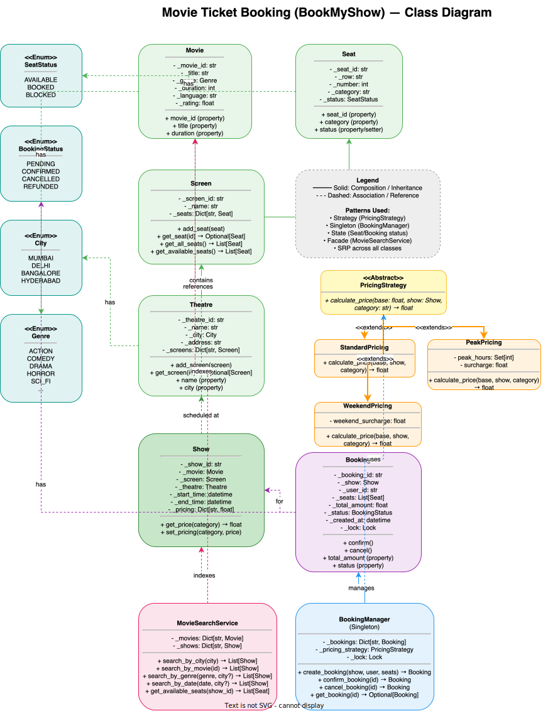

# 🏗️ Movie Ticket Booking System — High-Level Design

> **Target Level:** Senior/Staff Engineer | **Focus:** Concurrency, flash sales, payment, seat allocation

---

## 1. SYSTEM OVERVIEW

**Purpose:** Online movie ticket platform handling bookings, seat selection, payments, and discovery (like BookMyShow).

**Scale:** 10M MAU, 100K concurrent during flash sales (Avengers release), 50K simultaneous bookings

**Users:** Moviegoers, Theatre admins, Platform operators

**Use Cases:** Browse movies/theatres, Select seats, Book tickets, Cancel/refund, Search by city/date/genre

**Constraints:** No double-booking, <2s booking response, 99.95% uptime, payment idempotency

---

## 2. HIGH-LEVEL ARCHITECTURE

```
┌────────────────────────────────────────────┐
│           CDN (CloudFront/Akamai)           │
│  - Movie listings, theatre pages (static)   │
└───────────────────┬────────────────────────┘
                    │
┌───────────────────▼────────────────────────┐
│           API Gateway / Load Balancer       │
│  - Rate limit: 5 req/s per user during rush │
│  - WAF: Block DDoS / SQL injection          │
└──────┬────────────────────────────────┬────┘
       │                                │
┌──────▼──────┐                 ┌───────▼──────┐
│  Search     │                 │  Booking       │
│  Service    │                 │  Service       │
│  (Read)     │                 │  (Write)       │
│  - Elastic  │                 │  - Mutex per   │
│    search   │                 │    show        │
│  - Redis    │                 │  - Queue for   │
│    cache    │                 │    flash sales │
└──────┬──────┘                 └───────┬───────┘
       │                                │
┌──────▼──────────┐           ┌─────────▼──────┐
│  Read Replicas  │           │  Primary        │
│  (PostgreSQL)   │           │  Database       │
└─────────────────┘           └─────────┬───────┘
                                        │
                                ┌───────▼───────┐
                                │  Payment       │
                                │  Service       │
                                │  (Stripe/      │
                                │   Razorpay)    │
                                └───────────────┘
```

---

## 2.5 CLASS DIAGRAM



> **📥 Download:** [Movie Ticket Booking Architecture Diagram (draw.io)](movie-ticket-class-diagram.drawio) — Open in [draw.io](https://app.diagrams.net/) to edit.

---

## 3. KEY COMPONENTS & INTERVIEW Q&A

### Booking Service (Go/Python)
- Seat selection with 10-minute hold
- Distributed lock per show
- Queue-based request processing for flash sales

**🔴 Interview Question:** *"How do you prevent double-booking during a flash sale?"*

**✅ Answer:** Multi-layered approach:
1. **Redis distributed lock:** `SET show:123:lock user_456 NX EX 10` — per-show mutex
2. **Database transaction with SELECT FOR UPDATE:** Within transaction, lock all requested rows
3. **Seat state machine:** AVAILABLE → HELD (10 min TTL) → BOOKED
4. **Queue layer:** During flash sales, requests enter SQS queue → processed sequentially by workers
5. **Client-side:** Immediate "seat held" confirmation with countdown timer

**🔴 Interview Question:** *"How do you handle multiple bookings for a single seat during peak hours in a distributed system?"*

**✅ Answer:**

Managing concurrent seat bookings across multiple service instances requires a **multi-layered distributed locking strategy**:

#### Layer 1 — Optimistic Locking (Application Level)
Each seat has a `version` field. The booking request includes the version read during seat selection:
```sql
UPDATE seats 
SET status = 'BLOCKED', version = version + 1, held_by = ?, held_until = ?
WHERE seat_id = ? AND show_id = ? AND version = ? AND status = 'AVAILABLE'
```
If `Rows affected = 0`, another request has already taken the seat — the booking is rejected. The user sees "Seat no longer available."

#### Layer 2 — Pessimistic Locking (Database)
For peak hours, escalate to pessimistic row-level locks:
```sql
BEGIN;
SELECT * FROM seats 
WHERE show_id = ? AND seat_id IN (?, ?, ?) AND status = 'AVAILABLE'
FOR UPDATE NOWAIT;  -- Fail fast instead of waiting
-- If successful → mark seats as BLOCKED
UPDATE seats SET status = 'BLOCKED' WHERE seat_id IN (?, ?, ?);
COMMIT;
```
`NOWAIT` avoids queueing at the DB level — if the row is already locked, the request fails immediately rather than blocking.

#### Layer 3 — Distributed Lock (Redis)
For cross-service coordination, use Redis Redlock with a per-show lock:
```python
# Acquire lock for the entire show (10s TTL — enough for a booking transaction)
lock_key = f"show:{show_id}:booking_lock"
acquired = redis.set(lock_key, request_id, nx=True, px=10000)
if not acquired:
    return 429  "Too many requests — try again"
try:
    # Proceed with DB transaction
    ...
finally:
    # Release only if we still own the lock
    if redis.get(lock_key) == request_id:
        redis.delete(lock_key)
```

#### Layer 4 — Queue-Based Admission Control
During known peak hours (new release weekends), route all booking requests through a **queuing layer**:
```
User Request → Rate Limiter → SQS/Kafka Queue → Booking Workers → DB
                             ↕
               User polls for status via WebSocket
```
The queue acts as a **shock absorber**. Workers process requests sequentially per show. Users get a "ticket pending" status with estimated wait time rather than an immediate success/failure.

#### Seat Hold Timeout Strategy
| Step | Action | TTL |
|------|--------|-----|
| 1 | User selects seats → seats become BLOCKED | 10 minutes |
| 2 | User starts payment → seats stay BLOCKED | 15 minutes |
| 3 | Payment confirmed → seats become BOOKED | Permanent |
| 4 | Payment fails / timeout → seats back to AVAILABLE | Immediate |

A background scheduler runs every 30 seconds:
```sql
UPDATE seats 
SET status = 'AVAILABLE', held_by = NULL, held_until = NULL 
WHERE status = 'BLOCKED' AND held_until < NOW();
```

---

### Search Service (Elasticsearch + Redis)
- Movie/theatre/shows indexed in Elasticsearch
- Popular searches cached in Redis (TTL: 1 minute)
- Geo-filtering by city and proximity

**🔴 Interview Question:** *"How do you handle the thundering herd problem when a popular movie releases?"*

**✅ Answer:**
1. **CDN for static pages:** Movie listing pages cached at edge (10 min TTL)
2. **Stale cache while revalidate:** Serve stale cached results while async refetch happens in background
3. **Redis cache for seat availability:** `GET show:123:available_seats` — updates every 10 seconds, not on every booking
4. **Request coalescing:** If 100 requests arrive for same query simultaneously, only 1 hits the backend; others wait on the first result
5. **Rate limiting per user:** 5 requests/second max during flash sales

---

### Payment Service
- Idempotency key on every payment
- Gateway fallback chain: Stripe → Razorpay → manual

---

## 4. DATABASE OPERATIONS & SCHEMA

### Entity-Relationship Model

```
Movie (1) ────→ Show (N) ────→ Screen (1) ────→ Theatre (1) ────→ City (1)
                  │                 │
                  │                 └───→ Seat (N)
                  │
                  └───→ Booking (N) ────→ User (1)
                           │
                           └───→ Payment (1)
```

### Core SQL Schema

```sql
-- Theatres
CREATE TABLE theatres (
    id          BIGSERIAL PRIMARY KEY,
    name        VARCHAR(255) NOT NULL,
    city        VARCHAR(100) NOT NULL,
    address     TEXT NOT NULL,
    created_at  TIMESTAMPTZ DEFAULT NOW()
);

CREATE INDEX idx_theatres_city ON theatres(city);

-- Screens (auditoriums within a theatre)
CREATE TABLE screens (
    id          BIGSERIAL PRIMARY KEY,
    theatre_id  BIGINT NOT NULL REFERENCES theatres(id),
    name        VARCHAR(100) NOT NULL,  -- "Screen 1", "IMAX", etc.
    capacity    INT NOT NULL
);

CREATE INDEX idx_screens_theatre ON screens(theatre_id);

-- Seats (physical seats in a screen)
CREATE TABLE seats (
    id          BIGSERIAL PRIMARY KEY,
    screen_id   BIGINT NOT NULL REFERENCES screens(id),
    seat_row    CHAR(1) NOT NULL,    -- A, B, C, ...
    seat_number INT NOT NULL,        -- 1, 2, 3, ...
    category    VARCHAR(20) DEFAULT 'Regular',  -- Regular, Premium, VIP
    UNIQUE (screen_id, seat_row, seat_number)
);

CREATE INDEX idx_seats_screen ON seats(screen_id);

-- Movies
CREATE TABLE movies (
    id              BIGSERIAL PRIMARY KEY,
    title           VARCHAR(255) NOT NULL,
    genre           VARCHAR(50),
    duration_min    INT NOT NULL,      -- In minutes
    language        VARCHAR(50),
    rating          DECIMAL(2,1) DEFAULT 0.0,
    release_date    DATE
);

-- Shows (individual screenings)
CREATE TABLE shows (
    id           BIGSERIAL PRIMARY KEY,
    movie_id     BIGINT NOT NULL REFERENCES movies(id),
    screen_id    BIGINT NOT NULL REFERENCES screens(id),
    start_time   TIMESTAMPTZ NOT NULL,
    end_time     TIMESTAMPTZ NOT NULL,
    -- Base prices by category (denormalised for fast reads)
    price_regular DECIMAL(10,2) DEFAULT 150.00,
    price_premium DECIMAL(10,2) DEFAULT 250.00,
    price_vip     DECIMAL(10,2) DEFAULT 400.00,
    UNIQUE (screen_id, start_time)  -- No overlapping shows in same screen
);

CREATE INDEX idx_shows_movie ON shows(movie_id);
CREATE INDEX idx_shows_time ON shows(start_time);
CREATE INDEX idx_shows_city ON shows(theatre_id);  -- Join with theatres for city queries

-- Per-show seat inventory (to avoid N+1 queries)
CREATE TABLE show_seats (
    id        BIGSERIAL PRIMARY KEY,
    show_id   BIGINT NOT NULL REFERENCES shows(id),
    seat_id   BIGINT NOT NULL REFERENCES seats(id),
    status    VARCHAR(20) DEFAULT 'AVAILABLE',  -- AVAILABLE, BLOCKED, BOOKED
    version   INT DEFAULT 0,        -- Optimistic locking
    held_by   VARCHAR(255),         -- Session/user holding the seat
    held_until TIMESTAMPTZ,         -- Hold expiry time
    UNIQUE (show_id, seat_id)
);

-- Critical for booking performance
CREATE INDEX idx_show_seats_status ON show_seats(show_id, status) 
    WHERE status IN ('AVAILABLE', 'BLOCKED');

-- Bookings
CREATE TABLE bookings (
    id           BIGSERIAL PRIMARY KEY,
    booking_ref  VARCHAR(20) UNIQUE NOT NULL,  -- Human-readable: BK-XXXX
    user_id      BIGINT NOT NULL,
    show_id      BIGINT NOT NULL REFERENCES shows(id),
    total_amount DECIMAL(10,2) NOT NULL,
    status       VARCHAR(20) DEFAULT 'PENDING',  -- PENDING, CONFIRMED, CANCELLED, REFUNDED
    created_at   TIMESTAMPTZ DEFAULT NOW(),
    confirmed_at TIMESTAMPTZ,
    cancelled_at TIMESTAMPTZ
);

CREATE INDEX idx_bookings_user ON bookings(user_id);
CREATE INDEX idx_bookings_show ON bookings(show_id, status);

-- Booking seats (junction table)
CREATE TABLE booking_seats (
    id         BIGSERIAL PRIMARY KEY,
    booking_id BIGINT NOT NULL REFERENCES bookings(id),
    seat_id    BIGINT NOT NULL REFERENCES seats(id),
    category   VARCHAR(20) NOT NULL,
    price      DECIMAL(10,2) NOT NULL,  -- Snapshot of price at time of booking
    UNIQUE (booking_id, seat_id)
);

-- Payments (idempotency key prevents double-charge)
CREATE TABLE payments (
    id               BIGSERIAL PRIMARY KEY,
    booking_id       BIGINT NOT NULL REFERENCES bookings(id),
    amount           DECIMAL(10,2) NOT NULL,
    status           VARCHAR(20) DEFAULT 'PENDING',  -- PENDING, SUCCESS, FAILED, REFUNDED
    idempotency_key  VARCHAR(255) UNIQUE NOT NULL,
    gateway          VARCHAR(50),         -- stripe, razorpay
    gateway_txn_id   VARCHAR(255),
    created_at       TIMESTAMPTZ DEFAULT NOW()
);

CREATE INDEX idx_payments_booking ON payments(booking_id);
CREATE INDEX idx_payments_idempotency ON payments(idempotency_key);
```

### Key Transaction Flows

**Booking flow (atomic):**
```sql
BEGIN;
-- 1. Lock seats
SELECT id, version FROM show_seats 
WHERE show_id = $1 AND seat_id = ANY($2) AND status = 'AVAILABLE'
FOR UPDATE NOWAIT;

-- 2. Check all seats are available
-- (if row count < expected, ROLLBACK)

-- 3. Block seats
UPDATE show_seats 
SET status = 'BLOCKED', version = version + 1, 
    held_by = $3, held_until = NOW() + INTERVAL '10 minutes'
WHERE show_id = $1 AND seat_id = ANY($2) AND status = 'AVAILABLE';

-- 4. Create booking
INSERT INTO bookings (booking_ref, user_id, show_id, total_amount, status)
VALUES ($4, $3, $1, $5, 'PENDING')
RETURNING id;

-- 5. Create booking_seats entries
INSERT INTO booking_seats (booking_id, seat_id, category, price)
VALUES ($6, ...);

COMMIT;
```

**Payment confirmation flow (idempotent):**
```sql
BEGIN;
-- Idempotency check
INSERT INTO payments (booking_id, amount, status, idempotency_key)
VALUES ($1, $2, 'PENDING', $3)
ON CONFLICT (idempotency_key) DO NOTHING
RETURNING id;

-- If already processed, return existing payment
-- (avoids double-charge on retry)

-- Confirm booking
UPDATE bookings SET status = 'CONFIRMED', confirmed_at = NOW()
WHERE id = $1 AND status = 'PENDING';

-- Mark seats as permanently booked
UPDATE show_seats SET status = 'BOOKED'
WHERE show_id = (SELECT show_id FROM bookings WHERE id = $1)
  AND seat_id = ANY($4);
COMMIT;
```

---

## 5. SCALABILITY FOR FLASH SALES

| Strategy | Implementation |
|----------|---------------|
| **Queue excess** | Requests beyond capacity go to SQS; user gets estimated wait time |
| **Rate limit per user** | 1 booking attempt per 5 seconds |
| **Separate read/write paths** | Movie listing reads from replicas/cache; bookings go to write master |
| **Auto-scaling** | Booking workers auto-scale based on queue depth |
| **A/B capacity testing** | Regular load testing to know breaking point |

---

## 6. COST (Monthly)

| Component | Cost |
|-----------|------|
| Compute (booking + search) | $4,000 |
| PostgreSQL (Primary + Replicas) | $2,500 |
| Elasticsearch cluster | $1,500 |
| Redis Cache | $800 |
| CDN + Bandwidth | $1,000 |
| **Total** | **$9,800** |
