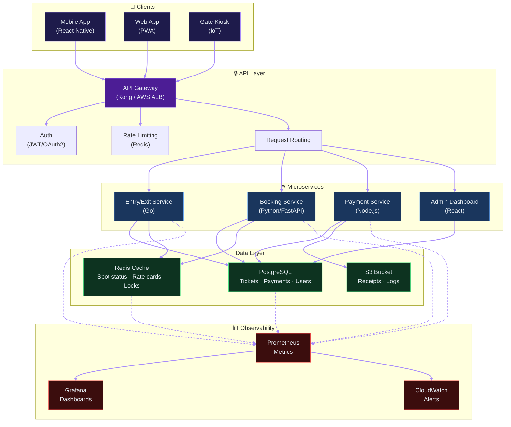
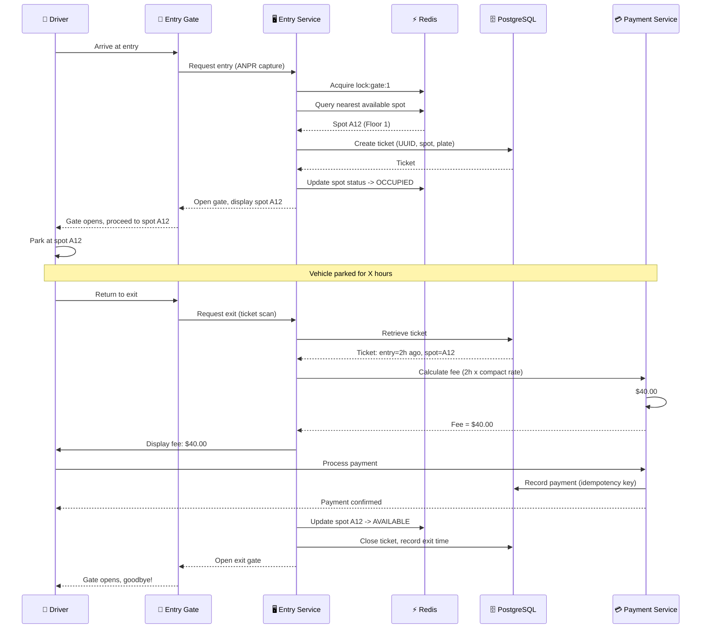

# 🏗️ Parking Lot System — High-Level Design

> **Interviewer:** Principal Software Engineer  
> **Target Level:** Senior/Staff Engineer  
> **Focus:** Distributed system architecture, scalability, API design

---

## 1. SYSTEM OVERVIEW

**Purpose:** Allow vehicles to enter, park, and exit a multi-floor parking facility with automated fee collection and spot allocation.

**Scale:** 10 floors × 500 spots = 5,000 total spots. Peak: 500 entries/hour, 500 exits/hour.

**Users:** Drivers (end users), Parking Attendants (admin), System Admins

**Use Cases:**
- Enter parking lot → get ticket
- Park at assigned spot
- Exit → pay fee → leave
- Check availability before arriving
- Reserve spot in advance (premium)

**Constraints:** Low latency for gate operations (<500ms), 99.9% uptime, no double-booking

---

## 2. HIGH-LEVEL ARCHITECTURE




> **📥 Download:** [Parking Lot Architecture Diagram (draw.io)](parking-lot-hld.drawio) — Open in [draw.io](https://app.diagrams.net/) to edit.

---

## 2.5 PARKING FLOW



---

## 3. COMPONENT BREAKDOWN

### 3.1 Entry/Exit Service
- **Technology:** Go (low latency, concurrent gate operations)
- **Responsibilities:**
  - Ticket issuance (entry gate)
  - License plate recognition (ANPR camera integration)
  - Fee calculation on exit
  - Payment processing
  - Gate open/close control

**🔴 Interview Question:** *"How would you design the entry gate to handle 500 concurrent vehicles/hour?"*

**✅ Answer:** The entry service is stateless and horizontally scalable. When a vehicle arrives:
1. ANPR camera captures plate → sends to Entry Service via local network
2. Entry Service acquires a distributed lock from Redis (`lock:gate:{gate_id}`)
3. Allocates nearest available spot using a geo-spatial query
4. Issues ticket (UUID), persists to PostgreSQL, returns to gate system
5. Gate opens — vehicle enters

Key: Use a local Redis cluster at the parking site for low-latency spot allocation. Sync to central DB asynchronously.

---

### 3.2 Booking Service
- **Technology:** Python/FastAPI
- **Responsibilities:**
  - Real-time availability queries
  - Spot reservation with 15-minute hold
  - Premium spot booking
  - Monthly pass management

**🔴 Interview Question:** *"How do you prevent double-booking during reservation?"*

**✅ Answer:** Two-phase locking:
1. **Application lock:** Redis distributed lock on `booking:{spot_id}:{time_slot}`
2. **Database lock:** `SELECT ... FOR UPDATE` within transaction
3. **Optimistic concurrency:** Version column on spot table

---

### 3.3 Payment Service
- **Technology:** Node.js (async I/O for payment gateways)
- **Responsibilities:**
  - Fee calculation based on duration + rate card
  - Payment gateway integration (card, UPI, wallet)
  - Receipt generation
  - Refund processing

**🔴 Interview Question:** *"How do you handle idempotency in payment processing?"*

**✅ Answer:** Every payment request carries an idempotency key (ticket_id + attempt_number). Before processing, check Redis for existing result. If found, return cached result — never double-charge.

---

### 3.4 Data Layer

**PostgreSQL Schema:**
```sql
CREATE TABLE parking_lots (
    id UUID PRIMARY KEY, name TEXT, address TEXT, total_spots INT
);
CREATE TABLE floors (
    id UUID, lot_id UUID REFERENCES parking_lots(id), floor_num INT
);
CREATE TABLE spots (
    id UUID, floor_id UUID REFERENCES floors(id),
    spot_type TEXT, status TEXT DEFAULT 'AVAILABLE',
    version INT DEFAULT 1
);
CREATE TABLE tickets (
    id UUID, spot_id UUID, vehicle_plate TEXT,
    entry_time TIMESTAMP, exit_time TIMESTAMP, fee DECIMAL,
    status TEXT DEFAULT 'ACTIVE'
);
```

**Caching Strategy (Redis):**
- Spot availability: `SET spot:{id}:status AVAILABLE` — TTL: None (write-through)
- Rate card: `HGETALL rate:{lot_id}` — TTL: 1 hour
- Active tickets: `HGETALL ticket:{id}` — TTL: 24 hours

---

### 3.5 Monitoring & Observability

| Metric | Tool | Alert Threshold |
|--------|------|-----------------|
| Gate open latency | Prometheus | p95 > 2s |
| Spot allocation time | Prometheus | p95 > 500ms |
| Payment success rate | CloudWatch | < 95% |
| Queue depth (exit) | Grafana | > 10 vehicles |

---

## 4. TRADE-OFFS ANALYSIS

### Trade-off 1: Local vs Cloud Processing

| Aspect | Local (Edge) | Cloud |
|--------|-------------|-------|
| Latency | <10ms gate control | ~50ms |
| Reliability | Works during internet outage | Dependent on connectivity |
| Cost | Higher per-site | Centralized, lower per-site |
| Maintenance | On-site hardware | Remote management |

**Decision:** Hybrid — gate operations local, booking/payments in cloud. Local cache syncs to cloud when online.

### Trade-off 2: License Plate Recognition (Camera) vs Manual Entry

| Aspect | ANPR | Manual (Attendant) |
|--------|------|-------------------|
| Speed | 3 seconds | 15 seconds |
| Accuracy | 95% (needs fallback) | 100% |
| Cost | $5K per gate | $3K/month per attendant |
| Maintenance | Regular cleaning needed | Training needed |

**Decision:** ANPR with manual fallback. 5% misreads handled by attendant verification.

---

## 5. SCALABILITY & RELIABILITY

**Availability Target:** 99.9% (8.7 hours downtime/year)

**Failure Scenarios:**

| Failure | Impact | Mitigation |
|---------|--------|------------|
| Internet down | Cloud services unavailable | Local fallback mode — queue transactions, sync later |
| Gate controller fails | Single gate down | Adjacent gate handles overflow |
| Database failure | All operations degrade | Read replicas for queries, WAL for recovery |
| Power outage | Entire lot affected | Backup generator + UPS for gates |

**Scaling Strategy:**
- Horizontal: Add more gate servers (stateless)
- Vertical: Larger DB instance for ticket storage
- Read replicas: For availability queries
- Sharding: By parking lot ID for multi-lot chains

---

## 6. COST BREAKDOWN (Monthly)

| Component | Cost | Notes |
|-----------|------|-------|
| Gate hardware (ANPR × 10) | $5,000 | Amortized over 3 years |
| Cloud compute (Entry/Booking) | $2,500 | Auto-scaled |
| Database (PostgreSQL RDS) | $1,500 | Multi-AZ |
| Redis Cache | $500 | Cluster mode |
| Monitoring + Alerts | $300 | Datadog/Prometheus |
| **Total** | **$9,800** | |

---

## 7. IMPLEMENTATION ROADMAP

**Phase 1 (Month 1-2):** Basic gate entry/exit with attendant. Manual fee calculation.

**Phase 2 (Month 3-4):** ANPR integration. Automated fee calculation. Payment gateway.

**Phase 3 (Month 5-6):** Mobile app for availability check. Premium reservations.

**Phase 4 (Month 7-8):** Multi-site support. Centralized management dashboard. Analytics.
