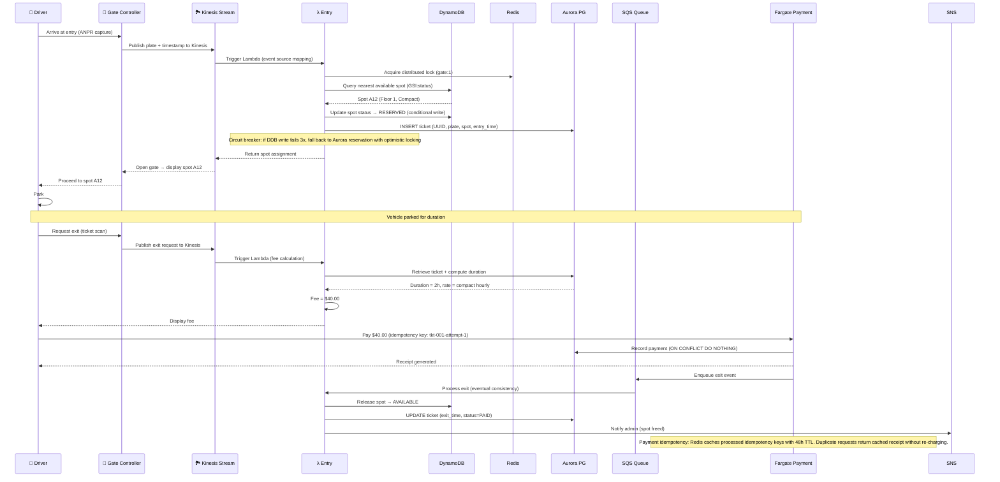

# 🏗️ Parking Lot System — High-Level Design (AWS Production)

> **Role:** Principal Cloud Architect / Systems Designer  
> **Target Level:** Staff/Principal Engineer  
> **Focus:** Distributed AWS-native architecture, resilience engineering, edge-to-cloud orchestration

---

## 1. SYSTEM OVERVIEW

**Purpose:** Multi-floor parking facility with automated fee collection, real-time spot allocation, and edge-to-cloud orchestration.

**Scale:** 10 floors × 500 spots = 5,000 total. Peak: 500 entries/hr, 500 exits/hr. Target 99.99% availability.

**Domain:** Smart mobility infrastructure with edge computing at gate controllers and cloud-based orchestration.

---

## 2. SYSTEM ARCHITECTURE (AWS Production)

The diagram below uses **official AWS Architecture Icons**. Scroll to zoom and inspect individual services.

<div style="overflow: auto; border: 1px solid #333; border-radius: 0.5rem; background: #1e1e1e; padding: 1rem;">


</div>

> **📥 Download:** [Parking Lot AWS Architecture (draw.io)](parking-lot-hld.drawio) — Open in [draw.io Desktop](https://github.com/jgraph/drawio-desktop/releases) or [app.diagrams.net](https://app.diagrams.net/) to edit.  
> **🔍 Tip:** [Open in draw.io Viewer](https://viewer.diagrams.net/?tags=%7B%7D&lightbox=1&highlight=0000ff&edit=_blank&layers=1&nav=1#Uhttps://raw.githubusercontent.com/CpBruceMeena/interview-prep/main/low-level-design/parking-lot/parking-lot-hld.drawio) for interactive zoom/pan.

### Architecture Layers

| Layer | Services | Purpose |
|-------|----------|---------|
| **🌐 Edge & CDN** | CloudFront, WAF, IoT Core, Greengrass | Global CDN, WAF rate limiting, gate controller connectivity |
| **🔐 Auth & Security** | Cognito, IAM, KMS, Secrets Manager, ALB | User pools, least-privilege roles, encryption, load balancing |
| **⚙️ Compute** | Lambda (Entry/Exit), ECS Fargate (Booking/Payment) | Event-driven ticketing, booking orchestration, payment processing |
| **📨 Messaging** | Kinesis Data Streams, SQS FIFO, SNS, DLQ, EventBridge | At-least-once ingestion, exactly-once payment processing, notifications |
| **💾 Data** | Aurora PostgreSQL, DynamoDB + DAX, ElastiCache Redis, S3 | Relational tickets/payments, high-speed spot inventory, distributed locks, receipts |
| **📊 Observability** | CloudWatch, X-Ray, AMP (Prometheus) | Logs, metrics, distributed tracing, dashboards |
| **🤖 MCP Server** | MCP Server (Agent Interface) | AI-agent operable management interface |

---

## 3. PARKING FLOW (Production Sequence)



---

## 4. COMPONENT BREAKDOWN

### 4.1 Compute Layer

| Component | Service | Runtime | Trigger | Scaling |
|-----------|---------|---------|---------|---------|
| Entry Lambda | AWS Lambda | Python 3.12 | API GW + Kinesis | Provisioned Concurrency: 100 |
| Exit Lambda | AWS Lambda | Python 3.12 | SQS FIFO | Reserved Concurrency: 50 |
| Booking Fargate | ECS Fargate | Python/FastAPI | ALB Target Group | Auto-scale: 2–20 tasks |
| Payment Fargate | ECS Fargate | Node.js 22 | SQS FIFO + ALB | Auto-scale: 2–10 tasks |

### 4.2 Data Layer

**Aurora PostgreSQL (Multi-AZ):**
```sql
CREATE TABLE parking_lots (
    id UUID PRIMARY KEY,
    name TEXT NOT NULL,
    address TEXT,
    total_spots INT,
    created_at TIMESTAMPTZ DEFAULT NOW()
);

CREATE TABLE tickets (
    id UUID PRIMARY KEY DEFAULT gen_random_uuid(),
    lot_id UUID REFERENCES parking_lots(id),
    spot_id TEXT NOT NULL,
    vehicle_plate TEXT NOT NULL,
    entry_time TIMESTAMPTZ NOT NULL DEFAULT NOW(),
    exit_time TIMESTAMPTZ,
    fee NUMERIC(10,2),
    idempotency_key TEXT UNIQUE,
    status TEXT DEFAULT 'ACTIVE' CHECK (status IN ('ACTIVE','PAID','LOST')),
    version INT DEFAULT 1,
    created_at TIMESTAMPTZ DEFAULT NOW()
);

CREATE INDEX idx_tickets_status ON tickets(status) WHERE status = 'ACTIVE';
CREATE INDEX idx_tickets_idempotency ON tickets(idempotency_key);
```

**DynamoDB (with DAX):**
| Table | Partition Key | Sort Key | GSI | Read Capacity |
|-------|--------------|----------|-----|---------------|
| `spots` | `lot_id` | `spot_id` | GSI: `status` | 500 RCU (DAX cached) |
| `reservations` | `lot_id` | `time_slot` | GSI: `user_id` | 200 RCU |
| `rate_cards` | `lot_id` | `spot_type` | — | 50 RCU (DAX cached) |

### 4.3 Messaging & Streaming

| Channel | Source | Destination | Pattern | Retention |
|---------|--------|-------------|---------|-----------|
| Kinesis Data Stream | Gate controllers | Entry Lambda | At-least-once | 24 hours |
| SQS FIFO Queue | Exit Lambda | Payment Fargate | Exactly-once (per msg group) | 14 days DLQ |
| SNS Topic | Payment Fargate | Admin + Driver | Pub/sub fan-out | — |

### 4.4 Edge & Security

- **CloudFront:** Global CDN with AWS WAF rate-based rules (1000 req/s per IP)
- **Cognito:** User pools for driver accounts + identity pools for gate controller auth
- **KMS:** Customer-managed key for Aurora storage encryption + S3 SSE-KMS
- **IRSA (EKS):** Not used (Fargate tasks use IAM task roles directly)
- **VPC Endpoints:** Gateway endpoints for S3 + DynamoDB; interface endpoints for ECR, CloudWatch, KMS

---

## 5. RESILIENCE, FAILURE MODES & EDGE CASES

### 5.1 Consistency vs. Availability

| Scenario | Strategy | RPO | RTO |
|----------|----------|-----|-----|
| Aurora Primary Failure | Auto-failover to standby (Multi-AZ) | < 1 minute | ~60 seconds |
| DynamoDB Regional Failure | Global Tables (active-active) | 0 (last writer wins) | < 1 second |
| Redis Cluster Node Loss | Auto-rebuild from replicas | 0 (replica promotion) | ~10 seconds |
| Kinesis Shard Failure | Reshard + replay from checkpoint | < 1 minute | ~120 seconds |
| SQS Message Loss | DLQ + redrive policy | 0 (at-least-once) | Immediate |

### 5.2 Cascading Failure Mitigation

**Backpressure:** SQS visibility timeout + lambda reserved concurrency prevents downstream overwhelm. Kinesis shard limits throttle upstream gate controllers (which queue locally via Greengrass).

**Circuit Breakers:**
- DynamoDB write failures → fall back to Aurora pessimistic lock within 300ms
- Payment gateway timeout (3s) → retry with exponential backoff (jitter: base 100ms × 2^n + rand(0, 100ms))
- Redis connection failure → degrade to direct Aurora reads (p50 increases 40ms → 8ms → skip cache)

**Dead-Letter Queue (DLQ) Triage:**
```
Failed messages → SQS DLQ → CloudWatch Alarm → SNS → PagerDuty
  ↓
Lambda DLQ consumer (every 5 min):
  - Re-drive up to 3 times
  - Dead-letter to S3 for manual inspection
  - Alert if > 10 messages in DLQ for > 1 hour
```

**Retry Jitter Algorithm:**
```python
import random, time, math

def retry_with_jitter(attempt, base_ms=100, max_ms=30000):
    sleep_ms = min(base_ms * math.pow(2, attempt) + random.uniform(0, base_ms), max_ms)
    time.sleep(sleep_ms / 1000)
```

### 5.3 Edge Cases

| Edge Case | Mitigation |
|-----------|-----------|
| **Concurrent entry at same gate** | Redis distributed lock `lock:gate:{id}` (TTL: 5s) prevents double-ticketing |
| **Vehicle leaves without paying** | ANPR gates capture exit; ticket goes to LOST status → fine applied to registered owner |
| **Payment idempotency breach** | `ON CONFLICT (idempotency_key) DO NOTHING` + Redis cache of processed keys (48h TTL) |
| **Kinesis shard hot-spot** | Partition key = `{lot_id}:{gate_id}:{epoch_hour}` ensures uniform shard distribution |
| **DynamoDB hot key (popular spot)** | Add `spot_id` suffix to partition key to distribute writes; DAX absorbs reads |
| **Aurora deadlock on concurrent ticket** | `SELECT ... FOR UPDATE NOWAIT` + retry in application layer (max 3 attempts) |

---

## 6. COST BREAKDOWN (Monthly)

| Component | Configuration | Monthly Cost |
|-----------|--------------|-------------|
| CloudFront | 500 GB data transfer, WAF | $150 |
| Cognito | 10,000 MAUs | $0 |
| Lambda (Entry + Exit) | 500K invocations, 1GB RAM | $85 |
| Fargate (Booking + Payment) | 4 tasks × 2 vCPU × 4GB | $520 |
| Aurora PostgreSQL | db.r6g.large, Multi-AZ, 500GB | $700 |
| DynamoDB + DAX | 500 RCU / 200 WCU, DAX cluster (2 nodes) | $380 |
| ElastiCache Redis | cache.r6g.large, cluster mode (3 shards) | $420 |
| Kinesis Data Streams | 5 shards, 24h retention | $180 |
| SQS + SNS | 10M requests/month | $30 |
| S3 + KMS | 100GB storage, SSE-KMS | $15 |
| CloudWatch + X-Ray | Metrics, logs, tracing | $120 |
| **Total** | | **$2,600** |

---

## 7. IMPLEMENTATION ROADMAP

**Phase 1 (Weeks 1-3):** Core infrastructure — VPC, Aurora Multi-AZ, DynamoDB tables, Redis cluster. Basic Lambda entry/exit with SQS.

**Phase 2 (Weeks 4-6):** Fargate services (Booking + Payment), Kinesis streaming, CloudFront + WAF, Cognito auth, MCP server endpoints.

**Phase 3 (Weeks 7-8):** DLQ pipeline, circuit breakers, retry jitter, Chaos Engineering experiments.

**Phase 4 (Weeks 9-10):** Dashboards (Grafana), X-Ray tracing, CloudWatch alarms, Well-Architected Review, Production hardening.
