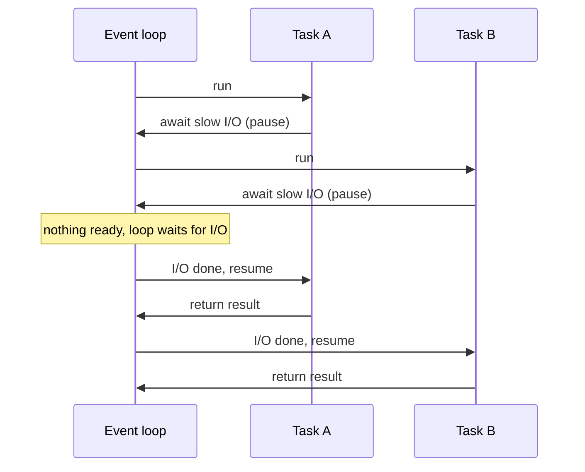
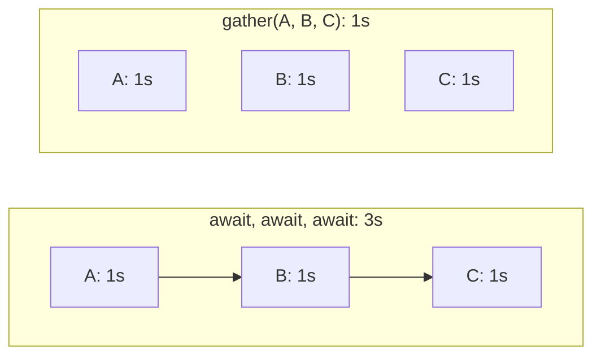
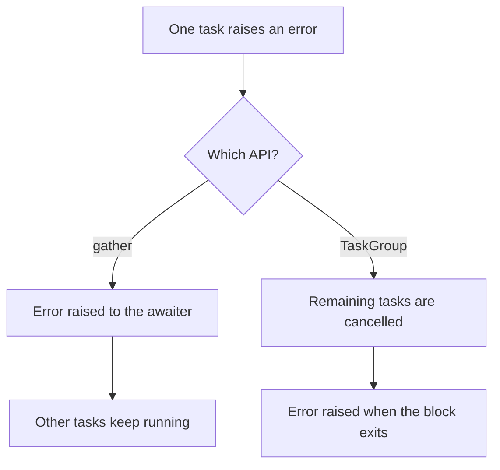
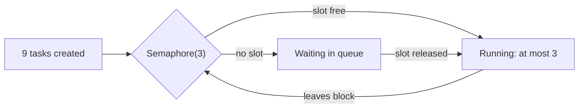
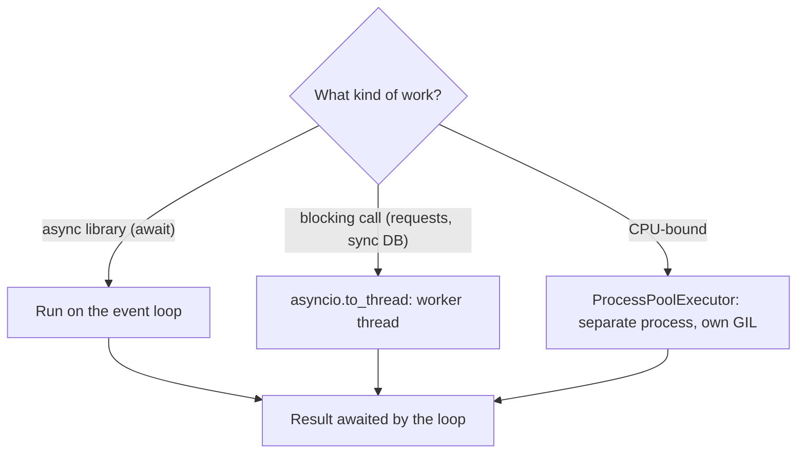

# ⚡ Async Basics: Running Functions at the Same Time with `await`

> A short, practical guide to running several functions concurrently with `asyncio`. Every example is runnable as-is (Python 3.11+); copy one into a file and run `python3 file.py`.
>
> For the deep dive (event loop internals, cancellation, production patterns), see [Asyncio Notes](ASYNCIO_NOTES.md).

---

## 1. The one idea you need

`await` means **"pause me here and let other work run until my result is ready."**

While one function waits on something slow (a network call, a database query, a timer), the event loop runs the others. That's how a single thread handles many slow I/O tasks at the same time.

!!! note "Concurrent, not truly parallel"
    asyncio runs on **one thread**. Tasks take turns, switching only at `await`. That is perfect for **I/O-bound** work (HTTP calls, DB queries, file and network waits). It does **not** speed up **CPU-bound** work (number crunching); for that, see [section 7](#cpu-heavy-work-use-processes).

*One thread, one event loop: a task runs until it hits `await`, then the loop hands the thread to another ready task.*



---

## 2. Your first async function

```python
import asyncio

async def greet(name: str) -> str:          # "async def" makes a coroutine function
    await asyncio.sleep(1)                   # simulate slow I/O (never time.sleep!)
    return f"Hello, {name}"

async def main():
    message = await greet("Alice")           # run it and wait for the result
    print(message)

asyncio.run(main())                          # start the event loop: once, at the top
```

```
Hello, Alice
```

Three rules:

1. `async def` defines a coroutine function. Calling it **doesn't run it**; it returns a coroutine object.
2. `await` runs a coroutine and gives you its result. You can only use `await` inside an `async def`.
3. `asyncio.run(main())` is the single entry point that starts everything.

---

## 3. The trap: `await` one after another is still sequential

```python
import asyncio, time

async def fetch(name: str, seconds: float) -> str:
    await asyncio.sleep(seconds)
    return f"{name} done"

async def main():
    start = time.perf_counter()
    a = await fetch("A", 1)      # waits 1s...
    b = await fetch("B", 1)      # ...then another 1s
    c = await fetch("C", 1)      # ...then another 1s
    print(a, b, c, f"in {time.perf_counter() - start:.1f}s")

asyncio.run(main())
```

```
A done B done C done in 3.0s
```

Each `await` waits for that call to finish before the next line starts. To overlap them, you have to start them **together**.

---

## 4. Run them at the same time: `asyncio.gather`

```python
import asyncio, time

async def fetch(name: str, seconds: float) -> str:
    await asyncio.sleep(seconds)
    return f"{name} done"

async def main():
    start = time.perf_counter()
    results = await asyncio.gather(          # start all three, wait for all three
        fetch("A", 1),
        fetch("B", 1),
        fetch("C", 1),
    )
    print(results, f"in {time.perf_counter() - start:.1f}s")

asyncio.run(main())
```

```
['A done', 'B done', 'C done'] in 1.0s
```

- Total time is the **slowest** task (1s), not the sum (3s).
- Results come back **in the order you passed them**, regardless of which finished first.

Running a dynamic list works the same way:

```python
results = await asyncio.gather(*(fetch(f"job-{i}", 1) for i in range(10)))
```

*Sequential `await`s add up to 3s, while `gather` starts all three sleeps before waiting, so the total is the slowest one (1s).*



---

## 5. The modern way: `asyncio.TaskGroup` (Python 3.11+)

`TaskGroup` does the same job as `gather`, with safer error handling. If one task fails, the others are **cancelled** and the error is raised, so nothing keeps running in the background.

```python
import asyncio, time

async def fetch(name: str, seconds: float) -> str:
    await asyncio.sleep(seconds)
    return f"{name} done"

async def main():
    start = time.perf_counter()
    async with asyncio.TaskGroup() as tg:    # all tasks start immediately
        t1 = tg.create_task(fetch("A", 1))
        t2 = tg.create_task(fetch("B", 2))
        t3 = tg.create_task(fetch("C", 1))
    # leaving the "async with" block waits for every task
    print(t1.result(), t2.result(), t3.result(), f"in {time.perf_counter() - start:.1f}s")

asyncio.run(main())
```

```
A done B done C done in 2.0s
```

**Which one should I use?**

| | `asyncio.gather` | `asyncio.TaskGroup` |
|---|---|---|
| Python version | any | 3.11+ |
| Returns | list of results, in input order | read each task's `.result()` |
| One task fails | raises, but **the other tasks keep running** | cancels the others, then raises |
| Keep going despite failures | `return_exceptions=True` | catch errors inside each task |

Default to **TaskGroup** for new code. Use `gather(..., return_exceptions=True)` when you want every result, including failures.

*`gather` leaves siblings running when one task fails, while `TaskGroup` cancels them before re-raising.*



---

## 6. Everyday patterns

### Handle failures without stopping the rest

```python
import asyncio

async def fetch(n: int) -> int:
    await asyncio.sleep(0.1)
    if n == 2:
        raise ValueError(f"job {n} failed")
    return n * 10

async def main():
    results = await asyncio.gather(*(fetch(n) for n in range(4)), return_exceptions=True)
    for n, r in enumerate(results):
        print(n, "ERROR:" if isinstance(r, Exception) else "OK:", r)

asyncio.run(main())
```

```
0 OK: 0
1 OK: 10
2 ERROR: job 2 failed
3 OK: 30
```

### Process results as they finish: `as_completed`

```python
import asyncio

async def fetch(name: str, seconds: float) -> str:
    await asyncio.sleep(seconds)
    return f"{name} ({seconds}s)"

async def main():
    tasks = [fetch("slow", 3), fetch("fast", 1), fetch("medium", 2)]
    for next_done in asyncio.as_completed(tasks):
        print(await next_done)            # fastest first

asyncio.run(main())
```

```
fast (1s)
medium (2s)
slow (3s)
```

### Put a time limit on it: `asyncio.timeout` (3.11+)

```python
import asyncio

async def slow_call():
    await asyncio.sleep(5)
    return "finished"

async def main():
    try:
        async with asyncio.timeout(1):
            print(await slow_call())
    except TimeoutError:
        print("gave up after 1s")        # the slow call is cancelled

asyncio.run(main())
```

```
gave up after 1s
```

### Limit how many run at once: `Semaphore`

Starting 10,000 requests at once can overload the server you're calling. A semaphore caps concurrency:

```python
import asyncio, time

async def fetch(i: int, limit: asyncio.Semaphore) -> int:
    async with limit:                     # at most 3 inside this block at a time
        await asyncio.sleep(1)
        return i

async def main():
    limit = asyncio.Semaphore(3)
    start = time.perf_counter()
    results = await asyncio.gather(*(fetch(i, limit) for i in range(9)))
    print(results, f"in {time.perf_counter() - start:.1f}s")   # 9 jobs, 3 at a time

asyncio.run(main())
```

```
[0, 1, 2, 3, 4, 5, 6, 7, 8] in 3.0s
```

### Start something now, collect it later: `create_task`

```python
import asyncio

async def background_report():
    await asyncio.sleep(1)
    return "report ready"

async def main():
    task = asyncio.create_task(background_report())   # starts running right away
    print("doing other work meanwhile...")
    await asyncio.sleep(0.5)
    print(await task)                                 # collect the result when needed

asyncio.run(main())
```

```
doing other work meanwhile...
report ready
```

!!! warning "Keep a reference to every task"
    The event loop holds only a weak reference to tasks. Store each task in a variable (or use a TaskGroup); a task you don't reference can be garbage-collected before it finishes.

*A `Semaphore(3)` lets only three tasks into the guarded block, so nine one-second jobs take three rounds (about 3s).*



---

## 7. Blocking code and CPU-heavy work

### A blocking library call: `asyncio.to_thread`

A normal (non-async) function such as `requests.get`, `time.sleep`, or a sync DB driver **blocks the whole event loop**: every other task freezes. Run it in a worker thread instead:

```python
import asyncio, time

def blocking_io(name: str) -> str:        # a normal, non-async function
    time.sleep(1)                         # e.g. requests.get(...) or a sync DB call
    return f"{name} done"

async def main():
    start = time.perf_counter()
    results = await asyncio.gather(
        asyncio.to_thread(blocking_io, "A"),
        asyncio.to_thread(blocking_io, "B"),
        asyncio.to_thread(blocking_io, "C"),
    )
    print(results, f"in {time.perf_counter() - start:.1f}s")

asyncio.run(main())
```

```
['A done', 'B done', 'C done'] in 1.0s
```

### CPU-heavy work: use processes

Threads and asyncio don't speed up pure-Python number crunching on standard CPython, because of the GIL. Use a process pool for true parallelism across CPU cores:

```python
import asyncio
from concurrent.futures import ProcessPoolExecutor

def crunch(n: int) -> int:                # CPU-bound: no I/O, just computing
    return sum(i * i for i in range(n))

async def main():
    loop = asyncio.get_running_loop()
    with ProcessPoolExecutor() as pool:
        results = await asyncio.gather(
            *(loop.run_in_executor(pool, crunch, 5_000_000) for _ in range(4))
        )
    print(len(results), "results computed in separate processes")

if __name__ == "__main__":                # required for process pools
    asyncio.run(main())
```

```
4 results computed in separate processes
```

*Pick the tool by the kind of work: async I/O stays on the loop, blocking calls go to a thread, CPU-bound work goes to another process.*



---

## 8. A realistic example: fetching many URLs

This uses the third-party `httpx` library (`pip install httpx`), which has an async client. It combines a shared client, a concurrency limit, a timeout and per-request error handling:

```python
import asyncio
import httpx

URLS = [
    "https://example.com",
    "https://www.python.org",
    "https://httpbin.org/delay/2",
]

async def fetch(client: httpx.AsyncClient, url: str, limit: asyncio.Semaphore) -> str:
    async with limit:
        try:
            r = await client.get(url, timeout=5)
            return f"{r.status_code} {url}"
        except httpx.HTTPError as e:
            return f"ERR {url}: {type(e).__name__}"

async def main():
    limit = asyncio.Semaphore(10)
    async with httpx.AsyncClient() as client:            # reuse one client (connection pooling)
        results = await asyncio.gather(*(fetch(client, u, limit) for u in URLS))
    for line in results:
        print(line)

asyncio.run(main())
```

---

## 9. Common mistakes

| Mistake | What happens | Fix |
|---|---|---|
| `time.sleep(1)` inside `async def` | Freezes **every** task for 1s | `await asyncio.sleep(1)` |
| Calling `fetch()` without `await` | Nothing runs; you get a "coroutine was never awaited" warning | `await fetch()` or wrap in a task |
| `await a(); await b()` and expecting overlap | Runs one after the other | `gather` or `TaskGroup` |
| Using `requests` (sync) in async code | Blocks the event loop | `httpx`/`aiohttp`, or `asyncio.to_thread` |
| Calling `asyncio.run()` inside async code | `RuntimeError` | Call `asyncio.run` once at the top; use `await` everywhere below |
| Expecting async to speed up CPU work | No speedup | `ProcessPoolExecutor` |
| Starting 100k tasks at once | Overloads the remote server or runs out of sockets | `asyncio.Semaphore` |
| `create_task(...)` without keeping the task | Task may be garbage-collected mid-run | Store it, or use `TaskGroup` |

---

## 10. Cheat sheet

```python
await coro()                                   # run one, wait for its result
await asyncio.gather(c1(), c2(), c3())         # run many at once, results in order
await asyncio.gather(*coros, return_exceptions=True)   # failures returned, not raised

async with asyncio.TaskGroup() as tg:          # run many at once, cancel all on failure (3.11+)
    t = tg.create_task(c1())

for f in asyncio.as_completed(coros):          # handle results as they finish
    print(await f)

async with asyncio.timeout(5):                 # time limit (3.11+)
    await c1()

sem = asyncio.Semaphore(10)                    # cap concurrency
async with sem:
    await c1()

await asyncio.to_thread(blocking_fn, arg)      # run blocking code without freezing the loop
task = asyncio.create_task(c1())               # start now, await later
asyncio.run(main())                            # program entry point, called once
```

**Rule of thumb:** waiting on I/O → asyncio. Blocking library → `asyncio.to_thread`. Heavy computation → `ProcessPoolExecutor`.
