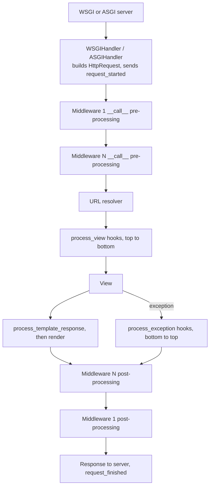

# 🐍 Django — Staff-Level Notes & Interview Questions

> **Deep-dive into Django's internals, ORM, request lifecycle, DRF, caching, async, and production patterns**
> *Written against Django 5.2 LTS and 6.0 (October 2026). Version-specific features are marked.*

---

## Table of Contents

1. [Django ORM Deep Dive](#1-django-orm-deep-dive)
2. [Request Lifecycle & Middleware](#2-request-lifecycle-middleware)
3. [Django REST Framework (DRF)](#3-django-rest-framework-drf)
4. [Authentication & Authorization](#4-authentication-authorization)
5. [Database Migrations](#5-database-migrations)
6. [Caching Strategies](#6-caching-strategies)
7. [Celery & Async Tasks](#7-celery-async-tasks)
8. [Performance Optimization](#8-performance-optimization)
9. [Signals & Event-Driven Patterns](#9-signals-event-driven-patterns)
10. [Production Deployment](#10-production-deployment)
11. [Django Design Patterns](#11-django-design-patterns)
12. [Django Interview Questions](#12-django-interview-questions)
13. [Async Django](#13-async-django)
14. [What's New in Django 5.x and 6.0](#14-whats-new-in-django-5x-and-60)

---

## 1. Django ORM Deep Dive

### QuerySet Internals

```python
# ── Lazy Evaluation ─────────────────────────────────────────
# QuerySets are lazy — they don't hit the database until evaluated.

qs = User.objects.filter(is_active=True)  # No query
qs = qs.filter(age__gte=18)              # Still no query
qs = qs.order_by('-created_at')          # Still no query
users = list(qs)                         # 🔥 Database hit!

# Evaluation triggers (fetch ALL rows and fill qs's result cache):
list(qs)          # ✅ Evaluate
for u in qs: ...  # ✅ Evaluate
bool(qs)          # ✅ Evaluate (so does `if qs:`) — loads every row! Use qs.exists() for a check
len(qs)           # ✅ Evaluate — loads every row; use qs.count() if you only need the number
repr(qs)          # ✅ Evaluate (first 21 rows; shell/debugger surprise)

# NOT evaluation of qs (they run their own query, nothing is cached on qs):
qs[0:10]          # ❌ Returns a NEW lazy QuerySet with LIMIT 10 (a step, qs[::2], does evaluate)
qs[0]             # Runs SELECT ... LIMIT 1 immediately, returns one object
qs.count()        # SELECT COUNT(*) (uses len(cache) if qs is already evaluated)
qs.exists()       # SELECT 1 ... LIMIT 1

# ── QuerySet Caching ────────────────────────────────────────
# Once evaluated, QuerySets cache results:
qs = User.objects.filter(is_active=True)
users_1 = list(qs)  # Database hit — cached
users_2 = list(qs)  # ✅ No query — uses cached result

# ⚠️ But cache doesn't apply after slicing:
qs = User.objects.all()
users_1 = qs[0:5]   # SELECT ... LIMIT 5
users_2 = qs[0:5]   # SELECT ... LIMIT 5 (NOT cached!)

# ── Chaining vs Reevaluation ──────────────────────────────
# Each chained filter creates a NEW QuerySet (not mutable):
qs1 = User.objects.all()
qs2 = qs1.filter(age__gte=18)  # qs1 is unchanged!
# qs1 still returns ALL users
```

### N+1 Query Problem

```python
# 🔴 N+1: One query for authors, N queries for books
class Author(models.Model):
    name = models.CharField(max_length=100)

class Book(models.Model):
    author = models.ForeignKey(Author, on_delete=models.CASCADE, related_name='books')
    title = models.CharField(max_length=200)
    rating = models.FloatField(default=0)
    pages = models.IntegerField(default=0)

def list_books():
    books = Book.objects.all()                          # 1 query
    for book in books:
        print(book.author.name)                         # N queries!
    # Total: 1 + N queries

# ✅ FIX: select_related (JOIN for ForeignKey/OneToOne)
def list_books_eager():
    books = Book.objects.select_related('author').all()  # 1 query with JOIN
    for book in books:
        print(book.author.name)                          # ✅ No query (cached)

# ✅ FIX: prefetch_related (separate query for ManyToMany/ reverse FK)
class Library(models.Model):
    name = models.CharField(max_length=100)
    books = models.ManyToManyField(Book)

def list_libraries():
    libraries = Library.objects.prefetch_related('books').all()  # 2 queries
    for lib in libraries:
        print([book.title for book in lib.books.all()])  # ✅ No extra queries

# ── Prefetch objects for custom querysets ───────────────────
from django.db.models import Prefetch

def prefetch_with_filter():
    popular_books = Prefetch(
        'books',
        queryset=Book.objects.filter(rating__gte=4),
        to_attr='popular_books'
    )
    libraries = Library.objects.prefetch_related(popular_books).all()
    for lib in libraries:
        print(lib.popular_books)  # ✅ Pre-filtered and cached

# ── Prefetch gotcha ─────────────────────────────────────────
# Prefetched data lives in a per-instance cache. Any further queryset
# call on the relation (lib.books.filter(...), .order_by(), .count()
# on a filtered qs) ignores it and queries again. Do the filtering in
# Prefetch(queryset=...) instead.

# ── ONLY / DEFER ───────────────────────────────────────────
# Only load specific fields:
users = User.objects.only('id', 'email', 'username')
# SELECT id, email, username FROM users

# Load everything except certain fields:
users = User.objects.defer('bio', 'avatar')
# SELECT all_fields EXCEPT bio, avatar FROM users
# ⚠️ Touching a deferred field later costs one query PER INSTANCE:
# only()/defer() in a loop can create a new N+1.
```

### Aggregation & Annotation

```python
from django.db.models import Count, Sum, Avg, Q, F, Case, When, Value, CharField, Window
from django.db.models.functions import Now, RowNumber

# ── Basic Aggregation ───────────────────────────────────────

# Total count of books per author
authors = Author.objects.annotate(
    book_count=Count('books'),
    total_pages=Sum('books__pages'),
    avg_rating=Avg('books__rating'),
)

for author in authors:
    print(f"{author.name}: {author.book_count} books")

# ── Conditional Annotation ─────────────────────────────────
# Books with high ratings count
authors = Author.objects.annotate(
    high_rated_books=Count('books', filter=Q(books__rating__gte=4)),
    total_books=Count('books'),
)

# ⚠️ Combining aggregates over TWO different multi-valued relations
# (Count('books') + Count('awards')) multiplies rows through the JOINs
# and inflates both. Use Count(..., distinct=True) or Subquery per relation.

# ── Case/When annotations ─────────────────────────────────
authors = Author.objects.annotate(avg_rating=Avg('books__rating')).annotate(
    popularity=Case(
        When(avg_rating__gte=4, then=Value('popular')),
        When(avg_rating__gte=3, then=Value('average')),
        default=Value('unpopular'),
        output_field=CharField(),       # matches the string values
    )
)

# ── F Expressions (reference fields) ───────────────────────
# Update without race conditions
Book.objects.filter(id=1).update(
    sales=F('sales') + 1,  # Atomic increment in database
    updated_at=Now(),
)

# ── Window Functions (PostgreSQL, MySQL 8+, SQLite 3.25+, Oracle) ──
# RowNumber/Rank live in django.db.models.functions (imported above)

books = Book.objects.annotate(
    rank=Window(
        expression=RowNumber(),
        partition_by=[F('author_id')],
        order_by=F('sales').desc(),
    )
)
```

### Transactions

```python
from django.db import transaction

# ── Atomic transactions ─────────────────────────────────────
@transaction.atomic
def transfer_funds(from_id, to_id, amount):
    """Either all operations succeed, or none do."""
    # Lock both rows in ONE query, in a fixed order (by id). Locking
    # from-then-to lets two opposite transfers deadlock each other.
    accounts = {a.id: a for a in
                Account.objects.select_for_update().filter(id__in=[from_id, to_id]).order_by('id')}
    from_acct, to_acct = accounts[from_id], accounts[to_id]

    if from_acct.balance < amount:
        raise ValueError("Insufficient funds")
    
    from_acct.balance -= amount
    to_acct.balance += amount
    from_acct.save(update_fields=['balance'])
    to_acct.save(update_fields=['balance'])

# ── Savepoints (nested transactions) ───────────────────────
@transaction.atomic
def process_order(order_id):
    order = Order.objects.get(id=order_id)
    
    try:
        with transaction.atomic():          # SAVEPOINT
            update_inventory(order)
            order.status = 'paid'
            order.save()
    except InventoryError:
        # Only the work inside the inner block is rolled back
        # (ROLLBACK TO SAVEPOINT); the outer transaction continues.
        order.status = 'failed'
        order.save()
    # Never catch exceptions *inside* an atomic block and carry on:
    # after a DB error the transaction is broken and Django raises
    # TransactionManagementError on the next query.

# ── select_for_update (row-level locking) ──────────────────
with transaction.atomic():
    # Locks row until transaction commits — prevents race conditions
    account = Account.objects.select_for_update().get(id=account_id)
    account.balance -= amount
    account.save()
    # Lock is released when the transaction block exits

# ── Transaction hooks ───────────────────────────────────────
@transaction.atomic
def create_user_and_send_email(data):
    user = User.objects.create(**data)
    
    # Runs only after COMMIT (never on rollback). Enqueueing a task
    # inside the transaction instead lets the worker run before the
    # row is visible, and it sees "User matching query does not exist".
    transaction.on_commit(lambda: send_welcome_email.delay(user.id))

    return user

# ── Other knobs ────────────────────────────────────────────
# ATOMIC_REQUESTS = True     # wrap every view in a transaction (simple,
#                            # but holds the transaction during rendering)
# transaction.atomic(durable=True)  # assert this is the OUTERMOST block
# select_for_update(skip_locked=True)  # job-queue pattern: workers grab
#                                      # different rows without blocking
# select_for_update(nowait=True)       # fail fast instead of waiting
```

### Advanced ORM Techniques

```python
# ── Subqueries ──────────────────────────────────────────────
from django.db.models import Subquery, OuterRef

# Books with their author's latest book date
latest_book = Book.objects.filter(
    author=OuterRef('author')
).order_by('-published_date')

authors = Author.objects.annotate(
    latest_book_date=Subquery(latest_book.values('published_date')[:1])
)

# ── CTEs: not supported by the ORM; use the django-cte package
#    or raw SQL.

# ── Raw SQL when ORM isn't enough ─────────────────────────
# raw() maps rows onto the model you call it on, so query that model
# (Author here) and select its primary key. Extra columns become attributes.
def heavy_report(start_date, end_date):
    return Author.objects.raw("""
        SELECT 
            a.id, a.name,
            COUNT(b.id) as book_count,
            AVG(b.rating) as avg_rating
        FROM books_book b
        JOIN books_author a ON b.author_id = a.id
        WHERE b.published_date BETWEEN %s AND %s
        GROUP BY a.id, a.name
        HAVING COUNT(b.id) > 5
        ORDER BY avg_rating DESC
    """, [start_date, end_date])   # always pass params; never f-string SQL
```

---

## 2. Request Lifecycle & Middleware

### Request Flow

!!! tip "30-second answer"
    The server (Gunicorn for WSGI, Uvicorn/Daphne/Granian for ASGI) calls Django's handler, which builds an `HttpRequest` and passes it through the middleware chain, an onion where each middleware wraps the next. The innermost layer resolves the URL, runs each middleware's `process_view`, calls the view, and, for a `TemplateResponse`, runs `process_template_response` and renders it. The response then unwinds back out through the middleware in reverse order. An exception in the view goes to `process_exception` hooks, again in reverse order.



Any middleware can short-circuit by returning a response without calling `get_response`. The layers inside it are skipped, and the response still passes back out through the outer ones.

### Custom Middleware

```python
# ── Middleware style ─────────────────────────────────────────
# Since Django 1.10 middleware is a callable factory: __init__(get_response)
# once at startup, __call__(request) per request. The old MIDDLEWARE_CLASSES
# setting was removed in 2.0; MiddlewareMixin remains only to adapt
# process_request/process_response-style classes.
# Middleware can be sync, async, or both (sync_capable / async_capable
# flags). Under ASGI every sync middleware in the chain forces a
# thread hop, so keep the stack async-capable if your views are async.

# ── Middleware (recommended form) ───────────────────────────
import time
import logging
from django.http import HttpRequest, HttpResponse

logger = logging.getLogger(__name__)

class RequestTimingMiddleware:
    """Measure and log request duration"""
    
    def __init__(self, get_response):
        self.get_response = get_response
    
    def __call__(self, request: HttpRequest) -> HttpResponse:
        # Pre-processing (process_request equivalent)
        request.start_time = time.perf_counter()
        
        # Get response from view
        response = self.get_response(request)
        
        # Post-processing (process_response equivalent)
        duration = time.perf_counter() - request.start_time
        response['X-Request-Duration'] = str(duration)
        
        if duration > 1.0:
            logger.warning(
                "Slow request: %s %s took %.2fs",
                request.method, request.path, duration
            )
        
        return response

# ── Process view middleware (access view function) ─────────
class PermissionEnforcementMiddleware:
    """Check permissions before view execution"""
    
    def __init__(self, get_response):
        self.get_response = get_response
    
    def __call__(self, request):
        return self.get_response(request)
    
    def process_view(self, request, view_func, view_args, view_kwargs):
        """Called just before the view is called"""
        # Check if view requires special permission
        required_perm = getattr(view_func, 'required_permission', None)
        if required_perm and not request.user.has_perm(required_perm):
            from django.http import HttpResponseForbidden
            return HttpResponseForbidden("Permission denied")
        
        return None  # Continue to view

# ── Exception middleware ────────────────────────────────────
class ExceptionHandlingMiddleware:
    def __init__(self, get_response):
        self.get_response = get_response
    
    def __call__(self, request):
        return self.get_response(request)
    
    def process_exception(self, request, exception):
        """Handle unhandled exceptions"""
        logger.exception("Unhandled exception: %s", exception)
        # Returning a response stops Django's own handling (no 500 email/
        # debug page) — usually restrict this to API paths or known types.
        from django.http import JsonResponse
        return JsonResponse(
            {"error": "Internal server error"},
            status=500,
        )

# ── Middleware ordering ─────────────────────────────────────
# Settings:
# MIDDLEWARE = [
#     'django.middleware.security.SecurityMiddleware',       # 1st (security)
#     'django.contrib.sessions.middleware.SessionMiddleware', # 2nd (session)
#     'django.middleware.common.CommonMiddleware',            # 3rd (common)
#     'django.middleware.csrf.CsrfViewMiddleware',            # 4th (CSRF)
#     'django.contrib.auth.middleware.AuthenticationMiddleware', # 5th (auth)
#     'django.contrib.messages.middleware.MessageMiddleware',  # 6th (messages)
#     'myapp.middleware.RequestTimingMiddleware',              # Custom
# ]
```

### ORM Query Analysis Middleware

```python
from django.db import connection
import logging

logger = logging.getLogger('django.db.backends')

class QueryCountDebugMiddleware:
    """Log number of queries per request — detect N+1 in development.
    connection.queries is only populated when DEBUG=True (it is reset
    on each request_started). In production, use
    connection.execute_wrapper() to count queries, or APM tracing."""
    
    def __init__(self, get_response):
        self.get_response = get_response
    
    def __call__(self, request):
        response = self.get_response(request)
        
        num_queries = len(connection.queries)
        
        if num_queries > 20:
            logger.warning(
                "High query count (%d) for %s %s",
                num_queries, request.method, request.path
            )
            
            if request.user.is_staff:
                # Show queries in response headers for debugging
                response['X-Query-Count'] = str(num_queries)  # header values are strings
        
        return response
```

---

## 3. Django REST Framework (DRF)

### ViewSets & Serializers

```python
from rest_framework import viewsets, serializers, permissions, status
from rest_framework.decorators import action
from rest_framework.response import Response
from django.db.models import Prefetch, Count

# ── ModelSerializer with validation ────────────────────────
class UserSerializer(serializers.ModelSerializer):
    full_name = serializers.SerializerMethodField()
    book_count = serializers.IntegerField(read_only=True)
    
    class Meta:
        model = User
        fields = [
            'id', 'email', 'username', 'full_name',
            'book_count', 'created_at',
        ]
        read_only_fields = ['id', 'created_at']
    
    def get_full_name(self, obj):
        return f"{obj.first_name} {obj.last_name}".strip()
    
    def validate_email(self, value):          # validate_<field>: per-field hook
        if not value.endswith('@company.com'):
            raise serializers.ValidationError("Must use company email")
        return value

    def validate(self, data):                 # cross-field hook, runs after field hooks
        if data.get('username', '').lower() == data.get('email', '').split('@')[0].lower():
            raise serializers.ValidationError("Username must differ from email name")
        return data

# ── ViewSet with optimization ──────────────────────────────
class UserViewSet(viewsets.ModelViewSet):
    serializer_class = UserSerializer
    permission_classes = [permissions.IsAuthenticated]
    
    def get_queryset(self):
        # Base queryset with optimization
        qs = User.objects.select_related('profile').prefetch_related(
            Prefetch(
                'books',
                queryset=Book.objects.only('id', 'title'),
            )
        )
        
        # Filtering
        if self.request.query_params.get('active'):
            qs = qs.filter(is_active=True)
        
        # Annotations (feeds the read-only book_count field above)
        qs = qs.annotate(book_count=Count('books', distinct=True))
        
        return qs
    
    @action(detail=True, methods=['post'])
    def activate(self, request, pk=None):
        user = self.get_object()
        user.is_active = True
        user.save(update_fields=['is_active'])
        return Response({'status': 'activated'})
    
    @action(detail=False, methods=['get'])
    def stats(self, request):
        return Response({
            'total_users': User.objects.count(),
            'active_users': User.objects.filter(is_active=True).count(),
        })

# ── Pagination ──────────────────────────────────────────────
from rest_framework.pagination import PageNumberPagination

class StandardPagination(PageNumberPagination):
    page_size = 20
    page_size_query_param = 'page_size'
    max_page_size = 100

# ── Filtering with django-filter ────────────────────────────
from django_filters import rest_framework as filters

class BookFilter(filters.FilterSet):
    min_rating = filters.NumberFilter(field_name='rating', lookup_expr='gte')
    max_rating = filters.NumberFilter(field_name='rating', lookup_expr='lte')
    published_after = filters.DateFilter(field_name='published_date', lookup_expr='gte')
    author_name = filters.CharFilter(field_name='author__name', lookup_expr='icontains')
    
    class Meta:
        model = Book
        fields = ['genre', 'author', 'min_rating', 'max_rating']
```

### Performance Optimizations for DRF

```python
# ── 1. Select only needed fields ───────────────────────────
# DON'T:
class BookViewSet(viewsets.ModelViewSet):
    queryset = Book.objects.all()  # Loads ALL columns

# DO: (with select_related, only() must keep the FK column 'author')
class BookViewSet(viewsets.ModelViewSet):
    queryset = Book.objects.select_related('author').only('id', 'title', 'author', 'author__name')

# ── 2. Separate list and detail serializers ────────────────
class BookListSerializer(serializers.ModelSerializer):
    """Lightweight serializer for list views"""
    author_name = serializers.CharField(source='author.name', read_only=True)

    class Meta:
        model = Book
        fields = ['id', 'title', 'author_name']

class BookDetailSerializer(serializers.ModelSerializer):
    """Full serializer for detail views"""
    class Meta:
        model = Book
        fields = '__all__'

class BookViewSet(viewsets.ModelViewSet):
    def get_serializer_class(self):
        if self.action == 'list':
            return BookListSerializer
        return BookDetailSerializer

# ── 3. Bulk operations ─────────────────────────────────────
# Use bulk_create and bulk_update instead of individual saves
def bulk_create_books(author, titles):
    books = [Book(author=author, title=title) for title in titles]
    # Multi-row INSERTs (batch_size bounds statement size). save() is NOT
    # called and pre/post_save signals are NOT sent. PKs are set on the
    # objects on PostgreSQL, MariaDB 10.5+ and SQLite 3.35+.
    return Book.objects.bulk_create(books, batch_size=1000)

# ── 4. Throttling ──────────────────────────────────────────
from rest_framework.throttling import UserRateThrottle

class BurstRateThrottle(UserRateThrottle):
    scope = 'burst'      # rate comes from DEFAULT_THROTTLE_RATES['burst']

class SustainedRateThrottle(UserRateThrottle):
    scope = 'sustained'  # no built-in default: a missing rate raises ImproperlyConfigured

# ⚠️ DRF throttles keep counters in the Django cache. With LocMemCache
# each process counts separately; use a shared cache (Redis). They are a
# fairness tool, not a security control: the check-then-set isn't atomic.

# Settings:
# REST_FRAMEWORK = {
#     'DEFAULT_THROTTLE_CLASSES': [
#         'myapp.throttles.BurstRateThrottle',
#         'myapp.throttles.SustainedRateThrottle',
#     ],
#     'DEFAULT_THROTTLE_RATES': {
#         'burst': '60/minute',
#         'sustained': '1000/day',
#     },
# }

# ── 5. Caching responses ────────────────────────────────────
from django.utils.decorators import method_decorator
from django.views.decorators.cache import cache_page
from django.views.decorators.vary import vary_on_headers

class CachedBookViewSet(viewsets.ReadOnlyModelViewSet):
    queryset = Book.objects.select_related('author').all()
    serializer_class = BookListSerializer
    
    @method_decorator(cache_page(60 * 15))  # Cache for 15 min
    @method_decorator(vary_on_headers("Authorization"))
    def list(self, request, *args, **kwargs):
        return super().list(request, *args, **kwargs)
```

---

## 4. Authentication & Authorization

### Custom Authentication

```python
from datetime import timedelta
from django.db import models
from django.utils import timezone
from django.contrib.auth.models import AbstractUser
from django.contrib.auth.backends import ModelBackend
from rest_framework.exceptions import AuthenticationFailed

# ── Custom User Model (DO THIS FIRST!) ──────────────────────
class User(AbstractUser):
    """Extensible user model — always use this instead of default User"""
    email = models.EmailField(unique=True)
    organization = models.ForeignKey(
        'Organization', on_delete=models.CASCADE, null=True
    )
    role = models.CharField(
        max_length=20,
        choices=[
            ('admin', 'Admin'),
            ('editor', 'Editor'),
            ('viewer', 'Viewer'),
        ],
        default='viewer',
    )
    
    phone = models.CharField(max_length=20, unique=True, null=True, blank=True)

    USERNAME_FIELD = 'email'  # Login with email instead of username
    REQUIRED_FIELDS = ['username']

# Set AUTH_USER_MODEL = 'accounts.User' BEFORE the first migration.
# Swapping the user model later means hand-written migrations across
# every FK to it, which is why "always start with a custom user" is the rule.

# ── Custom authentication backend: email OR phone ───────────
class EmailOrPhoneBackend(ModelBackend):   # inherits get_user + permission methods
    def authenticate(self, request, username=None, password=None, **kwargs):
        user = User.objects.filter(
            models.Q(email__iexact=username) | models.Q(phone=username)
        ).first()
        if user is None:
            # Hash anyway so "no such user" takes as long as "wrong password"
            # (stops user enumeration by timing), as ModelBackend does.
            User().set_password(password)
            return None
        if user.check_password(password) and self.user_can_authenticate(user):
            return user
        return None

# AUTHENTICATION_BACKENDS are tried in order; the first to return a user wins.
# A backend raising PermissionDenied stops the chain.

# ── Token Authentication (DRF) ─────────────────────────────
# DRF's built-in Token is one non-expiring token per user, stored in
# plain text. Fine for internal tools; for public APIs prefer
# djangorestframework-simplejwt or django-rest-knox (hashed, expiring).
from rest_framework.authtoken.models import Token
from rest_framework.authentication import TokenAuthentication

class ExpiringTokenAuthentication(TokenAuthentication):
    """Token with expiry"""
    
    def authenticate_credentials(self, key):
        try:
            token = Token.objects.select_related('user').get(key=key)
        except Token.DoesNotExist:
            raise AuthenticationFailed('Invalid token')
        
        if not token.user.is_active:
            raise AuthenticationFailed('User inactive or deleted')
        
        # Check token age (e.g., 30 days)
        if timezone.now() - token.created > timedelta(days=30):
            token.delete()
            raise AuthenticationFailed('Token has expired')
        
        return (token.user, token)
```

### Permission System

```python
from rest_framework.permissions import BasePermission, SAFE_METHODS

# has_permission runs for every request; has_object_permission runs only
# when the view calls get_object() (detail routes). It is NOT applied to
# list endpoints: filter the queryset in get_queryset() for those.

# ── Object-Level Permissions ────────────────────────────────
class IsOrganizationMember(BasePermission):
    """User must belong to same org as the object"""
    
    def has_object_permission(self, request, view, obj):
        if not request.user.is_authenticated:
            return False
        
        # Check if user belongs to the object's organization
        org = getattr(obj, 'organization', None)
        if org is None:
            return False  # fail closed: unknown ownership means no access
        
        return request.user.organization == org

class IsOwnerOrAdmin(BasePermission):
    """Only object owner or admin can modify"""
    
    def has_object_permission(self, request, view, obj):
        if request.method in SAFE_METHODS:
            return True
        
        # Owner can always modify
        user = getattr(obj, 'user', None) or getattr(obj, 'author', None)
        if user == request.user:
            return True
        
        # Admin can modify anything
        return request.user.role == 'admin'

# ── Role-Based Permissions ─────────────────────────────────
# DRF instantiates each entry of permission_classes with NO arguments,
# so passing HasRole(['admin']) (an instance) breaks. Build a class:
def has_role(*roles):
    class HasRole(BasePermission):
        def has_permission(self, request, view):
            return request.user.is_authenticated and request.user.role in roles
    return HasRole

# Usage:
# class AdminOnlyView(APIView):
#     permission_classes = [has_role('admin')]
# (Permissions also compose: [IsAuthenticated & (IsOwner | IsAdminUser)])

# ── Scope-Based Permissions (OAuth-style) ──────────────────
class HasScope(BasePermission):
    """Check JWT scopes"""
    
    def has_permission(self, request, view):
        if not request.auth:
            return False
        required = getattr(view, 'required_scopes', [])
        user_scopes = request.auth.get('scope', '').split()
        return all(scope in user_scopes for scope in required)
```

---

## 5. Database Migrations

### Advanced Migration Patterns

```python
# ── Data Migrations ─────────────────────────────────────────
# Generated with: python manage.py makemigrations --empty app_name

from django.db import migrations

def add_default_roles(apps, schema_editor):
    """Populate data as part of migration"""
    Role = apps.get_model('myapp', 'Role')
    
    roles = ['admin', 'editor', 'viewer']
    for role_name in roles:
        Role.objects.get_or_create(name=role_name, defaults={
            'description': f'{role_name.capitalize()} role',
        })

def reverse_roles(apps, schema_editor):
    """Reverse data migration"""
    Role = apps.get_model('myapp', 'Role')
    Role.objects.filter(name__in=['admin', 'editor', 'viewer']).delete()

class Migration(migrations.Migration):
    dependencies = [
        ('myapp', '0001_initial'),
    ]
    
    operations = [
        migrations.RunPython(add_default_roles, reverse_roles),
    ]

# ── Squashing Migrations (for performance) ─────────────────
# python manage.py squashmigrations myapp 0005
# Combines migrations 0001-0005 into a single migration

# ── Separate Databases (multiple DB support) ───────────────
class Router:
    """Route models to different databases"""
    
    def db_for_read(self, model, **hints):
        if model._meta.app_label == 'analytics':
            return 'analytics_replica'
        return 'default'
    
    def db_for_write(self, model, **hints):
        if model._meta.app_label == 'analytics':
            return 'analytics_primary'
        return 'default'
    
    def allow_migrate(self, db, app_label, model_name=None, **hints):
        if app_label == 'analytics':
            return db == 'analytics_primary'
        return db == 'default'
```

### Migration Best Practices

The questions here are about locks and deploy ordering, not syntax. On PostgreSQL most `ALTER TABLE` forms take an `ACCESS EXCLUSIVE` lock. A migration that rewrites or scans a large table blocks every read and write for its whole duration, and even a fast `ALTER` queues behind long-running queries while blocking everything that arrives after it.

| Change | Safe? (PostgreSQL) | Safe recipe |
|---|---|---|
| Add nullable column | Yes, metadata only | `null=True` |
| Add column with a default | Yes on PG 11+ for constant defaults | Django ≤ 4.2 only sets defaults in Python; 5.0+ `db_default=` sets a real DB default |
| Add `NOT NULL` to an existing column | Full scan under the lock | Add `CHECK (col IS NOT NULL) NOT VALID`, `VALIDATE CONSTRAINT`, then `SET NOT NULL` (PG 12+ uses the validated check and skips the scan) |
| Add index | Blocks writes for the build | `AddIndexConcurrently` (`django.contrib.postgres.operations`) in a migration with `atomic = False` |
| Rename or drop a column | Breaks the code still running during deploy | Expand/contract: add the new column, dual-write, backfill, switch reads, drop later. For a drop, remove it from the model first (`SeparateDatabaseAndState`), then drop in the next release |
| Data backfill | One huge transaction holds locks and bloats WAL | `atomic = False`, batches by PK range, each batch its own transaction |

```python
# ── Workflow / CI ──────────────────────────────────────────
# python manage.py makemigrations --check --dry-run  # CI: fail if a model change lacks a migration
# python manage.py sqlmigrate app 0042               # review the exact SQL and the locks it takes
# python manage.py migrate --plan                    # what will run, in order
# Set lock_timeout (e.g. SET lock_timeout = '5s') for migration sessions so
# a blocked ALTER fails fast instead of queueing every query behind it.

# ── --fake ─────────────────────────────────────────────────
# migrate --fake app 0005: marks it applied WITHOUT running SQL. Only for
# reconciling history with a schema you know already matches; using it
# to "get past" an error silently desyncs the DB from the models.

# ── Squashing ──────────────────────────────────────────────
# squashmigrations app 0001 0040: speeds up test DB creation and
# shortens the graph. Keep the originals until every environment has
# migrated past them, and check RunPython ops (elidable=True lets them be dropped).
```

---

## 6. Caching Strategies

### Cache Framework

```python
from django.core.cache import cache
from django.db import transaction

# ── Low-Level Cache API ─────────────────────────────────────
def get_user_stats(user_id: int) -> dict:
    cache_key = f'user_stats:{user_id}'
    stats = cache.get(cache_key)
    
    if stats is None:
        stats = compute_user_stats(user_id)
        cache.set(cache_key, stats, timeout=300)  # 5 minutes
    
    return stats

# ── Cache Versioning ────────────────────────────────────────
def invalidate_user_stats(user_id: int):
    cache.delete(f'user_stats:{user_id}')

# ── Cache with timeout and version ─────────────────────────
def get_cached_books(author_id: int, version: int = 1):
    cache_key = f'books:author:{author_id}:v{version}'
    books = cache.get(cache_key)
    
    if books is None:
        books = list(Book.objects.filter(author_id=author_id))
        cache.set(cache_key, books, timeout=60 * 15)
    
    return books

# ── Cache-Aside Pattern (Production Standard) ──────────────
class CachedManager:
    """Generic cache-aside pattern"""
    
    _MISS = object()

    @staticmethod
    def get_or_compute(cache_key: str, compute_fn, timeout: int = 300):
        # Sentinel default so a cached None/0/[] still counts as a hit
        result = cache.get(cache_key, CachedManager._MISS)
        if result is not CachedManager._MISS:
            return result
        result = compute_fn()
        cache.set(cache_key, result, timeout)
        return result
        # (cache.get_or_set(key, compute_fn, timeout) does the same in one call.
        #  Neither prevents a stampede: N concurrent misses run compute_fn N
        #  times. Fix with a short lock key via cache.add(), or by refreshing
        #  early, before expiry.)

    # Group invalidation without key scans: keep a generation number
    # in the key and bump it.
    @staticmethod
    def group_key(group: str, key: str) -> str:
        gen = cache.get_or_set(f"gen:{group}", 1, None)
        return f"{group}:{gen}:{key}"

    @staticmethod
    def invalidate_group(group: str):
        try:
            cache.incr(f"gen:{group}")      # old keys are orphaned and expire via TTL
        except ValueError:                  # generation key was evicted
            cache.set(f"gen:{group}", 1, None)

# Usage:
# def get_dashboard_data(user_id):
#     return CachedManager.get_or_compute(
#         f"dashboard:{user_id}",
#         lambda: compute_dashboard(user_id),
#         timeout=60
#     )
```

### Redis-Specific Patterns

```python
# ── Session Storage ─────────────────────────────────────────
# Settings:
# SESSION_ENGINE = 'django.contrib.sessions.backends.cache'
# SESSION_CACHE_ALIAS = 'session'

# ── Cache Backend Configuration ─────────────────────────────
# Built-in backend (Django 4.0+). OPTIONS go to the redis-py connection pool.
# CACHES = {
#     'default': {
#         'BACKEND': 'django.core.cache.backends.redis.RedisCache',
#         'LOCATION': 'redis://127.0.0.1:6379/1',
#         'OPTIONS': {'max_connections': 100},
#     },
#     'session': {
#         'BACKEND': 'django.core.cache.backends.redis.RedisCache',
#         'LOCATION': 'redis://127.0.0.1:6379/2',
#     },
# }
# Third-party django-redis ('django_redis.cache.RedisCache', with
# OPTIONS={'CLIENT_CLASS': ...}) adds extras the built-in lacks:
# delete_pattern(), keys(), locks, compression. Don't mix the two
# backends' OPTIONS. Both use pickle by default, so don't share the
# Redis DB with untrusted writers.
#
# ⚠️ Sessions in a cache only are lost on eviction/restart. Use
# 'django.contrib.sessions.backends.cached_db' if logouts matter.

# ── Rate Limiting with Redis ────────────────────────────────
import time

class RedisRateLimiter:
    def __init__(self, redis_client):
        self.redis = redis_client
    
    def is_rate_limited(self, key: str, max_requests: int, window: int = 60) -> bool:
        """FIXED-window counter (window resets every `window` seconds).
        Cheap and atomic (INCR), but allows up to 2x max_requests across a
        window boundary. See Q14 for a sliding-window version."""
        now = int(time.time())
        window_key = f"ratelimit:{key}:{now // window}"
        
        pipe = self.redis.pipeline()
        pipe.incr(window_key)
        pipe.expire(window_key, window * 2)
        current = pipe.execute()[0]
        
        return current > max_requests
```

### Cache Invalidation Strategies

```python
# ── 1. TTL-based (time-to-live) ────────────────────────────
# Simplest: set a timeout and let the cache expire
cache.set(key, value, timeout=300)

# ── 2. Write-through (update cache on write) ───────────────
def update_book(book_id, data):
    book = Book.objects.get(id=book_id)
    for attr, value in data.items():
        setattr(book, attr, value)
    book.save()

    # Write the cache only after COMMIT, or a rollback leaves the cache
    # holding data that never existed. Two concurrent writers can still
    # finish in the opposite order, which is why invalidate-on-write is
    # the usual default.
    transaction.on_commit(lambda: cache.set(f'book:{book_id}', book, timeout=300))

# ── 3. Write-invalidate (clear cache on write) ────────────
def update_book_and_invalidate(book_id, data):
    Book.objects.filter(id=book_id).update(**data)
    transaction.on_commit(lambda: cache.delete(f'book:{book_id}'))

    # Related caches: bump a generation (CachedManager.invalidate_group)
    # rather than delete_pattern(), which only exists in django-redis
    # and scans the keyspace (SCAN), O(total keys).
    # Race to know: a reader that misses, loads the OLD row, and writes
    # it back after this delete re-poisons the cache until TTL. Short
    # TTLs bound the damage.

# ── 4. Version-based (bump version on format change) ──────
# Built in: CACHES['default']['VERSION'] = 2, or per call:
cache.set(key, value, timeout=300, version=2)
cache.get(key, version=2)
# Bump on deploys that change what is cached (pickled model instances
# break when fields change).
```

---

## 7. Celery & Async Tasks

!!! tip "30-second answer"
    Celery runs functions in separate worker processes, fed by a broker (Redis or RabbitMQ). The rules that matter in production: pass IDs, not objects; enqueue with `transaction.on_commit`; make every task **idempotent**, because delivery is at-least-once; set time limits; and bound retries with backoff and jitter. Django 6.0 adds a built-in `django.tasks` API, but it ships no production worker (see [§14](#14-whats-new-in-django-5x-and-60)).

### Celery Setup & Patterns

```python
# ── Celery App Configuration ────────────────────────────────
# celery_app.py
from celery import Celery
from celery.schedules import crontab

app = Celery('myproject')
app.config_from_object('django.conf:settings', namespace='CELERY')
app.autodiscover_tasks()

# Settings:
# CELERY_BROKER_URL = 'redis://localhost:6379/0'
# CELERY_RESULT_BACKEND = 'redis://localhost:6379/0'
# CELERY_TASK_SERIALIZER = 'json'
# CELERY_RESULT_SERIALIZER = 'json'
# CELERY_ACCEPT_CONTENT = ['json']
# CELERY_TASK_TRACK_STARTED = True
# CELERY_TASK_TIME_LIMIT = 30 * 60       # hard kill after 30 min
# CELERY_TASK_SOFT_TIME_LIMIT = 25 * 60  # raises SoftTimeLimitExceeded first
# CELERY_TASK_ACKS_LATE = True           # ack after the task finishes: a worker
#                                        # crash re-delivers instead of losing it
#                                        # (so the task MUST be idempotent)
# CELERY_WORKER_PREFETCH_MULTIPLIER = 1  # long tasks: don't hoard messages
# With the Redis broker, set visibility_timeout above your longest ETA/countdown,
# or unacked tasks are re-delivered while still running.

# ── Basic Task ──────────────────────────────────────────────
from celery import shared_task
from django.core.mail import send_mail

@shared_task(
    bind=True,
    max_retries=3,
    default_retry_delay=60,
    rate_limit='100/h',
)
def send_welcome_email(self, user_id: int):
    """Send welcome email with retry logic"""
    try:
        user = User.objects.get(id=user_id)
        send_mail(
            'Welcome!',
            f'Hi {user.username}, welcome to our platform!',
            'noreply@example.com',
            [user.email],
            fail_silently=False,
        )
    except User.DoesNotExist:
        logger.error("User %s not found", user_id)   # don't retry: won't fix itself
    except Exception as exc:
        # Fixed 60 s delay (default_retry_delay). For exponential backoff use
        # countdown=60 * 2 ** self.request.retries, or autoretry_for + retry_backoff below.
        raise self.retry(exc=exc)

# ── Chain Tasks ─────────────────────────────────────────────
from celery import chain, group, chord

@shared_task
def process_image(image_id: int):
    # Step 1: Download
    return image_id

@shared_task
def resize_image(image_id: int):
    # Step 2: Resize
    return image_id

@shared_task
def upload_to_cdn(image_id: int):
    # Step 3: Upload
    return f"Image {image_id} uploaded"

# Execute tasks sequentially
result = chain(
    process_image.s(image_id),
    resize_image.s(),
    upload_to_cdn.s()
).delay()

# Execute tasks in parallel
parallel = group(
    resize_image.s(img_id) for img_id in image_ids
)

# Execute parallel then aggregate (needs a result backend; the body
# waits for every header task, so one stuck task stalls the chord)
workflow = chord(
    [resize_image.s(i) for i in image_ids],
    generate_thumbnails.s(),
)
workflow.delay()

# ── Periodic Tasks (Celery Beat) ────────────────────────────
# Run exactly ONE beat process; two beats schedule every job twice.
# tasks.py
@shared_task
def cleanup_expired_sessions():
    """Run daily to clean up expired sessions"""
    Session.objects.filter(expire_date__lt=timezone.now()).delete()
    logger.info("Cleaned up expired sessions")

# celery beat schedule:
from celery.schedules import crontab

app.conf.beat_schedule = {
    'cleanup-sessions-every-day': {
        'task': 'myapp.tasks.cleanup_expired_sessions',
        'schedule': crontab(hour=3, minute=0),  # 3 AM daily
    },
    'generate-reports-weekly': {
        'task': 'myapp.tasks.generate_weekly_report',
        'schedule': crontab(hour=0, minute=0, day_of_week='monday'),
    },
}
```

### Task Monitoring & Error Handling

```python
# ── Task Progress Tracking ──────────────────────────────────
@shared_task(bind=True)
def long_running_task(self, data: list):
    """Report progress during task execution"""
    total = len(data)
    
    for i, item in enumerate(data):
        # Update task state
        self.update_state(
            state='PROGRESS',
            meta={
                'current': i + 1,
                'total': total,
                'percent': int((i + 1) / total * 100),
            }
        )
        process_item(item)
    
    return {'status': 'completed', 'total': total}

# ── Task with custom retry policy ───────────────────────────
@shared_task(
    bind=True,
    autoretry_for=(ConnectionError, TimeoutError),
    retry_kwargs={'max_retries': 5},
    retry_backoff=True,           # Exponential backoff
    retry_backoff_max=600,        # Max 10 minutes
    retry_jitter=True,            # Add randomness to avoid thundering herd
)
def external_api_call(self, url: str):
    """Call external API with exponential backoff retry"""
    response = requests.post(url, timeout=30)
    response.raise_for_status()
    return response.json()
```

---

## 8. Performance Optimization

### Database Optimization

```python
# ── 1. Indexing Strategy ────────────────────────────────────
class Book(models.Model):
    title = models.CharField(max_length=200, db_index=True)
    author = models.ForeignKey(Author, on_delete=models.CASCADE)  # FKs get an index automatically
    published_date = models.DateField(db_index=True)
    rating = models.FloatField(default=0.0)
    
    class Meta:
        indexes = [
            # Composite index for "books by author, newest first". It also
            # serves author-only lookups (leftmost prefix), so the automatic
            # FK index becomes redundant (ForeignKey(db_index=False)).
            models.Index(fields=['author', '-published_date'], name='book_author_pub_idx'),
            # Partial index for active books
            models.Index(
                fields=['rating'],
                name='high_rated_books_idx',
                condition=Q(rating__gte=4.0),
            ),
        ]

# ── 2. Avoid exact COUNT(*) on huge tables ─────────────────
# PostgreSQL MVCC means COUNT(*) must visit every visible row (index-only
# scan at best). For page counts on huge tables: cursor pagination (no
# total), a cached/denormalised counter, or pg_class.reltuples as an estimate.

# ── 3. Batch Operations ────────────────────────────────────
# Slow:
for book in books:
    book.save()

# Fast (batched UPDATE ... CASE WHEN; no save()/signals):
Book.objects.bulk_update(books, ['title', 'rating'], batch_size=500)
# Fastest when the new value is computable in SQL:
Book.objects.filter(rating__lt=0).update(rating=0)

# ── 4. Use Iterator for Large QuerySets ────────────────────
# Slow (loads all into memory):
for book in Book.objects.all():
    process(book)

# Fast (streams; no result cache):
for book in Book.objects.all().iterator(chunk_size=1000):
    process(book)
# On PostgreSQL this uses a server-side cursor. Behind PgBouncer in
# transaction mode, set DISABLE_SERVER_SIDE_CURSORS = True or wrap the
# loop in transaction.atomic(). prefetch_related works with iterator()
# only when chunk_size is given (4.1+).
```

### Query Optimization

```python
# ── Use .values() and .values_list() when you only need fields ─
# Instead of loading full model instances:
user_ids = User.objects.filter(is_active=True).values_list('id', flat=True)

# ── Use .exists() instead of .count() > 0 ─────────────────
# Slow: if Book.objects.count() > 0:
# Fast: if Book.objects.exists():

# ── .first() vs [0] ───────────────────────────────────────
# Both run LIMIT 1. [0] raises IndexError when empty; first() returns
# None and orders by pk if the queryset is unordered (deterministic).

# ── len() vs count() ──────────────────────────────────────
# Need the rows anyway?  rows = list(qs); n = len(rows)  (one query)
# Only need the number?  qs.count()                      (no rows transferred)

# ── Use select_related and prefetch_related aggressively ──
# Profile with: django-debug-toolbar or QueryCountDebugMiddleware
```

### Caching Optimization

```python
# ── Template Fragment Caching (template syntax, shown as comments) ──
# 
# 
#     
#         <div>{{ book.title }}</div>
#     
# 

# ── View Caching ───────────────────────────────────────────
# Caches the whole response keyed by URL (+ Vary headers). Never use it
# on per-user pages without vary_on_cookie / vary_on_headers.
from django.views.decorators.cache import cache_page

@cache_page(60 * 15)  # Cache for 15 minutes
def book_list(request):
    books = Book.objects.select_related('author').all()
    return render(request, 'books.html', {'books': books})
```

---

## 9. Signals & Event-Driven Patterns

!!! warning "What signals don't do"
    - They are **synchronous, in-process** calls in the same transaction as the sender. They are not a message bus and give no delivery guarantee.
    - `QuerySet.update()`, `bulk_create()`, `bulk_update()` and raw SQL send **no** `pre_save`/`post_save`. (`QuerySet.delete()` does send per-object delete signals, which is why it loads the objects first.)
    - `post_save` fires before COMMIT. Enqueue work with `transaction.on_commit`, or the worker may not see the row yet, or may act on a row that is later rolled back.
    - A receiver that raises breaks the sender's request. `send_robust()` catches and returns the errors instead.

    For anything that must reliably reach another system, use a **transactional outbox**: write an event row in the same transaction, and have a relay publish it.

```python
from django.db.models.signals import post_save, post_delete, pre_save, m2m_changed
from django.dispatch import receiver, Signal
from django.core.cache import cache
from django.db import transaction

# ── Custom Signal ───────────────────────────────────────────
book_published = Signal()
# Sender side:  book_published.send(sender=Book, book=book)

@receiver(book_published)
def notify_subscribers(sender, book, **kwargs):
    """Send notifications when a book is published"""
    subscribers = Subscriber.objects.filter(authors=book.author)
    for subscriber in subscribers:
        send_notification.delay(subscriber.id, book.id)

# ── Cache Invalidation on Save ─────────────────────────────
@receiver(post_save, sender=Book)
def invalidate_book_cache(sender, instance, **kwargs):
    """Invalidate cache when book is updated"""
    transaction.on_commit(lambda: cache.delete(f'book:{instance.id}'))

# ── Denormalized Count on Many-to-Many ─────────────────────
@receiver(m2m_changed, sender=Library.books.through)
def update_book_count(sender, instance, action, **kwargs):
    """Update denormalized book count on library"""
    if action in ['post_add', 'post_remove', 'post_clear']:
        instance.book_count = instance.books.count()
        instance.save(update_fields=['book_count'])

# ── Signal Performance Warning ─────────────────────────────
# ⚠️ Signals are SYNCHRONOUS by default!
# Heavy signal handlers block the request-response cycle.
# Use Celery for expensive signal handlers:

@receiver(post_save, sender=Book)
def process_book_async(sender, instance, created, **kwargs):
    if created:
        # Defer to Celery after COMMIT — doesn't block the response, and
        # the worker is guaranteed to see the row
        transaction.on_commit(lambda: generate_book_preview.delay(instance.id))
```

---

## 10. Production Deployment

### Settings Management

```python
# ── Environment-Based Settings ──────────────────────────────
import environ
import os

env = environ.Env(
    DEBUG=(bool, False),
    DATABASE_URL=(str, 'sqlite:///db.sqlite3'),
    REDIS_URL=(str, 'redis://localhost:6379/0'),
    SECRET_KEY=(str, ''),
    ALLOWED_HOSTS=(list, ['localhost']),
    CORS_ALLOWED_ORIGINS=(list, ['http://localhost:3000']),
)

# Django Settings
SECRET_KEY = env('SECRET_KEY')
DEBUG = env('DEBUG')
ALLOWED_HOSTS = env('ALLOWED_HOSTS')

DATABASES = {
    'default': env.db(),
}

CACHES = {
    'default': env.cache(),
}

# ── Security Settings (Production) ──────────────────────────
SECURE_SSL_REDIRECT = not DEBUG
SESSION_COOKIE_SECURE = not DEBUG
CSRF_COOKIE_SECURE = not DEBUG
SECURE_CONTENT_TYPE_NOSNIFF = True   # default True
X_FRAME_OPTIONS = 'DENY'             # default 'DENY' since 3.0
SECURE_HSTS_SECONDS = 31536000       # 1 year; start small, HSTS is sticky
SECURE_HSTS_INCLUDE_SUBDOMAINS = True
SECURE_HSTS_PRELOAD = True
SECURE_PROXY_SSL_HEADER = ('HTTP_X_FORWARDED_PROTO', 'https')  # only behind a proxy that sets it
# SECURE_BROWSER_XSS_FILTER was removed in Django 4.0 (browsers dropped X-XSS-Protection).
# Django 6.0: built-in Content-Security-Policy via SECURE_CSP + ContentSecurityPolicyMiddleware.
# Run `python manage.py check --deploy` in CI.
```

### Production WSGI & ASGI

| Workload | Server | Notes |
|---|---|---|
| Classic sync Django | Gunicorn, sync or `gthread` workers | Start at about `2 × cores + 1` processes and load test. `gthread` adds threads per process for I/O waits |
| Async views, websockets, streaming, long polling | Uvicorn (or Daphne, Granian, Hypercorn) on `asgi.py` | Uvicorn 0.30+ has its own `--workers` supervisor that restarts dead workers |
| Gunicorn managing Uvicorn workers | `gunicorn -k uvicorn_worker.UvicornWorker` | The old `uvicorn.workers.UvicornWorker` is deprecated; use the separate `uvicorn-worker` package |

```python
# ── gunicorn.conf.py (sync Django) ─────────────────────────
# workers = 2 * multiprocessing.cpu_count() + 1   # a starting point, not a law
# worker_class = 'gthread'; threads = 4
# timeout = 30                 # kill a worker stuck >30 s (keep below the LB timeout)
# graceful_timeout = 30
# keepalive = 5                # longer than nothing, shorter than the LB idle timeout
# max_requests = 1000          # recycle workers to cap memory leaks...
# max_requests_jitter = 100    # ...but not all at the same moment
# preload_app = True           # share code pages via copy-on-write; open DB
#                              # connections AFTER fork, never before
# Run: gunicorn myproject.wsgi:application -c gunicorn.conf.py

# ── asgi.py ────────────────────────────────────────────────
import os
from django.core.asgi import get_asgi_application

os.environ.setdefault('DJANGO_SETTINGS_MODULE', 'myproject.settings')
application = get_asgi_application()

# uvicorn myproject.asgi:application --workers 4 --proxy-headers
# gunicorn myproject.asgi:application -k uvicorn_worker.UvicornWorker -w 4
```

Under ASGI, sync views still work: Django runs them in a thread pool via `sync_to_async`. Serving a mostly-sync app over ASGI adds overhead and buys nothing, so choose ASGI when you have real async views. See [§13](#13-async-django).

### Database Connection Pooling

```python
# ── Three options ──────────────────────────────────────────
# 1. Persistent connections: CONN_MAX_AGE = 60 (one connection per worker
#    thread, reused across requests) + CONN_HEALTH_CHECKS = True (4.1+).
#    Don't use under ASGI: each request may run in a different thread.
# 2. Native pool (Django 5.1+, PostgreSQL + psycopg 3 + psycopg-pool):
DATABASES = {
    'default': {
        'ENGINE': 'django.db.backends.postgresql',
        'NAME': env('DB_NAME'),
        'HOST': env('DB_HOST'),
        # CONN_MAX_AGE stays 0 when the pool is enabled
        'OPTIONS': {
            'pool': {'min_size': 2, 'max_size': 10, 'timeout': 10},
        },
    }
}
#    The pool is per PROCESS: total = max_size x processes x hosts must stay
#    below Postgres max_connections.
# 3. External pooler (PgBouncer, RDS Proxy) in transaction mode: needed once
#    process count x pool size outgrows the DB. Set
#    DISABLE_SERVER_SIDE_CURSORS = True, and avoid session state
#    (SET, advisory locks, named prepared statements).

# ── Connection Health Checks ───────────────────────────────
from django.db import connection
from django.db.utils import OperationalError

def health_check() -> bool:
    try:
        with connection.cursor() as cursor:
            cursor.execute("SELECT 1")
        return True
    except OperationalError:
        return False
# Keep liveness probes DB-free; put DB checks in readiness, so a DB blip
# doesn't make Kubernetes restart every pod.
```

---

## 11. Django Design Patterns

### Service Layer Pattern

```python
# ── Fat Models, Thin Views → Service Layer ─────────────────
# Instead of putting business logic in views or models:

# services/book_service.py
from django.db import transaction
from django.db.models import Avg, OuterRef, Subquery
from django.core.cache import cache

class BookService:
    """Business logic for books — keeps views thin"""
    
    @staticmethod
    @transaction.atomic
    def create_book(author, title, genre, **kwargs) -> Book:
        """Create book with validation and side effects"""
        book = Book.objects.create(
            author=author,
            title=title,
            genre=genre,
            **kwargs,
        )
        
        # Side effects only after COMMIT
        transaction.on_commit(lambda: book_published_task.delay(book.id))
        transaction.on_commit(lambda: cache.delete(f'author_books:{author.id}'))

        return book
    
    @staticmethod
    def get_author_books(author_id: int) -> list[Book]:
        """Get cached author books"""
        cache_key = f'author_books:{author_id}'
        books = cache.get(cache_key)
        
        if books is None:
            books = list(
                Book.objects.filter(author_id=author_id)
                .select_related('author')
                .only('id', 'title', 'published_date')
            )
            cache.set(cache_key, books, timeout=300)
        
        return books
    
    @staticmethod
    @transaction.atomic
    def update_book_rating(book_id: int, rating: float) -> Book:
        """Update rating and author's average rating"""
        book = Book.objects.select_for_update().get(id=book_id)
        book.rating = rating
        book.save(update_fields=['rating'])
        
        # Recompute author's average. update() can't take a join aggregate
        # like Avg('books__rating') directly, so use a correlated subquery.
        avg = (Book.objects.filter(author_id=OuterRef('pk'))
               .values('author_id').annotate(a=Avg('rating')).values('a'))
        Author.objects.filter(id=book.author_id).update(avg_rating=Subquery(avg))

        transaction.on_commit(lambda: cache.delete(f'book:{book_id}'))
        return book

# views.py (thin!)
from rest_framework import viewsets

class BookViewSet(viewsets.ModelViewSet):
    serializer_class = BookSerializer
    permission_classes = [IsAuthenticated]
    
    def perform_create(self, serializer):
        # Set serializer.instance so the 201 response serializes the new book
        serializer.instance = BookService.create_book(
            author=self.request.user.author_profile,
            **serializer.validated_data,
        )
```

### Repository Pattern

Debatable in Django: the ORM already is a repository/unit-of-work, and wrapping it hides `select_related`, transactions and lazy querysets. It earns its keep at the boundary of a domain core you want to test without a DB. Saying "I'd usually not do this in Django, and here's when I would" is a staff-level answer.

```python
# ── Repository Pattern for testability ──────────────────────
from abc import ABC, abstractmethod
from typing import Optional

class BookRepository(ABC):
    """Abstract repository — swap implementations for testing"""
    
    @abstractmethod
    def get_by_id(self, book_id: int) -> Optional[Book]: ...
    
    @abstractmethod
    def get_by_author(self, author_id: int) -> list[Book]: ...
    
    @abstractmethod
    def save(self, book: Book) -> Book: ...

class DjangoBookRepository(BookRepository):
    """Django ORM implementation"""
    
    def get_by_id(self, book_id: int) -> Optional[Book]:
        try:
            return Book.objects.select_related('author').get(id=book_id)
        except Book.DoesNotExist:
            return None
    
    def get_by_author(self, author_id: int) -> list[Book]:
        return list(
            Book.objects.filter(author_id=author_id)
            .select_related('author')
        )
    
    def save(self, book: Book) -> Book:
        book.save()
        return book

class InMemoryBookRepository(BookRepository):
    """In-memory implementation for testing"""
    
    def __init__(self):
        self._books = {}
        self._next_id = 1
    
    def get_by_id(self, book_id: int) -> Optional[Book]:
        return self._books.get(book_id)
    
    def get_by_author(self, author_id: int) -> list[Book]:
        return [b for b in self._books.values() if b.author_id == author_id]
    
    def save(self, book: Book) -> Book:
        if not book.id:
            book.id = self._next_id
            self._next_id += 1
        self._books[book.id] = book
        return book
```

### Manager Pattern

```python
from django.db import models

class BookQuerySet(models.QuerySet):
    """Custom QuerySet methods — chainable"""
    
    def published(self):
        return self.filter(status='published')
    
    def by_author(self, author_id: int):
        return self.filter(author_id=author_id)
    
    def high_rated(self, min_rating: float = 4.0):
        return self.filter(rating__gte=min_rating)
    
    def with_author_name(self):
        return self.select_related('author').annotate(
            author_name=models.F('author__name')
        )

# Shortcut: objects = BookQuerySet.as_manager()  (exposes every QuerySet
# method on the manager). Manager.from_queryset(BookQuerySet) when you
# also need manager-only methods, as below.
class BookManager(models.Manager):
    """Custom manager — entry point for QuerySet"""
    
    def get_queryset(self):
        return BookQuerySet(self.model, using=self._db)
    
    def published(self):
        return self.get_queryset().published()
    
    def popular_books(self, limit: int = 10):
        return (
            self.get_queryset()
            .published()
            .high_rated()
            .with_author_name()
            .order_by('-rating')[:limit]
        )

class Book(models.Model):
    title = models.CharField(max_length=200)
    author = models.ForeignKey(Author, on_delete=models.CASCADE)
    rating = models.FloatField(default=0.0)
    status = models.CharField(max_length=20, default='draft')
    
    objects = BookManager()  # Custom manager

# Usage:
# Book.objects.popular_books()  # Chained, optimized queries
# Book.objects.published().by_author(author_id)
```

---

## 12. Django Interview Questions

### Beginner

<details>
<summary><b>Q1: What is the Django ORM? How does it differ from raw SQL?</b></summary>

**Answer:** Django ORM is an object-relational mapper that lets you interact with your database using Python code instead of raw SQL. Key differences:
- **Abstraction:** ORM abstracts away database-specific SQL dialects
- **Safety:** ORM prevents SQL injection (parameterized queries)
- **Lazy evaluation:** QuerySets are evaluated only when needed
- **Migration support:** Automatic schema migration generation
- **Trade-off:** ORM can generate inefficient queries (N+1 problem) without optimization like `select_related`/`prefetch_related`
</details>

<details>
<summary><b>Q2: What is the difference between select_related and prefetch_related?</b></summary>

**Answer:** Both prevent N+1 queries but work differently:
- **select_related:** Uses SQL JOIN to fetch related objects in the same query. Works for ForeignKey and OneToOneField (single-valued relationships).
- **prefetch_related:** Uses separate queries (one for parent, one for related) and joins in Python. Works for all relationship types including ManyToMany and reverse ForeignKey.

```python
# select_related — single JOIN query
Book.objects.select_related('author')  # SELECT ... FROM book JOIN author

# prefetch_related — two queries
Author.objects.prefetch_related('books')  # SELECT authors; SELECT books WHERE author_id IN (...)
```
</details>

<details>
<summary><b>Q3: What is the Django request-response cycle?</b></summary>

**Answer:**
1. The WSGI server (Gunicorn) or ASGI server (Uvicorn, Daphne) calls Django's `WSGIHandler`/`ASGIHandler`, which builds the `HttpRequest` and sends `request_started`.
2. The request goes through each middleware's `__call__` pre-processing, top to bottom in `MIDDLEWARE`. Any of them may return a response early.
3. The URL resolver matches `ROOT_URLCONF` (raising `Http404` on no match).
4. `process_view` hooks run, then the view. Exceptions go to `process_exception` hooks, in reverse order.
5. A `TemplateResponse` passes through `process_template_response` and is rendered.
6. Post-processing runs back out through the middleware, bottom to top. The server sends the response, and `request_finished` closes stale DB connections.

**Probe next:** where `request.user` comes from (`AuthenticationMiddleware`, set lazily, so it must sit after `SessionMiddleware`); what an async view costs under WSGI (an event loop per request via `async_to_sync`); and why middleware order matters (`SecurityMiddleware` first, CSRF before any view logic).
</details>

### Intermediate

<details>
<summary><b>Q4: How do you handle database transactions in Django?</b></summary>

**Answer:**
```python
from django.db import transaction

# Decorator
@transaction.atomic
def view_func(request):
    # Everything in one transaction
    pass

# Context manager
def view_func(request):
    with transaction.atomic():
        # This block is atomic
        pass

# Savepoints (nested)
with transaction.atomic():
    # Outer transaction
    with transaction.atomic():
        # Savepoint — can rollback independently
        pass

# select_for_update (row locking)
with transaction.atomic():
    account = Account.objects.select_for_update().get(id=1)
    account.balance -= amount
    account.save()

# Or skip the lock entirely with an atomic conditional UPDATE:
updated = Account.objects.filter(id=1, balance__gte=amount).update(balance=F('balance') - amount)
if not updated:
    raise InsufficientFunds

# Side effects after commit
transaction.on_commit(lambda: notify.delay(account.id))
```

**What they probe:** the default is autocommit (each query commits on its own) unless you're inside `atomic`. Nested `atomic` creates savepoints. Catching a DB error inside `atomic` and continuing raises `TransactionManagementError`. Keep transactions short, never wrapping HTTP calls. Lock rows in a consistent order to avoid deadlocks. Async code can't use `atomic` directly yet; wrap the transactional function in `sync_to_async`.
</details>

<details>
<summary><b>Q5: Explain Django's signal system. When would you use it vs overriding save()?</b></summary>

**Answer:** Signals allow decoupled apps to get notified when actions occur elsewhere. Use cases:
- **Cache invalidation:** Clear cache when model saved
- **Async tasks:** Trigger Celery task after model creation
- **Cross-app communication:** One app signals another

```python
# Use signals when:
# 1. Multiple unrelated actions should happen on save
# 2. Action should happen in another app
# 3. You can't modify the sender (third-party app)

# Use save() override when:
# 1. Single, tightly-coupled action
# 2. Field validation/normalization
# 3. Simple side effect in the same app

# ⚠️ Signals are synchronous, run inside the sender's transaction, and
#    are skipped by update()/bulk_create(). Enqueue via on_commit.
```

**Staff-level view:** signals hide control flow. Six months later nobody knows that saving an `Order` sends email. For logic inside your own app, an explicit service function call is easier to read, test and keep transactional. Keep signals for decoupling from apps you don't own.
</details>

<details>
<summary><b>Q6: What is the N+1 query problem and how do you solve it?</b></summary>

**Answer:** N+1 queries happen when you fetch a list of objects (1 query) and then loop through them accessing a related field (N queries).

```python
# 🔴 N+1 Problem
books = Book.objects.all()  # 1 query
for book in books:
    print(book.author.name)  # N queries (one per book)

# ✅ Fix with select_related (for ForeignKey/OneToOne)
books = Book.objects.select_related('author').all()  # 1 JOIN query

# ✅ Fix with prefetch_related (for ManyToMany/reverse FK)
authors = Author.objects.prefetch_related('books').all()  # 2 queries total

# Detection: django-debug-toolbar, QueryCountDebugMiddleware
```
</details>

<details>
<summary><b>Q7: How do you implement custom permissions in Django REST Framework?</b></summary>

**Answer:**
```python
from rest_framework.permissions import BasePermission, IsAuthenticated, SAFE_METHODS
from rest_framework.viewsets import ModelViewSet

class IsOwner(BasePermission):
    def has_object_permission(self, request, view, obj):
        return obj.user == request.user

class IsAdminOrReadOnly(BasePermission):
    def has_permission(self, request, view):
        if request.method in SAFE_METHODS:
            return True
        return request.user.is_staff

# Usage in ViewSet:
class BookViewSet(ModelViewSet):
    permission_classes = [IsAuthenticated, IsOwner]
    
    def get_queryset(self):
        # has_object_permission is NOT applied to list views, so scope
        # the queryset too. Scoping also turns other users' objects into
        # 404s rather than 403s, which doesn't leak that they exist.
        return Book.objects.filter(user=self.request.user)
```
</details>

### Advanced

<details>
<summary><b>Q8: Design a multi-tenant SaaS application using Django. How do you isolate tenant data?</b></summary>

**Answer:** Three approaches for multi-tenancy:

**1. Schema-based isolation (PostgreSQL schemas):**
- Each tenant gets a separate schema
- Best isolation, but complex connection routing
- Library: `django-tenants`

**2. Database-based isolation:**
- Each tenant gets a separate database
- Maximum isolation, hardest to manage
- Use database router per tenant

**3. Row-level isolation (most common):**
```python
class TenantMixin(models.Model):
    tenant = models.ForeignKey('Tenant', on_delete=models.CASCADE)
    
    class Meta:
        abstract = True

class Book(TenantMixin):
    title = models.CharField(max_length=200)

# Current tenant in a ContextVar: safe for threads AND async tasks
# (a threading.local leaks across coroutines sharing a thread)
from contextvars import ContextVar
from django.http import Http404
_current_tenant: ContextVar = ContextVar("current_tenant", default=None)

def get_current_tenant():
    return _current_tenant.get()

class TenantMiddleware:
    def __init__(self, get_response):
        self.get_response = get_response

    def __call__(self, request):
        subdomain = request.get_host().split('.')[0]
        try:
            request.tenant = Tenant.objects.get(subdomain=subdomain)
        except Tenant.DoesNotExist:
            raise Http404("Unknown tenant")
        token = _current_tenant.set(request.tenant)
        try:
            return self.get_response(request)
        finally:
            _current_tenant.reset(token)    # never leak into the next request

# Manager to auto-filter by tenant; fail closed when no tenant is set
class TenantManager(models.Manager):
    def get_queryset(self):
        tenant = get_current_tenant()
        if tenant is None:
            raise RuntimeError("No tenant in context")
        return super().get_queryset().filter(tenant=tenant)

class Book(TenantMixin):
    objects = TenantManager()
    all_tenants = models.Manager()   # explicit escape hatch for admin/jobs
```

**Where row-level isolation leaks:** raw SQL, `.update()` through another manager, Celery tasks and management commands with no tenant set, cache keys without a tenant prefix, and unique constraints that forget `tenant` (`UniqueConstraint(fields=['tenant', 'slug'])`). Defence in depth: PostgreSQL **Row-Level Security** policies keyed on `SET app.tenant_id`, so even a missed filter returns nothing.

| | Row-level | Schema per tenant | DB per tenant |
|---|---|---|---|
| Isolation | Weakest (app-enforced, RLS helps) | Medium | Strongest |
| Tenants supported | Millions | Hundreds to low thousands (catalog bloat, migrations run per schema) | Tens to hundreds |
| Migrations | One | N schemas | N databases |
| Noisy neighbour | Shared | Shared | Isolated |
| Typical fit | B2C/SMB SaaS | B2B with moderate tenant count | Regulated / enterprise tiers |
</details>

<details>
<summary><b>Q9: How do you optimize a Django view that returns thousands of records via a REST API?</b></summary>

**Answer:**
```python
# 1. Pagination (never return all records)
class BookPagination(PageNumberPagination):
    page_size = 50
    max_page_size = 200

# 1b. For deep pages on big tables, CursorPagination (keyset on an
#     indexed ordering) avoids OFFSET scans and COUNT(*).

# 2. Selective field loading
class BookListSerializer(serializers.ModelSerializer):
    author_name = serializers.CharField(source='author.name', read_only=True)

    class Meta:
        model = Book
        fields = ['id', 'title', 'author_name']  # Minimum fields

# 3. Database optimization
class BookViewSet(ModelViewSet):
    serializer_class = BookListSerializer
    pagination_class = BookPagination
    
    def get_queryset(self):
        return Book.objects.select_related('author').only(
            'id', 'title', 'author', 'author__name'
        )

    # 4. Caching (only if the list isn't per-user, or vary on the auth header)
    @method_decorator(cache_page(60 * 5))
    def list(self, request, *args, **kwargs):
        return super().list(request, *args, **kwargs)

# 4b. Serializer cost is real: DRF ModelSerializer is slow for 1000s of
#     rows. For hot read paths use .values() + a plain dict, or a
#     lighter serializer, and measure.

# 5. Deferred/async processing for heavy computations
class AsyncBookView(APIView):
    def get(self, request):
        task = generate_report.delay(request.query_params)
        return Response(
            {'task_id': task.id, 'status': 'processing'},
            status=202,  # Accepted
        )
```
</details>

<details>
<summary><b>Q10: Explain Django's migration system. How do you handle a breaking migration in production?</b></summary>

**Answer:** Strategies for zero-downtime migrations:

**30-second answer:** never make a change that the *currently running* code can't survive. Expand (add nullable or defaulted columns, new tables), deploy code that writes both, backfill in batches, switch reads, then contract (drop old columns) in a later release. Keep each migration's lock short. See the [lock table in §5](#migration-best-practices).

**1. Add field with null=True first:**
```python
# Migration 1: Add field as nullable
class Migration(migrations.Migration):
    operations = [
        migrations.AddField(
            model_name='book',
            name='publisher',
            field=models.ForeignKey('Publisher', null=True, on_delete=models.SET_NULL),
        ),
    ]

# Deploy: code writes to new field, reads from both old and new
# Migration 2: Backfill data
# Migration 3: Make field non-nullable (on big PG tables: NOT VALID check
#              constraint + VALIDATE first, so SET NOT NULL skips the scan)
# Migration 4: Remove old field (after no running code references it)
```

**2. Rename field with separate steps:**
```python
# Step 1: Add new field
# Step 2: Backfill data (RunPython)
# Step 3: Deploy code using new field
# Step 4: Remove old field
```

**3. Large table backfills:**
```python
from django.db import migrations, transaction

def backfill(apps, schema_editor):
    Book = apps.get_model('myapp', 'Book')    # historical model, not an import
    last_pk = 0
    while True:
        batch = list(Book.objects.filter(pk__gt=last_pk, new_field__isnull=True)
                     .order_by('pk')[:1000])
        if not batch:
            break
        for book in batch:
            book.new_field = compute_value(book)
        with transaction.atomic():            # short transaction per batch
            Book.objects.bulk_update(batch, ['new_field'])
        last_pk = batch[-1].pk                # keyset: no OFFSET, no re-scanning

class Migration(migrations.Migration):
    atomic = False      # otherwise the WHOLE backfill is one transaction on PostgreSQL
    dependencies = [('myapp', '0042_book_new_field')]
    operations = [migrations.RunPython(backfill, migrations.RunPython.noop)]
```
For really large tables, run the backfill as a resumable management command or job outside the deploy, and keep the migration for the schema change only.

**Key principles:**
- Always add before remove (add column, deploy, remove column)
- Set `lock_timeout` so a blocked `ALTER` fails fast instead of stalling all traffic
- Run migrations as a separate deploy step (one job), not in every pod's startup
- `--fake` only to reconcile history with a schema already in place
- Test migrations on a production-sized clone and read `sqlmigrate` output
</details>

<details>
<summary><b>Q11: Design a high-throughput event logging system with Django. What are the bottlenecks and how do you address them?</b></summary>

**Answer:**
```python
# ── Problem: Writing millions of events per day through Django ORM

# 🔴 Bottleneck 1: Individual INSERT per event
# Slow:
Event.objects.create(type='click', user_id=1, timestamp=now)  # one round trip + commit each

# ✅ Solution: batched INSERTs. NEVER build SQL with f-strings:
#    event data is user-controlled, so that is SQL injection.
def bulk_create_events(events: list[dict]):
    Event.objects.bulk_create(
        [Event(type=e['type'], user_id=e['user_id'], timestamp=e['timestamp'])
         for e in events],
        batch_size=1000,
    )
# Faster still on PostgreSQL: COPY via psycopg 3's cursor.copy()
# (often several times faster than multi-row INSERT for big batches).

# 🔴 Bottleneck 2: ORM overhead per request
# ✅ Solution: Write directly to queue, process in batches
class EventService:
    @staticmethod
    def record_event(event_type, user_id, data):
        """Write to Redis queue — no database hit"""
        redis_client.lpush(
            'event_queue',
            json.dumps({
                'type': event_type,
                'user_id': user_id,
                'data': data,
                'timestamp': timezone.now().isoformat(),
            })
        )

# Celery task processes batches:
@shared_task
def process_event_queue():
    raw = redis_client.rpop('event_queue', 1000)   # Redis 6.2+: pop up to 1000 in one call
    if raw:
        bulk_create_events([json.loads(e) for e in raw])
    # ⚠️ Popped-then-crashed = events lost. For at-least-once use
    # LMOVE to a processing list (ack by LREM after insert), Redis
    # Streams with consumer groups (XREADGROUP/XACK), or Kafka.

# 🔴 Bottleneck 3: heavy analytics queries competing with OLTP writes
# (PostgreSQL reads don't block writes, but they compete for CPU, I/O
# and cache, and long queries hold back VACUUM)
# ✅ Solution: read replicas, materialized views, or move events to a
#    columnar store (ClickHouse, BigQuery) and keep Postgres for OLTP.
#    Partition the event table by time so retention is DROP PARTITION.
# Separate read/write databases
class AnalyticsRouter:
    def db_for_read(self, model, **hints):
        if model._meta.app_label == 'analytics':
            return 'analytics_replica'
        return 'default'
    
    def db_for_write(self, model, **hints):
        if model._meta.app_label == 'analytics':
            return 'analytics_primary'
        return 'default'

# 🔴 Bottleneck 4: Slow aggregation queries
# ✅ Solution: Pre-aggregate with periodic tasks
@shared_task
def hourly_aggregation():
    from django.db.models import Count
    
    # Aggregate the PREVIOUS complete hour (aligned buckets, not "last 60 min")
    end = timezone.now().replace(minute=0, second=0, microsecond=0)
    start = end - timedelta(hours=1)
    stats = (Event.objects.filter(created_at__gte=start, created_at__lt=end)
             .values('type').annotate(count=Count('id')))

    # Idempotent upsert: a retried or duplicated run doesn't double count
    for stat in stats:
        HourlySummary.objects.update_or_create(
            event_type=stat['type'], hour=start,
            defaults={'count': stat['count']},
        )
    # Late-arriving events need a re-aggregation window (e.g. redo the last 3 hours).
```
</details>

<details>
<summary><b>Q12: How do you implement CQRS (Command Query Responsibility Segregation) with Django?</b></summary>

**Answer:**
```python
# ── CQRS separates read and write paths ─────────────────────

# Write Model (Normalized, for transactions)
class Order(models.Model):
    user = models.ForeignKey(User, on_delete=models.CASCADE)
    status = models.CharField(max_length=20, default='pending')
    total = models.DecimalField(max_digits=10, decimal_places=2)
    created_at = models.DateTimeField(auto_now_add=True)

# Read Model (Denormalized, for queries)
class OrderSummary(models.Model):
    """Pre-joined materialized view for read queries"""
    order_id = models.BigIntegerField(primary_key=True)
    user_id = models.BigIntegerField(db_index=True)
    user_name = models.CharField(max_length=150)
    user_email = models.EmailField()
    status = models.CharField(max_length=20)
    total = models.DecimalField(max_digits=10, decimal_places=2)
    item_count = models.IntegerField()
    created_at = models.DateTimeField()
    
    class Meta:
        managed = False  # Managed by sync mechanism
        db_table = 'order_summary'

# ── Projection: rebuild the read model for one order
# (A post_save signal on Order would fire when the Order row is created,
#  BEFORE its items exist, and record item_count=0. Project explicitly
#  after the whole command commits instead.)
@shared_task
def project_order_summary(order_id: int):
    instance = Order.objects.select_related('user').get(id=order_id)
    OrderSummary.objects.update_or_create(
        order_id=instance.id,
        defaults={
            'user_id': instance.user_id,
            'user_name': instance.user.get_full_name(),
            'user_email': instance.user.email,
            'status': instance.status,
            'total': instance.total,
            'item_count': instance.items.count(),
            'created_at': instance.created_at,
        }
    )

# ── Write API (Commands)
class OrderCommandView(APIView):
    def post(self, request):
        serializer = OrderCreateSerializer(data=request.data)
        serializer.is_valid(raise_exception=True)
        with transaction.atomic():
            order = Order.objects.create(user=request.user, total=serializer.validated_data['total'])
            OrderItem.objects.bulk_create(
                [OrderItem(order=order, **item) for item in serializer.validated_data['items']])
            # Same DB: project after commit (async via a task if slow).
            # Different store (Elasticsearch): write an outbox row here,
            # in this transaction, and let a relay update the read side.
            transaction.on_commit(lambda: project_order_summary.delay(order.id))
        return Response({'order_id': order.id}, status=201)

# ── Read API (Queries)
class OrderQueryView(APIView):
    def get(self, request):
        # Queries the denormalized table — no JOINs needed
        orders = OrderSummary.objects.filter(
            user_id=request.user.id
        ).order_by('-created_at')
        
        serializer = OrderSummarySerializer(orders, many=True)
        return Response(serializer.data)

# ── Benefits of CQRS: ──────────────────────────────────────
# 1. Read queries don't touch transactional tables
# 2. Can optimize each path independently (different indexes)
# 3. Read replicas for scaling reads
# 4. No JOINs on read path — single table queries
# 5. Can use different storage engines (Postgres for writes, Elasticsearch for reads)
#
# ── Costs (what the interviewer actually wants to hear) ────
# - Read side is EVENTUALLY consistent: a user may not see their own
#   order immediately. Mitigate: read-your-writes from the write model
#   right after a command, or return the new state in the command response.
# - Projections must be idempotent and rebuildable (replay from source).
# - Two models to migrate and keep in sync. Often overkill: indexes,
#   select_related and a Postgres materialized view get you most of the way.
```
</details>

<details>
<summary><b>Q13: Explain Django's deferred attribute loading and how it interacts with select_related?</b></summary>

**30-second answer:** `select_related('author')` adds a JOIN and selects **all** of the author's columns. The `Author` instance is built while the rows are read and stored in the book's related-object cache, so `book.author.anything` costs no query. Deferred loading only appears when you use `only()`/`defer()`: each deferred field becomes a lazy attribute, and touching it runs **one query per instance**.

```python
books = Book.objects.select_related('author')
for book in books:
    book.author.name      # no query
    book.author.bio       # no query: every author column was selected

books = Book.objects.select_related('author').only('id', 'title', 'author', 'author__name')
for book in books:
    book.author.name      # no query
    book.author.bio       # ⚠️ one extra query PER BOOK (deferred field): a new N+1
    book.get_deferred_fields()   # {'rating', 'pages', ...} on the book itself

# Rules that bite:
# - only() with select_related must keep the FK ('author'); otherwise
#   Django raises "cannot be both deferred and traversed using select_related".
# - Saving an instance loaded with only() writes only the loaded fields
#   (save() with deferred fields acts like update_fields of the loaded ones).
# - Once fetched, a related object is cached on the instance; call
#   refresh_from_db() or re-query to see changes.
```

**When to use `only()`:** wide rows (large text/JSON columns) on hot list endpoints. Measure first. For read-only paths, `.values()` avoids model instantiation entirely and can't trigger lazy loads.
</details>

<details>
<summary><b>Q14: Design a rate-limiting system for a Django REST API at scale.</b></summary>

**30-second answer:** limit in layers. A coarse per-IP limit at the edge (CDN/WAF/nginx) absorbs floods cheaply. Per-user or per-API-key limits by plan live in the app, backed by a shared store (Redis) with **atomic** updates. Return `429` with `Retry-After` and `RateLimit-*` headers. Decide whether to fail open or closed when Redis is down (usually open, with an edge limit as the backstop).

```python
# ── Tier 1: edge (nginx / CDN / WAF) ───────────────────────
# limit_req_zone $binary_remote_addr zone=api:10m rate=100r/s;

# ── Tier 2: DRF throttle by user tier ─────────────────────
from rest_framework.throttling import SimpleRateThrottle

class TieredRateThrottle(SimpleRateThrottle):
    scope = 'tiered'
    RATES = {'free': '10/minute', 'pro': '100/minute', 'enterprise': '10000/minute'}
    ANON_RATE = '5/minute'

    def get_rate(self):
        # Called from __init__, BEFORE a request exists, so it can't look at
        # the user. Return a placeholder and pick the real rate per request.
        return self.ANON_RATE

    def allow_request(self, request, view):
        user = request.user
        rate = (self.RATES.get(getattr(user, 'subscription_tier', None), self.ANON_RATE)
                if user.is_authenticated else self.ANON_RATE)
        self.rate = rate
        self.num_requests, self.duration = self.parse_rate(rate)
        return super().allow_request(request, view)

    def get_cache_key(self, request, view):
        ident = request.user.pk if request.user.is_authenticated else self.get_ident(request)
        return self.cache_format % {'scope': self.scope, 'ident': ident}

# ⚠️ get_ident() trusts X-Forwarded-For only per NUM_PROXIES; set it
#    to your real proxy count or clients can spoof their IP.

# ── Tier 3: atomic sliding-window log in Redis (Lua) ───────
import time, uuid

SLIDING_WINDOW = """
local key, now, window, limit = KEYS[1], tonumber(ARGV[1]), tonumber(ARGV[2]), tonumber(ARGV[3])
redis.call('ZREMRANGEBYSCORE', key, '-inf', now - window)
if redis.call('ZCARD', key) >= limit then return 0 end
redis.call('ZADD', key, now, ARGV[4])
redis.call('PEXPIRE', key, math.ceil(window * 1000))
return 1
"""

class RedisSlidingWindowRateLimiter:
    def __init__(self, redis_client):
        self._script = redis_client.register_script(SLIDING_WINDOW)

    def is_allowed(self, key: str, limit: int, window: float = 60.0) -> bool:
        # One round trip, atomic: no check-then-act race between ZCARD and ZADD.
        # Unique member so two requests in the same microsecond both count.
        return bool(self._script(keys=[f"rl:{key}"],
                                 args=[time.time(), window, limit, uuid.uuid4().hex]))
```

| Algorithm | Memory per key | Accuracy | Notes |
|---|---|---|---|
| Fixed window (`INCR` + `EXPIRE`) | O(1) | Up to 2× burst at the boundary | Simplest |
| Sliding window log (ZSET) | O(limit) | Exact | Costly for high limits |
| Sliding window counter (two windows, weighted) | O(1) | Close approximation | Good default at scale |
| Token bucket (Lua) | O(1) | Allows controlled bursts | Matches "N/s with burst B" plans |

**Probe next:** limits across regions (local limits with a global budget, or accept approximation), Redis hot keys for a single huge tenant, and making limits observable (log every 429 with key and rule).
</details>

<details>
<summary><b>Q15: How do you handle file uploads efficiently in Django at scale?</b></summary>

**30-second answer:** keep file bytes out of your app servers. The API issues a **presigned URL** (or S3 multipart-upload part URLs for large files), the client uploads straight to object storage, and an S3 event or a "complete" call triggers async processing. Django only stores metadata and enforces auth, size and type.

```python
import uuid
import boto3
from rest_framework.views import APIView
from rest_framework.response import Response

s3 = boto3.client("s3")
MAX_BYTES = 100 * 1024 * 1024

class PresignedUploadView(APIView):
    def post(self, request):
        key = f"uploads/{request.user.pk}/{uuid.uuid4()}"   # never trust the client filename as a key
        presigned = s3.generate_presigned_post(
            Bucket="my-bucket",
            Key=key,
            Conditions=[["content-length-range", 1, MAX_BYTES],
                        {"Content-Type": request.data["content_type"]}],
            Fields={"Content-Type": request.data["content_type"]},
            ExpiresIn=900,
        )
        Upload.objects.create(user=request.user, key=key, status="pending")
        return Response(presigned)   # {"url": ..., "fields": {...}}; client POSTs the file there

# Large files (> ~100 MB): S3 multipart upload.
#   create_multipart_upload -> presign each upload_part URL ->
#   client uploads parts in parallel, retrying failed parts ->
#   complete_multipart_upload with the part ETags.
#   Add a lifecycle rule to abort incomplete multipart uploads.

@shared_task(bind=True, acks_late=True)
def process_upload(self, upload_id: int):
    upload = Upload.objects.get(id=upload_id)
    # Stream from S3 (storage backends have no local .path), scan for
    # malware, verify the real type from magic bytes, transcode or
    # thumbnail, then mark ready. Idempotent: safe to re-run.
```

**Why not reassemble chunks on the Django side:** chunks written to a pod's `/tmp` don't survive restarts and aren't visible to the other replicas behind the load balancer, and every byte ties up a worker. If uploads must pass through your service, set `DATA_UPLOAD_MAX_MEMORY_SIZE`/`FILE_UPLOAD_MAX_MEMORY_SIZE` so large files spool to disk, and stream to storage.
</details>

<details>
<summary><b>Q16: Explain Django's prefetch_related_objects() and when to use it.</b></summary>

**Answer:**
```python
# prefetch_related_objects() allows prefetching on already-loaded instances

# ── Use case: Prefetch after QuerySet evaluation ──────────
def get_books_and_authors():
    books = list(Book.objects.all()[:50])  # QuerySet evaluated
    
    # Now prefetch authors for these books
    from django.db.models import prefetch_related_objects
    prefetch_related_objects(books, 'author')
    
    # Now book.author is cached for all books
    return books

# ── Use case: Mixed querysets ─────────────────────────────
def mixed_prefetch():
    books = list(Book.objects.filter(status='published'))
    drafts = list(Book.objects.filter(status='draft'))
    
    # Prefetch related data for ALL books at once
    from django.db.models import prefetch_related_objects
    prefetch_related_objects(books + drafts, 'author', 'comments')
    
    return books, drafts

# ── Performance benefit ────────────────────────────────────
# Without prefetch_related_objects:
# - 50 books each accessed individually → 50 queries
# With prefetch_related_objects:
# - 1 query per relation (author, comments), using IN (...)
#
# Typical uses: instances from a cache or from several querysets,
# a single object (prefetch_related_objects([obj], 'tags')), or
# objects returned by a service you don't control.
# Async: aprefetch_related_objects() (Django 5.0+).
```

---

## 13. Async Django

!!! tip "30-second answer"
    Django supports `async def` views, async middleware, and `a`-prefixed ORM methods (`aget`, `acreate`, `async for`), and runs fully async under ASGI. But the database layer is still synchronous underneath: async ORM calls run the sync code in a thread via `sync_to_async`, and `transaction.atomic` has no async form. Async Django pays off when a view **fans out to slow network calls** (other services, LLM APIs) or holds long-lived connections (SSE, websockets via Channels). It doesn't make a DB-bound CRUD app faster.

```python
import asyncio
import httpx
from asgiref.sync import sync_to_async
from django.db import transaction
from django.http import JsonResponse

async def dashboard(request):
    # Async ORM (Django 4.1+): a-methods and async iteration
    user = await User.objects.aget(pk=request.user.pk)          # request.auser() in 5.0+
    orders = [o async for o in Order.objects.filter(user=user)[:20]]

    # The real win: concurrent outbound I/O
    async with httpx.AsyncClient(timeout=5) as client:
        recs, inbox = await asyncio.gather(
            client.get(f"https://recs.internal/users/{user.pk}"),
            client.get(f"https://inbox.internal/users/{user.pk}"),
        )
    return JsonResponse({"orders": len(orders), "recs": recs.json(), "inbox": inbox.json()})

# Transactions: write the transactional unit as sync code, call it once
@sync_to_async
def place_order(user_id, items):
    with transaction.atomic():
        ...

async def checkout(request):
    order = await place_order(request.user.pk, ...)   # one thread hop, not one per query
```

**Rules and failure modes**

| Topic | What to know |
|---|---|
| Sync ORM from async code | Raises `SynchronousOnlyOperation`. Use `a`-methods or `sync_to_async`. Don't set `DJANGO_ALLOW_ASYNC_UNSAFE` in production |
| `sync_to_async(thread_sensitive=True)` (default) | All thread-sensitive calls in a request run on one shared thread, which keeps DB connections consistent but serialises them. Batch work into one call instead of many small ones |
| Sync middleware in an async stack | Every sync middleware forces a thread switch per request. Audit third-party middleware |
| Async view under WSGI | Works, but each request spins up an event loop. No concurrency benefit |
| Connections | `CONN_MAX_AGE` should be 0 under ASGI. Use the native pool (5.1+) or PgBouncer, and size it for higher concurrency |
| Lazy relations | Touching an unloaded FK (`book.author`) in async code raises `SynchronousOnlyOperation`; there's no implicit async lazy load. Load it up front with `select_related`/`prefetch_related`, or fetch explicitly (`await Author.objects.aget(pk=book.author_id)`) |
| Client disconnects | Under ASGI, the view task is cancelled (`asyncio.CancelledError`). Clean up and re-raise |
| Auth/session | `request.auser()`, `aauthenticate`, `alogin` (5.0+); async `UserManager.acreate_user` and permission checks (5.2) |

**Probe next:** "Would you convert our sync DRF app to async?" Usually no: DRF itself is sync. Measure where time goes; if it's outbound HTTP, async views (or an async sidecar such as FastAPI) for those endpoints. If it's the DB, fix queries and indexes.

---

## 14. What's New in Django 5.x and 6.0

| Version | Released | Support | Highlights for interviews |
|---|---|---|---|
| 4.2 LTS | Apr 2023 | Ended Apr 2026 | psycopg 3 support |
| 5.0 | Dec 2023 | Ended | `GeneratedField`, `db_default`, field groups in templates, `Field.choices` accepts enums/mappings directly, facet counts in admin |
| 5.1 | Aug 2024 | Ended | Native PostgreSQL connection pool, `LoginRequiredMiddleware`, `` |
| **5.2 LTS** | Apr 2025 | Until about Apr 2028 | **Composite primary keys**, shell auto-imports models, async auth methods, `reverse(query=..., fragment=...)`. Last version supporting Python 3.10/3.11 |
| **6.0** | Dec 2025 | Until about Apr 2027 | **Tasks framework** (`django.tasks`), built-in **CSP**, template partials, `DEFAULT_AUTO_FIELD` now `BigAutoField`, `AsyncPaginator`. Python 3.12+ |

```python
from django.db import models
from django.db.models import F

# ── GeneratedField (5.0): column computed BY THE DATABASE ──
class LineItem(models.Model):
    quantity = models.IntegerField()
    unit_price = models.DecimalField(max_digits=10, decimal_places=2)
    total = models.GeneratedField(
        expression=F("quantity") * F("unit_price"),
        output_field=models.DecimalField(max_digits=12, decimal_places=2),
        db_persist=True,      # STORED (indexable); False = VIRTUAL (backend support varies)
    )
# Always consistent, even for raw SQL and bulk updates. Indexable when
# stored. Since 6.0 it's refreshed after save() on backends with RETURNING.

# ── db_default (5.0): default set in the DB, not in Python ──
class Event(models.Model):
    created_at = models.DateTimeField(db_default=models.functions.Now())

# ── Composite primary keys (5.2) ───────────────────────────
class OrderLineItem(models.Model):
    pk = models.CompositePrimaryKey("order_id", "product_id")
    order = models.ForeignKey("Order", on_delete=models.CASCADE)
    product = models.ForeignKey("Product", on_delete=models.CASCADE)
    quantity = models.IntegerField()
# OrderLineItem.objects.get(pk=(1, 7))
# Limits: no ForeignKey TO such a model (use ForeignObject), not in the
# admin, no GenericForeignKey, and no migrating an existing table to or
# from a composite pk. Main use: mapping legacy schemas and join tables.

# ── Tasks framework (6.0) ──────────────────────────────────
from django.tasks import task

@task
def email_users(emails, subject, message):
    return send_mail(subject, message, None, emails)

result = email_users.enqueue(emails=["a@example.com"], subject="Hi", message="...")
# TASKS = {"default": {"BACKEND": "django.tasks.backends.immediate.ImmediateBackend"}}
```

**Tasks framework vs Celery:** `django.tasks` standardises how you *define and enqueue* background work: a backend-agnostic API, like the cache or email frameworks. Django ships only development and test backends (`ImmediateBackend` runs inline, `DummyBackend` stores without running) and **no worker**. For production you need a third-party backend (e.g. the `django-tasks` package's database backend, or community adapters for RQ/Celery). Celery remains the pick for workflows (chains, chords), routing, rate limits and beat scheduling. The `on_commit` rule applies just the same: enqueue after commit.

---

## 📊 Quick Reference: Django at a Glance

| Component | Purpose | Key Method/Class |
|-----------|---------|------------------|
| ORM | Database abstraction | `Model`, `QuerySet` |
| Migrations | Schema management | `makemigrations`, `migrate` |
| Views | Request handling | `View`, `APIView`, `ViewSet` |
| Serializers | Data transformation | `Serializer`, `ModelSerializer` |
| Middleware | Request/response pipeline | `Middleware.__call__` |
| Authentication | Identity verification | `BaseBackend`, `TokenAuthentication` |
| Permissions | Access control | `BasePermission` |
| Signals | Event-driven patterns | `Signal`, `@receiver` |
| Cache | Response/data caching | `cache.get()`, `cache.set()` |
| Celery | Async task processing | `@shared_task` |
| Tasks (6.0) | Backend-agnostic background tasks | `@task`, `.enqueue()` |
| Async | Async views / ORM | `async def`, `aget()`, `sync_to_async` |
| Forms | Input validation | `Form`, `ModelForm` |
| Admin | Admin interface | `ModelAdmin` |

---

> *Use these notes as a comprehensive reference for Django interviews. Focus on understanding trade-offs (when to use ORM vs raw SQL, when signals vs save(), etc.) — staff-level interviews are about system design and trade-offs, not syntax.*
