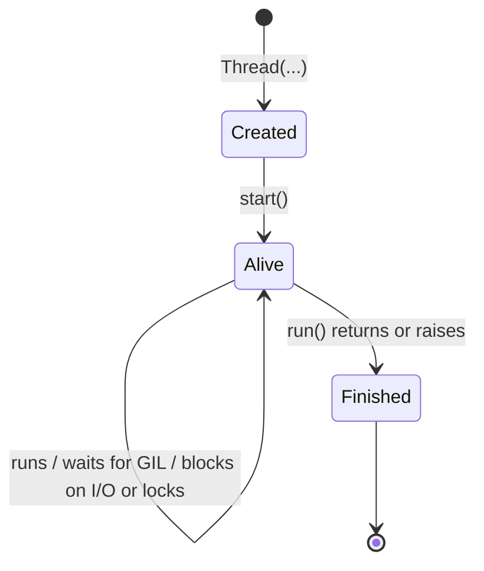

# 🐍 Python Multithreading & Concurrency — Practical Notes

> **A hands-on guide to writing concurrent Python code: threading, GIL, multiprocessing, asyncio, and production patterns**
> *From basics to staff-level depth*

---

## Table of Contents

1. [Concurrency Landscape in Python](#1-concurrency-landscape-in-python)
2. [The GIL — Global Interpreter Lock](#2-the-gil-global-interpreter-lock)
3. [Threading Module](#3-threading-module)
4. [Thread Synchronization](#4-thread-synchronization)
5. [Thread-Safe Queues & Communication](#5-thread-safe-queues-communication)
6. [concurrent.futures — High-Level API](#6-concurrentfutures-high-level-api)
7. [Multiprocessing — True Parallelism](#7-multiprocessing-true-parallelism)
8. [AsyncIO — Event Loop Concurrency](#8-asyncio-event-loop-concurrency)
9. [Choosing the Right Approach](#9-choosing-the-right-approach)
10. [Thread Safety Patterns](#10-thread-safety-patterns)
11. [Debugging Concurrency Issues](#11-debugging-concurrency-issues)
12. [Concurrency & Parallelism Interview Questions](#12-concurrency-parallelism-interview-questions)

---

## 1. Concurrency Landscape in Python

!!! tip "30-second answer"
    CPython gives you three tools. **Threads** are real OS threads that overlap I/O (the GIL is released while blocked) but, on the default build, run Python bytecode one at a time. **Processes** give real CPU parallelism at the cost of pickling and IPC. **asyncio** multiplexes thousands of I/O-bound tasks on one thread with cooperative scheduling. Since 3.14 there are two more options for CPU work: the officially supported **free-threaded build** (no GIL) and **subinterpreters** (`concurrent.interpreters`, `InterpreterPoolExecutor`), each with its own GIL.

### Three Models

```
┌──────────────────┬──────────────────┬──────────────────────────────┐
│   threading      │  multiprocessing │      asyncio                 │
│ (OS threads)     │ (OS processes)   │ (event loop, one thread)     │
├──────────────────┼──────────────────┼──────────────────────────────┤
│ GIL-limited CPU  │ True parallelism │ Cooperative, single thread   │
│ Good for I/O     │ Good for CPU     │ Best for many I/O conns      │
│ Shared memory    │ Separate memory  │ Shared state, no preemption  │
│ Stack: 8MB virt, │ Full interpreter │ ~1-2KB per coroutine/task    │
│ little resident  │ (tens of MB RSS) │                              │
│ 100s-low 1000s   │ ~1 per core      │ 10K-100K+ tasks              │
└──────────────────┴──────────────────┴──────────────────────────────┘
```

The memory and scale figures are orders of magnitude, not limits: thread stacks reserve virtual memory (8 MB by default on Linux, settable with `threading.stack_size()`) but only touched pages count, and process cost depends on start method and imports.

### Decision Matrix

| Workload | threading | multiprocessing | asyncio |
|----------|-----------|-----------------|---------|
| CPU-bound (compute) | ❌ GIL serializes | ✅ True parallelism | ❌ Single thread |
| I/O-bound (network) | ✅ GIL releases | ⚠️ Overkill | ✅ Best option |
| I/O-bound (file) | ✅ Works well | ⚠️ Overkill | ✅ Works well |
| Mixed CPU/I/O | ⚠️ Partial | ✅ Best | ⚠️ Partial |
| Low tail latency | ⚠️ GIL hand-offs add jitter | ⚠️ IPC overhead | ⚠️ Good until one task blocks the loop |
| Memory sharing needed | ✅ Easy | ⚠️ IPC needed | ✅ Single thread |

### Key Terminology

```python
# ── Concurrency ──────────────────────────────────────────
# "Dealing with many things at once" (structuring)
# Python: threading and asyncio are concurrent models

# ── Parallelism ──────────────────────────────────────────
# "Doing many things at once" (execution)
# Python: multiprocessing gives true parallelism
# threading is NOT parallel (GIL limits CPU work)

# ── Multithreading ──────────────────────────────────────
# Multiple threads sharing the same memory space
# Python: threads are real OS threads (1:1, scheduled by the kernel)
# But: on the default build the GIL prevents parallel bytecode execution

# ── Multiprocessing ─────────────────────────────────────
# Multiple processes with separate memory spaces
# Python: true parallel execution across CPU cores
# Cost: IPC overhead, memory duplication (unless shared)
```

---

## 2. The GIL — Global Interpreter Lock

### What the GIL Actually Is

The GIL is a per-interpreter mutex that a thread must hold to execute Python bytecode or touch Python objects. It exists so that reference counting, the allocator and built-in containers need no fine-grained locking, which keeps single-threaded code and C extensions simple and fast.

**How switching works (the "new GIL", Python 3.2+, by Antoine Pitrou; not a PEP):**

1. A thread that wants the GIL waits on a condition variable with a timeout of `sys.getswitchinterval()` (default `0.005` s).
2. If the timeout expires and the holder still has not released it, the waiter sets a "drop request" flag.
3. The holder checks that flag at safe points in the eval loop (backward jumps, function calls) and releases the GIL; it then waits until another thread has actually taken it, which prevents it from immediately grabbing it back.
4. Any blocking call (socket read, `time.sleep`, file I/O, `Lock.acquire`, many C extensions) releases the GIL voluntarily, so I/O threads rarely wait the full interval.

So the holder does **not** release every 5 ms unconditionally; it only drops the GIL when someone is waiting. This replaced the pre-3.2 "every 100 ticks" scheme, which let CPU-bound threads starve others on multicore machines.

**What the GIL does not give you:** atomicity of your own compound operations. `x += 1` is several bytecodes and a switch can land between them (see [Atomic Operations](#atomic-operations-no-lock-needed)).

```python
import sys
sys.getswitchinterval()        # 0.005
sys.setswitchinterval(0.001)   # more responsive I/O threads, more switching overhead
sys._is_gil_enabled()          # 3.13+: False only on a free-threaded build running without the GIL
```

### GIL Impact Analysis

```python
import sys
import time
import threading

def cpu_intensive(n: int) -> int:
    """CPU-bound work — GIL serializes this"""
    result = 0
    for i in range(n):
        result += i ** 2
    return result

def io_simulation(n: int) -> None:
    """I/O-bound work — GIL releases during sleep/I/O"""
    for _ in range(n):
        time.sleep(0.001)  # GIL released during sleep!

# ── CPU-bound test ───────────────────────────────────────
def test_cpu():
    start = time.perf_counter()
    threads = [
        threading.Thread(target=cpu_intensive, args=(5_000_000,))
        for _ in range(4)
    ]
    for t in threads: t.start()
    for t in threads: t.join()
    print(f"CPU-bound with 4 threads: {time.perf_counter() - start:.2f}s")
    # Same as sequential, often slightly slower (GIL hand-offs).
    # On a free-threaded build this scales with cores.

# ── I/O-bound test ───────────────────────────────────────
def test_io():
    start = time.perf_counter()
    threads = [
        threading.Thread(target=io_simulation, args=(1000,))
        for _ in range(4)
    ]
    for t in threads: t.start()
    for t in threads: t.join()
    print(f"I/O-bound with 4 threads: {time.perf_counter() - start:.2f}s")
    # ~4x faster than sequential! GIL releases during I/O.
```

### Working Around the GIL

| Option | Parallel CPU? | Cost / catch | Since |
|---|---|---|---|
| `multiprocessing` / `ProcessPoolExecutor` | Yes | Pickling, IPC, per-process memory; start method matters | always |
| C extensions that release the GIL (NumPy, hashlib on large inputs, zlib, Cython `with nogil:`) | Yes, inside the C code | Only helps if the hot loop is in C | always |
| Subinterpreters: `concurrent.interpreters`, `InterpreterPoolExecutor` | Yes, one GIL per interpreter | No shared objects; data is copied or passed through queues; many third-party C extensions not yet supported | per-interpreter GIL 3.12 (PEP 684), public API 3.14 (PEP 734) |
| Free-threaded build (`python3.14t`) | Yes, with plain threads | Separate build; ~5-10% single-thread overhead in 3.14; C extensions must opt in | experimental 3.13 (PEP 703), officially supported 3.14 (PEP 779) |

```python
# ── Strategy 1: processes ─────────────────────────────────
from concurrent.futures import ProcessPoolExecutor

def sum_squares(n: int) -> int:
    return sum(i * i for i in range(n))

if __name__ == "__main__":          # required with spawn/forkserver start methods
    with ProcessPoolExecutor() as pool:
        print(list(pool.map(sum_squares, [10, 100, 1000])))
        # [285, 328350, 332833500]

# ── Strategy 2: C code that releases the GIL ──────────────
# C:      Py_BEGIN_ALLOW_THREADS ... Py_END_ALLOW_THREADS
# Cython: with nogil: ...
# NumPy releases the GIL inside many array ops (e.g. np.dot on large arrays),
# so a ThreadPoolExecutor over NumPy work can use several cores.

# ── Strategy 3: subinterpreters (Python 3.14+) ────────────
from concurrent.futures import InterpreterPoolExecutor
from concurrent import interpreters

if __name__ == "__main__":
    # High level: each worker is an isolated interpreter with its own GIL.
    # Functions and arguments are pickled across, like ProcessPoolExecutor.
    with InterpreterPoolExecutor(max_workers=4) as pool:
        print(list(pool.map(sum_squares, [10, 100, 1000])))
        # [285, 328350, 332833500]

    # Low level: create one, run code in it, talk through a queue
    interp = interpreters.create()
    print(interp.call(sum_squares, 10))      # 285
    q = interpreters.create_queue()
    interp.prepare_main(q=q)                 # bind q in the interpreter's __main__
    interp.exec("q.put(sum(range(10)))")
    print(q.get())                           # 45
    interp.close()

# ── Strategy 4: free-threaded build ───────────────────────
# Install the "t" build (python3.14t; python.org installers and uv offer it).
#   python3.14t -c "import sys; print(sys._is_gil_enabled())"   # False
# Importing a C extension that hasn't declared free-threading support
# re-enables the GIL with a warning; PYTHON_GIL=0 / -X gil=0 forces it off.
# PYTHON_GIL has no effect on the normal (GIL) build.
```

!!! warning "What free threading does and doesn't change"
    Built-in `dict`, `list` and `set` use per-object locks, so a single `d[k] = v` or `lst.append(x)` still can't corrupt the object. What you lose is the *accidental* serialisation of your own compound operations: races that were rare under the GIL become frequent. Sharing one iterator across threads is not safe (items can be duplicated or skipped). Rule unchanged: protect shared mutable state with a `Lock`, or don't share it.

## 3. Threading Module

### Creating and Managing Threads

```python
import threading
import time
from typing import Callable, Any

# ── Basic thread creation ────────────────────────────────
def worker(name: str, delay: float) -> None:
    print(f"Thread {name} starting")
    time.sleep(delay)
    print(f"Thread {name} finished")

t = threading.Thread(target=worker, args=("A", 1.0))
t.start()
t.join()  # Wait for thread to finish
print("Main thread continues")

# ── Thread with return values ────────────────────────────
class ResultThread(threading.Thread):
    def __init__(self, target: Callable, args: tuple = ()):
        super().__init__()
        self._target_fn = target
        self._args = args
        self._result = None
        self._exception = None
    
    def run(self):
        try:
            self._result = self._target_fn(*self._args)
        except Exception as e:
            self._exception = e
    
    def result(self, timeout: float = None) -> Any:
        self.join(timeout)
        if self._exception:
            raise self._exception
        return self._result

def expensive_compute(n: int) -> int:
    return sum(i ** 2 for i in range(n))

thread = ResultThread(target=expensive_compute, args=(10_000_000,))
thread.start()
result = thread.result(timeout=5.0)
print(f"Result: {result}")

# ── Daemon threads ────────────────────────────────────────
# Daemon threads die when the main thread exits
# Use: background tasks, monitoring, health checks
def background_monitor():
    while True:
        print("Monitoring...")
        time.sleep(1)

monitor = threading.Thread(target=background_monitor, daemon=True)
monitor.start()
# Main thread exits → daemon thread is killed
```

### Thread Lifecycle



Python exposes only these states (`is_alive()`, `join()`); the runnable/running/blocked distinction lives in the OS scheduler. Things interviewers probe:

- `start()` can be called once; a second call raises `RuntimeError`.
- There is **no way to kill a thread** from outside. Design for cooperative cancellation (an `Event` the thread checks, or a sentinel on its queue).
- An exception in `run()` does not propagate to the joiner; it goes to `threading.excepthook` (prints by default). Use `concurrent.futures` if you need the exception back.

### Thread Identification & Utilities

```python
# ── Current thread info ──────────────────────────────────
current = threading.current_thread()
print(f"Name: {current.name}")
print(f"Ident: {current.ident}")
print(f"Daemon: {current.daemon}")
print(f"Alive: {current.is_alive()}")

# ── Enumerate all threads ────────────────────────────────
for thread in threading.enumerate():
    print(f"Thread: {thread.name} (alive={thread.is_alive()})")

# ── Thread count ─────────────────────────────────────────
print(f"Active threads: {threading.active_count()}")

# ── Thread-local data ────────────────────────────────────
# Data isolated per thread (no race conditions)
from uuid import uuid4
thread_local = threading.local()

def setup_thread():
    thread_local.user_id = threading.current_thread().ident
    thread_local.transaction_id = str(uuid4())

def get_context():
    return {
        'user_id': getattr(thread_local, 'user_id', None),
        'transaction_id': getattr(thread_local, 'transaction_id', None),
    }
```

### Thread Pools (Manual)

In real code use `ThreadPoolExecutor`. Writing one by hand is a common interview exercise, and the points they check are: unique task IDs, errors returned rather than swallowed, and a clean shutdown that doesn't rely on polling.

```python
import threading
from queue import Queue
from typing import Callable

_STOP = object()   # sentinel: one per worker on shutdown

class ThreadPool:
    def __init__(self, num_workers: int = 4):
        self.tasks: Queue = Queue()
        self.results: Queue = Queue()
        self._ids = iter(range(10**18))      # next() under _id_lock
        self._id_lock = threading.Lock()
        self.workers = [threading.Thread(target=self._worker_loop, daemon=True)
                        for _ in range(num_workers)]
        for w in self.workers:
            w.start()

    def _worker_loop(self):
        while True:
            task = self.tasks.get()          # blocks, no busy polling
            if task is _STOP:
                return
            task_id, func, args, kwargs = task
            try:
                self.results.put((task_id, func(*args, **kwargs), None))
            except Exception as e:           # report, don't swallow
                self.results.put((task_id, None, e))

    def submit(self, func: Callable, *args, **kwargs) -> int:
        with self._id_lock:
            task_id = next(self._ids)
        self.tasks.put((task_id, func, args, kwargs))
        return task_id

    def get_result(self, timeout: float | None = None):
        return self.results.get(timeout=timeout)   # (task_id, result, exc)

    def shutdown(self):
        for _ in self.workers:               # queued tasks finish first (FIFO)
            self.tasks.put(_STOP)
        for w in self.workers:
            w.join()
```

---

## 4. Thread Synchronization

### Lock (Mutex)

```python
import threading

# ── Basic lock ────────────────────────────────────────────
counter = 0
counter_lock = threading.Lock()

def increment():
    global counter
    for _ in range(100000):
        with counter_lock:  # Context manager — always releases
            counter += 1

# ── Non-blocking acquire ──────────────────────────────────
def try_acquire():
    if counter_lock.acquire(blocking=False):  # Don't block
        try:
            # Critical section
            pass
        finally:
            counter_lock.release()
    else:
        print("Lock not available, doing something else")

# ── Lock with timeout ─────────────────────────────────────
def acquire_with_timeout(lock: threading.Lock, timeout: float):
    acquired = lock.acquire(timeout=timeout)
    if acquired:
        try:
            # Critical section
            pass
        finally:
            lock.release()
    else:
        raise TimeoutError("Could not acquire lock")
```

### RLock (Reentrant Lock)

```python
# ── RLock: same thread can acquire multiple times ─────────
# Without RLock, this would deadlock:
class Counter:
    def __init__(self):
        self.lock = threading.RLock()  # NOT threading.Lock!
        self.value = 0
    
    def increment(self):
        with self.lock:
            self.value += 1
    
    def increment_by(self, n):
        with self.lock:
            for _ in range(n):
                self.increment()  # Same thread re-acquires lock
    
    def get_and_increment(self):
        with self.lock:
            val = self.value
            self.increment()
            return val

# ⚠️ RLock vs Lock:
# Lock: one acquisition per thread. If same thread tries again → deadlock
# RLock: same thread can acquire N times (reentrant), must release N times
# Use RLock when a method with a lock calls another method with the same lock
```

### Semaphore

```python
# ── Semaphore: limit concurrent access to N threads ───────
# Semaphore(n) allows n threads to enter
# BoundedSemaphore can't exceed initial value

import threading
import time

pool_semaphore = threading.Semaphore(3)  # Max 3 concurrent connections

def database_query(query: str):
    with pool_semaphore:
        print(f"Running: {query}")
        time.sleep(1)  # Simulate DB query
        return f"Result of {query}"

# ── Practical: rate-limited API client ─────────────────────
class TokenBucketRateLimiter:
    """
    Proper token bucket rate limiter.
    
    Tokens refill at a constant rate (max_calls/period per second),
    NOT all at once. This prevents the "burst at boundary" problem
    that the simple Semaphore + Timer approach suffers from.
    
    Each acquire() blocks until a token is available.
    Tokens are replenished continuously, not in batches.
    """
    
    def __init__(self, max_calls: int, period: float = 1.0):
        self.max_calls = max_calls
        self.period = period
        self.tokens = max_calls  # Start with full bucket
        self._rate = max_calls / period  # Tokens per second
        self._last_refill = time.monotonic()
        self._lock = threading.Lock()
    
    def acquire(self, blocking: bool = True, timeout: float = None) -> bool:
        """
        Acquire a token. Returns True if acquired, False if timeout/blocking=False.
        
        ⚠️ This implementation uses a simple sleep-poll loop.
        For production, use threading.Condition to avoid busy-waiting:
        
            self._cond = threading.Condition(self._lock)
            # In acquire(): while self.tokens < 1: self._cond.wait(t)
            # In _refill_tokens(): self._cond.notify()
        """
        deadline = time.monotonic() + timeout if timeout is not None else None
        
        while True:
            with self._lock:
                self._refill_tokens()
                if self.tokens >= 1:
                    self.tokens -= 1
                    return True
            
            if not blocking:
                return False
            if deadline is not None and time.monotonic() >= deadline:
                return False
            
            # No token available — wait a bit and retry
            time.sleep(min(0.001, self.period / self.max_calls))
    
    def _refill_tokens(self):
        now = time.monotonic()
        elapsed = now - self._last_refill
        self.tokens = min(self.max_calls, self.tokens + elapsed * self._rate)
        self._last_refill = now
    
    def __enter__(self):
        self.acquire()
        return self
    
    def __exit__(self, *args):
        pass  # Token was consumed; nothing to release

# Usage:
# limiter = TokenBucketRateLimiter(10, 1.0)  # 10 tokens/sec, continuous refill
# limiter.acquire()
# make_api_call()
# Or: with limiter: make_api_call()
```

### Event

```python
# ── Event: signal between threads ─────────────────────────
# One thread sets the event, others wait for it

start_event = threading.Event()
data_ready = threading.Event()
shutdown_event = threading.Event()

def worker_thread(worker_id: int):
    print(f"Worker {worker_id} waiting for start signal")
    start_event.wait()  # Block until set
    print(f"Worker {worker_id} started!")
    
    while not shutdown_event.is_set():
        data_ready.wait(timeout=1.0)
        if data_ready.is_set():
            print(f"Worker {worker_id} processing data")
            data_ready.clear()
    
    print(f"Worker {worker_id} shutting down")

# Signal all workers to start
start_event.set()

# Signal data available
data_ready.set()

# Shutdown all workers
shutdown_event.set()

# ── Event vs Condition ────────────────────────────────────
# Event: simple on/off signaling (pulse)
# Condition: complex state-dependent waiting (data availability)
```

### Condition

```python
# ── Condition: wait until a predicate over shared state is true ──
import threading
from collections import deque

class BoundedBuffer:
    """Producer-consumer with two Conditions sharing one Lock
    (the same design as queue.Queue)."""

    def __init__(self, maxsize: int = 10):
        self.buffer = deque()                    # O(1) popleft; list.pop(0) is O(n)
        self.maxsize = maxsize
        lock = threading.Lock()
        self.not_full = threading.Condition(lock)
        self.not_empty = threading.Condition(lock)

    def put(self, item):
        with self.not_full:
            while len(self.buffer) >= self.maxsize:   # while, not if: spurious
                self.not_full.wait()                  # wake-ups and stolen slots
            self.buffer.append(item)
            self.not_empty.notify()                   # wake ONE consumer

    def get(self):
        with self.not_empty:
            while not self.buffer:
                self.not_empty.wait()
            item = self.buffer.popleft()
            self.not_full.notify()                    # wake ONE producer
            return item
```

Why two conditions: with a single `Condition` shared by producers and consumers, `notify()` can wake a thread of the *wrong kind* (a producer when the buffer is full). That thread re-checks, goes back to sleep, and the wake-up is lost; with everyone asleep, the program deadlocks. Either use two conditions (above) or use `notify_all()` and pay for the thundering herd. `cond.wait_for(predicate, timeout)` wraps the `while` loop for you.

| Use | When |
|---|---|
| `Event` | One-shot or level-triggered flag: "started", "shutdown requested" |
| `Condition` | Wait until arbitrary shared state satisfies a predicate |
| `queue.Queue` | Almost always, instead of hand-rolling the above |

### Barrier

```python
# ── Barrier: synchronize N threads at a point ─────────────
# All N threads must reach the barrier before any can proceed

import threading
import time

barrier = threading.Barrier(3)  # 3 threads must sync

def parallel_phase(worker_id: int, phase_name: str):
    print(f"Worker {worker_id} starting phase {phase_name}")
    time.sleep(worker_id * 0.5)  # Simulate variable work
    print(f"Worker {worker_id} waiting at barrier for {phase_name}")
    barrier.wait()  # Blocks until all 3 threads arrive
    print(f"Worker {worker_id} passed barrier for {phase_name}")
    # All threads proceed together

# ── Barrier with timeout ──────────────────────────────────
try:
    barrier.wait(timeout=5.0)
except threading.BrokenBarrierError:
    print("Barrier broken — one thread timed out or failed")

# ── Barrier with callback ─────────────────────────────────
barrier = threading.Barrier(3, action=lambda: print("All threads synced!"))
```

---

## 5. Thread-Safe Queues & Communication

### queue.Queue

```python
import queue
import threading

# ── Queue — thread-safe FIFO ───────────────────────────────
task_queue = queue.Queue(maxsize=100)

def producer():
    for i in range(50):
        task_queue.put(f"Task-{i}")  # Blocks if full
        print(f"Produced Task-{i}")
    task_queue.put(None)  # Sentinel: signals end

def consumer():
    while True:
        task = task_queue.get()  # Blocks if empty
        if task is None:
            task_queue.task_done()
            break  # Sentinel received
        print(f"Consumed {task}")
        task_queue.task_done()  # Signal task completion

producer_thread = threading.Thread(target=producer)
consumer_thread = threading.Thread(target=consumer)

producer_thread.start()
consumer_thread.start()

# Wait until all tasks are processed
task_queue.join()  # Blocks until every put has a corresponding task_done
print("All tasks completed")

# ── Queue variants ─────────────────────────────────────────
q = queue.Queue(maxsize=100)      # FIFO (default)
q = queue.LifoQueue(maxsize=100)  # LIFO (stack)
q = queue.PriorityQueue(maxsize=100)  # Priority (min-heap)

# ── Non-blocking operations ────────────────────────────────
try:
    item = task_queue.get(block=False)
except queue.Empty:
    print("Queue empty, doing other work")

try:
    task_queue.put(item, block=False)
except queue.Full:
    print("Queue full, discarding item")

# ── Queue with timeout ─────────────────────────────────────
try:
    item = task_queue.get(timeout=5.0)
except queue.Empty:
    print("No item after 5 seconds")
```

### Pipe (multiprocessing)

```python
# ── Pipe for two-way communication ─────────────────────────
# Simplex/duplex channels between processes/threads
from multiprocessing import Pipe

parent_conn, child_conn = Pipe()

def worker(conn):
    conn.send("Hello from worker")
    data = conn.recv()  # Receive from main
    conn.close()

t = threading.Thread(target=worker, args=(child_conn,))
t.start()

msg = parent_conn.recv()  # Receive from worker
print(f"Got: {msg}")
parent_conn.send("Hello from main")
t.join()
```

### Producer-Consumer Patterns

```python
# ── Multi-producer, single consumer ────────────────────────
class Pipeline:
    def __init__(self, num_producers: int, maxsize: int = 100):
        self.queue = queue.Queue(maxsize)    # bounded = backpressure
        self.num_producers = num_producers
        self._stop_event = threading.Event()

    def producer(self, data: list):
        try:
            for item in data:
                if self._stop_event.is_set():
                    break
                self.queue.put(item)
        finally:
            self.queue.put(None)             # ALWAYS send the sentinel

    def consumer(self):
        # Count sentinels against a number known up front. Tracking
        # "producers seen so far" breaks if one producer finishes
        # before another has sent anything.
        remaining = self.num_producers
        while remaining:
            item = self.queue.get()
            try:
                if item is None:
                    remaining -= 1
                else:
                    self.process(item)
            finally:
                self.queue.task_done()       # every get() needs one

    def process(self, item):
        pass

    def stop(self):
        self._stop_event.set()

# ── Fan-out: one producer, multiple consumers ──────────────
class FanOut:
    def __init__(self, num_consumers: int = 4):
        self.queues = [queue.Queue() for _ in range(num_consumers)]
        self.consumers = []
        self._counter = 0  # For round-robin
    
    def add_consumer(self, worker):
        idx = len(self.consumers)
        t = threading.Thread(target=worker, args=(self.queues[idx],))
        t.daemon = True
        t.start()
        self.consumers.append(t)
    
    def publish(self, item):
        # Round-robin distribution (assumes ONE publishing thread;
        # _counter += 1 is not atomic)
        q = self.queues[self._counter % len(self.queues)]
        self._counter += 1
        q.put(item)
    
    def broadcast(self, item):
        # Send to ALL consumers
        for q in self.queues:
            q.put(item)
```

---

## 6. concurrent.futures — High-Level API

### ThreadPoolExecutor

```python
from concurrent.futures import ThreadPoolExecutor, as_completed, wait
import urllib.request

# ── Basic usage ────────────────────────────────────────────
def fetch_url(url: str) -> tuple[str, str]:
    with urllib.request.urlopen(url, timeout=5) as response:
        return url, response.read().decode()[:100]

urls = [
    "https://python.org",
    "https://github.com",
    "https://stackoverflow.com",
]

# Context manager — automatically shuts down pool
with ThreadPoolExecutor(max_workers=4) as executor:
    # Submit individual tasks
    futures = {executor.submit(fetch_url, url): url for url in urls}
    
    # Process as they complete
    for future in as_completed(futures):
        url = futures[future]
        try:
            _, content = future.result(timeout=10)
            print(f"{url}: {len(content)} chars")
        except Exception as e:
            print(f"{url} failed: {e}")

# ── map() — simple mapping ────────────────────────────────
with ThreadPoolExecutor(max_workers=4) as executor:
    results = executor.map(fetch_url, urls, timeout=10)
    for url, content in results:      # results come back in INPUT order;
        print(f"{url}: OK")           # the first exception is re-raised here
```

Details interviewers check:

- Default `max_workers` is `min(32, os.process_cpu_count() + 4)` (3.13+; `os.cpu_count()` before). Size I/O pools to the downstream limit (DB pool size, API quota), not to cores.
- `as_completed` yields in completion order; `map` yields in input order and a slow first item holds up the rest. `map(..., buffersize=n)` (3.14) stops `map` from submitting the whole input up front.
- `future.cancel()` only works before the task starts. `shutdown(cancel_futures=True)` (3.9+) drops queued work; running tasks still finish, since threads can't be interrupted.
- An exception inside a task is stored on the future. If nobody calls `.result()`, it is silently lost.

### ProcessPoolExecutor

```python
from concurrent.futures import ProcessPoolExecutor, as_completed
import math

# ── CPU-bound work: processes give true parallelism ───────
def is_prime(n: int) -> bool:
    if n < 2:
        return False
    for i in range(2, int(math.sqrt(n)) + 1):
        if n % i == 0:
            return False
    return True

def find_primes_in(r: range) -> list[int]:
    return [n for n in r if is_prime(n)]

if __name__ == "__main__":   # children re-import this module under spawn/forkserver
    with ProcessPoolExecutor(max_workers=4) as executor:
        # Chunk the work: one task per chunk amortises pickling/IPC
        chunks = [range(i, i + 25000) for i in range(0, 100000, 25000)]
        futures = [executor.submit(find_primes_in, c) for c in chunks]

        results = []
        for future in as_completed(futures):
            results.extend(future.result())
    print(len(results))   # 9592 primes below 100,000

# ── Thread vs Process ──────────────────────────────────────
# ThreadPoolExecutor:  GIL-bound, good for I/O
# ProcessPoolExecutor: True parallel, good for CPU
# ProcessPoolExecutor: function, arguments and results must be picklable
# (no lambdas or local functions), and the worker must be importable.
```

### Custom Executor Patterns

```python
from concurrent.futures import ThreadPoolExecutor, Future
import threading
import time

# ── Rate-limited executor ──────────────────────────────────
class RateLimitedExecutor:
    """
    Executor that limits throughput using a token bucket.
    
    ⚠️ Uses TokenBucketRateLimiter instead of raw Semaphore.
       A raw Semaphore with Timer has a burst-at-boundary bug:
       all permits are released at once after the period, not
       continuously at the desired rate.
    """
    def __init__(self, max_workers: int, calls_per_second: float):
        self.executor = ThreadPoolExecutor(max_workers)
        # Token bucket provides smooth rate limiting, not bursty
        self.rate_limiter = TokenBucketRateLimiter(
            max_calls=int(calls_per_second),
            period=1.0,
        )
    
    def submit(self, fn, *args, **kwargs) -> Future:
        # Block until a token is available (rate limited)
        self.rate_limiter.acquire()
        return self.executor.submit(fn, *args, **kwargs)
    
    def shutdown(self, wait=True):
        self.executor.shutdown(wait)

# ── Progress tracking executor ─────────────────────────────
class ProgressExecutor:
    def __init__(self, max_workers: int, total: int):
        self.executor = ThreadPoolExecutor(max_workers)
        self.completed = 0
        self.total = total
        self.lock = threading.Lock()
    
    def submit(self, fn, *args, **kwargs) -> Future:
        future = self.executor.submit(fn, *args, **kwargs)
        future.add_done_callback(self._on_complete)
        return future
    
    def _on_complete(self, future):
        # Runs in the worker thread that finished the task (or immediately,
        # in the caller, if the future is already done).
        with self.lock:
            self.completed += 1
            done = self.completed            # read under the lock
        print(f"Progress: {done}/{self.total} ({done*100//self.total}%)")

# Usage:
# executor = ProgressExecutor(4, len(urls))
# for url in urls:
#     executor.submit(fetch_url, url)
```

---

## 7. Multiprocessing — True Parallelism

### Start Methods (a frequent production bug source)

| Method | How the child starts | Default on | Catch |
|---|---|---|---|
| `fork` | `fork()` copy of the parent, copy-on-write | nowhere since 3.14 (was Linux) | Copies held locks and only the forking thread. If another thread held a lock (logging, an HTTP client, a DB driver), the child can deadlock. 3.12+ emits a `DeprecationWarning` when forking a multi-threaded process |
| `spawn` | Fresh interpreter, re-imports your main module | macOS (3.8+), Windows | Slow start; everything must be picklable; needs `if __name__ == "__main__":` |
| `forkserver` | Forks from a clean single-threaded server process | Linux and other POSIX since **3.14** | Same picklability and main-guard rules as `spawn` |

Code that "worked on Linux" because `fork` let children inherit globals and lambdas breaks on 3.14 Linux for the same reason it always broke on macOS. Fix the code (picklable top-level functions, main guard) or opt in explicitly with `multiprocessing.get_context("fork")`.

### Process Basics

```python
import multiprocessing as mp
import os
import time

# ── Process creation ───────────────────────────────────────
def worker(name: str):
    print(f"Worker {name} (PID: {os.getpid()}) running")
    time.sleep(1)
    return f"Result from {name}"

# Process has its own memory space, GIL, and Python interpreter
p = mp.Process(target=worker, args=("A",))
p.start()
p.join()  # Wait for process to complete

# ── Process with return value (via Queue) ─────────────────
def worker_with_result(q: mp.Queue, name: str):
    result = expensive_computation(name)
    q.put(result)

result_queue = mp.Queue()
p = mp.Process(target=worker_with_result, args=(result_queue, "B"))
p.start()
result = result_queue.get()  # Get result
p.join()
```

### Pool — Process Pool

```python
from multiprocessing import Pool, cpu_count

# ── Pool.map — parallel mapping ────────────────────────────
def process_item(item: dict) -> dict:
    # CPU-intensive processing
    item['result'] = expensive_transform(item['data'])
    return item

data = [{'id': i, 'data': range(1000000)} for i in range(16)]

with Pool(processes=cpu_count()) as pool:
    # map: blocks until all done
    results = pool.map(process_item, data)
    
    # imap: lazy iteration (yields as completed)
    for result in pool.imap(process_item, data):
        print(f"Got: {result['id']}")
    
    # imap_unordered: yields as completed, no order guarantee
    for result in pool.imap_unordered(process_item, data):
        print(f"Got: {result['id']}")

# ── Pool.starmap — multiple arguments ──────────────────────
def multiply(x, y):
    return x * y

with Pool(4) as pool:
    results = pool.starmap(multiply, [(1,2), (3,4), (5,6)])
    # results = [2, 12, 30]

# ── Pool.apply_async — non-blocking submission ────────────
def process_chunk(chunk):
    return [item * 2 for item in chunk]

with Pool(4) as pool:
    futures = []
    for chunk in chunks:
        future = pool.apply_async(process_chunk, (chunk,))
        futures.append(future)
    
    for future in futures:
        result = future.get(timeout=30)
        all_results.extend(result)
```

### Shared Memory

```python
from multiprocessing import shared_memory, Value, Array, Manager
import numpy as np

# ── Shared Memory (Python 3.8+) ────────────────────────────
# Zero-copy shared memory between processes
def worker_process(shm_name: str, shape: tuple, dtype: np.dtype):
    existing_shm = shared_memory.SharedMemory(name=shm_name)
    arr = np.ndarray(shape, dtype=dtype, buffer=existing_shm.buf)
    
    # Modify in place — no serialization!
    arr *= 2
    
    existing_shm.close()

# Main process
shape = (1000, 1000)
arr = np.zeros(shape, dtype=np.float64)

shm = shared_memory.SharedMemory(create=True, size=arr.nbytes)
shared_arr = np.ndarray(shape, dtype=arr.dtype, buffer=shm.buf)
shared_arr[:] = arr[:]

p = mp.Process(target=worker_process, args=(shm.name, shape, arr.dtype))
p.start()
p.join()

print(shared_arr[:5, :5])  # Values doubled!

shm.close()
shm.unlink()

# ── Value and Array (simpler shared primitives) ────────────
counter = mp.Value('i', 0)  # Shared integer
data = mp.Array('d', 100)   # Shared array of 100 doubles

def increment(counter):
    with counter.get_lock():  # Value has built-in lock
        counter.value += 1

# ── Manager — shared Python objects ────────────────────────
# Manager provides shared dicts, lists, Namespaces, etc.
# Slower than shared_memory (uses IPC) but more flexible

def manager_worker(d, key, value):
    d[key] = value

with mp.Manager() as manager:
    shared_dict = manager.dict()
    shared_list = manager.list()
    
    processes = []
    for i in range(5):
        p = mp.Process(target=manager_worker, args=(shared_dict, f'key-{i}', i))
        p.start()
        processes.append(p)
    
    for p in processes:
        p.join()
    
    print(dict(shared_dict))  # {'key-0': 0, 'key-1': 1, ...}
```

### Multiprocessing Queue & Pipe

```python
# ── Queue — thread & process safe ─────────────────────────
from multiprocessing import Queue, Pipe

task_queue = Queue(maxsize=100)
result_queue = Queue()

def producer(q: Queue, items: list):
    for item in items:
        q.put(item)
    q.put(None)  # Sentinel

def consumer(in_q: Queue, out_q: Queue):
    while True:
        item = in_q.get()
        if item is None:
            out_q.put(None)
            break
        result = process(item)
        out_q.put(result)

# ── Pipe — two-way communication ───────────────────────────
parent_conn, child_conn = Pipe(duplex=True)

def pipe_worker(conn):
    conn.send("Hello")
    msg = conn.recv()
    print(f"Worker received: {msg}")
    conn.close()

p = mp.Process(target=pipe_worker, args=(child_conn,))
p.start()

msg = parent_conn.recv()
print(f"Main received: {msg}")
parent_conn.send("World")
p.join()
```

---

## 8. AsyncIO — Event Loop Concurrency

### When to Use AsyncIO

```python
# ── AsyncIO is best for ────────────────────────────────────
# 1. Many concurrent I/O connections (1000s of open sockets)
# 2. Network services (HTTP servers, WebSocket handlers)
# 3. Microservices communicating over the network
# 4. (Not disk I/O: there is no async file I/O in asyncio; aiofiles and
#    asyncio.to_thread just run blocking file calls in a thread pool)
# 5. Any workload that spends most time waiting for I/O

# ── AsyncIO is NOT good for ────────────────────────────────
# 1. CPU-bound computation (blocking the event loop)
# 2. Libraries that don't support async
# 3. True parallelism (single-threaded by design)
```

### Event Loop Mechanics

```python
import asyncio

# ── The event loop in action ──────────────────────────────
async def task_a():
    print("A: started")
    await asyncio.sleep(1)  # Yields control
    print("A: finished")

async def task_b():
    print("B: started")
    await asyncio.sleep(0.5)
    print("B: finished")

# These run concurrently (not in parallel)
async def main():
    await asyncio.gather(task_a(), task_b())

asyncio.run(main())
# Output:
# A: started
# B: started
# B: finished
# A: finished

# ── Mixed threading and asyncio ────────────────────────────
# Run blocking code in a thread pool
async def fetch_with_fallback(url: str):
    # Simplest (3.9+): run a sync function in the default thread pool
    # and copy contextvars across. Doesn't block the event loop.
    return await asyncio.to_thread(sync_http_request, url)

    # Equivalent lower-level form (use get_running_loop inside coroutines;
    # get_event_loop() with no running loop raises RuntimeError since 3.14):
    # loop = asyncio.get_running_loop()
    # return await loop.run_in_executor(None, sync_http_request, url)
```

### Running Blocking Code with AsyncIO

```python
import asyncio
import functools
from concurrent.futures import ThreadPoolExecutor

# ── Thread pool with asyncio ───────────────────────────────
async def process_items(items):
    loop = asyncio.get_running_loop()

    # A dedicated pool caps concurrency for this workload separately
    # from the default executor. Blocking I/O belongs here; CPU-bound
    # pure-Python work still holds the GIL, so use a ProcessPoolExecutor.
    with ThreadPoolExecutor(max_workers=4) as pool:
        tasks = []
        for item in items:
            task = loop.run_in_executor(pool, blocking_func, item)
            tasks.append(task)
        
        results = await asyncio.gather(*tasks)
    return results

# ── Async context manager for thread pool ─────────────────
class ThreadPoolAsync:
    def __init__(self, max_workers: int = 4):
        self.pool = ThreadPoolExecutor(max_workers)
    
    async def run(self, fn, *args, **kwargs):
        loop = asyncio.get_running_loop()
        # run_in_executor takes positional args only; bind kwargs first
        return await loop.run_in_executor(
            self.pool, functools.partial(fn, *args, **kwargs))
    
    async def __aenter__(self):
        return self
    
    async def __aexit__(self, *args):
        self.pool.shutdown(wait=True)

# Usage:
# async with ThreadPoolAsync(4) as pool:
#     result = await pool.run(expensive_compute, data)
```

---

## 9. Choosing the Right Approach

### Decision Guide

```python
# ═══════════════════════════════════════════════════════════
# How to choose your concurrency model
# ═══════════════════════════════════════════════════════════

def choose_concurrency_model(workload_type: str, concurrency: int):
    """
    workload_type: 'cpu', 'io_network', 'io_disk', 'mixed'
    concurrency: number of simultaneous tasks
    """
    
    guide = {
        'cpu': {
            'few_tasks': 'multiprocessing',
            'many_tasks': 'multiprocessing with Pool',
            'logic': 'True parallelism needed. GIL prevents threading.',
        },
        'io_network': {
            'few_tasks': 'threading (simpler than asyncio)',
            'many_tasks': 'asyncio (thousands of connections)',
            'logic': 'Both release GIL. asyncio scales to more connections.',
        },
        'io_disk': {
            'few_tasks': 'threading',
            'many_tasks': 'asyncio with aiofiles',
            'logic': 'Disk I/O also releases GIL.',
        },
        'mixed': {
            'few_tasks': 'multiprocessing + threading',
            'many_tasks': 'asyncio + ProcessPoolExecutor',
            'logic': 'Use threads for I/O, processes for CPU.',
        },
    }
    
    return guide[workload_type]

# ── Hybrid pattern: asyncio + multiprocessing ─────────────
import asyncio
from concurrent.futures import ProcessPoolExecutor

async def hybrid_pipeline(data: list) -> list:
    """Use asyncio for I/O, processes for CPU work"""
    
    loop = asyncio.get_running_loop()

    with ProcessPoolExecutor(max_workers=4) as pool:
        # Phase 1: CPU-bound processing in parallel
        cpu_results = await loop.run_in_executor(
            pool, cpu_heavy_process, data
        )
        
        # Phase 2: I/O-bound with asyncio
        io_tasks = [
            make_network_call(result)
            for result in cpu_results
        ]
        final_results = await asyncio.gather(*io_tasks)
    
    return final_results
```

### Performance Comparison Table

| Aspect | Threading | Multiprocessing | AsyncIO | Subinterpreters (3.14) | Free-threaded (3.14t) |
|--------|-----------|-----------------|---------|----|----|
| **Parallel CPU** | No (GIL build) | Yes | No | Yes | Yes |
| **Memory per unit** | Small resident; 8 MB virtual stack | Tens of MB | ~1-2 KB per task | Several MB per interpreter | Same as threads |
| **Startup** | Fast | `fork` fast; `spawn`/`forkserver` slow (imports) | Very fast | Slower than threads, faster than spawn | Fast |
| **Data sharing** | Shared objects | Pickle / shared_memory | Shared (one thread) | Copy / queues / memoryview | Shared objects |
| **Typical scale** | 10s-1000s | ~1 per core | 10K-100K+ | ~1 per core | ~1 per core for CPU |
| **Main risk** | Races, deadlocks | Pickling, start-method bugs | One blocking call stalls everything | Extension support | Races that the GIL used to hide; extension support |

---

## 10. Thread Safety Patterns

### Immutable Data

```python
# ── Immutable objects are inherently thread-safe ──────────

from typing import NamedTuple
import threading

# NamedTuple is immutable (no __dict__, no attribute mutation)
class Config(NamedTuple):
    host: str
    port: int
    timeout: float
    max_connections: int

# Once created, Config is safe to share across threads
config = Config("localhost", 8080, 30.0, 100)

def worker():
    # Reading config is always safe — no mutation!
    conn = connect(config.host, config.port, config.timeout)
```

### Thread-Local Storage

```python
# ── Each thread gets its own copy of data ──────────────────
import threading

_request_context = threading.local()

def set_request_context(user_id: str, request_id: str):
    _request_context.user_id = user_id
    _request_context.request_id = request_id
    _request_context.trace_id = f"{user_id}:{request_id}"

def get_request_context():
    return {
        'user_id': getattr(_request_context, 'user_id', None),
        'request_id': getattr(_request_context, 'request_id', None),
        'trace_id': getattr(_request_context, 'trace_id', None),
    }

# ── Thread-local logger ─────────────────────────────────────
import logging

class ThreadLocalLogger:
    _storage = threading.local()
    
    def __init__(self, name: str):
        self.name = name
    
    def get_logger(self) -> logging.Logger:
        if not hasattr(self._storage, 'logger'):
            self._storage.logger = logging.getLogger(self.name)
        return self._storage.logger

# Usage in thread pool:
# logger = ThreadLocalLogger("my_service")
# log = logger.get_logger()  # Each thread has its own logger instance
```

### Atomic Operations (No Lock Needed)

Short answer: a **single operation on a built-in container** (`d[k] = v`, `d.get(k)`, `lst.append(x)`, `lst.pop()`, `deque.append`/`popleft`) can't corrupt the object, on both the GIL build and the free-threaded build (which uses per-object locks). **Read-modify-write sequences are never atomic.** The language spec guarantees none of this, so treat it as a CPython implementation detail: fine for a `deque` used as a log buffer, not something to build correctness on.

```python
# ✅ Single operation on a built-in (won't corrupt the container)
value = shared_dict['key']
shared_dict['key'] = value     # unless key's __hash__/__eq__ or the old
shared_list.append(item)       # value's __del__ runs Python code
item = shared_deque.popleft()

# ❌ Read-modify-write: another thread can run in between
shared_dict['key'] += 1
counter += 1
if key not in cache:           # check-then-act
    cache[key] = compute()

# What `counter += 1` compiles to (Python 3.14, `dis`):
#   LOAD_GLOBAL      counter
#   LOAD_SMALL_INT   1
#   BINARY_OP        13 (+=)     <- a switch here loses an update
#   STORE_GLOBAL     counter
# Bytecode names change between versions (INPLACE_ADD before 3.11);
# the point is that it's a load, an add and a store.
```

Atomic alternatives that need no explicit lock: `dict.setdefault(k, v)` (one call, so first writer wins), `queue.Queue`, and `itertools.count()` for IDs on the GIL build. For anything else, use a `Lock`.

### Read-Copy-Update (RCU) Pattern

```python
# ── Lock-free reads, copy-on-write updates ─────────────────
import threading
from types import MappingProxyType

class RCUCache:
    """Readers never lock: they grab the current snapshot reference,
    which is never mutated after publication. Writers copy, modify
    and publish a new snapshot under a lock."""

    def __init__(self, initial_data: dict | None = None):
        self._lock = threading.Lock()                 # serialises writers only
        self._data = MappingProxyType(dict(initial_data or {}))  # read-only view of our own copy

    def get(self, key, default=None):
        return self._data.get(key, default)           # one attribute load = consistent snapshot

    def update(self, key, value):
        self.batch_update({key: value})

    def batch_update(self, updates: dict):
        with self._lock:
            new = dict(self._data)                    # shallow copy is enough if values are immutable
            new.update(updates)
            self._data = MappingProxyType(new)        # publish: single reference assignment
```

Trade-off: reads are as cheap as a dict lookup; each write is O(n) in the size of the map. Good for config and routing tables (many reads, rare writes), bad for hot write paths. A reader holding an old snapshot sees stale data until it re-reads, which is usually what you want (a consistent view).

### Read-Write Lock Pattern

```python
# ── Read-write lock (writer-preferring) ────────────────────
# The stdlib has no RWLock. In CPython, critical sections are usually
# short and the GIL serialises reads anyway, so a plain Lock often
# wins. An RWLock pays off when reads are long (I/O or C code that
# releases the GIL) or on the free-threaded build.
import threading
from contextlib import contextmanager

class RWLock:
    """Many concurrent readers OR one writer.
    Writer-preferring: once a writer is waiting, new readers queue
    behind it, so a steady stream of readers can't starve writers."""

    def __init__(self):
        self._cond = threading.Condition(threading.Lock())
        self._readers = 0            # active readers
        self._writer = False         # a writer holds the lock
        self._writers_waiting = 0

    def acquire_read(self):
        with self._cond:
            while self._writer or self._writers_waiting:
                self._cond.wait()
            self._readers += 1

    def release_read(self):
        with self._cond:
            self._readers -= 1
            if self._readers == 0:
                self._cond.notify_all()   # a writer may be waiting

    def acquire_write(self):
        with self._cond:
            self._writers_waiting += 1
            while self._writer or self._readers:   # excludes other writers too
                self._cond.wait()
            self._writers_waiting -= 1
            self._writer = True

    def release_write(self):
        with self._cond:
            self._writer = False
            self._cond.notify_all()       # wake readers and writers; they re-check

    @contextmanager
    def read_lock(self):
        self.acquire_read()
        try:
            yield
        finally:
            self.release_read()

    @contextmanager
    def write_lock(self):
        self.acquire_write()
        try:
            yield
        finally:
            self.release_write()
```

Follow-ups to expect: the lock isn't reentrant (a reader that tries to take the write lock deadlocks, because upgrades need a separate protocol), and writer preference trades writer starvation for reader latency spikes.

### Pipeline Pattern (Thread-Safe)

```python
# ── Thread-safe pipeline using queues ──────────────────────
class PipelineStage(threading.Thread):
    def __init__(self, input_queue: queue.Queue, output_queue: queue.Queue,
                 process_fn, name: str = ""):
        super().__init__(daemon=True)
        self.input = input_queue
        self.output = output_queue
        self.process = process_fn
        self.name = name
    
    def run(self):
        while True:
            item = self.input.get()
            if item is None:  # Sentinel
                self.output.put(None)
                break
            try:
                result = self.process(item)
                self.output.put(result)
            except Exception as e:
                self.output.put(e)

class Pipeline:
    def __init__(self, stages: list):
        self.queues = [queue.Queue() for _ in range(len(stages) + 1)]
        self.stages = []
        
        for i, (process_fn, name) in enumerate(stages):
            stage = PipelineStage(
                self.queues[i], self.queues[i+1],
                process_fn, name
            )
            self.stages.append(stage)
    
    def start(self):
        for stage in self.stages:
            stage.start()
    
    def process(self, item):
        self.queues[0].put(item)
    
    def get_result(self, timeout: float = None):
        return self.queues[-1].get(timeout=timeout)
    
    def shutdown(self):
        self.queues[0].put(None)  # Propagates through all stages
        for stage in self.stages:
            stage.join(timeout=1.0)

# Usage:
# def parse_data(data): return json.loads(data)
# def validate(item): return item if item['id'] else None
# def save(item): db.insert(item); return item
#
# pipeline = Pipeline([
#     (parse_data, "parser"),
#     (validate, "validator"),
#     (save, "saver"),
# ])
# pipeline.start()
# pipeline.process('{"id": 1, "name": "test"}')
# result = pipeline.get_result()
```

---

## 11. Debugging Concurrency Issues

### Common Pitfalls

```python
# ── 1. Deadlock ─────────────────────────────────────────────
# Thread A holds Lock 1, waits for Lock 2
# Thread B holds Lock 2, waits for Lock 1

# Fix: consistent lock ordering, timeouts, or try-lock

# ── 2. Race Condition ──────────────────────────────────────
# Two threads read/write shared data without synchronization

counter = 0
def bad_increment():
    global counter
    counter += 1  # NOT safe! Read, modify, write are not atomic

# ── 3. Lost wake-up / missed signal ──────────────────────
# Checking a condition with `if` instead of `while`, or notifying
# before the waiter starts waiting. Fix: always `while not pred: wait()`
# (or cond.wait_for), and keep the state change under the same lock.

# ── 4. Starvation ─────────────────────────────────────────
# Python threads have no priorities. Starvation here means a reader-
# preferring RWLock starving writers, or an unfair lock always being
# re-taken by the same thread. Fix: fair/writer-preferring designs, queues.

# ── 5. GIL convoy effect ──────────────────────────────────
# One CPU-bound thread + I/O-bound threads: every time an I/O thread's
# read completes it must wait up to the switch interval (5 ms) to get
# the GIL back, so I/O throughput and latency collapse (bpo-7946).
# Fix: move CPU work to processes, or lower sys.setswitchinterval().

# ── 6. Holding Lock During I/O ────────────────────────────
with lock:
    data = fetch_from_network()  # ⚠️ I/O while holding lock!
    process(data)
# Fix: minimize locked regions, fetch outside lock
```

### Debugging Tools

```python
# ── 1. Dump every thread's stack (hung process) ──────────────
import faulthandler, signal, sys
faulthandler.register(signal.SIGUSR1, all_threads=True)  # kill -USR1 <pid>
faulthandler.dump_traceback_later(60, repeat=True)       # watchdog: dump every 60 s if still running
faulthandler.dump_traceback(file=sys.stderr, all_threads=True)  # on demand

# From outside, without code changes:
#   py-spy dump --pid <pid>        # all thread stacks, shows who holds/waits on the GIL
#   python3.14 -m pdb -p <pid>     # 3.14+: attach a debugger to a live process (PEP 768)
#   python3.14 -m asyncio pstree <pid>   # 3.14+: async task tree of a running process

# ── 2. Put the thread name in every log line ─────────────────
import logging
logging.basicConfig(
    level=logging.DEBUG,
    format='%(asctime)s [%(threadName)s] %(message)s',
)

# ── 3. Surface exceptions from bare threads ──────────────────
import threading
def excepthook(args):  # args.exc_type, args.exc_value, args.thread
    logging.error("Thread %s died", args.thread.name,
                  exc_info=(args.exc_type, args.exc_value, args.exc_traceback))
threading.excepthook = excepthook
```

```python
# ── 4. Lock-order checker (finds deadlock *risk* before it hangs) ──
import threading

class TrackedLock:
    """Wraps a Lock (composition; threading.Lock can't be subclassed).
    Records "held A, then took B" edges; seeing B-then-A anywhere
    means two threads could deadlock. This is the idea behind
    lockdep in Linux and TSan's lock-order checks."""

    _held = threading.local()   # per-thread stack of held lock ids
    _edges: set[tuple[int, int]] = set()
    _edges_lock = threading.Lock()

    def __init__(self, name: str):
        self._lock = threading.Lock()
        self.name = name

    def acquire(self, blocking=True, timeout=-1):
        ok = self._lock.acquire(blocking, timeout)
        if ok:
            stack = self._held.__dict__.setdefault("stack", [])
            with TrackedLock._edges_lock:
                for held in stack:
                    if (id(self), held) in TrackedLock._edges:
                        print(f"WARNING lock-order inversion: {self.name} "
                              f"taken while holding another lock in reverse order")
                    TrackedLock._edges.add((held, id(self)))
            stack.append(id(self))
        return ok

    def release(self):
        self._held.stack.remove(id(self))
        self._lock.release()

    __enter__ = acquire
    def __exit__(self, *exc):
        self.release()

# ── 5. ThreadSanitizer ───────────────────────────────────────
# There is no runtime flag. Build CPython with
#   ./configure --with-thread-sanitizer   (3.13+, mainly for the
#   free-threaded build: --disable-gil)
# and run your tests to find data races in C extensions and the
# interpreter. For pure-Python races, use stress tests: many threads,
# sys.setswitchinterval(1e-6) to force frequent switches.
```

### Profiling Concurrent Code

```python
# ── Profile thread contention ──────────────────────────────
import cProfile
import pstats
import threading

def profile_threads(func, *args, **kwargs):
    """Profile a function that spawns threads"""
    profiler = cProfile.Profile()
    profiler.enable()
    
    result = func(*args, **kwargs)
    
    profiler.disable()
    
    stats = pstats.Stats(profiler)
    stats.sort_stats('cumtime')
    stats.print_stats(20)
    
    return result

# ── Measure lock contention ────────────────────────────────
import time

class LockProfiler:
    """Wraps a lock and profiles contention"""
    
    def __init__(self, lock, name="lock"):
        self._lock = lock
        self.name = name
        self.acquire_count = 0
        self.total_wait_time = 0.0
        self.max_wait_time = 0.0
    
    def acquire(self, blocking=True, timeout=-1):
        start = time.monotonic()
        result = self._lock.acquire(blocking, timeout)
        wait = time.monotonic() - start
        
        if result:
            self.acquire_count += 1
            self.total_wait_time += wait
            self.max_wait_time = max(self.max_wait_time, wait)
        
        return result
    
    def release(self):
        self._lock.release()
    
    def stats(self):
        if self.acquire_count == 0:
            return "No acquisitions"
        avg_wait = self.total_wait_time / self.acquire_count
        return (f"Lock '{self.name}': "
                f"acquired={self.acquire_count}, "
                f"avg_wait={avg_wait*1000:.2f}ms, "
                f"max_wait={self.max_wait_time*1000:.2f}ms")
    
    def __enter__(self):
        self.acquire()
        return self
    
    def __exit__(self, *args):
        self.release()
```

---

## 12. Concurrency & Parallelism Interview Questions

### Beginner

<details>
<summary><b>Q1: What is the difference between concurrency and parallelism? Give Python examples.</b></summary>

**Answer:** Concurrency is about structuring a program to handle multiple tasks simultaneously (interleaving). Parallelism is about executing multiple tasks simultaneously on multiple cores.

In Python:
- **Concurrency:** Threading and asyncio — multiple tasks make progress, but only one executes at a time (GIL prevents parallel bytecode execution)
- **Parallelism:** Multiprocessing — separate processes each have their own GIL and can run on different cores simultaneously

```python
# Concurrency: tasks interleaved on single core
import threading
# Threads take turns executing (concurrent, not parallel)

# Parallelism: tasks run simultaneously on different cores
from multiprocessing import Pool
# Processes run truly in parallel
```
</details>

<details>
<summary><b>Q2: What is the GIL? Why does it exist?</b></summary>

**Answer:** The Global Interpreter Lock (GIL) is a mutex that prevents multiple threads from executing Python bytecodes simultaneously in the same process. It exists because:
1. **Reference counting:** CPython's memory management relies on reference counts, which must be protected from race conditions
2. **Internal data structures:** Objects like dicts and lists need protection from concurrent modification
3. **Simplicity:** Without the GIL, CPython would need fine-grained locks on every object, making single-threaded code much slower

The trade-off: fast, simple single-threaded code and C extensions, at the cost of multithreaded CPU scaling. The free-threaded build (officially supported since 3.14, PEP 779) shows the price of removing it: roughly 5-10% slower single-threaded code (per the 3.14 release notes; it varies by platform), plus a separate ABI that C extensions must opt into.

**Probe next:** "Does the GIL make my code thread-safe?" No. It makes individual bytecodes and built-in operations atomic, not your read-modify-write sequences.
</details>

<details>
<summary><b>Q3: When would you use threading vs asyncio vs multiprocessing?</b></summary>

**Answer:** 
- **Threading:** I/O-bound work with moderate concurrency (<1000 connections), when you need shared state, or when using libraries that don't support asyncio
- **AsyncIO:** I/O-bound work with very high concurrency (1000s of connections), network servers, when you want lightweight tasks
- **Multiprocessing:** CPU-bound work, when you need true parallelism, or when isolating workloads for fault tolerance
- **3.14 options for CPU work:** `InterpreterPoolExecutor` (isolated interpreters, own GIL each) or the free-threaded build, if your C dependencies support them

Choose by workload type first, then by concurrency requirements. In practice you often combine them: an asyncio service that offloads blocking calls with `asyncio.to_thread` and CPU work to a process pool.
</details>

### Intermediate

<details>
<summary><b>Q4: How does the GIL switch between threads? Can you control it?</b></summary>

**Answer:** Since Python 3.2 (Antoine Pitrou's "new GIL"; there is no PEP for it), switching is time-based and request-driven:
- A waiting thread waits on a condition variable for the switch interval (default 5 ms).
- If it times out, it sets a drop request; the holder notices at the next eval-loop check and releases.
- The releasing thread waits until another thread has actually taken the GIL, so it can't immediately re-grab it.
- Blocking calls release the GIL voluntarily, so a holder with no waiters never switches.

You can control it with:
```python
sys.setswitchinterval(0.001)  # 1ms — more frequent switching
sys.setswitchinterval(0.1)    # 100ms — fewer switches, worse I/O latency

# Check current interval:
print(sys.getswitchinterval())  # Default: 0.005 (5ms)
```

C extensions can explicitly release the GIL:
```c
Py_BEGIN_ALLOW_THREADS
// C computation without Python calls
Py_END_ALLOW_THREADS
```

NumPy, Pandas, and many C extensions release the GIL during heavy computation.
</details>

<details>
<summary><b>Q5: What is a deadlock? How do you prevent it?</b></summary>

**Answer:** A deadlock occurs when two or more threads are each waiting for a lock held by another, creating a cycle of waiting.

**Prevention strategies:**
1. **Lock ordering:** Always acquire locks in a consistent global order
2. **Lock timeout:** Use `lock.acquire(timeout=5.0)` instead of unbounded wait
3. **Try-lock:** Use `lock.acquire(blocking=False)` to avoid blocking
4. **Minimize lock scope:** Only hold locks for the shortest time necessary
5. **Avoid nested locks:** If possible, restructure to use a single lock or lock-free patterns

**Detection:** a live process can't tell "deadlocked" from "slow", so look at stacks. Dump all threads (`faulthandler.dump_traceback(all_threads=True)`, `py-spy dump --pid`, or `python -m pdb -p` on 3.14) and look for two threads each blocked in `acquire()` on a lock the other holds. To catch it before production, run tests with a lock-order checker (see [Debugging Tools](#debugging-tools)).

**Probe next:** "Is `RLock` a fix?" Only for self-deadlock (one thread re-entering), never for two threads in a cycle.
</details>

<details>
<summary><b>Q6: Explain the difference between Lock, RLock, Semaphore, and Condition.</b></summary>

**Answer:**

| Primitive | Behavior | Use Case |
|-----------|----------|----------|
| **Lock** | Only one thread can acquire. Same thread can't re-acquire (would deadlock). | Simple mutual exclusion |
| **RLock** | Reentrant — same thread can acquire multiple times. Must release same number of times. | Methods calling other methods with same lock |
| **Semaphore** | Allows N threads to acquire simultaneously. Counter-based. | Connection pools, rate limiting |
| **Condition** | Combines a Lock with wait/notify mechanism. Threads wait for a condition, are notified when state changes. | Producer-consumer, bounded buffers |

```python
# Lock — simple mutual exclusion
lock = threading.Lock()
with lock:
    counter += 1

# RLock — reentrant (same thread can acquire again)
rlock = threading.RLock()
with rlock:
    with rlock:  # OK with RLock, deadlock with Lock
        counter += 1

# Semaphore — limit concurrent access
sem = threading.Semaphore(5)  # Max 5 threads
with sem:
    # At most 5 threads here
    pass

# Condition — wait for state
cond = threading.Condition()
with cond:
    while not data_available:
        cond.wait()  # Release lock, sleep until notified
    process_data()
```
</details>

<details>
<summary><b>Q7: What are daemon threads? When would you use them?</b></summary>

**Answer:** Daemon threads are threads that run in the background and die automatically when the main thread exits. The Python interpreter exits when only daemon threads remain.

**Use cases:**
- Background monitoring/heartbeat threads
- Periodic cache cleanup
- Logging/telemetry collection
- Health check servers

```python
# Daemon thread — dies when main thread exits
monitor = threading.Thread(target=watchdog, daemon=True)
monitor.start()

# Non-daemon thread — keeps process alive
worker = threading.Thread(target=process_data)  # daemon=False by default
worker.start()
```

**⚠️ Warning:** Daemon threads can be interrupted mid-operation, potentially leaving resources in an inconsistent state. Don't use them for critical cleanup or transactions.
</details>

<details>
<summary><b>Q8: How do you safely share data between threads?</b></summary>

**Answer:** Safe data sharing approaches (ordered by preference):

1. **Queues** (`queue.Queue`): Pass messages, not shared state
2. **Thread-local storage** (`threading.local`): Each thread has its own copy
3. **Locks** (`Lock`, `RLock`): Protect critical sections
4. **Single built-in operations** (`append`, `d[k] = v`): won't corrupt the container, but are a CPython implementation detail, not a guarantee
5. **Immutable data**: No mutation means no races

```python
# ✅ Safe: Queue-based communication
q = queue.Queue()
def producer():
    q.put(data)
def consumer():
    data = q.get()

# ✅ Safe: Thread-local storage
local = threading.local()
def worker():
    local.counter = 0  # Each thread has its own

# ✅ Safe: Lock-protected shared state
lock = threading.Lock()
shared_list = []
with lock:
    if condition:
        shared_list.append(item)

# ⚠️ Single built-in operation: won't corrupt the dict (CPython detail)
shared_dict[key] = value
# ❌ Unsafe: read-modify-write without a lock
shared_dict[key] += 1
```
</details>

### Advanced

<details>
<summary><b>Q9: Implement a thread-safe bounded buffer (producer-consumer) using Condition variables.</b></summary>

**30-second answer:** one lock, two conditions (`not_full`, `not_empty`), always wait in a `while` loop, and notify the *other* side after changing state. That's exactly how `queue.Queue` is built, and in production you'd just use `queue.Queue(maxsize=n)`.

```python
import threading
from collections import deque

class BoundedBuffer:
    def __init__(self, capacity: int):
        self.buf = deque()
        self.capacity = capacity
        lock = threading.Lock()
        self.not_full = threading.Condition(lock)
        self.not_empty = threading.Condition(lock)

    def put(self, item, timeout: float | None = None) -> None:
        with self.not_full:
            if not self.not_full.wait_for(lambda: len(self.buf) < self.capacity, timeout):
                raise TimeoutError("buffer full")
            self.buf.append(item)
            self.not_empty.notify()

    def get(self, timeout: float | None = None):
        with self.not_empty:
            if not self.not_empty.wait_for(lambda: self.buf, timeout):
                raise TimeoutError("buffer empty")
            item = self.buf.popleft()
            self.not_full.notify()
            return item

buffer = BoundedBuffer(10)
received = []

def producer():
    for i in range(100):
        buffer.put(i)

def consumer():
    for _ in range(100):
        received.append(buffer.get())

t1 = threading.Thread(target=producer)
t2 = threading.Thread(target=consumer)
t1.start(); t2.start()
t1.join(); t2.join()
print(received == list(range(100)))   # True
```

**What they probe next:**
- *Why `while`/`wait_for` and not `if`?* Spurious wake-ups, and another consumer may take the item between the notify and this thread re-acquiring the lock.
- *Why two conditions?* With one shared condition, `notify()` can wake a producer when only a consumer can make progress; the wake-up is lost and everything can deadlock. One condition only works with `notify_all()`.
- *Shutdown?* Add a `closed` flag checked in both predicates, and `notify_all()` on close.
</details>

<details>
<summary><b>Q10: How does Python's GIL affect I/O-bound vs CPU-bound performance? Explain with benchmark.</b></summary>

**Answer:**
```python
import threading
import time
import requests

# ── I/O-bound: GIL releases during I/O wait ────────────────
# Threads work well here!
def io_heavy(urls):
    def fetch(url):
        requests.get(url)  # GIL released during network I/O
    
    threads = [threading.Thread(target=fetch, args=(url,)) 
               for url in urls]
    start = time.perf_counter()
    for t in threads: t.start()
    for t in threads: t.join()
    return time.perf_counter() - start

# ── CPU-bound: GIL serializes execution ────────────────────
# Threads are WORSE than sequential!
def cpu_heavy():
    def compute():
        sum(i ** 2 for i in range(10_000_000))
    
    threads = [threading.Thread(target=compute) for _ in range(4)]
    start = time.perf_counter()
    for t in threads: t.start()
    for t in threads: t.join()
    return time.perf_counter() - start

# Typical results (shape, not exact numbers):
# I/O-bound:  4 threads take about as long as ONE request (waits overlap)
# CPU-bound:  4 threads take about as long as running the 4 jobs
#             sequentially, sometimes longer (GIL hand-off overhead)
# CPU-bound, 4 processes / InterpreterPoolExecutor / 3.14t threads:
#             close to 4x faster on 4 idle cores, minus startup and pickling
```

**The GIL impact:**
- I/O-bound: Threads work great (GIL released during I/O)
- CPU-bound: Threads don't help (GIL serializes)
- Mixed: Threads help with I/O portion, CPU portion is serialized
- Mixed, with one hot CPU thread: also hurts the I/O threads' latency (convoy effect)
</details>

<details>
<summary><b>Q11: Design a concurrent web scraper that respects rate limits, handles errors, and collects results asynchronously using multiple approaches.</b></summary>

**Answer:**
```python
import asyncio
import aiohttp
import threading
import queue
from concurrent.futures import ThreadPoolExecutor
import time

# ── Approach 1: AsyncIO (best for I/O-bound) ──────────────
class AsyncScraper:
    def __init__(self, max_concurrent: int = 10, rate_limit: float = 10):
        self.semaphore = asyncio.Semaphore(max_concurrent)
        self.rate_limit = rate_limit
        self.last_request = 0
        self.lock = asyncio.Lock()
    
    async def fetch(self, session: aiohttp.ClientSession, url: str) -> dict:
        async with self.semaphore:
            await self._throttle()
            try:
                async with session.get(url, timeout=aiohttp.ClientTimeout(10)) as resp:
                    text = await resp.text()
                    return {'url': url, 'status': resp.status, 'size': len(text)}
            except Exception as e:
                return {'url': url, 'error': str(e)}
    
    async def _throttle(self):
        async with self.lock:
            now = time.monotonic()
            wait = 1.0 / self.rate_limit - (now - self.last_request)
            if wait > 0:
                await asyncio.sleep(wait)
            self.last_request = time.monotonic()
    
    async def scrape_many(self, urls: list[str]) -> list[dict]:
        async with aiohttp.ClientSession() as session:
            tasks = [self.fetch(session, url) for url in urls]
            return await asyncio.gather(*tasks)

# ── Approach 2: Threading (good for mixed workloads) ──────
class ThreadedScraper:
    def __init__(self, num_workers: int = 10, rate_limit: float = 10):
        self.url_queue = queue.Queue()
        self.result_queue = queue.Queue()
        self.num_workers = num_workers
        # Shared token bucket from §4; a Semaphore released by Timers
        # allows bursts and spawns a thread per request.
        self.rate_limiter = TokenBucketRateLimiter(max(1, int(rate_limit)), 1.0)
        self._stop = threading.Event()
    
    def _worker(self):
        import requests
        while not self._stop.is_set():
            try:
                url = self.url_queue.get(timeout=1)
            except queue.Empty:
                continue
            try:
                self.rate_limiter.acquire()
                resp = requests.get(url, timeout=10)
                self.result_queue.put({
                    'url': url,
                    'status': resp.status_code,
                    'size': len(resp.text),
                })
            except Exception as e:
                self.result_queue.put({'url': url, 'error': str(e)})
            finally:
                self.url_queue.task_done()   # without this, join() below hangs forever
    
    def scrape(self, urls: list[str]) -> list[dict]:
        workers = []
        for _ in range(self.num_workers):
            t = threading.Thread(target=self._worker, daemon=True)
            t.start()
            workers.append(t)
        
        for url in urls:
            self.url_queue.put(url)
        
        # Wait for all URLs to be processed
        self.url_queue.join()
        self._stop.set()
        
        results = []
        while not self.result_queue.empty():
            results.append(self.result_queue.get_nowait())
        
        return results

# ── Approach 3: ProcessPoolExecutor ───────────────────────
# Only worth it if parsing each page is CPU-heavy. For plain fetching
# it just adds process startup and pickling; better: asyncio for the
# fetches + a process pool for the parse step.
from concurrent.futures import ProcessPoolExecutor, as_completed

def scrape_url(url: str) -> dict:
    import requests
    start = time.perf_counter()
    try:
        resp = requests.get(url, timeout=10)
        return {
            'url': url,
            'status': resp.status_code,
            'time': time.perf_counter() - start,
            'size': len(resp.text),
        }
    except Exception as e:
        return {'url': url, 'error': str(e), 'time': time.perf_counter() - start}

def parallel_scrape(urls: list[str]) -> list[dict]:
    with ProcessPoolExecutor(max_workers=4) as executor:
        futures = {executor.submit(scrape_url, url): url for url in urls}
        results = []
        for future in as_completed(futures):
            results.append(future.result(timeout=30))
        return results
```
</details>

<details>
<summary><b>Q12: Explain free-threaded Python (PEP 703). What changes and what breaks?</b></summary>

**30-second answer:** It's a separate CPython build (`python3.13t`, `python3.14t`) with no GIL, so plain threads run Python code on many cores. It was experimental in 3.13 and is **officially supported but not the default** in 3.14 (PEP 779). Single-threaded code is roughly 5-10% slower, C extensions must declare support, and races your code always had become much more likely to show up.

**Timeline**

| Version | Status |
|---|---|
| 3.13 (Oct 2024) | Experimental build (PEP 703); specializing interpreter disabled, so single-threaded overhead was large |
| 3.14 (Oct 2025) | Phase II, officially supported (PEP 779); specialization re-enabled; ~5-10% single-thread cost |
| Future | Making it the default needs a separate decision (Phase III) |

**How the interpreter stays safe without the GIL:**
- **Biased reference counting:** the owning thread updates refcounts without atomics; other threads use atomic operations on a shared count.
- **Immortal objects** (PEP 683) such as `None`, small ints and interned strings skip refcounting entirely; deferred refcounting for functions, modules and code objects.
- **Per-object locks** (critical sections) inside `dict`, `list`, `set` and friends.
- **mimalloc** as the allocator, and a stop-the-world garbage collector.

**What changes for you:**
- Detect it: `sysconfig.get_config_var("Py_GIL_DISABLED")` tells you the build; `sys._is_gil_enabled()` tells you whether the GIL is actually off right now.
- Importing a C extension that hasn't declared support (`Py_mod_gil`) **re-enables the GIL** for the whole process, with a warning. `PYTHON_GIL=0` / `-X gil=0` forces it off anyway (at your own risk). These settings do nothing on the default build.
- Built-ins stay internally consistent, but sharing one iterator between threads, and calling `frame.f_locals` across threads, are not safe.
- 3.14 turns on `thread_inherit_context` and context-aware `warnings` by default in this build, so `catch_warnings()` and contextvars flow into threads started inside them.

**What breaks / costs:**
- C extensions need a rebuild for the `t` ABI (separate wheels such as `cp314t`) and an audit of code that relied on the GIL.
- Latent races in pure Python surface far more often.
- Memory use is somewhat higher, and some objects become immortal (never freed).

**Migration path:** run the test suite on `3.14t` with stress settings, check `sys._is_gil_enabled()` after imports to catch dependencies that turn the GIL back on, then benchmark. The win only exists for CPU-bound work in threads; I/O-bound services gain little.
</details>

<details>
<summary><b>Q13: Design a thread-safe connection pool for a database.</b></summary>

**30-second answer:** a deque of idle connections, a count of open connections, and one `Condition`. `acquire` takes an idle connection, or reserves a slot and creates one **outside the lock**, or waits with a deadline. `release` returns the connection and notifies one waiter. Hand connections out through a context manager so they can't leak.

```python
import threading
import time
from collections import deque
from contextlib import contextmanager
from typing import Callable, Generic, TypeVar

T = TypeVar("T")

class ConnectionPool(Generic[T]):
    def __init__(self, create: Callable[[], T], close: Callable[[T], None],
                 max_size: int = 10, timeout: float = 30.0,
                 is_healthy: Callable[[T], bool] = lambda c: True):
        self._create, self._close, self._healthy = create, close, is_healthy
        self._max, self._timeout = max_size, timeout
        self._idle: deque[T] = deque()
        self._open = 0                       # idle + in use + being created
        self._cond = threading.Condition()

    def acquire(self) -> T:
        deadline = time.monotonic() + self._timeout
        with self._cond:
            while True:
                if self._idle:
                    conn = self._idle.pop()  # LIFO: reuse warm connections
                    break
                if self._open < self._max:
                    self._open += 1          # reserve the slot, create below
                    conn = None
                    break
                remaining = deadline - time.monotonic()
                if remaining <= 0 or not self._cond.wait(remaining):
                    raise TimeoutError("connection pool exhausted")
        # Slow work (network) happens OUTSIDE the lock
        try:
            if conn is not None and self._healthy(conn):
                return conn
            if conn is not None:
                self._close(conn)
            return self._create()
        except BaseException:
            with self._cond:                 # give the slot back on failure
                self._open -= 1
                self._cond.notify()
            raise

    def release(self, conn: T, broken: bool = False) -> None:
        if broken:
            self._close(conn)
        with self._cond:
            if broken:
                self._open -= 1
            else:
                self._idle.append(conn)
            self._cond.notify()

    @contextmanager
    def connection(self):
        conn = self.acquire()
        try:
            yield conn
        except Exception:
            self.release(conn, broken=True)  # don't return a conn mid-transaction
            raise
        else:
            self.release(conn)
```

**Design points they'll probe:**
- **Never do I/O under the pool lock.** Creating a connection can take seconds, and every other thread would queue behind it.
- **Timeouts with a deadline,** not a fresh timeout per wake-up (the original recursive "wait then call acquire again" approach could wait forever in total).
- **Health checks:** validate on checkout (costs a round trip) or check in the background plus `max_lifetime` recycling, which is what HikariCP and SQLAlchemy's `pool_pre_ping`/`pool_recycle` do.
- **Sizing:** connections are a database-side resource. Total = pool size × processes × hosts must fit under the DB's `max_connections`; that's why PgBouncer exists.
- **Leaks:** the context manager guarantees release; production pools also log connections checked out longer than a threshold.
</details>

<details>
<summary><b>Q14: How do subinterpreters enable true parallelism? What are the limitations?</b></summary>

**30-second answer:** Since 3.12 (PEP 684) each subinterpreter can have its **own GIL**, so several interpreters in one process run Python code on different cores. Since 3.14 there is a public API: `concurrent.interpreters` (PEP 734) and `concurrent.futures.InterpreterPoolExecutor`. Think "processes, but in one address space": isolation like multiprocessing, cheaper than processes, but no sharing of ordinary objects.

**How they work:**
- Each interpreter has its own modules, `sys`, builtins, object allocator state and GIL. Objects belong to exactly one interpreter.
- Data crosses by copy (pickling for most objects), or through `interpreters.Queue`. Truly shared memory is limited to buffers such as `memoryview`.
- Immortal and static objects (e.g. `None`, small ints) are shared safely.

```python
from concurrent.futures import InterpreterPoolExecutor
from concurrent import interpreters

def sum_squares(n: int) -> int:
    return sum(i * i for i in range(n))

if __name__ == "__main__":
    with InterpreterPoolExecutor(max_workers=4) as pool:      # 3.14+
        print(list(pool.map(sum_squares, [10, 100, 1000])))
        # [285, 328350, 332833500]

    interp = interpreters.create()
    q = interpreters.create_queue()
    interp.prepare_main(q=q)              # make q visible in the interpreter
    interp.exec("q.put(sum(range(10)))")  # runs in interp, in this thread
    print(q.get())                        # 45
    t = interp.call_in_thread(sum_squares, 1000)  # run concurrently in a new thread
    t.join()
    interp.close()
```

**Limitations (as of 3.14):**
1. **Extension support:** a C extension must support multi-phase init and per-interpreter state; many popular ones (historically including NumPy) don't yet, and importing one fails.
2. **No shared objects:** arguments and results are copied, so large data has the same cost as with processes unless it fits in a buffer.
3. **Startup and memory:** interpreter creation isn't optimised yet and each one re-imports what it needs.
4. **No crash isolation:** a segfault in one interpreter kills the whole process, unlike multiprocessing.

**vs multiprocessing:** lighter and faster to start, no fork/spawn pitfalls, shared address space; but less mature, weaker isolation, and narrower library support. **vs free threading:** free threading shares objects and needs locks; subinterpreters share nothing and need messages.
</details>

<details>
<summary><b>Q15: Can you write a lock-free concurrent counter in Python?</b></summary>

**30-second answer:** Not in pure Python in any meaningful sense. The standard library exposes no compare-and-swap or atomic integer, and `x += 1` is a load, an add and a store. The honest options are a lock, a counter that is atomic by construction in CPython (`itertools.count`), or sharding so threads don't contend at all.

```python
import itertools
import threading

# 1. Lock: correct everywhere, including the free-threaded build.
class LockedCounter:
    def __init__(self):
        self._value = 0
        self._lock = threading.Lock()

    def increment(self) -> int:
        with self._lock:
            self._value += 1
            return self._value

# 2. itertools.count: next() is a single C call, so on the GIL build
#    each thread gets a unique value. Good for ID generation. Treat as
#    a CPython detail, and use a lock on the free-threaded build.
ids = itertools.count(1)
next(ids)   # 1

# 3. Sharded counter: each thread increments its own slot, readers sum.
#    No contention on the hot path; reads are approximate while writers run.
class ShardedCounter:
    def __init__(self):
        self._local = threading.local()
        self._shards: list[list[int]] = []
        self._lock = threading.Lock()          # only for registering shards

    def increment(self) -> None:
        shard = getattr(self._local, "shard", None)
        if shard is None:
            shard = self._local.shard = [0]
            with self._lock:
                self._shards.append(shard)
        shard[0] += 1                          # only this thread writes it

    def value(self) -> int:
        with self._lock:
            return sum(s[0] for s in self._shards)

c = LockedCounter()
threads = [threading.Thread(target=lambda: [c.increment() for _ in range(10_000)])
           for _ in range(4)]
for t in threads: t.start()
for t in threads: t.join()
print(c._value)   # 40000
```

**Common wrong answers to avoid:** `with threading.Lock():` creates a *new* lock on every call, so it protects nothing; `ctypes` calls to OS atomics on a `c_long` work on one platform and break the moment anything reads `.value` non-atomically; `multiprocessing.Value` is for *processes* and still takes a lock.

**Probe next:** "Where would you get real lock-free atomics?" In a C/Rust extension (`std::atomic`, `AtomicU64` via PyO3), or by pushing the counter to Redis `INCR` if it must be shared across processes or hosts.
</details>

<details>
<summary><b>Q16: Explain Python's async/await protocol and how it relates to generator-based coroutines.</b></summary>

**30-second answer:** A native coroutine is a suspendable frame, implemented with the same machinery as generators. `await x` calls `x.__await__()`, which must return an iterator, and delegates to it like `yield from`. Whatever bottoms out in a `yield` (in asyncio, a pending `Future`) travels all the way up to the event loop, which resumes the coroutine with `.send()` when the future completes. The return value arrives as `StopIteration.value`.

```python
class Ready:
    """Minimal awaitable: suspends once, then returns a value."""
    def __init__(self, value):
        self.value = value
    def __await__(self):
        received = yield "suspend me"      # surfaces to whoever calls .send()
        return self.value + received

async def main():
    result = await Ready(40)               # delegates like `yield from`
    return result

coro = main()
print(coro.send(None))   # suspend me   <- what the event loop would see (a Future)
try:
    coro.send(2)         # the loop resumes us with the future's result
except StopIteration as stop:
    print(stop.value)    # 42
```

**Facts that are easy to get wrong:**
- Native coroutines are a separate type (`types.CoroutineType`), not generators: you can't iterate them, and `await` only accepts awaitables. The old `@asyncio.coroutine` + `yield from` style was removed in Python 3.11.
- Calling an `async def` function runs nothing; it only creates the coroutine object. Forgetting `await` gives "coroutine was never awaited".
- In asyncio, a `Task` wraps a coroutine and drives `send()`/`throw()`; cancellation is delivered as `CancelledError` thrown in at the current `await`.
- What async/await added beyond generators: a distinct type the event loop and type checkers can recognise, `async with` / `async for`, and async generators. The suspension mechanism itself is the generator one.
</details>

---

## 📊 Quick Reference: Python Concurrency at a Glance

| Pattern | Module | When to Use |
|---------|--------|-------------|
| Thread creation | `threading.Thread` | I/O-bound parallel tasks |
| Thread pool | `concurrent.futures.ThreadPoolExecutor` | Many similar I/O tasks |
| Mutual exclusion | `threading.Lock` | Protect shared state |
| Reentrant lock | `threading.RLock` | Methods calling other locked methods |
| Semaphore | `threading.Semaphore` | Limit concurrent access |
| Event | `threading.Event` | One-shot signaling |
| Condition | `threading.Condition` | State-dependent waiting |
| Barrier | `threading.Barrier` | Synchronize N threads at a point |
| Queue | `queue.Queue` | Thread-safe data passing |
| Process pool | `concurrent.futures.ProcessPoolExecutor` | CPU-bound parallel tasks |
| Interpreter pool | `concurrent.futures.InterpreterPoolExecutor` (3.14+) | CPU-bound work, pure-Python deps, lighter than processes |
| Shared memory | `multiprocessing.shared_memory` | Zero-copy data sharing |
| Async I/O | `asyncio` | High-concurrency network I/O |
| Thread-local | `threading.local` | Per-thread data isolation |

---

> *Use these notes as a practical reference for writing concurrent Python code. Remember: choose the concurrency model based on your workload (I/O vs CPU), not on familiarity.*
