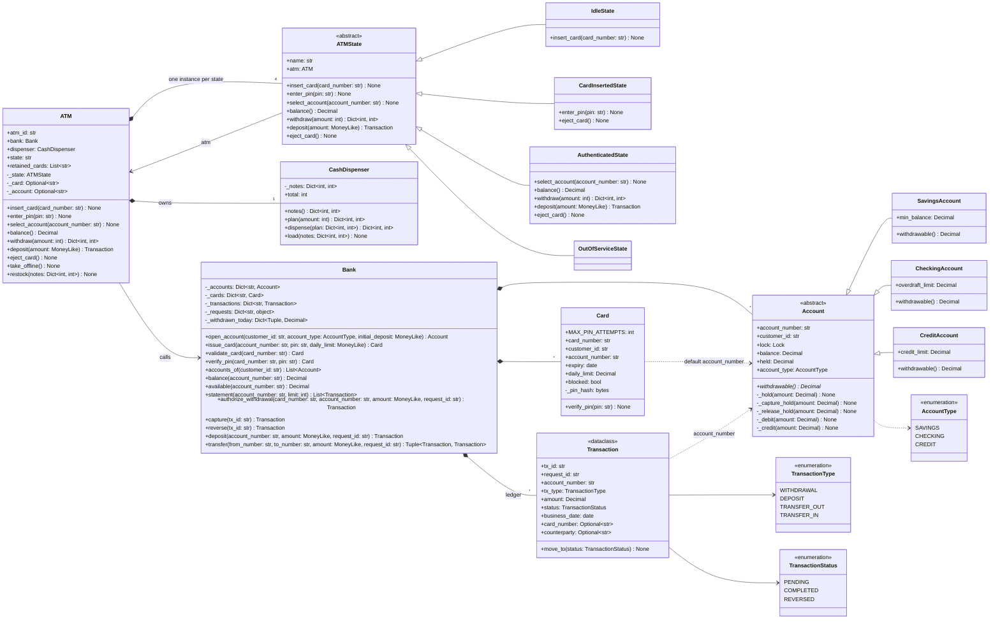

# 🧠 ATM / Banking System LLD — Thought Process Guide

> **Goal:** Learn *how* to think when designing a Low-Level Design.

---

## 📊 Class Diagram



---

## ⏱️ How to Run This in a 45–60 min Interview

| Time | Step | What to say out loud |
|------|------|----------------------|
| 0–7 min | **Clarify** | "Which operations: balance, withdraw, deposit, transfer? Account types and their rules? Daily limits? What happens on three wrong PINs? Do I model the dispenser's denominations?" |
| 7–15 min | **Entities + interfaces** | "The ATM is a state machine; the bank is a separate service the ATM calls. Accounts differ only in how much can be withdrawn. Every money call carries a request id." Sketch the state table before any code. |
| 15–35 min | **Core code** | `Account.withdrawable()` and the three subclasses; `Bank.authorize_withdrawal / capture / reverse`; the four ATM states with a base class that rejects everything. |
| 35–45 min | **Failure + concurrency** | Walk the withdrawal sequence and ask "what if the dispenser jams here? what if the network drops here?" That gives two-phase withdraw, idempotent capture/reverse, request ids. Then per-account locks and lock ordering for transfers. |
| 45–60 min | **Extension + tests** | Session timeout, partial dispense, fees, PIN change. Tests: jam reverses the hold, retry moves money once, 16 threads cannot overdraw, A→B / B→A do not deadlock, three wrong PINs retain the card. |

**Clarifying questions worth asking**

- Operations in scope (balance, withdraw, deposit, transfer, PIN change, mini-statement)?
- Account types and their limits (minimum balance, overdraft, credit limit)? Per-card daily withdrawal limit?
- Wrong PIN policy: how many attempts, and is the card retained?
- Denominations in the cassettes? Must the ATM pick the combination, or is any valid combination fine?
- Is the bank in-process, or a remote service (so retries and timeouts matter)?

---

## Phase 0: Requirements Gathering

Customers insert a card, enter a PIN, and then check balance, withdraw cash, deposit, or transfer between their own accounts. Accounts are savings (minimum balance), checking (overdraft) or credit (credit limit). Cards have a daily withdrawal limit and are blocked after three wrong PINs.

## Phase 1: Identify the Nouns

> *"A bank has accounts of different types. Customers get cards. ATMs authenticate cards and perform banking operations."*

| Noun | Decision | Why |
|------|----------|-----|
| Account | ABC | One abstract rule: `withdrawable()` |
| SavingsAccount / CheckingAccount / CreditAccount | Subclasses | Min balance / overdraft / credit limit |
| Transaction | dataclass | Ledger entry with a status state machine |
| Card | Regular class | PIN hash, attempts, block flag, expiry, daily limit |
| Bank | Facade | Accounts, cards, ledger, idempotency, locks |
| CashDispenser | Regular class | Notes per denomination, planning |
| ATM | Context | Owns session and dispenser; delegates to its state |
| ATMState | ABC | Idle, CardInserted, Authenticated, OutOfService |

## Phase 2: Enums First

```python
class AccountType(Enum):       SAVINGS, CHECKING, CREDIT
class TransactionType(Enum):   WITHDRAWAL, DEPOSIT, TRANSFER_OUT, TRANSFER_IN
class TransactionStatus(Enum): PENDING, COMPLETED, REVERSED
```

Only the values the code uses. An enum value nobody handles (the old `LOAN`, `FEE`, `INTEREST`) is a promise the code does not keep.

## Phase 3: Assigning Responsibilities

| Action | Owner | Why |
|--------|-------|-----|
| How much can leave this account? | `Account.withdrawable()` | The only thing that differs by type |
| Hold / capture / reverse | `Bank` | Needs the account lock, the ledger and the daily limit |
| Validate PIN, count attempts | `Card.verify_pin()` | Card owns the hash and the counter |
| Is the card usable? | `Bank.validate_card()` | Unknown, blocked, expired |
| Which notes? | `CashDispenser.plan()` | Pure function of stock and amount |
| What is allowed right now? | `ATMState` subclasses | No `if state == ...` anywhere |

## Phase 4: State Pattern for the ATM

```
IDLE --insert_card (valid card)--> CARD_INSERTED --enter_pin (ok)--> AUTHENTICATED
  ^                                   |   wrong PIN: stay (attempts left)        |
  |                                   |   3rd wrong PIN: block + retain -> IDLE  |
  +------------- eject_card ----------+------------------------------------------+
IDLE <--restock-- OUT_OF_SERVICE <-- (session ends with an empty dispenser, or take_offline)
```

The base `ATMState` raises `InvalidOperationError` for every operation; each state overrides only what it allows. That makes "what can happen in this state" readable in one place and makes holes visible.

## Phase 5: The Withdrawal Sequence (the part to slow down on)

1. `dispenser.plan(amount)`: can this machine pay it? No side effects.
2. `bank.authorize_withdrawal(card, account, amount, request_id)`: daily limit, ownership, hold funds. Transaction `PENDING`.
3. `dispenser.dispense(plan)`.
4. Success → `bank.capture(tx)`. Jam → `bank.reverse(tx)`.

Ask out loud at each arrow: "What if we crash or time out here?" Before 2: nothing happened. Between 2 and 3: a hold exists; reverse it. Between 3 and 4: cash is out, so capture must be retried until it succeeds, which is why capture is idempotent.

## Phase 6: Concurrency

- Per-account lock for check-and-hold / check-and-debit.
- Transfers lock both accounts in account-number order.
- Daily limit is per card and gets its own small lock.
- Idempotency claim is atomic (`_requests_lock`), the operation itself runs outside it.

## Phase 7: Cash Dispenser Denominations

Greedy (largest note first) fails when it matters: 600 from `{500 × 1, 200 × 3}`. Use a bounded min-notes DP over amounts divided by the gcd of the denominations. Plan before authorizing, so an amount the machine cannot pay never touches the account.

## Phase 8: Quick Checklist

✅ **State pattern** with a reject-by-default base class; no unreachable or leaky states
✅ **Two-phase withdrawal**: hold → dispense → capture/reverse
✅ **Idempotency** on every money-moving call; capture and reverse are idempotent too
✅ **Locks** per account, ordered for transfers; no check-then-act races
✅ **Money** is `Decimal`; **PINs** are salted hashes compared in constant time
✅ **Ownership**: a session can only reach the card holder's accounts
