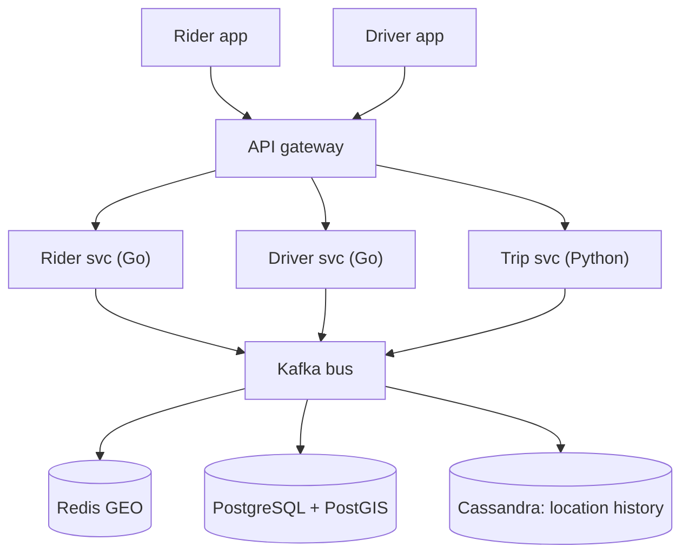
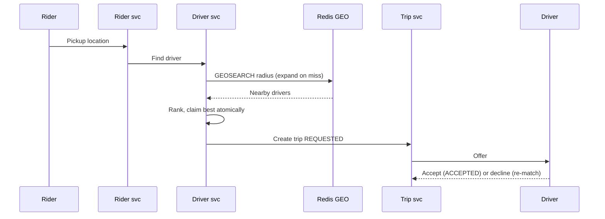
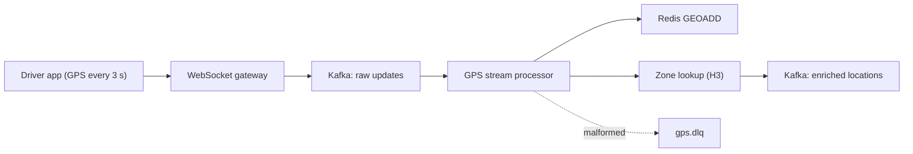
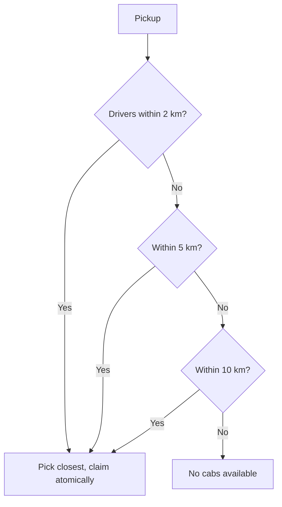

# 🏗️ Cab Booking Service (Uber) — High-Level Design

> **Target Level:** Staff/Principal Engineer | **Focus:** Geo-spatial indexing, event-driven architecture, real-time stream processing, distributed systems

---

## 1. SYSTEM OVERVIEW

**Purpose:** On-demand cab booking connecting riders with drivers in real-time with dynamic pricing.

**Scale:** 50 cities, 1M rides/day, 100K active drivers peak, 500 concurrent rides/minute per city

**Users:** Riders, Drivers, Operations team, Analytics

**Use Cases:** Request ride, Driver matching, Real-time tracking, Surge pricing, Payment & billing, Driver dispatch optimization

**Constraints:** <1s driver matching latency, 99.99% uptime, GPS accuracy <10m, sub-100ms ETA calculation

---

## 2. HIGH-LEVEL ARCHITECTURE

```
┌──────────────┐     ┌──────────────┐
│ Rider App    │     │ Driver App   │
│ (React       │     │ (React       │
│  Native)     │     │  Native)     │
└──────┬───────┘     └──────┬───────┘
       │                    │
       └────────┬───────────┘
                │ WebSocket / HTTPS
       ┌────────▼───────────┐
       │     API Gateway     │
       │ (Kong, SSL term)    │
       └────────┬───────────┘
                │
    ┌───────────┼───────────────┐
    │           │               │
┌───▼───┐  ┌────▼────┐  ┌──────▼────┐
│ Rider │  │ Driver  │  │ Trip      │
│ Svc   │  │ Svc     │  │ Svc       │
│ (Go)  │  │ (Go)    │  │ (Python)  │
└───┬───┘  └────┬────┘  └──────┬────┘
    │           │              │
    └───────────┼──────────────┘
                │
        ┌───────▼───────┐
        │   Kafka Bus    │
        │(GPS events,    │
        │ trip updates,  │
        │ zone analytics)│
        └───────┬───────┘
                │
    ┌───────────┼───────────────┐
    │           │               │
┌───▼───┐  ┌────▼────┐  ┌──────▼────┐
│ Redis │  │ Post-   │  │ Cassandra │
│ Geo   │  │ greSQL  │  │ (Location │
│       │  │ + PostGIS│  │  history) │
└───────┘  └─────────┘  └───────────┘
```

*Figure: apps, services, Kafka bus and stores.*



### Data Flow for a Ride Request

```
1. Rider opens app → sends pickup location
2. API Gateway routes to Rider Service
3. Rider Service calls Driver Service with pickup coords
4. Driver Service queries Redis GEO: GEOSEARCH pickup BYRADIUS 2 km (expand to 5, 10 km on miss)
5. Redis returns nearby drivers (sorted by distance); the matcher ranks them
6. Matcher claims the best one atomically (SET NX PX / conditional UPDATE); on failure, the next
7. Trip Service creates the trip in REQUESTED (+ outbox row) and sends the offer to the driver
8. Driver accepts → ACCEPTED; declines or times out → claim released, re-match excluding them
9. Trip events relayed from the outbox to Kafka 'trip.events'; Payment pre-authorises asynchronously
```

*Figure: ride request flow, from pickup to driver acceptance.*



### 🎬 Animated Sequence Diagram

<p align="center">
  <video controls width="900" style="border-radius: 12px; box-shadow: 0 4px 24px rgba(0,0,0,0.3);" loop playsinline preload="metadata">
    <source src="../../../assets/videos/cab-booking-sequence.mp4" type="video/mp4" />
    Your browser does not support the video tag.
  </video>
  <br/>
  <em>🎬 Animated Cab Booking Sequence — Rider Request → Geo Matching → Driver Dispatch → Trip Creation → Kafka Event Pipeline. Click ▶ to play/pause. Created with <a href="https://remotion.dev">Remotion</a>.</em>
</p>

---

## 3. KAFKA EVENT-DRIVEN ARCHITECTURE

### Kafka Topics

| Topic | Partitions | Retention | Producers | Consumers | Message Schema |
|-------|-----------|-----------|-----------|-----------|----------------|
| `gps.raw.updates` | 5 per city | 7 days | Driver WS Gateway | GPS Stream Processor | `{driver_id, lat, lng, speed, heading, timestamp}` |
| `gps.enriched.locations` | 5 per city | 3 days | GPS Stream Processor | Zone Analytics, ETL | `{driver_id, location, zone_id, speed, heading, timestamp}` |
| `gps.zone.driver_counts` | 3 per city | 1 day | Zone Analytics | Surge Engine, Dashboard | `{zone_id, driver_count, surge_multiplier, timestamp}` |
| `trip.events` | 5 | 14 days | Trip Service | Payment, Notification, Analytics | `{trip_id, status, rider_id, driver_id, fare, ...}` |
| `gps.dlq` | 1 | 30 days | Failed messages | Dead-letter handler | `{error, original_message}` |

### GPS Location Update Pipeline

```ascii
┌─────────────┐     ┌────────────┐     ┌─────────────┐     ┌──────────────┐
│ Driver App  │────▶│ WebSocket  │────▶│  Kafka      │────▶│ GPS Stream   │
│ (GPS 3s)    │     │ Gateway    │     │ Raw Updates │     │ Processor     │
└─────────────┘     └────────────┘     └──────┬──────┘     └──────┬───────┘
                                              │                   │
                                              │         ┌─────────▼────────┐
                                              │         │  GeoIndex Update  │
                                              │         │  (Redis GEOADD)   │
                                              │         └─────────┬────────┘
                                              │                   │
                                              │         ┌─────────▼────────┐
                                              │         │  Zone Lookup     │
                                              │         │  (H3, in-process)│
                                              │         └─────────┬────────┘
                                              │                   │
                                              │         ┌─────────▼────────┐
                                              │         │  Kafka: Enriched │
                                              └─────────│  Locations Topic │
                                                        └─────────────────┘
```

**Staff-level considerations:**
- **Partition key:** `driver_id` → ensures same driver's events go to same partition for ordered processing
- **Delivery semantics:** at-least-once. Commit offsets after the Redis write; the consumer drops any ping whose timestamp is not newer than the stored one, so replays are harmless. (An idempotent producer only removes duplicate appends from producer retries; it does not make the Redis write exactly-once.)
- **Dead letter queue:** Messages that fail enrichment (e.g., malformed GPS) go to `gps.dlq`
- **Backpressure:** If Redis is slow, pause partitions (Kafka buffers durably). After a long lag, skip to the newest pings per driver: a stale position is worth less than a fresh one
- **Scaling:** Partition by `driver_id`, add partitions/consumers per region. Isolate blast radius per region (cluster per region), not per city

*Figure: GPS ingestion pipeline, partitioned by driver_id.*



---

## 4. GEORADIUS DRIVER MATCHING

### Redis GEO Implementation

```python
# Production: Redis GEO (GEOSEARCH, Redis >= 6.2; GEORADIUS is deprecated)
def find_nearest_drivers(city, cab_type, pickup_lat, pickup_lng, radius_km=2, limit=10):
    return redis.geosearch(
        f"drivers:available:{city}:{cab_type}",
        longitude=pickup_lng, latitude=pickup_lat,   # Redis takes (lng, lat)
        radius=radius_km, unit="km",
        withdist=True, sort="ASC", count=limit,
    )

def claim(driver_id, trip_id):
    # The only authoritative step: atomic, self-expiring if we crash.
    return redis.set(f"driver:{driver_id}:assignment", trip_id, nx=True, px=15000)
```

### Progressive Radius Expansion

```
Pickup Location
    │
    ├── Query: GEORADIUS pickup 2km
    │   └── Found 3 drivers → pick closest
    │
    ├── Query: GEORADIUS pickup 2km → No results
    │   └── Query: GEORADIUS pickup 5km
    │       └── Found 1 driver → dispatch
    │
    ├── Query: GEORADIUS pickup 2km → No results
    │   └── Query: GEORADIUS pickup 5km → No results
    │       └── Query: GEORADIUS pickup 10km
    │           └── No results → "No cabs available"
```

**Staff-level considerations:**
- **Query cost:** `GEOSEARCH` is O(N + log M): N = points in the 9 bounding cells, M = points in the result shape. Dense downtown cells make N large; keep radii small there and expand only on miss
- **Neighbour cells:** a geohash prefix search must include the 8 neighbouring cells or drivers just across an edge are missed (Redis does this internally)
- **Read-replicas:** replicas lag the primary (async replication), so a replica may still list a just-booked driver. Fine, because the claim below is the authority
- **Race condition:** the search result is stale the moment it returns. Reserve with an atomic claim (`SET driver:{id}:assignment {trip} NX PX 15000` or `UPDATE drivers SET status='BOOKED' WHERE id=? AND status='AVAILABLE'`); on failure try the next candidate
- **Key layout:** shard by city and cab type → `drivers:available:{city}:mini`. One GEO key lives on one Redis shard, so this is also how you spread load; remove a driver from the key when they are booked

*Figure: progressive radius expansion for driver search.*



---

## 5. ZONE MANAGEMENT & SURGE PRICING

### Hexagonal Grid Partitioning

```
City partitioned into ~500m hexagonal zones:
         ___
     ___/ Z \___
    / Z \___/ Z \
    \___/ Z \___/
    / Z \___/ Z \
    \___/   \___/

Benefits over square grids:
- All neighbors are equidistant
- Better circular radius approximation
- Minimizes zone-transition edge effects
```

### Zone Analytics Pipeline

```
Every 30 seconds (tumbling window):
┌─────────────────┐
│ Zone Analytics  │
│ Aggregator      │
│                 │
│ For each zone:  │
│   drivers =     │
│     COUNT(DISTINCT driver_id)  │
│     WHERE zone_id = Z AND      │
│     status = AVAILABLE         │
│                 │
│   requests =    │
│     COUNT(ride_requests)       │
│     WHERE zone_id = Z          │
│     IN THIS 30 s WINDOW        │
│                 │
│   surge = f(drivers, requests) │
│                 │
│   Publish to    │
│   Kafka topic   │
└─────────────────┘
```

### Surge Multiplier Calculation

```python
def compute_surge(demand: int, supply: int) -> Decimal:
    if demand == 0:
        return Decimal("1.0")   # no demand, no surge, even with zero drivers
    if supply == 0:
        return Decimal("2.5")   # cap
    ratio = demand / supply
    if ratio > 3.0:   return Decimal("2.0")
    if ratio > 2.0:   return Decimal("1.5")
    if ratio > 1.5:   return Decimal("1.25")
    return Decimal("1.0")
# Production adds: smoothing across neighbouring cells, hysteresis/decay so the
# multiplier doesn't flicker, and the multiplier is locked into the quote.
```

---

## 6. DATA MODEL

### PostgreSQL + PostGIS Tables

See [DB_SCHEMA.md](DB_SCHEMA.md) for the complete DDL.

**Key tables:**
- `riders` — user accounts, ratings, payment methods (JSONB)
- `drivers` — license, cab type, availability status, **GEOGRAPHY(Point)** for geo-radius queries
- `trips` — full trip state machine, fare breakdown, **GEOGRAPHY** pickup/dropoff
- `zones` — zone (H3 cell) definitions with **GIST spatial index**
- `driver_location_history` — **partitioned by month** for query performance
- `payments` — with idempotency key for exactly-once processing
- `surge_pricing_log` — time-series of zone supply/demand

### Redis Keys

```ascii
drivers:available:{city}:{type} → GEO (sorted set of available drivers)
driver:{id}:assignment         → STRING trip_id, SET NX PX 15000 (the claim)
driver:{id}:status             → STRING (AVAILABLE/BOOKED/ON_TRIP/OFFLINE)
trip:{id}:state                → HASH (current trip state machine)
zone:{id}:surge                → STRING (current surge multiplier)
zone:{id}:drivers              → ZSET driver_id scored by last-seen ts (ZCARD = supply)
```

---

## 7. STAFF-LEVEL INTERVIEW QUESTIONS & ANSWERS

### Q1: "How would you design the GPS location ingestion pipeline to handle 100K drivers updating every 3 seconds?"

**Expected Answer:**

**Scale calculation:** 100K drivers × 1 update/3s = ~33K writes/second. This is significant but manageable with proper partitioning.

**Architecture:**

```
Driver App ──(WebSocket, binary protobuf)──▶ WS Gateway (Nginx/HAProxy)
                                                     │
                                                     ├── Kafka producer (async, batching)
                                                     │    └── Topic: gps.raw.updates (5 partitions per city)
                                                     │
                                                     ├── Stream processor → Redis GEO (every update, ts-guarded)
                                                     │    └── GEOADD drivers:available:{city}:{type} <lng> <lat> <driver_id>
                                                     │
                                                     └── Batch write to Cassandra (30s cadence)
                                                          └── driver_location_history (TTL: 90 days)
```

**Key decisions:**
1. **WebSocket with binary protocol (protobuf)** — 60% less bandwidth than JSON
2. **Adaptive polling** — 3s when moving, 30s when stationary (detect via accelerometer)
3. **Dead reckoning** — if GPS drops, estimate position from last known speed/direction
4. **Kalman filter** — smooth GPS noise at the app level before sending
5. **Rebuildable index** — Redis GEO is the source of truth for *current* position only; every driver re-pings within ~3 s, so a lost index heals in one interval. Cassandra holds history
6. **Kafka partitioning** — `driver_id` as partition key ensures ordered processing per driver

**Failure modes:**
- **Redis GEO shard down:** fail over to its replica (seconds); the index refills from the next round of pings. PostGIS `ST_DWithin` on the last persisted positions is a degraded fallback
- **Kafka broker failure:** Rebalance partitions across remaining brokers; drivers re-publish on reconnect
- **GPS data corruption:** Schema validation at Kafka producer; DLQ for bad messages

---

### Q2: "How would you implement zone-based surge pricing at city scale?"

**Expected Answer:**

**Geo-fencing architecture:**

```
1. Partition the city into H3 resolution-8 cells (≈0.74 km² each; a 10 km-radius city ≈ 314 km² ≈ 425 cells)
2. Maintain zone state in Redis:
     ZADD zone:{id}:drivers <ts> <driver_id>  (on each ping; ZREM from the old zone when the cell changes)
     ZREMRANGEBYSCORE zone:{id}:drivers -inf <now-30s>; ZCARD → supply
     HINCRBY zone:{id}:stats requests 1      (when ride requested in zone)
3. Run aggregation worker every 30 seconds:
     For each zone:
       supply = ZCARD zone:{id}:drivers (after trimming stale entries)
       demand = MULTI; HGET requests; HSET requests 0; EXEC  (read-and-reset = tumbling window)
       surge = f(demand, supply)
       HSET zone:{id}:stats surge {surge}
4. Publish zone stats to Kafka topic 'gps.zone.driver_counts'
5. Rider app reads surge via GET /api/zones/{zone_id}/surge
   (cached for 5 seconds at API Gateway)
```

**Sticky surge decay:** Surge doesn't drop instantly. If ratio drops below threshold, surge decays linearly over 5 minutes. This prevents drivers from gaming the system by waiting for surge to hit then immediately leaving.

**Leading indicators:**
- Airport flight arrivals → pre-load surge prediction
- Concert/sports event schedules → pre-load surge zones
- Weather data (rain = higher demand) → adjust base multiplier

---

### Q3: "Design a system to handle driver location updates during GPS signal loss in tunnels."

**Expected Answer:**

**Dead Reckoning System:**

```
┌─────────────────────────────────────────────┐
│ Mobile SDK (on-device)                      │
│                                              │
│  GPS available:                              │
│    → Send precise location every 3s          │
│    → Record: speed, heading, timestamp       │
│                                              │
│  GPS lost (tunnel, parking garage):          │
│    → Use last known speed + heading          │
│    → Estimate position:                      │
│         new_lat = last_lat + (speed * time * cos(heading)) / earth_radius
│         new_lng = last_lng + (speed * time * sin(heading)) / earth_radius
│    → Tag message: {dead_reckoning: true}     │
│    → Update every 1s (more frequent since    │
│       error accumulates faster)              │
│                                              │
│  GPS restored:                               │
│    → Send actual location with tag            │
│    → {corrected: true, drift_meters: X}      │
│    → Server applies correction to estimate    │
└─────────────────────────────────────────────┘
```

**Server-side handling:**
- Mark dead-reckoned locations with lower confidence score
- Don't use dead-reckoned locations for surge/gamification calculations
- Widen geo-radius search radius for dead-reckoned drivers
- On GPS re-acquisition, calculate drift and update ML models

---

### Q4: "How would you prevent driver fraud in a geo-spatial cab booking system?"

**Expected Answer:**

**Fraud vectors and mitigations:**

| Fraud Type | Detection | Mitigation |
|-----------|-----------|------------|
| **GPS spoofing** (fake location) | Compare GPS with cell tower triangulation + WiFi BSSID fingerprint | Two-factor location verification; flag discrepancies > 100m |
| **Route manipulation** (taking longer route) | ML model predicts expected route/duration per segment | Auto-adjust fare; flag outliers > 2σ from expected |
| **Fake ride requests** (driver self-booking) | Device fingerprinting; payment auth before dispatch | Require payment method for all rides; rate-limit per device |
| **Collusion** (rider and driver gaming surge) | Check if rider and driver share IP, device, or payment method | Ban both accounts on detection |
| **Bait-and-switch** (different car than registered) | Photo verification on trip start; AI model compares car photos | Penalize driver rating; suspend after N violations |

**GPS spoofing detection algorithm:**
```python
def detect_gps_spoofing(gps_location, cell_towers, wifi_bssids):
    # Cell tower triangulation
    cell_location = trilaterate(cell_towers)
    cell_distance = haversine(gps_location, cell_location)
    
    # WiFi fingerprint lookup (pre-mapped)
    wifi_location = lookup_wifi_bssid_db(wifi_bssids)
    wifi_distance = haversine(gps_location, wifi_location)
    
    # Combined score
    if cell_distance > 200 or wifi_distance > 100:
        return FRAUD_FLAG  # Likely spoofed
    
    # Speed check: impossible speeds = spoofing
    speed = calculate_speed(consecutive_updates)
    if speed > 250:  # km/h
        return SPOOF_FLAG
        
    return LEGITIMATE
```

---

### Q5: "Design an RTA (Real-Time Agreement) system for Uber pool / shared rides."

**Expected Answer:**

Core challenge: Match multiple riders going in the same direction, splitting fare, with minimum time penalty.

**Key components:**
- **Route similarity index:** Compare pickup/dropoff pairs using road network (not straight-line) distance
- **Time penalty budget:** Max 5 minutes extra per rider per shared trip
- **Dynamic pricing:** Pool rides are 30-50% cheaper than individual
- **Matching window:** 15-30 second batch window for pool requests in same zone

**Algorithm:**
```python
def match_pool_riders(pending_pool_requests, available_drivers):
    # 1. Cluster pending requests by pickup proximity
    clusters = dbscan_cluster(
        [r.pickup for r in pending_pool_requests],
        eps=500,  # 500m cluster radius
        min_samples=2
    )
    
    # 2. For each cluster, compute optimal sequence
    matched_pairs = []
    for cluster in clusters:
        # Compute pairwise route efficiency
        for r1, r2 in combinations(cluster, 2):
            # Optimized route: pickup1 → pickup2 → dropoff1 → dropoff2
            efficiency = compute_route_efficiency(r1, r2)
            
            if efficiency.detour_minutes <= 5:  # Within budget
                matched_pairs.append((r1, r2, efficiency))
    
    # 3. Assign to nearest driver with seat capacity
    return assign_to_drivers(matched_pairs, available_drivers)
```

---

### Q6: "How would you handle cross-city (inter-city) trips?"

For long trips spanning cities, the system needs:
- **Cross-cluster trip coordinator** — manages the trip state across city boundaries
- **ETA calculation** using inter-city driving time (not city-level model)
- **Pricing** that accounts for return trip deadhead (driver won't get a return fare)
- **Driver incentive** — premium payout for inter-city trips to compensate for return deadhead

**Architecture:**
```
Rider requests Mumbai → Pune (150km)
    │
    ├── Mumbai cluster evaluates: available drivers
    ├── Inter-city trip coordinator created
    ├── Fare: normal rate × 1.5 (deadhead adjustment)
    ├── Driver notified with deadhead compensation
    │
    ├── Trip starts in Mumbai cluster
    ├── On city boundary → trip state transfers to Pune cluster
    └── Trip completes in Pune cluster → deadhead payout processed
```

---

## 7a. CONSISTENCY, IDEMPOTENCY & FAILURE MODES

**Where strong consistency is required, and where it isn't:**

| Data | Consistency | Why |
|------|-------------|-----|
| Driver assignment (claim) | Linearizable per driver (Redis `SET NX` on the primary, or a conditional UPDATE) | Double-booking is the one unacceptable failure |
| Trip status | Linearizable per trip (conditional UPDATE on `status`/`version`) | Cancel-vs-start must have one winner |
| Driver positions | Eventual, last-writer-wins by device timestamp | Stale by ≤ 3 s anyway; rebuildable |
| Surge multipliers | Eventual (30 s windows) | Quoted and locked into the trip at request time |
| Payments | Exactly-once effect via idempotency keys | Money |

**Idempotency:**
- `POST /rides` takes an `Idempotency-Key`; `trips.idempotency_key` is UNIQUE, so a retried request returns the original trip.
- GPS consumer is idempotent by timestamp; trip-event consumers dedupe on `(trip_id, version)`.
- Payment capture uses `payments.idempotency_key`; retries never double-charge.

**Failure modes:**

| Failure | Effect | Mitigation |
|---------|--------|------------|
| Matcher dies after claim, before trip insert | Driver stuck BOOKED | Claim TTL (`PX 15000`) or reaper for claims with no trip |
| Trip committed but event not published | Payment/notifications never hear about it | Transactional outbox + relay |
| Driver app disconnects mid-offer | Rider waits forever | Offer timeout → decline path → re-match |
| Redis primary failover | Last ~1 s of positions/claims may be lost (async replication) | Positions heal on next ping; re-check claims against the trip DB on accept |
| Kafka consumer lag | Positions stale, matches worse | Alert on lag; skip to latest offsets; widen first search radius |
| Hot zone (stadium exit) | Thousands of requests on one geo cell | Batch matching per cell every 1–2 s; per-cell single-writer dispatch |

**Capacity (per the scale in §1):** 100K drivers / 3 s ≈ 33K position writes/s (~3.3 MB/s); a GEO member is ~50–100 bytes, so 100K drivers ≈ 10 MB of index — memory is not the constraint, write rate and per-key hotness are. Peak 500 ride requests/min/city ≈ 8/s/city, each ≈ 1–3 GEOSEARCH calls + 1 claim.

---

## 8. TRADE-OFF ANALYSIS

| Decision | Choice | Rationale | Alternative |
|----------|--------|-----------|-------------|
| **Geo-index** | Redis GEO | Sub-ms server time, O(N + log M) per search, built-in geo commands | PostGIS (durable, polygons; 33K updates/s causes MVCC/vacuum churn) |
| **Event bus** | Kafka | Durable, replayable, ordered per partition | RabbitMQ (simpler, lower throughput) |
| **Zone shape** | H3 hexagons (res 8) | All 6 neighbours equidistant, O(1) point→cell, hierarchical | Geohash cells (simpler, but rectangles distort with latitude) |
| **Driver matching** | Progressive radius | Simple, predictable, easy to debug | ML-based (optimal but opaque) |
| **Surge calculation** | Fixed thresholds | Transparent, easier to tune | ML pricing (optimal but hard to explain) |
| **Location DB** | Cassandra | Writes optimized, TTL support, horizontal scaling | TimescaleDB (SQL interface, but more overhead) |

---

## 9. COST (Monthly)

| Component | Configuration | Cost |
|-----------|--------------|------|
| Compute (Go services) | ECS Fargate, 10 tasks × 2 vCPU | $5,000 |
| Redis Geo cluster | ElastiCache, r6g.xlarge, cluster mode (3 shards) | $1,500 |
| Kafka + Stream processing | MSK, 5 brokers, m5.large | $3,500 |
| PostgreSQL + PostGIS | RDS, db.r6g.large, Multi-AZ, 500GB | $3,000 |
| Cassandra (location history) | 5 nodes, i3.large | $2,000 |
| WebSocket Gateway | ALB + Nginx, auto-scaling | $1,500 |
| Maps API (Google) | Pay-per-use | $2,000 |
| Monitoring (CloudWatch, Datadog) | Metrics + traces | $1,500 |
| **Total** | | **$20,000** |
