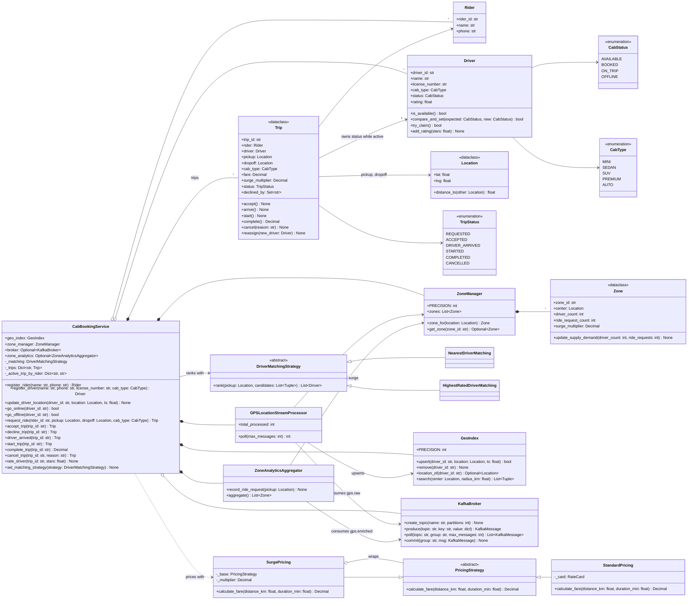

# 🧠 Cab Booking (Uber) LLD — Thought Process Guide

> **Goal:** Learn *how* to think when designing a Low-Level Design.

---

## 📊 Class Diagram



---

## ⏱️ How to Run This in a 45–60 min Interview

| Time | Step | What you do | What to say out loud |
|------|------|-------------|----------------------|
| 0–7 | **Clarify** | Pin scope with the questions below. Write the agreed list in a comment. | "I'll treat matching, the trip lifecycle and pricing as core; GPS ingestion and surge as stretch." |
| 7–15 | **Entities & interfaces** | Enums, `Location`, `Driver`, `Trip`, `PricingStrategy`, `DriverMatchingStrategy`, the service facade. Draw the trip state machine. | "Driver status and trip status are separate state machines that move together. The trip owns the driver's status while it's active." |
| 15–35 | **Core code** | `request_ride` (search → rank → claim → price → create trip), `Trip` transitions table, `StandardPricing` + `SurgePricing`. A linear scan for "nearby" is fine first. | "I'm writing the linear scan first and hiding it behind `GeoIndex.search` so I can swap in geohash without touching matching." |
| 35–45 | **Concurrency** | `Driver.try_claim()` as a CAS; trip lock around transitions; one active trip per rider. | "The search result is stale by definition. The claim is the only authority, and losing a claim means try the next driver, not fail." |
| 45–55 | **Extension** | Whatever they add: decline/timeout, surge, cancellation fee, pool, ETA ranking. | "This fits in `rank()` / a new transition / the decorator chain. Here's the one place that changes." |
| 55–60 | **Wrap up** | Tests you'd write; how it maps to a service. | "In production the CAS becomes a conditional UPDATE or Redis `SET NX`, and the index is Redis GEO fed by Kafka." |

### Clarifying questions worth asking

1. **Matching rule:** nearest by straight line, by ETA, or by rating? Fixed radius or expanding? *(Drives the strategy interface.)*
2. **Offer model:** does the driver accept/decline, with a timeout, or is assignment automatic? *(Adds `REQUESTED` vs `ACCEPTED`.)*
3. **Cancellation:** who can cancel, until when, and is there a fee after the driver arrives? *(Transition table.)*
4. **Pricing:** upfront fare locked at request, or metered at the end? Surge per zone? *(Fare stored on trip vs computed at completion.)*
5. **Concurrency scope:** many riders requesting at once in the same area? *(Yes, always. Say you'll make the claim atomic.)*
6. **Can a rider have more than one active trip?** *(Usually no; enforce it.)*
7. **Scale for the follow-up:** drivers per city and GPS frequency. *(100K drivers / 3 s ≈ 33K writes/s, which is why the index is in memory.)*

---

## Phase 0: Requirements

Rider requests a cab of a type from A to B. The system finds a nearby available driver of that type, offers
the trip, and on acceptance the trip runs `ACCEPTED → DRIVER_ARRIVED → STARTED → COMPLETED`. Fare is quoted
up front (base + per km + per minute, times zone surge). Drivers stream GPS. A driver is never on two trips.

## Phase 1: Identify the Nouns

| Noun | Decision | Why |
|------|----------|-----|
| Rider | Class | Identity, minimal behaviour |
| Driver | Class with a lock | Status is contended state; changes via compare-and-set |
| Location | Frozen dataclass | Value object with haversine `distance_to` |
| GeoIndex | Class | "Who is near this point?" behind one method (`search`) |
| Trip | Dataclass with a lock | State machine; owns its driver's status while active |
| PricingStrategy | ABC | Base fare; surge decorates it |
| DriverMatchingStrategy | ABC | Ranking policy, pure function of candidates |
| Zone / ZoneManager | Classes | Surge per area |
| KafkaBroker | Class | Event pipeline simulation (stretch) |
| CabBookingService | Facade | Orchestrates matching, pricing, lifecycle |

## Phase 2: Enums First

```python
class CabStatus(Enum):  AVAILABLE, BOOKED, ON_TRIP, OFFLINE
class TripStatus(Enum): REQUESTED, ACCEPTED, DRIVER_ARRIVED, STARTED, COMPLETED, CANCELLED
class CabType(Enum):    MINI, SEDAN, SUV, PREMIUM, AUTO
```

Don't add enums you won't use (a `PaymentMethod` with no payment flow is noise in an interview).

## Phase 3: Assigning Responsibilities

| Action | Owner | Why |
|--------|-------|-----|
| Distance | `Location.distance_to()` | Pure value-object behaviour |
| Who is nearby | `GeoIndex.search()` | Spatial structure hidden behind one call |
| Order candidates | `DriverMatchingStrategy.rank()` | Policy, no side effects |
| Reserve a driver | `Driver.try_claim()` | The driver guards its own status |
| Fare | `PricingStrategy.calculate_fare()` | Strategy; surge is a decorator |
| Status transitions | `Trip.accept/arrive/start/complete/cancel` | Trip owns its lifecycle and validates against a table |
| Orchestration | `CabBookingService.request_ride()` | Search → rank → claim → price → create |

## Phase 4: The Concurrency Story (say this unprompted)

The classic bug is check-then-act: `if driver.is_available(): driver.status = BOOKED`. Two requests both see
AVAILABLE and both book. The fix is one atomic step:

```python
def try_claim(self) -> bool:
    with self._lock:
        if self._status is not CabStatus.AVAILABLE:
            return False
        self._status = CabStatus.BOOKED
        return True
```

and a matcher that treats a failed claim as "next candidate". Then lock the trip for every transition, so
cancel-vs-start can't both win. Lock order trip → driver, never the reverse.

## Phase 5: Two Strategy Patterns

```python
class PricingStrategy(ABC):
    def calculate_fare(self, distance_km, duration_min) -> Decimal

class StandardPricing(PricingStrategy)      # rate card per cab type
class SurgePricing(PricingStrategy)         # decorator: wraps any strategy, multiplies

class DriverMatchingStrategy(ABC):
    def rank(self, pickup, candidates: list[(Driver, km)]) -> list[Driver]

class NearestDriverMatching(...)            # distance asc
class HighestRatedDriverMatching(...)       # rating desc within radius, distance tiebreak
```

Radius expansion (2 → 5 → 10 km) lives in the service, not in each strategy, so every strategy gets it.

## Phase 6: GeoIndex

Start with a linear scan (O(N)), then say: "Redis GEO stores members in a sorted set keyed by a 52-bit
geohash. A radius query scans the centre cell and its 8 neighbours at a precision where a cell is at least
the radius wide, then filters by exact distance." Forgetting the neighbours is the common bug: a driver 50 m
away across a cell edge gets missed.

## Phase 7: Quick Checklist

✅ **Atomic claim:** no driver on two trips, losers fall through to the next candidate
✅ **State machine:** transitions in a table, illegal ones raise
✅ **Money:** `Decimal`, quoted at request
✅ **Strategy + Decorator:** matching and pricing swappable; surge composes
✅ **OCP:** new cab type = enum value + rate card
