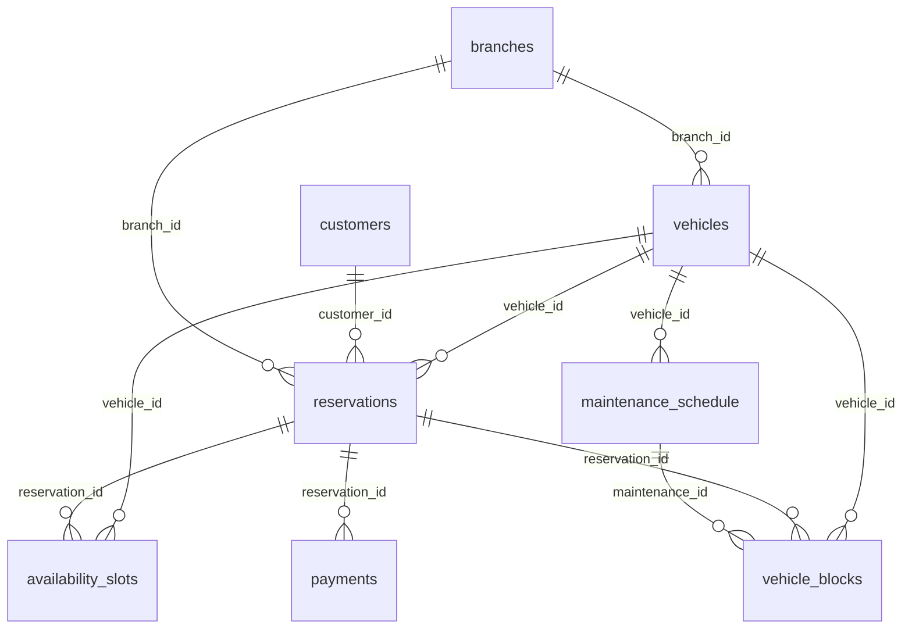

# 🗄️ Car Rental Platform — Database Schema & Relationships

> **Database:** PostgreSQL 16 with btree_gist extension  
> **Purpose:** Fleet management, hourly/daily bookings, availability calendar, payments  
> **Tables:** 8 tables. The double-booking guarantee lives in ONE table, `vehicle_blocks`

---

## 📊 Entity Relationship Diagram (Textual)

```
┌──────────────┐     ┌──────────────┐1───N┌────────────┐
│   vehicles   │1───N│ reservations │     │  payments  │
└──────┬───────┘     └──────┬───────┘     └────────────┘
       │1                   │1 (0..1 active)
       │                    │
       │N            ┌──────▼──────────┐ EXCLUDE (vehicle_id =, range &&) WHERE active
       ├────────────▶│ vehicle_blocks  │◀──────────────┐
       │             └──────┬──────────┘               │1
       │1                   │ derived (async)  ┌───────┴─────────┐
       │                    ▼                  │ maintenance_    │
       │             ┌──────────────────┐      │ schedule        │
       └────────────▶│ availability_    │      └─────────────────┘
                     │ slots (read model)│
                     └──────────────────┘

┌──────────────┐     ┌──────────────┐
│  customers   │1───N│ reservations │
└──────────────┘     └──────────────┘

┌──────────────┐
│  branches    │─── locations
└──────────────┘
```

---

*Figure: tables and foreign keys, generated from the DDL below (one-to-many from parent to child).*



## 🏛️ Complete DDL

```sql
-- ============================================================
-- Car Rental Platform - Production Database Schema
-- Database: PostgreSQL 16
-- ============================================================

CREATE EXTENSION IF NOT EXISTS "uuid-ossp";
CREATE EXTENSION IF NOT EXISTS "btree_gist";  -- For exclusion constraint

-- -----------------------------------------------------------
-- 1. BRANCHES / LOCATIONS (created first: vehicles references it)
-- -----------------------------------------------------------
CREATE TABLE branches (
    id UUID PRIMARY KEY DEFAULT uuid_generate_v4(),
    name VARCHAR(255) NOT NULL,
    address TEXT NOT NULL,
    city VARCHAR(100) NOT NULL,
    latitude DECIMAL(10,7),
    longitude DECIMAL(10,7),
    phone VARCHAR(20),
    opening_time TIME DEFAULT '08:00',
    closing_time TIME DEFAULT '20:00',
    is_active BOOLEAN DEFAULT true,
    created_at TIMESTAMPTZ DEFAULT NOW()
);

-- -----------------------------------------------------------
-- 2. VEHICLES
-- -----------------------------------------------------------
CREATE TABLE vehicles (
    id UUID PRIMARY KEY DEFAULT uuid_generate_v4(),
    vehicle_type VARCHAR(20) NOT NULL 
        CHECK (vehicle_type IN ('HATCHBACK','SEDAN','SUV','LUXURY','VAN','TRUCK')),
    make VARCHAR(100) NOT NULL,
    model VARCHAR(100) NOT NULL,
    year INT NOT NULL,
    license_plate VARCHAR(20) UNIQUE NOT NULL,
    fuel_type VARCHAR(20) NOT NULL 
        CHECK (fuel_type IN ('PETROL','DIESEL','ELECTRIC','HYBRID')),
    hourly_rate DECIMAL(8,2) NOT NULL,
    daily_rate DECIMAL(8,2) NOT NULL,
    weekly_rate DECIMAL(8,2),          -- Discounted weekly rate
    monthly_rate DECIMAL(8,2),         -- Discounted monthly rate
    mileage INT DEFAULT 0,
    status VARCHAR(20) DEFAULT 'AVAILABLE' 
        CHECK (status IN ('AVAILABLE','RENTED','MAINTENANCE','RETIRED')),  -- physical state; future bookings live in vehicle_blocks
    location VARCHAR(255),             -- Current branch/location
    branch_id UUID REFERENCES branches(id),
    seating_capacity INT NOT NULL,
    transmission VARCHAR(20) DEFAULT 'MANUAL' CHECK (transmission IN ('MANUAL','AUTOMATIC')),
    features JSONB DEFAULT '[]',       -- ["GPS", "AC", "Bluetooth", ...]
    image_urls TEXT[],
    is_active BOOLEAN DEFAULT true,
    created_at TIMESTAMPTZ DEFAULT NOW(),
    updated_at TIMESTAMPTZ DEFAULT NOW()
);

CREATE INDEX idx_vehicles_type ON vehicles(vehicle_type);
CREATE INDEX idx_vehicles_location ON vehicles(location);
CREATE INDEX idx_vehicles_status ON vehicles(status) WHERE status = 'AVAILABLE';

-- -----------------------------------------------------------
-- 3. CUSTOMERS
-- -----------------------------------------------------------
CREATE TABLE customers (
    id UUID PRIMARY KEY DEFAULT uuid_generate_v4(),
    name VARCHAR(255) NOT NULL,
    email VARCHAR(255) UNIQUE NOT NULL,
    phone VARCHAR(20) UNIQUE NOT NULL,
    password_hash VARCHAR(255) NOT NULL,
    driver_license_number VARCHAR(50) UNIQUE NOT NULL,
    driver_license_expiry DATE NOT NULL,
    date_of_birth DATE,
    address TEXT,
    is_verified BOOLEAN DEFAULT false,
    loyalty_points INT DEFAULT 0,
    membership_tier VARCHAR(20) DEFAULT 'BASIC' 
        CHECK (membership_tier IN ('BASIC','SILVER','GOLD','PLATINUM')),
    created_at TIMESTAMPTZ DEFAULT NOW()
);

-- -----------------------------------------------------------
-- 4. RESERVATIONS (lifecycle + money; the overlap guarantee is on vehicle_blocks)
-- -----------------------------------------------------------
CREATE TABLE reservations (
    id UUID PRIMARY KEY DEFAULT uuid_generate_v4(),
    customer_id UUID NOT NULL REFERENCES customers(id),
    vehicle_id UUID NOT NULL REFERENCES vehicles(id),
    branch_id UUID REFERENCES branches(id),
    pickup_datetime TIMESTAMPTZ NOT NULL,
    return_datetime TIMESTAMPTZ NOT NULL,
    pickup_location VARCHAR(255) NOT NULL,
    dropoff_location VARCHAR(255) NOT NULL,
    status VARCHAR(20) DEFAULT 'PENDING' 
        CHECK (status IN ('PENDING','CONFIRMED','IN_PROGRESS','COMPLETED','CANCELLED','EXPIRED','NO_SHOW')),
    hold_expires_at TIMESTAMPTZ,              -- set while PENDING (payment hold)
    -- Pricing breakdown
    pricing_strategy VARCHAR(50),  -- 'HOURLY', 'DAILY', 'WEEKLY_DISCOUNT'
    hourly_rate DECIMAL(8,2),
    daily_rate DECIMAL(8,2),
    base_amount DECIMAL(10,2),
    discount_amount DECIMAL(10,2) DEFAULT 0,
    tax_amount DECIMAL(10,2) DEFAULT 0,
    total_amount DECIMAL(10,2) NOT NULL,
    additional_services JSONB DEFAULT '[]',  -- [{"name": "GPS", "cost": 5.0}, ...]
    -- Business rules
    idempotency_key VARCHAR(64) UNIQUE,  -- Prevent duplicate bookings
    cancellation_reason TEXT,
    created_at TIMESTAMPTZ DEFAULT NOW(),
    updated_at TIMESTAMPTZ DEFAULT NOW(),
    
    CONSTRAINT valid_range CHECK (pickup_datetime < return_datetime)
);

CREATE INDEX idx_reservations_customer ON reservations(customer_id);
CREATE INDEX idx_reservations_vehicle ON reservations(vehicle_id);
CREATE INDEX idx_reservations_status ON reservations(status);
CREATE INDEX idx_reservations_pickup ON reservations(pickup_datetime);

-- -----------------------------------------------------------
-- 5. VEHICLE BLOCKS: THE hard guarantee against double-booking
-- -----------------------------------------------------------
-- Every reservation AND every maintenance window inserts one row here, in the
-- same transaction as its parent row. One exclusion constraint therefore stops
-- reservation-vs-reservation AND reservation-vs-maintenance overlaps.
-- (Two tables with two constraints would not stop the cross-table case.)
CREATE TABLE vehicle_blocks (
    id UUID PRIMARY KEY DEFAULT uuid_generate_v4(),
    vehicle_id UUID NOT NULL REFERENCES vehicles(id),
    kind VARCHAR(20) NOT NULL CHECK (kind IN ('RESERVATION','MAINTENANCE')),
    reservation_id UUID REFERENCES reservations(id),
    maintenance_id UUID,                      -- FK added after maintenance_schedule exists
    block_start TIMESTAMPTZ NOT NULL,         -- = pickup_datetime
    block_end TIMESTAMPTZ NOT NULL,           -- = return_datetime + turnaround, computed by the app
                                              --   (timestamptz + interval is STABLE, not allowed in a constraint)
    active BOOLEAN NOT NULL DEFAULT true,     -- false once cancelled / expired / completed
    CHECK (block_start < block_end),
    CHECK ((kind = 'RESERVATION') = (reservation_id IS NOT NULL))
);

-- Partial: only ACTIVE blocks conflict. Without WHERE (active), a cancelled
-- booking would block its slot forever. Default tstzrange bounds are [) so
-- back-to-back blocks touch without overlapping. Needs btree_gist for "=" on UUID.
-- An overlapping INSERT fails with SQLSTATE 23P01 (exclusion_violation) at any
-- isolation level, including READ COMMITTED.
ALTER TABLE vehicle_blocks ADD CONSTRAINT no_overlapping_blocks
EXCLUDE USING gist (
    vehicle_id WITH =,
    tstzrange(block_start, block_end) WITH &&
) WHERE (active);

-- Hold expiry can't be in the constraint (now() is not immutable). A sweeper
-- runs every few seconds:
--   UPDATE vehicle_blocks b SET active = false FROM reservations r
--   WHERE b.reservation_id = r.id AND r.status = 'PENDING' AND r.hold_expires_at < now();
-- and on 23P01 the booking path expires a lapsed blocking hold the same way, then retries once.

-- -----------------------------------------------------------
-- 6. AVAILABILITY SLOTS (derived read model, NOT the guarantee)
-- -----------------------------------------------------------
-- Rebuilt from vehicle_blocks by a worker (outbox/CDC) for the 7x24 grid.
-- May lag by seconds; booking never reads it.
-- -----------------------------------------------------------
CREATE TABLE availability_slots (
    id BIGSERIAL,
    vehicle_id UUID NOT NULL REFERENCES vehicles(id),
    slot_date DATE NOT NULL,
    slot_hour INT NOT NULL CHECK (slot_hour >= 0 AND slot_hour < 24),
    is_booked BOOLEAN DEFAULT false,
    reservation_id UUID REFERENCES reservations(id),
    PRIMARY KEY (vehicle_id, slot_date, slot_hour)
);

CREATE INDEX idx_avail_vehicle_date ON availability_slots(vehicle_id, slot_date);

-- -----------------------------------------------------------
-- 7. MAINTENANCE SCHEDULE (its window is also a vehicle_blocks row)
-- -----------------------------------------------------------
CREATE TABLE maintenance_schedule (
    id UUID PRIMARY KEY DEFAULT uuid_generate_v4(),
    vehicle_id UUID NOT NULL REFERENCES vehicles(id),
    maintenance_type VARCHAR(50) NOT NULL 
        CHECK (maintenance_type IN ('OIL_CHANGE','TIRE','SERVICE','DETAILING','REPAIR')),
    scheduled_start TIMESTAMPTZ NOT NULL,
    scheduled_end TIMESTAMPTZ NOT NULL,
    status VARCHAR(20) DEFAULT 'SCHEDULED' 
        CHECK (status IN ('SCHEDULED','IN_PROGRESS','COMPLETED','CANCELLED')),
    notes TEXT,
    cost DECIMAL(10,2),
    created_at TIMESTAMPTZ DEFAULT NOW()
);
ALTER TABLE vehicle_blocks ADD CONSTRAINT fk_blocks_maintenance
    FOREIGN KEY (maintenance_id) REFERENCES maintenance_schedule(id);

-- -----------------------------------------------------------
-- 8. PAYMENTS
-- -----------------------------------------------------------
CREATE TABLE payments (
    id UUID PRIMARY KEY DEFAULT uuid_generate_v4(),
    reservation_id UUID NOT NULL REFERENCES reservations(id),
    amount DECIMAL(10,2) NOT NULL,
    currency VARCHAR(3) DEFAULT 'USD',
    method VARCHAR(20) NOT NULL CHECK (method IN ('CARD','UPI','WALLET','BANK_TRANSFER')),
    status VARCHAR(20) DEFAULT 'PENDING' 
        CHECK (status IN ('PENDING','AUTHORIZED','CAPTURED','REFUNDED','FAILED')),
    is_pre_authorization BOOLEAN DEFAULT true,
    gateway_transaction_id VARCHAR(255),
    gateway_response JSONB,
    idempotency_key VARCHAR(64) UNIQUE,
    created_at TIMESTAMPTZ DEFAULT NOW()
);

-- -----------------------------------------------------------
-- KEY QUERY EXAMPLES
-- -----------------------------------------------------------

-- 1. Check if vehicle is available for a time range (a hint for search; the INSERT is the authority)
SELECT NOT EXISTS (
    SELECT 1 FROM vehicle_blocks
    WHERE vehicle_id = 'uuid-here' AND active
      AND tstzrange(block_start, block_end) &&
          tstzrange('2024-01-15 10:00:00+05:30', '2024-01-15 16:30:00+05:30')  -- end includes turnaround
) AS is_available;

-- 1b. Book: one transaction, no pre-check needed
BEGIN;
INSERT INTO reservations (id, customer_id, vehicle_id, pickup_datetime, return_datetime,
                          pickup_location, dropoff_location, status, hold_expires_at,
                          total_amount, idempotency_key)
VALUES ($1, $2, $3, $4, $5, $6, $7, 'PENDING', now() + interval '10 minutes', $8, $9);
INSERT INTO vehicle_blocks (vehicle_id, kind, reservation_id, block_start, block_end)
VALUES ($3, 'RESERVATION', $1, $4, $10);      -- $10 = return + turnaround
COMMIT;                                        -- 23P01 => "no longer available"

-- 2. Find ALL available vehicles for a time range + location
SELECT v.* FROM vehicles v
WHERE v.is_active
  AND NOT EXISTS (
    SELECT 1 FROM vehicle_blocks b
    WHERE b.vehicle_id = v.id AND b.active
      AND tstzrange(b.block_start, b.block_end) &&
          tstzrange('2024-01-15 10:00:00+05:30', '2024-01-15 16:30:00+05:30')
  )
  AND v.location = 'Bangalore Airport';

-- 3. Get hourly availability for a vehicle on a specific date
SELECT slot_hour, is_booked
FROM availability_slots
WHERE vehicle_id = 'uuid-here'
  AND slot_date = '2024-01-15'
ORDER BY slot_hour;

-- 4. Get weekly availability summary for a vehicle
SELECT slot_date, 
       COUNT(*) FILTER (WHERE NOT is_booked) AS available_hours,
       COUNT(*) FILTER (WHERE is_booked) AS booked_hours
FROM availability_slots
WHERE vehicle_id = 'uuid-here'
  AND slot_date >= CURRENT_DATE
  AND slot_date < CURRENT_DATE + 7
GROUP BY slot_date
ORDER BY slot_date;

-- 5. Fleet utilization for the last 7 days: clip each rental to the window
--    (range intersection *), so multi-day rentals that started earlier count correctly.
WITH w AS (SELECT tstzrange(date_trunc('day', now()) - interval '7 days', date_trunc('day', now())) AS win)
SELECT v.id, v.make || ' ' || v.model AS vehicle,
       COUNT(r.id) AS bookings_touching_window,
       COALESCE(SUM(EXTRACT(EPOCH FROM upper(rr) - lower(rr)) / 3600), 0) AS booked_hours,
       ROUND(COALESCE(SUM(EXTRACT(EPOCH FROM upper(rr) - lower(rr)) / 3600), 0) / 168.0 * 100, 1) AS utilization_pct
FROM vehicles v
CROSS JOIN w
LEFT JOIN reservations r ON r.vehicle_id = v.id
    AND r.status IN ('IN_PROGRESS', 'COMPLETED')
    AND tstzrange(r.pickup_datetime, r.return_datetime) && w.win
LEFT JOIN LATERAL (SELECT tstzrange(r.pickup_datetime, r.return_datetime) * w.win AS rr) x ON true
GROUP BY v.id, v.make, v.model
ORDER BY utilization_pct DESC;
```

---

## 🔑 Redis Schema (Caching Layer)

```ascii
available:{vehicle_id}:{YYYY-MM-DD}:{HH}     → BOOL (1=available, 0=booked)
fleet:available:{YYYY-MM-DD}:{HH}             → INT (total available in city)
fleet:weekly_bitmap:{vehicle_id}              → BYTES (21 bytes = 7×24 bits)
reservation:{id}:state                        → HASH (current reservation state)
```

---

## 📐 Table Relationships Summary

| # | Table | Parent FK | Child References | Key Indexes |
|---|-------|-----------|-----------------|-------------|
| 1 | `branches` | — | `vehicles(branch_id)`, `reservations(branch_id)` | — |
| 2 | `vehicles` | `branch_id → branches` | `reservations`, `vehicle_blocks`, `availability_slots`, `maintenance_schedule` | type, location, available(partial) |
| 3 | `customers` | — | `reservations(customer_id)` | email, phone (UNIQUE) |
| 4 | `reservations` | `customer_id → customers`, `vehicle_id → vehicles`, `branch_id → branches` | `payments`, `vehicle_blocks`, `availability_slots` | customer, vehicle, status, pickup, idempotency_key (UNIQUE) |
| 5 | `vehicle_blocks` | `vehicle_id → vehicles`, `reservation_id → reservations`, `maintenance_id → maintenance_schedule` | — | **EXCLUDE gist (vehicle_id =, tstzrange &&) WHERE active** |
| 6 | `availability_slots` | `vehicle_id → vehicles`, `reservation_id → reservations` | — | (vehicle_id, slot_date) — derived read model |
| 7 | `maintenance_schedule` | `vehicle_id → vehicles` | `vehicle_blocks(maintenance_id)` | — |
| 8 | `payments` | `reservation_id → reservations` | — | idempotency_key (UNIQUE) |
