# 🧠 Car Rental Platform LLD — Thought Process Guide

> **Goal:** Learn *how* to think when designing a Low-Level Design.

---

## 📊 Class Diagram

```mermaid
classDiagram
    direction LR
    class CarRentalService {
        +HOLD_TTL: timedelta
        +MIN_RENTAL: timedelta
        +RETURN_GRACE: timedelta
        +POINTS_PER_HOUR: int
        +calendar: AvailabilityCalendar
        +search: SearchService
        -_vehicles: Dict~str, Vehicle~
        -_customers: Dict~str, Customer~
        -_reservations: Dict~str, Reservation~
        +add_vehicle(vehicle: Vehicle) None
        +register_customer(name: str, email: str, license_number: str) Customer
        +get_reservation(reservation_id: str) Reservation
        +create_reservation(customer_id: str, vehicle_id: str, pickup: datetime, dropoff: datetime, ...) Reservation
        +confirm_reservation(reservation_id: str) Reservation
        +cancel_reservation(reservation_id: str) Reservation
        +expire_holds() List~str~
        +schedule_maintenance(vehicle_id: str, start: datetime, end: datetime) str
        +start_rental(reservation_id: str) Reservation
        +complete_rental(reservation_id: str, returned_at: datetime) Decimal
    }
    class Vehicle {
        <<dataclass>>
        +vehicle_id: str
        +vehicle_type: VehicleType
        +make: str
        +model: str
        +license_plate: str
        +fuel_type: FuelType
        +hourly_rate: Decimal
        +daily_rate: Decimal
        +location: str
        +status: VehicleStatus
    }
    class Customer {
        <<dataclass>>
        +customer_id: str
        +name: str
        +email: str
        +license_number: str
        +loyalty_points: int
    }
    class Reservation {
        <<dataclass>>
        +reservation_id: str
        +customer: Customer
        +vehicle: Vehicle
        +pickup: datetime
        +dropoff: datetime
        +pricing: RentalPricing
        +quoted_amount: Decimal
        +hold_expires_at: datetime
        +status: ReservationStatus
        +final_amount: Optional~Decimal~
        +returned_at: Optional~datetime~
        +duration_hours: int
        +move_to(target: ReservationStatus) None
    }
    class AvailabilityCalendar {
        -_turnaround: timedelta
        -_schedules: Dict~str, VehicleSchedule~
        +add_vehicle(vehicle_id: str) None
        +try_block(vehicle_id: str, start: datetime, end: datetime, kind: BlockKind, ref_id: str, expires_at: datetime) bool
        +confirm_hold(vehicle_id: str, ref_id: str) bool
        +release(vehicle_id: str, ref_id: str) None
        +is_available(vehicle_id: str, pickup: datetime, dropoff: datetime) bool
        +get_available_vehicles(vehicle_ids: List~str~, pickup: datetime, dropoff: datetime) List~str~
        +next_free_window(vehicle_id: str, pickup: datetime, dropoff: datetime) datetime
        +free_hours(vehicle_id: str, day: date) List~int~
        +get_availability_summary(vehicle_id: str, day: date) dict
        +get_weekly_availability(vehicle_id: str, start_date: date) dict
        +weekly_bitmap(vehicle_id: str, start_date: date) int
    }
    class VehicleSchedule {
        +lock: Lock
        -_blocks: List~Block~
        +purge_expired(now: datetime) None
        +conflict(start: datetime, end: datetime) Optional~Block~
        +insert(block: Block) None
        +find(ref_id: str) Optional~Block~
        +remove(ref_id: str) None
        +blocks() List~Block~
    }
    class Block {
        <<dataclass>>
        +start: datetime
        +end: datetime
        +kind: BlockKind
        +ref_id: str
        +expires_at: Optional~datetime~
        +live(now: datetime) bool
    }
    class SearchService {
        -_calendar: AvailabilityCalendar
        +search_available(pickup: datetime, dropoff: datetime, vehicle_type: VehicleType, location: str) List~Vehicle~
        +search_by_date(day: date, vehicle_type: VehicleType) dict
        +browse_weekly(start_date: date, vehicle_type: VehicleType, location: str) dict
    }
    class RentalPricing {
        <<abstract>>
        +calculate_cost(vehicle: Vehicle, hours: int) Decimal
    }
    class HourlyRentalPricing {
        +calculate_cost(vehicle: Vehicle, hours: int) Decimal
    }
    class DailyRentalPricing {
        +calculate_cost(vehicle: Vehicle, hours: int) Decimal
    }
    class WeeklyDiscountPricing {
        -_base: RentalPricing
        +calculate_cost(vehicle: Vehicle, hours: int) Decimal
    }
    class ReservationStatus {
        <<enumeration>>
        PENDING
        CONFIRMED
        IN_PROGRESS
        COMPLETED
        CANCELLED
        EXPIRED
    }
    class VehicleStatus {
        <<enumeration>>
        AVAILABLE
        RENTED
    }
    class BlockKind {
        <<enumeration>>
        RESERVATION
        MAINTENANCE
    }
    class VehicleType {
        <<enumeration>>
        HATCHBACK
        SEDAN
        SUV
        LUXURY
        VAN
    }
    class FuelType {
        <<enumeration>>
        PETROL
        DIESEL
        ELECTRIC
        HYBRID
    }

    RentalPricing <|-- HourlyRentalPricing
    RentalPricing <|-- DailyRentalPricing
    RentalPricing <|-- WeeklyDiscountPricing
    WeeklyDiscountPricing o-- RentalPricing : wraps

    CarRentalService *-- AvailabilityCalendar
    CarRentalService *-- SearchService
    CarRentalService o-- "*" Vehicle
    CarRentalService o-- "*" Customer
    CarRentalService *-- "*" Reservation
    SearchService --> AvailabilityCalendar : reads
    SearchService ..> Vehicle
    AvailabilityCalendar *-- "*" VehicleSchedule : one per vehicle
    VehicleSchedule *-- "*" Block : sorted, non-overlapping
    Block --> BlockKind

    Reservation --> "1" Customer
    Reservation --> "1" Vehicle
    Reservation --> RentalPricing : quoted with
    Reservation --> ReservationStatus
    Vehicle --> VehicleType
    Vehicle --> FuelType
    Vehicle --> VehicleStatus
```



---

## ⏱️ How to Run This in a 45–60 min Interview

| Time | Step | What you do | What to say out loud |
|------|------|-------------|----------------------|
| 0–7 | **Clarify** | Ask the questions below; write the agreed scope as a comment. | "The hard part here is *when is a car free*. I'll make that exact first and build the UI views on top." |
| 7–15 | **Entities & interfaces** | `Vehicle`, `Customer`, `Reservation` + status enum, `RentalPricing` ABC, the calendar, the facade. Sketch the reservation state machine. | "A vehicle's future is a set of half-open intervals. Its *status* is only where it is right now." |
| 15–35 | **Core code** | `VehicleSchedule.conflict()` (overlap test), `try_block`, `create_reservation`, pricing, transitions table. | "Two ranges `[a,b)` and `[c,d)` overlap iff `a < d and c < b`. Sorted, non-overlapping blocks make that a bisect." |
| 35–45 | **Concurrency** | Per-vehicle lock around check-and-insert; reservation lock around transitions. | "Search is a hint. The insert is the authority. In Postgres that's an exclusion constraint, not a SELECT-then-INSERT." |
| 45–55 | **Extension** | Holds with TTL, turnaround buffer, maintenance, late return, "any SUV". | "A hold is just a block with an expiry; maintenance is just a block of another kind." |
| 55–60 | **Wrap up** | Tests; how the hourly grid is served at scale. | "The 7×24 grid is a cached projection, rebuilt on write. Correctness never depends on the cache." |

### Clarifying questions worth asking

1. **Granularity:** can a booking start at 10:30, or only on the hour? *(If any minute: store intervals, derive hours. Never round the stored booking.)*
2. **Book a specific car or a class** ("an SUV at the airport")? *(Specific car is simpler; class means try candidates until one claims.)*
3. **Payment flow:** pay at booking, or hold then pay? How long is a hold? *(Introduces `PENDING` with TTL.)*
4. **Turnaround** between rentals for cleaning? *(Buffer on every block.)*
5. **Pricing:** hourly with a daily cap? Weekly/monthly discounts? Late-return policy and grace? *(Strategy + decorator; store the quote.)*
6. **Cancellation / no-show** policy? *(More transitions.)*
7. **How far ahead** can people book, and how far ahead do we *display*? *(7-day display window ≠ booking horizon.)*
8. **Concurrency:** many users on the same car at peak (airport, Friday evening)? *(Always yes.)*

---

## Phase 1: Identify the Nouns

> *"Customers search for cars free over a time range, hold one while paying, then pick up and return it. A car can never be promised to two people for overlapping time."*

| Noun | Decision | Why |
|------|----------|-----|
| Vehicle | Dataclass | Type, rates, location, physical status. No subclass per type: the types differ only in data |
| Customer | Dataclass | Identity, loyalty points |
| Block | Dataclass | `[start, end)`, kind (reservation / maintenance), optional hold expiry |
| VehicleSchedule | Class with a lock | Sorted non-overlapping blocks for one car; the unit of locking |
| AvailabilityCalendar | Class | All schedules, turnaround buffer, the hourly/weekly projections |
| Reservation | Dataclass with a lock | Lifecycle state machine; stores the quote |
| RentalPricing | ABC | Hourly, daily; discounts decorate |
| SearchService | Class | Read-side filtering and sorting |
| CarRentalService | Facade | Orchestrates booking and lifecycle |

## Phase 2: Enums First

```python
class VehicleType(Enum):       HATCHBACK, SEDAN, SUV, LUXURY, VAN
class VehicleStatus(Enum):     AVAILABLE, RENTED                 # physical state only
class ReservationStatus(Enum): PENDING, CONFIRMED, IN_PROGRESS, COMPLETED, CANCELLED, EXPIRED
class BlockKind(Enum):         RESERVATION, MAINTENANCE
```

The trap: a `RESERVED` vehicle status. A car booked for next week is on the lot today. Future availability belongs in the calendar.

## Phase 3: Assigning Responsibilities

| Action | Owner | Why |
|--------|-------|-----|
| Overlap test | `VehicleSchedule.conflict()` | Owns the sorted blocks |
| Atomic reserve | `AvailabilityCalendar.try_block()` | Check + insert under the vehicle's lock |
| Hourly / weekly view | `AvailabilityCalendar.free_hours()` / `get_weekly_availability()` | Projection of intervals |
| "When could I get it instead?" | `AvailabilityCalendar.next_free_window()` | Walks the gaps once |
| Search | `SearchService.search_available()` | Read side; no guarantees |
| Price | `RentalPricing.calculate_cost(vehicle, hours)` | Strategy |
| Transitions | `Reservation.move_to()` | Table-driven, raises on illegal moves |
| Orchestration | `CarRentalService` | Hold, confirm, start, complete, cancel, expire |

## Phase 4: The Core Data Structure

```python
class VehicleSchedule:
    def __init__(self):
        self.lock = threading.Lock()
        self._blocks: List[Block] = []          # sorted by start, never overlapping

    def conflict(self, start, end) -> Optional[Block]:
        i = bisect.bisect_right(self._blocks, start, key=lambda b: b.end)
        if i < len(self._blocks) and self._blocks[i].start < end:
            return self._blocks[i]
        return None
```

**Key insight:** because blocks never overlap, sorting by start also sorts by end, so a single binary search finds the only block that could overlap. O(log n) check, O(n) insert (list), which is fine for the tens of bookings a car has in its horizon. An interval tree is only worth it when intervals may overlap (e.g. multi-unit inventory).

**Why not hourly slots as the truth?** They force rounding. Round down and you miss real overlaps; round up and you sell less. Store exact intervals; compute slots for display.

## Phase 5: Concurrency

```python
with sched.lock:                            # one lock per vehicle
    if sched.conflict(s, e) is None:
        sched.insert(Block(...))            # check and insert are one step
```

Same shape as the production answer: an `EXCLUDE USING gist (vehicle_id WITH =, tstzrange(pickup, return) WITH &&)` constraint makes the INSERT itself fail on overlap, at any isolation level.

## Phase 6: Pricing (Strategy + Decorator)

```python
class HourlyRentalPricing(RentalPricing):          # each 24 h capped at the daily rate
class DailyRentalPricing(RentalPricing):           # any started day = full day
class WeeklyDiscountPricing(RentalPricing):        # wraps any strategy: -10% at 7 d, a further -15% at 30 d
```

## Phase 7: Quick Checklist

✅ **Exact intervals, half-open:** back-to-back bookings allowed, sub-hour overlaps caught
✅ **Atomic check-and-insert** per vehicle; search is only a hint
✅ **State machine:** holds expire, illegal transitions raise
✅ **Money:** `Decimal`; quote stored on the reservation
✅ **Time:** injectable clock, so tests can move time forward
