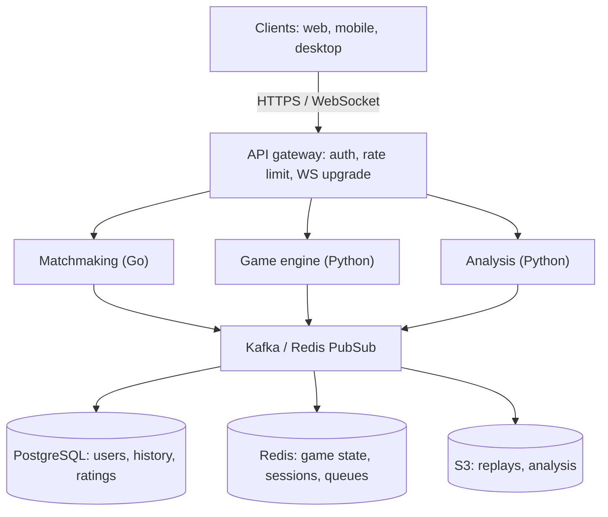
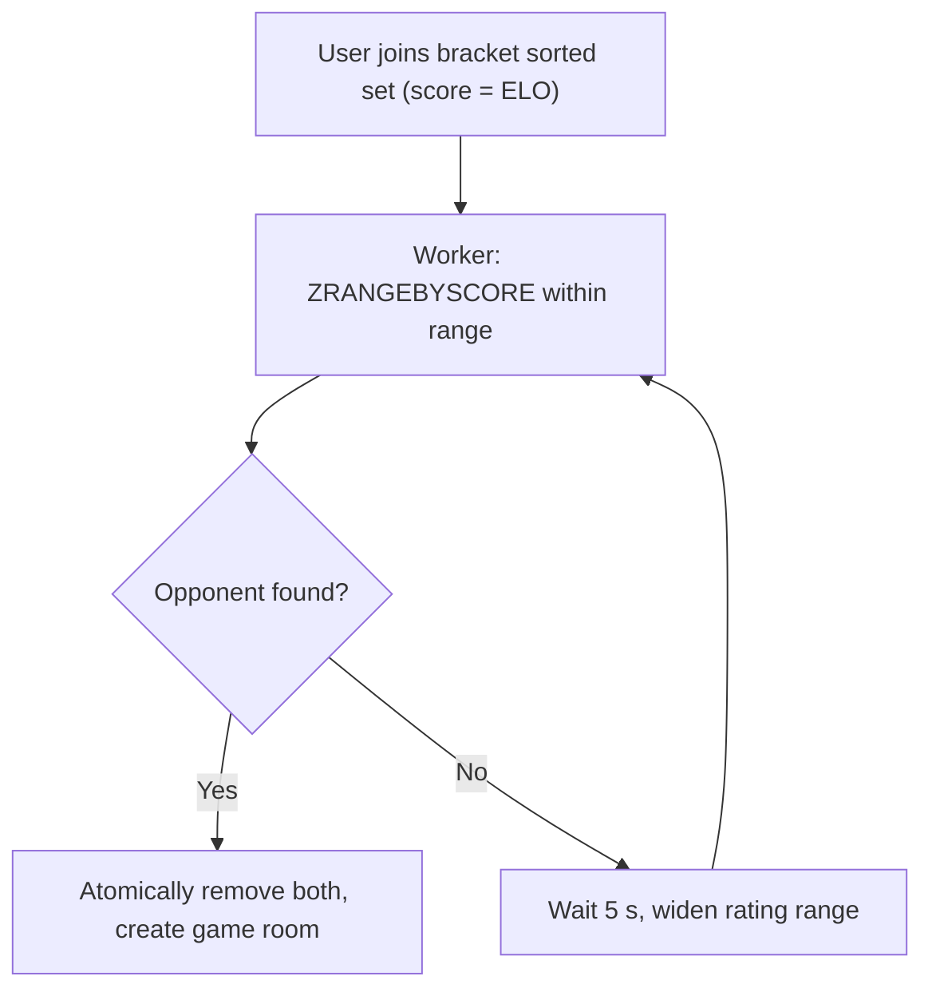
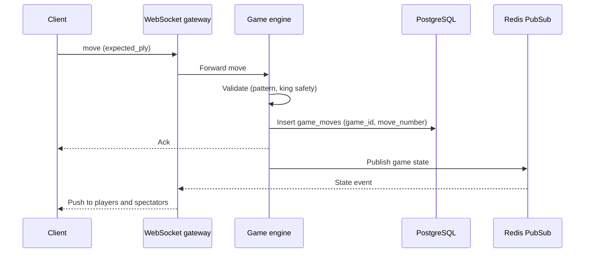

# 🏗️ Chess Game — High-Level Design

> **Interviewer:** Principal Software Engineer  
> **Target Level:** Senior/Staff Engineer  
> **Focus:** Game engine architecture, real-time multiplayer, AI integration

---

## 1. SYSTEM OVERVIEW

**Purpose:** Online chess platform supporting real-time multiplayer, AI opponents, game analysis, and tournament management.

**Scale:** launch at ~10K concurrent games / 50K games per day; design target below (100K concurrent, 500K games/day). The numbers in the rest of this doc use the design target.

**Users:** Players (casual/competitive), Spectators, Tournament organizers

**Use Cases:**
- Play chess vs human (matchmaking)
- Play chess vs AI (3 difficulty levels)
- Analyze completed games
- Watch live tournaments
- Save and review game history

**Constraints:** <100ms move validation, <50ms state sync via WebSocket, <2s AI move generation (easy), 99.99% uptime for ranked play

**Scale Targets:**
- **100K concurrent games** (peak)
- **1M+ registered users**
- **500K games/day**
- **1M+ WebSocket connections** (players + spectators)
- **50K matchmaking requests/minute**
- **200K game moves/minute** (peak) ≈ **3.3K moves/second**

**Back-of-envelope:** 100K games × one move every ~30 s ≈ 3.3K moves/s, consistent with the line above. Each move is ~100 bytes on the wire and one row in the move log. 500K games/day × ~80 plies ≈ 40M move rows/day ≈ 460 rows/s average. None of this is large for PostgreSQL; the hard parts are **fan-out to ~1M sockets, clock accuracy, and never losing or double-applying a move**.

---

## 2. HIGH-LEVEL ARCHITECTURE

```
┌──────────────────────────────────────────────────────┐
│                  Client Applications                   │
│  Web (React)  │  Mobile (React Native) │  Desktop     │
└──────────────────────────┬───────────────────────────┘
                           │ HTTPS / WebSocket
┌──────────────────────────▼───────────────────────────┐
│                   API Gateway                         │
│           (Kong / AWS API Gateway)                    │
│  - Authentication (OAuth2)                           │
│  - Rate Limiting (100 req/s per user)                 │
│  - WebSocket upgrade for live games                  │
└──────────────────────────┬───────────────────────────┘
                           │
          ┌────────────────┼────────────────┐
          │                │                │
┌─────────▼──────┐ ┌───────▼───────┐ ┌───────▼───────┐
│  Matchmaking   │ │   Game        │ │   Analysis    │
│  Service       │ │   Engine      │ │   Service     │
│  (Go)          │ │   (Python)    │ │   (Python)    │
└─────────┬──────┘ └───────┬───────┘ └───────┬───────┘
          │                │                │
          └────────────────┼────────────────┘
                           │
          ┌────────────────▼────────────────┐
          │          Kafka / Redis PubSub    │
          │  (Game events, notificatons)     │
          └────────────────┬────────────────┘
                           │
          ┌────────────────┼────────────────┐
          │                │                │
┌─────────▼──────┐ ┌───────▼───────┐ ┌───────▼───────┐
│  PostgreSQL    │ │   Redis       │ │   S3/Blob    │
│  - Users       │ │  - Game state │ │  - Game      │
│  - Game history│ │  - Sessions   │ │    replays   │
│  - Ratings     │ │  - Match queue│ │  - Analysis  │
└────────────────┘ └───────────────┘ └───────────────┘
```

*Figure: clients, gateway, services, event bus and stores.*



### 🎬 Animated Sequence Diagram

<p align="center">
  <video controls width="900" style="border-radius: 12px; box-shadow: 0 4px 24px rgba(0,0,0,0.3);" loop playsinline preload="metadata">
    <source src="../../../assets/videos/chess-game-sequence.mp4" type="video/mp4" />
    Your browser does not support the video tag.
  </video>
  <br/>
  <em>🎬 Animated Chess Game Sequence — Player → Move → Validation → Board Update → Game State. Click ▶ to play/pause. Created with <a href="https://remotion.dev">Remotion</a>.</em>
</p>

---

## 3. COMPONENT BREAKDOWN

### 3.1 Game Engine Service
- **Technology:** Python (Python for chess logic; Go for real-time if needed)
- **Responsibilities:**
  - Board state management (bitboard representation)
  - Move validation (6 piece types, special rules)
  - Check/checkmate/stalemate detection
  - AI move generation (Minimax + Alpha-Beta pruning)
  - Game timer management

**🔴 Interview Question:** *"How would you architect the move validation to be fast enough for 10K concurrent games?"*

**✅ Answer:** 
1. **Bitboard representation:** Represent board as 12 × uint64 (one per piece type per color). Move generation becomes bitwise operations — 50M+ positions/second per core.
2. **Pre-computed attack tables:** Knight and king moves are lookup tables (O(1)).
3. **Magic bitboards:** Sliding pieces (bishop, rook, queen) use magic hash to pre-compute attack sets.
4. **Validation pipeline:** Move pattern check → legality check (king safety) → en passant/castling checks.
5. **Stateless design:** Each game state is self-contained (no shared state between games). Scale horizontally by adding more engine pods.

---

### 3.2 Matchmaking Service
- **Technology:** Go (high concurrency)
- **Responsibilities:**
  - ELO-based opponent matching
  - Rating range: ±200 for fast matches, expanding over time
  - Priority to same rating range first
  - Handle casual vs ranked queues separately

**🔴 Interview Question:** *"How does your matchmaking handle 10K users queueing simultaneously?"*

**✅ Answer:** 
1. Redis sorted sets per rating bracket (e.g., 0-1000, 1000-1200, ...)
2. Each bracket key: `matchmaking:{rating_bracket}`
3. Users enter with score = ELO rating
4. Background worker polls each bracket: `ZRANGEBYSCORE` to find opponents within range
5. Match found → atomically remove both users, create game room
6. Expand search range every 5 seconds if no match found

*Figure: matchmaking by rating bracket with a widening search range.*



---

### 3.3 Analysis Service
- **Technology:** Python + Stockfish integration
- **Responsibilities:**
  - Position evaluation (centipawns, best move)
  - Game annotation
  - Blunder detection
  - Opening book lookup

---

### 3.4 Data Layer

**PostgreSQL Schema:**
```sql
CREATE TABLE users (
    id UUID PRIMARY KEY, username TEXT UNIQUE, elo_rating INT DEFAULT 1200
);
CREATE TABLE games (
    id UUID PRIMARY KEY, white_id UUID, black_id UUID,
    pgn TEXT, result TEXT, played_at TIMESTAMP DEFAULT NOW(),
    time_control TEXT
);
CREATE TABLE moves (
    id BIGSERIAL, game_id UUID REFERENCES games(id),
    move_number INT, from_sq TEXT, to_sq TEXT, piece TEXT,
    time_seconds INT
);
```

**Redis:**
- Active game state: `HGETALL game:{id}:state`
- User session: `GET session:{token}`
- Matchmaking queue: `ZADD matchmaking:1500 {user_id} {rating}`

**S3 Storage:** Game PGN exports, analysis reports, user profile images

---

### 3.5 Monitoring & Observability

| Metric | Tool | Alert |
|--------|------|-------|
| Move validation latency | Prometheus | p99 > 50ms |
| AI move generation | Prometheus | > 5s (easy mode) |
| Matchmaking time | Grafana | > 30s avg |
| Concurrent games | CloudWatch | > 80% capacity |
| WebSocket connections | Grafana | > 10K per pod |

---

## 4. TRADE-OFFS ANALYSIS

### Trade-off 1: Server-side vs Client-side Game Logic

| Aspect | Server-side | Client-side |
|--------|-------------|-------------|
| Trust | ✅ No cheating possible | ❌ Client can modify state |
| Latency | ❌ 50-100ms per move | ✅ <5ms |
| Cost | ❌ Server compute | ✅ Free |
| Complexity | More infrastructure | Simpler |

**Decision:** Server-authoritative for ranked games. Client-side for AI games (faster UX).

### Trade-off 2: Bitboard vs Array Representation

| Aspect | Bitboard (uint64) | 2D Array |
|--------|------------------|----------|
| Speed | ✅ 50M+ positions/s | ❌ ~500K positions/s |
| Memory | ~96 bytes (12 × 64-bit) | ~64 bytes (one byte per square) — memory is not the reason to choose either |
| Complexity | ❌ Harder to debug | ✅ Simple |
| Move generation | ✅ Bitwise ops | ❌ Loops |

**Decision:** For a game server that validates *one* move per request, the array board is fast enough (well under a millisecond per legal-move check) and far easier to get right. Bitboards matter for the AI/analysis tier, which searches millions of positions; use a proven engine (Stockfish) there rather than writing one.

---

## 5. SCALING TO 100K CONCURRENT GAMES & 1M USERS

### 5.1 Architecture for Massive Scale

At 100K concurrent games and 1M users, the architecture must be fundamentally different from a simple monolith. Here's how each layer scales:

```
                              ┌──────────────────────────────────────┐
                              │       Global Load Balancer           │
                              │  (AWS Global Accelerator / Cloudflare)│
                              └────────────┬─────────────────────────┘
                                           │
                              ┌────────────▼─────────────────────────┐
                              │        API Gateway (Kong)             │
                              │  - Auth, Rate limiting, WebSocket     │
                              │  - Sticky sessions by game_id hash    │
                              └────────────┬─────────────────────────┘
                                           │
              ┌────────────────────────────┼────────────────────────────┐
              │                            │                            │
   ┌──────────▼──────────┐    ┌────────────▼───────────┐  ┌───────────▼──────────┐
   │  Matchmaking Service │    │    Game Engine Pods    │  │  Analysis / AI       │
   │  (Go, 3-5 pods)     │    │  (Go, 50-200 pods)     │  │  (Python, 10-30 pods)│
   │  - Redis ZSET queue  │    │  - 1 game = 1 goroutine│  │  - Async job queue   │
   │  - Rating brackets   │    │  - ~2000 games/pod     │  │  - Stockfish workers │
   │  - Expand search     │    │  - Bitboard engine     │  │  - Spot GPU for AI   │
   └──────────┬──────────┘    └────────────┬───────────┘  └───────────┬──────────┘
              │                            │                            │
              └────────────────────────────┼────────────────────────────┘
                                           │
                              ┌────────────▼─────────────────────────┐
                              │        Message Bus (Kafka)            │
                              │  Topics: game-events, rating-updates, │
                              │  analysis-jobs, notifications         │
                              └────────────┬─────────────────────────┘
                                           │
              ┌────────────────────────────┼────────────────────────────┐
              │                            │                            │
   ┌──────────▼──────────┐    ┌────────────▼───────────┐  ┌───────────▼──────────┐
   │  PostgreSQL (Primary)│   │  Redis Cluster          │  │  S3 / Object Store   │
   │  - Aurora Global DB  │   │  - 15+ shards           │  │  - Game replays (PGN) │
   │  - 2 read replicas   │   │  - Active game state    │  │  - Analysis reports  │
   │  - Cross-region DR   │   │  - WebSocket pub/sub    │  │  - User avatars      │
   │  - Partitioned tables │   │  - Matchmaking queues   │  │                      │
   └──────────────────────┘   └─────────────────────────┘  └──────────────────────┘
```

### 5.2 Game Engine Placement & Architecture

**Where does the game engine live?**

```
┌─────────────────────────────────────────────────────────────┐
│                    Game Engine Pod (Go)                      │
│                                                             │
│  ┌──────────────────────────────────────────────────────┐   │
│  │              Game Router                              │   │
│  │  Routes WebSocket messages to the correct game loop  │   │
│  └──────────────┬───────────────────────────────────────┘   │
│                  │                                           │
│  ┌───────────────▼───────────────────────────────────────┐   │
│  │           Game Loop Manager                            │   │
│  │  Manages 2000+ goroutines, each running one game      │   │
│  │  Each goroutine:                                      │   │
│  │    - Reads move from channel (blocking, no busy-wait) │   │
│  │    - Validates move (bitboard engine, <100μs)         │   │
│  │    - Updates game state                               │   │
│  │    - Publishes state change to Redis PubSub           │   │
│  │    - Flushes to PG every N moves (async)              │   │
│  └───────────────────────────────────────────────────────┘   │
│                                                             │
│  ┌───────────────┬───────────────────────┬───────────────┐   │
│  │ Bitboard      │  Timer Manager        │  Redis Client │   │
│  │ Engine        │  Per-game chess clocks │  (go-redis)  │   │
│  │ (Go native)   │  O(1) timer heap      │  PubSub conn │   │
│  └───────────────┴───────────────────────┴───────────────┘   │
└─────────────────────────────────────────────────────────────┘

Key design decisions:
1. **Game engine is in Go**, not Python — Go's goroutines make it trivial to manage 2000+ concurrent games per pod (each with its own timer, WebSocket connection, and game state). Python would require complex async patterns for similar throughput.
2. **One goroutine per game** — not per player. Both player WebSocket connections feed into the same game goroutine via channels. This eliminates all locking within a game.
3. **Single writer per game, enforced by a lease** — a pod owns a game while it holds a lease (e.g. `SET game:{id}:owner pod-7 NX PX 10000`, renewed every few seconds) and every write carries a fencing token (the lease epoch). If a pod crashes, another pod takes the lease, rebuilds the game from the durable move log, and resumes. Without fencing, a paused-but-alive old owner could write after the new owner took over (split brain).
4. **Bitboard engine compiled as native Go** — no CGo, no Python overhead. Pure Go bit manipulation for move generation.
```

**Game Engine Code Architecture (Go):**

```go
// Game represents a single chess game running in a goroutine
type Game struct {
    ID              string
    WhitePlayer     string
    BlackPlayer     string
    Board           *Bitboard          // Current bitboard state
    MoveHistory     []Move
    WhiteClock      *ChessClock
    BlackClock      *ChessClock
    Status          GameStatus
    
    // Channels for communication
    MoveChan        chan PlayerMove    // Receives moves from players
    StateChan       chan GameState     // Publishes state changes
    DisconnectChan  chan string        // Player disconnected
    Done            chan struct{}      // Game over signal
}

func (g *Game) Run() {
    timer := time.NewTicker(100 * time.Millisecond) // Timer resolution
    defer timer.Stop()
    
    for {
        select {
        case move := <-g.MoveChan:
            // Reject duplicates / stale submissions: the client echoes the ply it saw
            if move.ExpectedPly != len(g.MoveHistory) {
                g.StateChan <- GameState{Error: "Stale move", Player: move.Player}
                continue
            }
            if !g.Board.IsLegalMove(move.Player, move.From, move.To) {
                g.StateChan <- GameState{Error: "Illegal move", Player: move.Player}
                continue
            }
            // Persist BEFORE acknowledging: INSERT ... (game_id, move_number) is the PK,
            // so a second writer for the same ply fails instead of forking the game.
            if err := g.Store.AppendMove(g.ID, len(g.MoveHistory)+1, move, g.LeaseEpoch); err != nil {
                g.StateChan <- GameState{Error: "Retry", Player: move.Player}
                continue
            }
            g.Board.ApplyMove(move.From, move.To, move.Promotion)
            g.MoveHistory = append(g.MoveHistory, move.ToMove())
            g.SwitchTurn()

            if g.Board.IsCheckmate() || g.Board.IsStalemate() || g.Board.IsAutomaticDraw() {
                g.EndGame()   // persists the result, then publishes game_over
                return
            }
            // Publish new state to Redis PubSub (-> other player + spectators)
            g.PublishState()
            // Note: never hand g.MoveHistory to another goroutine (e.g. `go flush(g.MoveHistory)`)
            // while this loop keeps appending to it: that is a data race. Copy it, or don't.
            
        case playerID := <-g.DisconnectChan:
            g.HandleDisconnect(playerID)
            
        case <-timer.C:
            // Tick chess clocks
            g.TickClocks()
            
        case <-g.Done:
            return
        }
    }
}
```

### 5.3 State Management & Board Positions

**Three-tier state architecture:**

| Tier | Technology | Purpose | Recovery |
|------|-----------|---------|----------|
| **L1 - Hot** | Redis (in-memory) | Active game state, FEN, timers, last 50 moves | Cache; rebuilt from L2 on loss |
| **L2 - Warm** | PostgreSQL (game_sessions + game_moves) | Source of truth: every move, written before ack | Replay the move log |
| **L3 - Cold** | S3 / Object Store | PGN exports, archived games (older than 6 months) | Bulk restore |

**State serialization format:**

```json
{
  "game_id": "abc-123",
  "fen": "rnbqkbnr/pppppppp/8/8/4P3/8/PPPP1PPP/RNBQKBNR b KQkq e3 0 1",
  "turn": "black",
  "status": "active",
  "white_player": {
    "id": "user-1",
    "time_ms": 600000,
    "last_move_at": 1704067200
  },
  "black_player": {
    "id": "user-2",
    "time_ms": 598000,
    "last_move_at": 1704067210
  },
  "move_count": 1,
  "last_moves": ["e2e4"],
  "checkpoint_version": 0,
  "started_at": 1704067190
}
```

**Persistence strategy:**
- **The move log in PostgreSQL is the source of truth.** Each accepted move is one `INSERT` into `game_moves` with PK `(game_id, move_number)` *before* the move is acknowledged. At ~3.3K moves/s peak this is comfortably within one primary (or a few hash-partitioned tables).
- **Redis is a hot cache** of the derived state (FEN, clocks) for fast reconnects and spectators. Losing it loses nothing: replay the move log.
- Batching every 10 moves (a common suggestion) means a pod or Redis failure can silently delete up to 10 moves of a ranked game. Unacceptable for a game whose result changes ratings; per-move writes are cheap enough that batching isn't worth it.
- **Zombie game cleanup**: TTL on Redis keys (max 24h per game). Games exceeding max time (e.g., unlimited time control → 7 days) auto-draw.

### 5.4 WebSocket Architecture for 1M+ Connections

**Challenge:** 100K active games × 2 players + ~8 spectators/game (avg) = ~1M concurrent WebSocket connections.

**Connection Architecture:**

```
Client A ──WebSocket──→  ┌──────────────────────┐
Client B ──WebSocket──→  │   WebSocket Gateway   │  ┌─────────────────┐
Client C ──WebSocket──→  │   (Go, 10 pods)       │──▶ Redis PubSub    │
Client D ──WebSocket──→  │   - Connection mux    │  │  game:{id}:state │
...                       │   - Per-pod 100K conns│  └────────┬────────┘
1M connections            │   - Graceful drain    │           │
                          │   - Rate limiting     │           │
                          └──────────────────────┘           │
                                                              │
                    ┌─────────────────────────────────────────┘
                    │
          ┌─────────▼───────────┐
          │   Game Engine Pods   │
          │   (Go, 50-200 pods)  │
          │   Subscribe to Redis │
          │   PubSub for their   │
          │   assigned games     │
          └─────────────────────┘
```

**Key WebSocket design decisions:**

1. **WebSocket Gateway is separate from Game Engine** — a thin proxy that maintains 1M+ connections. Each gateway pod can handle ~100K connections (Go's goroutines are lightweight: ~5KB per connection).

2. **Routing to the owning pod:** a game→pod lookup (the lease key above, cached at the gateway) or consistent hashing on `game_id`. Plain `hash(game_id) % num_pods` reshuffles almost every game when a pod is added or removed, which is exactly when you can least afford mass migration.

3. **Redis PubSub for broadcasting:** When engine pod processes a move, it publishes the new state to Redis PubSub channel `game:{id}:state`. The gateway pod (which subscribed to this channel via Redis) pushes the update to both players' WebSocket connections.

4. **Connection migration:** If a gateway pod fails, clients reconnect via a global connection registry (Redis SET). The new gateway subscribes to the game's Redis channels and resumes pushing state.

5. **Spectator mode:** Spectators subscribe to the same Redis PubSub channel. The gateway fan-out pattern means adding 100K spectators costs almost nothing — just more WebSocket connections on the gateway tier.

**WebSocket message protocol:**

```json
// Client → Server (move submission)
{
  "type": "move",
  "payload": {
    "from": "e2",
    "to": "e4",
    "promotion": null,
    "expected_ply": 0
  },
  "timestamp": 1704067200000
}

// Server → Client (state update)
{
  "type": "state",
  "payload": {
    "fen": "rnbqkbnr/pppppppp/8/8/4P3/8/PPPP1PPP/RNBQKBNR b KQkq e3 0 1",
    "turn": "black",
    "status": "active",
    "white_time_ms": 598000,
    "black_time_ms": 600000,
    "move_count": 1,
    "last_move": "e2e4"
  },
  "timestamp": 1704067200010
}

// Server → Client (game over)
{
  "type": "game_over",
  "payload": {
    "result": "white_win",
    "reason": "checkmate",
    "final_fen": "...",
    "winner_rating_change": +15,
    "loser_rating_change": -15
  }
}

// Server → Client (clock sync)
{
  "type": "clock_sync",
  "payload": {
    "white_time_ms": 450000,
    "black_time_ms": 600000,
    "server_time": 1704067500000
  }
}
// Sent every 500ms to keep clocks in sync
```

### 5.5 Processing Simultaneous Games at Scale

**Challenge:** 200,000 moves/minute peak. How do we validate, store, and broadcast efficiently?

**Move processing pipeline:**

```
1. Client sends move via WebSocket
   │
2. WebSocket Gateway receives
   │  - Validate message format
   │  - Rate limit check (max 3 moves/sec per player)
   │  - Forward to correct engine pod via Redis PubSub
   │
3. Engine Pod processes move
   │  - Validate move legality (bitboard, <100μs)
   │  - Apply move to board
   │  - Update chess clocks
   │  - Check for check/checkmate/stalemate
   │  - Publish new state to Redis
   │  - Append move to PG move log (before ack)
   │
4. Redis PubSub fan-out
   │  - All gateway pods subscribed to this game's channel
   │  - Gateways push state to player WebSockets + spectators
   │
5. Background services react
   │  - Rating service: update ELO after game ends
   │  - Analysis service: queue Stockfish analysis
   │  - Notification service: push move alerts
   │  - Anti-cheat: scan for suspicious patterns
```

**Throughput calculations:**

| Component | Cost per move | At 3.3K moves/s | Notes |
|-----------|--------------|-----------------|-------|
| Move validation (array board, Python) | ~0.5 ms CPU | ~1.7 cores | Bitboards would cut this ~100×; not needed |
| PG move-log insert | ~1–3 ms latency | 3.3K inserts/s | One well-provisioned primary; hash-partition `game_moves` for vacuum/index size, not for throughput |
| Redis state update + PUBLISH | <1 ms | ~6.6K ops/s | A single Redis node handles ~100K ops/s; shard for memory/fan-out, not ops |
| WebSocket pushes | ~10 recipients per move (2 players + ~8 spectators) | ~33K pushes/s | Spread across gateway pods; popular games need a separate fan-out path |

**Bottleneck management:**

1. **Clock sync traffic, not moves, dominates Redis/WebSocket load.** `clock_sync` every 500 ms × 100K games × 10 recipients = 2M messages/s. Send clock state only with moves (clients count down locally from the server timestamp) and resync every few seconds, not every 500 ms.

2. **Hot games:** a top-board tournament game with 50K spectators. Don't fan out from the engine pod: publish once to a dedicated channel and let a CDN-style relay tier (or SSE with caching) handle viewers, who tolerate a second of delay.

3. **WebSocket broadcast storm:** When 100K games all produce moves simultaneously, gateways could get overwhelmed. **Solution:** Rate-limit state broadcasts per-game (max 10/s). If a game produces moves faster (premoves in bullet chess), batch the last known state.

### 5.6 Anti-Cheat & Fair Play

| Threat | Detection | Mitigation |
|--------|-----------|------------|
| **Engine assistance** | Analyze move correlation with Stockfish top moves. Flag >90% correlation. | Shadow-ban: match suspected cheaters only with each other. Manual review for ranked. |
| **Automated play (bots)** | Mouse movement analysis, move timing patterns (sub-second moves duration), CAPTCHA challenges. | Rate limit moves/sec. Require periodic verification. |
| **Sandbagging** | Detect intentional rating drop by analyzing game patterns (blunders in winning positions). | Rollback ELO manipulation. Temporary ban. |
| **Collusion (tournaments)** | Graph analysis of opponent matching patterns. IP address clustering. | Disqualify. Publish transparency report. |
| **DDoS via game creation** | Rate-limit game creation per user (max 1 concurrent game). | CAPTCHA on account creation. Tiered rate limits based on account age. |

### 5.7 Database Scaling Strategy

```
┌─────────────────────────────────────────────────────┐
│               PostgreSQL (Aurora Global)              │
│                                                       │
│  ┌─────────────┐  ┌─────────────┐  ┌─────────────┐  │
│  │ Primary      │  │ Read        │  │ Read        │  │
│  │ (us-east-1)  │──│ Replica 1   │──│ Replica 2   │  │
│  │ - Writes     │  │ - Game reads│  │ - Analytics  │  │
│  │ - Game      │  │ - User      │  │ - Leaderboard│  │
│  │   creation   │  │   profiles  │  │ - History    │  │
│  └─────────────┘  └─────────────┘  └─────────────┘  │
│         │                                             │
│         │ Cross-region replication                    │
│  ┌──────▼──────┐                                      │
│  │ DR (eu-west) │                                      │
│  │ - Standby    │                                      │
│  └─────────────┘                                      │
└─────────────────────────────────────────────────────┘

┌─────────────────────────────────────────────────────┐
│               Redis Cluster (15+ shards)              │
│                                                       │
│  Shard 0: game:0* → game:6**    │  Shard 1: game:7*...│
│  Shard 2: user sessions         │  Shard 3: matchmaking│
│  Shard 4-14: more game shards   │                      │
│                                                       │
│  Each shard: 1 primary + 2 replicas (for HA)          │
└─────────────────────────────────────────────────────┘
```

**Partitioning strategy for `game_moves`:**
- Partition by `game_id` hash (mod 64) — evenly distributes write load
- Sub-partition by month for easy archival
- Older partitions can be moved to slower (cheaper) storage or S3

**Read optimization for game replay:**
- Recently finished games (last 7 days): served from Redis cache
- Older games: served from PostgreSQL (`game_moves` partitioned by month)
- Archived games (>6 months): served from S3 as pre-generated PGN files

---

## 6. SCALABILITY & RELIABILITY

**Availability:** 99.99% (ranked) / 99.9% (casual)

**Game State Recovery:**
1. Every move is in PostgreSQL before it is acknowledged (see 5.3)
2. Redis persistence (AOF every 1s + RDB every 5min) only shortens warm-up; it is not relied on for correctness
3. If Redis fails completely → replay `game_moves` for each active game (≈80 rows per game; seconds for the whole fleet)

**Disaster Recovery:**
- Cross-region replica of PostgreSQL (Aurora Global Database)
- On full region failover, active games resume from the replicated move log. Aurora Global replicates asynchronously (typically under a second of lag), so a region loss can drop the last move or two; the client re-submits with its `expected_ply` and the server either accepts or returns the authoritative state. Clocks are paused for the failover window.
- Redis replication across AZs within region

**Graceful degradation:**
| Condition | Degraded behavior |
|-----------|-------------------|
| Redis cluster partially down | Games on affected shards pause (show "reconnecting" to players). Other games unaffected. |
| PG primary down | Read replica promoted (15-30s failover). Game creation paused. Existing games continue from Redis. |
| Engine pod crash | Games on crashed pod detected by heartbeat timeout (5s). Redis state loaded, new pod spawns, games resume. |
| Full game service down | Active games paused. Rating changes deferred. All games resume when service is back. |

**Scaling:**
- Game engine pods: Horizontal based on active game count (target ~2K games per pod, one goroutine per game; scale out at ~80% of that)
- WebSocket gateway pods: Scale based on connection count (target 100K connections/pod)
- AI computation: GPU instances with auto-scaling queue. Analysis jobs queued via Kafka, processed as capacity allows.
- Redis cluster: Add shards as memory usage crosses 70%
- PostgreSQL: Read replicas for leaderboard queries, analytics offloading

---

### Idempotency & ordering (summary)

| Risk | Guard |
|------|-------|
| Client retries a move after a timeout | Client sends `expected_ply`; server returns the current state if the ply already advanced |
| Two pods both think they own a game | Lease + fencing epoch stored with each move write; the store rejects lower epochs |
| Same ply written twice | `PRIMARY KEY (game_id, move_number)` on `game_moves` |
| Rating applied twice when the game-over event is redelivered | `UNIQUE (user_id, game_id, rating_type)` on rating history; consumer is idempotent |
| Flag-fall timer races a last-second move | Both go through the game's single writer; whichever is processed first wins |

*Figure: one move; it is durable in PostgreSQL before the ack, then fanned out.*



---

## 7. COST BREAKDOWN (Monthly at Full Scale)

| Component | Cost (100K games) | Cost (10K games) | Notes |
|-----------|------------------|------------------|-------|
| Game Engine (50-200 pods) | $15,000 | $4,000 | c5.xlarge, auto-scaling |
| WebSocket Gateway (10 pods) | $3,000 | $1,000 | c5.2xlarge, ~100K conns/pod |
| Matchmaking (3-5 pods) | $600 | $400 | Small instances |
| PostgreSQL Aurora (Global) | $4,000 | $1,200 | serverless scaling |
| Redis Cluster (15 shards) | $6,000 | $600 | r6g.large per shard |
| AI computation (Stockfish) | $2,000 | $800 | Spot GPU + CPU mix |
| Kafka + Event Bus | $1,500 | $500 | MSK or self-hosted |
| CDN + Bandwidth | $2,000 | $500 | 10TB egress |
| S3 Storage | $500 | $200 | Game replays + analysis |
| Monitoring (Datadog/Prom) | $1,500 | $500 | Metrics, traces, logs |
| **Total** | **$36,100** | **$9,700** | |

---

## 8. IMPLEMENTATION ROADMAP

**Phase 1 (Month 1-2):** Core game engine with all rules. Bitboard in Go. Local multiplayer only. Basic CLI test.

**Phase 2 (Month 3-4):** Online multiplayer with WebSocket. Redis for game state. Simple matchmaking (ELO-based). Game history in PostgreSQL.

**Phase 3 (Month 5-6):** AI depth 6 with alpha-beta. Game analysis (Stockfish). Async job queue (Kafka). Batching: 100 concurrent games.

**Phase 4 (Month 7-8):** Scale to 10K concurrent games. Redis Cluster. PG read replicas. Auto-scaling engine pods. Tournaments.

**Phase 5 (Month 9-12):** Scale to 100K concurrent games. Global deployment (multi-region). Spectator mode. Anti-cheat. Advanced analytics.
