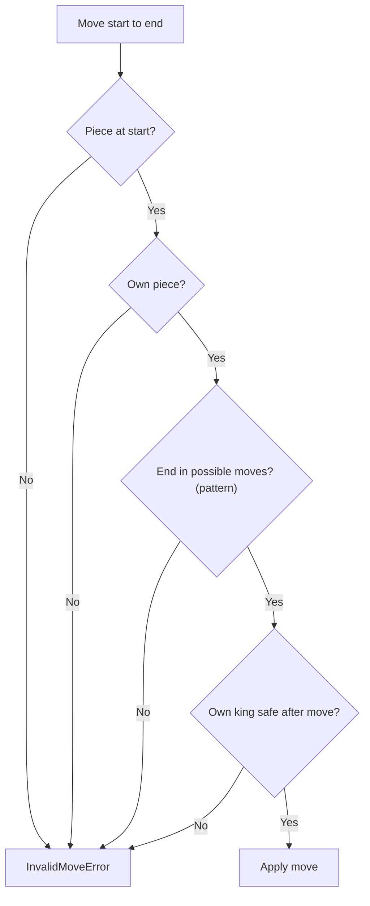
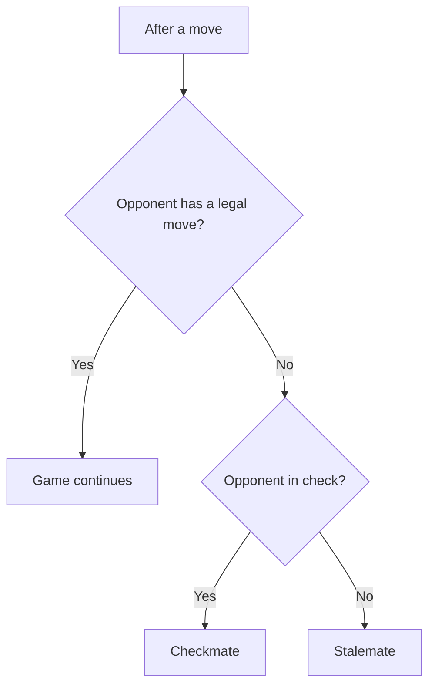

# Chess Game - Interview Questions & Answers

> **Interviewer Persona:** Principal Software Engineer with 15+ years experience  
> **Target Level:** Senior/Staff Engineer (6+ years)  
> **Evaluation Focus:** Complex state management, polymorphism, recursion, game AI

---

## Question 1: Core Design
**Interviewer:** *"Design a chess game with all standard rules — piece movement, check, checkmate, castling, en passant, and pawn promotion."*

### 🎯 Expected Answer

Let me decompose this. Chess is fundamentally a **state machine** with well-defined transitions enforced by game rules. The core challenge is modeling the polymorphism of 6 different piece types, each with unique movement rules.

**Class Hierarchy (LSP):**
```python
class Piece(ABC):
    @abstractmethod
    def get_possible_moves(self, board: Board) -> List[Tuple[int, int]]:
        pass

class King(Piece): ...
class Queen(Piece): ...
class Rook(Piece): ...
class Bishop(Piece): ...
class Knight(Piece): ...
class Pawn(Piece): ...
```

Each `Piece` subclass knows how it moves. The caller invokes `get_possible_moves()` polymorphically — no `if piece_type == KING` checks anywhere. This is **Open/Closed** in practice: adding a new piece type (e.g., a Fairy Chess piece) means one new class plus a `PieceType` value and a factory entry; `Board`, `MoveValidator` and `ChessGame` don't change.

**Factory Pattern for Piece Creation:**
```python
class PieceFactory:
    _piece_map = {
        PieceType.KING: King,
        PieceType.QUEEN: Queen,
        # ...
    }
    @classmethod
    def create_piece(cls, piece_type, color, position):
        return cls._piece_map[piece_type](color, position)
```

This centralizes piece creation — changing how pieces are initialized (e.g., adding a unique ID for tracking) happens in one place.

### 🔍 Deep Dive: Move Generation vs. Move Validation

A key architectural decision: **separate move generation from move validation**.

```python
# Step 1: Generate candidate moves (piece knows its movement pattern)
candidate_moves = piece.get_possible_moves(board)

# Step 2: Filter to legal moves (board knows rules)
legal_moves = [m for m in candidate_moves if board.is_legal_move(piece, m)]
```

`is_legal_move` applies the move on the real board, checks whether the mover's king is attacked, then calls `undo_move`. No board copy is made, which is why `apply_move`/`undo_move` must be exact inverses. This separation means:
- **SRP**: Pieces generate patterns; the board validates legality
- **Testability**: You can unit-test piece movement independently of check detection
- **Performance**: In a chess engine, you'd optimize move generation (bitboards) separately from legality checking

### ⚠️ Recursion Gotcha

Correct castling requires "the king is not in check and doesn't pass through an attacked square". If "attacked" is computed via `get_possible_moves()`, then `is_in_check` → enemy king's `get_possible_moves` → its castling check → `is_in_check` → … recurses forever. The fix is to give every piece a separate **`attacks()`** method and use only that for check detection:

```python
class Piece(ABC):
    def attacks(self, board):            # default: attacks == moves
        return self.get_possible_moves(board)

class King(Piece):
    def attacks(self, board):            # one step in 8 directions, never castling
        ...
    def get_possible_moves(self, board):
        moves = self.attacks(board)
        if not self.has_moved and not board.is_in_check(self.color):
            ...                          # castling: uses board.is_square_attacked()

class Pawn(Piece):
    def attacks(self, board):            # both diagonals, even if empty
        ...
```

Pawns need the split too: a pawn *moves* straight but *attacks* diagonally, including empty squares. Using pawn moves for "is f1 attacked?" would miss a pawn guarding an empty square and allow illegal castling.

---

## Question 2: Move Validation Engine
**Interviewer:** *"How do you validate moves efficiently for 6 piece types with different rules?"*

### 🎯 Expected Answer

**Validation pipeline** (an ordered sequence of checks, each failing with a precise reason):
```python
class MoveValidator:
    def validate(self, player, start, end) -> Piece:
        piece = self._board.get_piece_at(start)
        if piece is None:
            raise InvalidMoveError(f"No piece at {square_name(start)}")
        if piece.color is not player.color:
            raise InvalidMoveError("not your piece")
        if end not in piece.get_possible_moves(self._board):      # pattern (polymorphic)
            raise InvalidMoveError("bad pattern")
        if not self._board.is_legal_move(piece, end):             # king safety
            raise InvalidMoveError("Move leaves own king in check")
        return piece
```
Raising beats returning `False`: the UI can show *why*, and tests can assert on the reason. If the rule set grows (variants, house rules), turn each check into a `MoveRule` object in a list; that's when Chain of Responsibility starts to pay.

*Figure: move validation pipeline; each check fails with a precise reason.*



**Pin detection** is particularly interesting. A pinned piece (e.g., bishop pinned to king by enemy rook) shouldn't be able to move off its attack line. In our implementation, this falls out naturally from `_is_legal_move` — any move that exposes the king to check is rejected.

### 💡 Production Performance Considerations

For a competitive chess engine:
1. **Bitboard representation**: Represent the board as 12 × 64-bit integers (one per piece type per color). Move generation becomes bitwise operations — millions of moves/second.
2. **Pre-computed attack tables**: Knights and kings have lookup tables — O(1) move generation.
3. **Zobrist hashing**: Hash the board state for transposition tables — avoids re-computing positions.
4. **Alpha-beta pruning**: Prune branches that can't change the result — with perfect move ordering the tree shrinks from O(b^d) to about O(b^(d/2)), i.e. roughly double the depth for the same work. Worst case (bad ordering) it's no better than minimax, which is why move ordering matters.

---

## Question 3: AI Integration
**Interviewer:** *"How would you design this to support AI opponents of varying difficulty?"*

### 🎯 Expected Answer

**Strategy Pattern for AI:**
```python
class ChessAI(ABC):
    @abstractmethod
    def choose_move(self, board: Board, color: Color) -> Move:
        pass

class RandomAI(ChessAI):
    """Easy: picks random legal move"""

class MinimaxAI(ChessAI):
    """Medium: minimax with depth limit"""

class AlphaBetaAI(ChessAI):
    """Hard: minimax + alpha-beta pruning + opening book"""
```

**Minimax with Alpha-Beta:**
```python
def minimax(board, depth, alpha, beta, maximizing):
    if depth == 0 or game_over:
        return evaluate(board)
    
    if maximizing:
        max_eval = -inf
        for move in generate_moves(board):
            board.make_move(move)
            score = minimax(board, depth-1, alpha, beta, False)
            board.undo_move(move)
            max_eval = max(max_eval, score)
            alpha = max(alpha, score)
            if beta <= alpha:
                break  # Beta cut-off
        return max_eval
    # minimizing branch is symmetric (min, beta = min(beta, score), alpha cut-off)
```

**Piece-square tables** for evaluation:
```python
# Give bonus for central control
PIECE_SQUARE_TABLES = {
    PAWN: [
        [0, 0, 0, 0, 0, 0, 0, 0],
        [50, 50, 50, 50, 50, 50, 50, 50],
        [10, 10, 20, 30, 30, 20, 10, 10],
        [5, 5, 10, 25, 25, 10, 5, 5],
        [0, 0, 0, 20, 20, 0, 0, 0],
        [5, -5, -10, 0, 0, -10, -5, 5],
        [5, 10, 10, -20, -20, 10, 10, 5],
        [0, 0, 0, 0, 0, 0, 0, 0]
    ]
}
```

---

## Question 4: Game State & Undo
**Interviewer:** *"How would you handle saving/loading, undo/redo, and PGN export?"*

### 🎯 Expected Answer

**Command Pattern** for move history. The record must hold *everything* needed to reverse the move, which is more than people expect:
```python
@dataclass
class Move:
    start_pos: Square
    end_pos: Square
    piece: Piece
    captured_piece: Optional[Piece] = None
    captured_pos: Optional[Square] = None      # != end_pos for en passant
    promotion: Optional[PieceType] = None
    promoted_piece: Optional[Piece] = None
    is_castling: bool = False
    rook_from: Optional[Square] = None
    rook_to: Optional[Square] = None
    prev_en_passant_target: Optional[Square] = None
    prev_has_moved: bool = False               # else undo restores castling rights wrongly

class MoveHistory:
    def __init__(self):
        self._moves: List[Move] = []
        self._current = -1
    
    def record(self, move: Move): ...
    def undo(self) -> Move: ...  # Pop and reverse
    def redo(self) -> Move: ...  # Re-apply
```
In the code, `ChessGame.undo_last_move()` also restores the half-move clock, the repetition counter and the previous status, which the board alone doesn't know.

**Memento Pattern** for game state snapshots:
```python
class GameSnapshot:
    def __init__(self, board_state, turn, castling_rights, 
                 en_passant_target, half_move_clock):
        ...

class ChessGame:
    def save_state(self) -> GameSnapshot:
        return deepcopy(self._state)
    
    def restore_state(self, snapshot: GameSnapshot):
        self._state = deepcopy(snapshot)
```

**PGN Export:**
```python
def to_pgn(moves: List[Move], white: str, black: str) -> str:
    pgn = f"[White \"{white}\"]\n[Black \"{black}\"]\n\n"
    for i, move in enumerate(moves):
        if i % 2 == 0:
            pgn += f"{i//2 + 1}. {move_to_algebraic(move)}"
        else:
            pgn += f" {move_to_algebraic(move)}\n"
    return pgn
```

---

## Question 5: Performance Optimization
**Interviewer:** *"How would you make move generation competitive with Stockfish-level engines?"*

### 🎯 Answer

The jump from OOP chess to competitive engine is massive. Key optimizations:

1. **Bitboards**: Replace 2D array with `uint64` per piece type. `king_attacks = KING_ATTACK_TABLE[king_square]` — O(1) lookup.
2. **Magic bitboards** for sliding pieces (bishop, rook, queen): Pre-computed attack sets via magic hash functions.
3. **Null-move pruning**: Let the side to move *pass* and search the opponent's reply at reduced depth. If the position is still good enough to cause a beta cut-off even after giving the opponent a free move, prune. Disabled in zugzwang-prone positions (pawn endgames), where passing would be an advantage.
4. **Transposition table**: Zobrist-hashed dictionary of (board_hash, depth, score) — avoids re-searching positions.
5. **Iterative deepening**: Search depth 1, 2, 3... until time runs out — you always have a best move ready.

---

## Question 6: Special Rules

| Rule | Implementation |
|------|---------------|
| **Castling** | Check king/rook hasn't moved, no pieces between, king not in check, doesn't pass through check |
| **En passant** | Track last double-pawn-push square; allow diagonal capture on that square for one turn |
| **Pawn promotion** | On reaching rank 0/7, prompt selection or default to Queen |
| **Threefold repetition** | Count positions keyed by placement + side to move + castling rights + en-passant square (if a capture is possible). Third occurrence: the player may *claim*. Fifth: automatic draw (FIDE). Engines use a Zobrist hash as the key. |
| **50-move rule** | Half-move clock counts plies since the last capture or pawn move. 100 plies: claimable. 150 plies (75-move rule): automatic. |
| **Insufficient material** | K v K, K+B v K, K+N v K, and bishops-only on one square colour: automatic draw |

---

## Question 7: Design Patterns Inventory

| Pattern | Where | In the code? |
|---------|-------|--------------|
| **Factory** | `PieceFactory` | Yes (setup, FEN, promotion) |
| **Command** | `Move` + `undo_move` | Yes, lightweight |
| **Facade** | `ChessGame` | Yes |
| **Strategy** | `ChessAI` | Extension (Q3) |
| **Memento** | `GameSnapshot` / FEN | Extension; FEN is the natural memento |
| **Observer** | UI / spectators | Extension; only with real subscribers |

`GameStatus` is an enum with transition logic in `_refresh_status`, not the State pattern. Say so rather than over-claiming.

*Figure: after each move, the status depends on check and on having any legal move.*



---

## Question 8: The Follow-ups Interviewers Actually Push On

**"A pinned bishop just moved and exposed the king. Fix it."**
Don't write pin detection. Filter every pseudo-legal move with make → `is_in_check(own colour)` → unmake. Pins, discovered checks and king-into-check are all the same test.

**"Your castling lets the king castle through check."**
Castling needs: king and rook unmoved, squares between empty, king not currently in check, and the squares the king *crosses and lands on* not attacked. The b-file square on the queen side must be empty but may be attacked. Use `attacks()`, not `get_possible_moves()`, for the attack test.

**"Undo, then the player castles illegally."**
Classic bug: `undo_move` sets `has_moved = False`. Store the previous flag in the `Move` and restore it.

**"Two players' clients both send a move for the same turn" / "the client retried."**
Lock `make_move` and include the ply number the client saw (`expected_ply`). If it doesn't match, raise `StaleMoveError`; the client refetches state. In a service, the same idea is a conditional write on `(game_id, move_number)` as primary key: the second insert fails.

**"Add chess clocks."**
Server-authoritative. On each accepted move, charge `now - turn_started_at` to the mover, add increment, start the opponent's clock. A timer (per-game or one timer wheel/heap for all games) fires a flag-fall. The flag-fall and an incoming move race: whichever takes the game lock first wins, and the loser sees `GameOverError` or a stale ply.

**"How do you know your move generator is right?"**
Perft: count leaf nodes of the legal move tree to depth N and compare with published numbers (start position 20 / 400 / 8,902; "Kiwipete" 48 / 2,039). Mismatches pinpoint bugs in castling, en passant, pins or promotion, and running it also proves make/unmake restores the board. `test_chess_game.py` does exactly this.

**"Support 960 / fairy variants."**
New piece types are subclasses. Chess960 changes castling (king and rook start files vary); store castling rook files in the board instead of hard-coding columns 0 and 7.

---

## ⚠️ Common Mistakes

- Pawn attacks computed from pawn *moves* (misses diagonal control of empty squares, straight pushes counted as attacks).
- Castling generated without checking "not in check / not through check", or the rook not moved by `apply_move`.
- En passant target never set, or not cleared after one ply, or the captured pawn not removed (it isn't on the destination square).
- No promotion, or promotion that can't be undone.
- `undo_move` that doesn't restore `has_moved`, captured piece *position*, or the en-passant target.
- Checkmate tested as "in check" only, without "no legal moves"; stalemate forgotten.
- Same letter for King and Knight in the board printout (use `N`).
- `print` + `return False` from validation, so callers can't tell why a move failed.

## 🎚️ Senior vs Staff Signal

- **Senior:** clean piece hierarchy, pseudo-legal + make/unmake legality, all special moves correct, checkmate and stalemate, exceptions with reasons, targeted tests.
- **Staff:** also scopes ruthlessly up front, separates `attacks()` from moves for a reason they can explain, makes undo exact, proves the generator with perft, treats the online game as a single-writer state machine with an idempotent/ordered move log (ply as version), and can explain why the in-memory engine is fine for validation but not for search.
