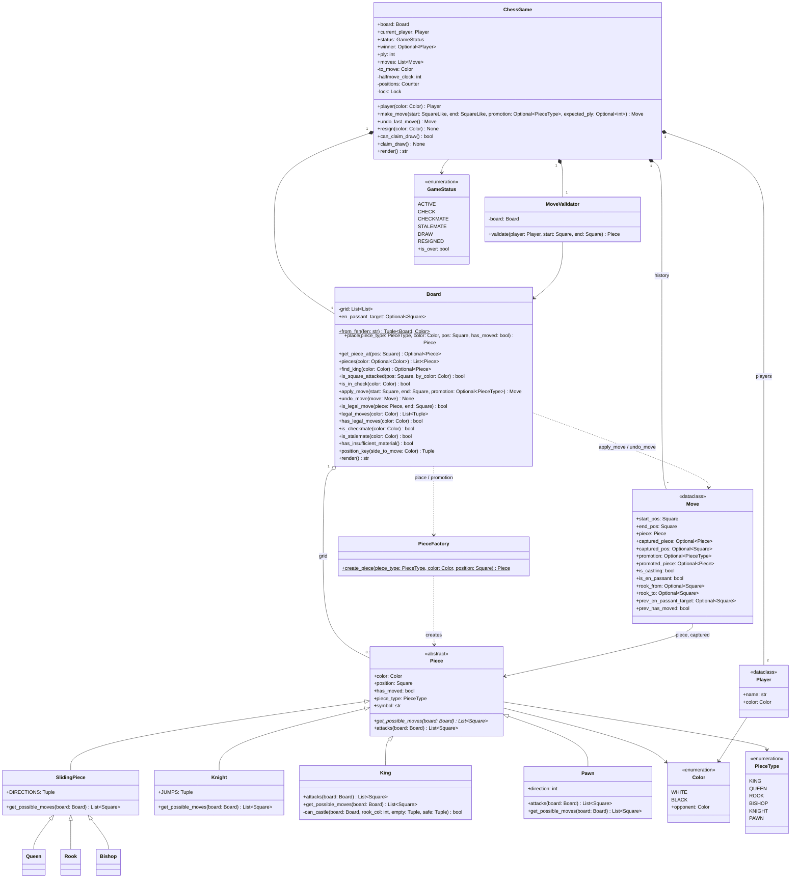

# 🧠 Chess Game LLD — Thought Process Guide

> **Goal:** Learn *how* to think when designing a Low-Level Design.

---

## 📊 Class Diagram



---

## Phase 0: Requirements Gathering

Chess rules are fixed, so the clarifying questions are about **scope**, not rules:

| Question | Why it matters | Typical answer |
|----------|----------------|----------------|
| Full rules, or basic moves only? | Castling / en passant / promotion are 30% of the code and most of the bugs | Full rules, but promotion can default to queen |
| Which endings? Checkmate, stalemate, draws? | Draw rules (repetition, 50-move) need extra state | Mate + stalemate; mention draws |
| Local two-player, vs AI, or online? | Online brings concurrency (duplicate submissions) and persistence | Local, "but design so it could go online" |
| Undo? | Decides whether moves must be fully reversible | Yes, usually asked as a follow-up |
| Clocks? | Time control is a separate subsystem | Out of scope unless asked |
| UI / input format? | Keep it out of the domain model | Squares like `"e2"` → `"e4"` |

## Phase 1: Identify the Nouns

> *"Two players play chess on an 8×8 board. Each piece type moves differently. The game ends in checkmate, stalemate, or draw."*

| Noun | Decision | Why |
|------|----------|-----|
| Piece | ABC | 6 piece types with different move rules |
| King/Queen/Rook/Bishop/Knight/Pawn | Regular | Each implements `get_possible_moves()` |
| Board | Regular | Manages 8×8 grid, piece positions |
| Move | `@dataclass` | Record of one applied move, with everything needed to undo it |
| Player | frozen `@dataclass` | Identity (name + color) |
| MoveValidator | Regular | Validates moves against chess rules |
| ChessGame | Facade | Orchestrates the game |
| Color | Enum | WHITE, BLACK |
| PieceType | Enum | KING, QUEEN, ROOK, BISHOP, KNIGHT, PAWN |
| GameStatus | Enum | ACTIVE, CHECK, CHECKMATE, STALEMATE, DRAW, RESIGNED |

## Phase 2: Enums First

```python
class Color(Enum):     WHITE, BLACK
class PieceType(Enum): KING, QUEEN, ROOK, BISHOP, KNIGHT, PAWN
class GameStatus(Enum): ACTIVE, CHECK, CHECKMATE, STALEMATE, DRAW, RESIGNED
```

## Phase 3: dataclass vs `__init__`

- **`Piece`**: ABC — abstract, subclasses implement move logic
- **`King`/`Queen`/`Rook`/`Bishop`/`Knight`/`Pawn`**: Regular — each has its own `get_possible_moves()`
- **`Board`**: Regular — complex 2D grid management
- **`Move`**: `@dataclass` — pure data, but it must capture *everything* needed to undo (captured piece and its square, rook hop, previous en-passant target, previous `has_moved`)
- **`Player`**: frozen `@dataclass` — simple identity, compared by value
- **`MoveValidator`**: Regular — validation logic
- **`ChessGame`**: Regular — orchestrates everything

## Phase 4: Assigning Responsibilities

| Action | Owner | Why |
|--------|-------|-----|
| Get possible moves | Each Piece subclass | Each piece knows its movement rules |
| Place/get piece | `Board.get_piece_at()` / `Board.place()` | Board owns the grid |
| Squares a piece attacks | `Piece.attacks()` | Differs from moves for pawns and castling |
| Execute move | `Board.apply_move()` | Board updates grid, handles castling rook / en passant / promotion, returns a `Move` |
| Check if in check | `Board.is_in_check()` | Board evaluates king safety |
| Check checkmate | `Board.is_checkmate()` | Board evaluates all legal moves |
| Validate move | `MoveValidator.validate()` | Checks piece color, move legality, check |
| Make a move | `ChessGame.make_move()` | Validates → executes → updates status |
| Undo a move | `Board.undo_move()` | Exact inverse of `apply_move`; powers legality checks and user undo |
| Draw rules | `ChessGame` | Needs history (repetition counts, half-move clock) the board doesn't keep |

## Phase 5: Piece Hierarchy (LSP in Action)

```python
class Piece(ABC):
    @abstractmethod
    def get_possible_moves(self, board) -> List[Tuple[int, int]]: pass

class Rook(Piece):    # Moves horizontally/vertically
class Bishop(Piece):  # Moves diagonally
class Queen(Piece):   # Moves like Rook + Bishop
class Knight(Piece):  # L-shaped jumps
class King(Piece):    # One square any direction + castling
class Pawn(Piece):    # Forward, capture diagonally, en passant
```

The Board doesn't care *what kind* of piece it is — it just calls `piece.get_possible_moves(board)`. This is Textbook LSP.

## Phase 6: Factory Pattern for Pieces

```python
class PieceFactory:
    _piece_map = {
        PieceType.KING: King, PieceType.QUEEN: Queen,
        PieceType.ROOK: Rook, PieceType.BISHOP: Bishop,
        PieceType.KNIGHT: Knight, PieceType.PAWN: Pawn,
    }
    @classmethod
    def create_piece(cls, piece_type, color, position):
        return cls._piece_map[piece_type](color, position)
```

## Phase 7: Move Validation (Legal vs Possible)

Critical distinction:
- **Possible moves:** What the piece can do ignoring check
- **Legal moves:** Possible moves that don't leave the king in check

`Board.is_legal_move()` applies the move, checks whether the mover's king is attacked, then undoes it. Pins and discovered checks need no special code.

**The recursion trap:** castling is illegal if the king passes through an attacked square. If "attacked" is computed from `get_possible_moves()`, and the enemy king's `get_possible_moves()` itself checks castling, you recurse. The fix is a separate `attacks()` method (no castling, pawn diagonals only) used by all check detection.

## Phase 8: Quick Checklist

✅ **LSP:** Every Piece subclass is substitutable for Piece
✅ **SRP:** Board owns grid, Piece owns moves, ChessGame owns flow
✅ **Factory:** Creating pieces is centralized
✅ **OCP:** New piece type → new subclass, no Board/Game changes
✅ **Encapsulation:** Board grid is private, accessed through methods
✅ **Reversibility:** `apply_move` followed by `undo_move` restores the board exactly (perft tests prove it)

---

## Phase 9: How to Run This in a 45–60 min Interview

| Time | Step | What you do | What you say out loud |
|------|------|-------------|-----------------------|
| 0–5 | **Clarify** | Agree scope from the Phase 0 table. Write it down. | *"Full rules including castling, en passant and promotion; checkmate and stalemate; undo as a stretch; local two-player but I'll keep the game object safe for online use."* |
| 5–12 | **Entities & interfaces** | Enums, `Piece` ABC with `get_possible_moves` and `attacks`, `Board`, `Move`, `ChessGame`. Signatures only. | *"Pieces know patterns, the board knows legality, the game knows turns and endings."* |
| 12–30 | **Core code** | Slider base class + knight + king + pawn; `apply_move` / `undo_move`; `is_in_check`; `is_legal_move` by make/unmake; checkmate = in check and no legal moves. | *"I'm generating pseudo-legal moves and filtering with make/unmake. Pins come for free."* |
| 30–42 | **Special moves** | Castling (rights, empty squares, not through check), en passant (target set only by a double push, valid for one ply), promotion (default queen). | *"These live in `apply_move` and the record is rich enough to undo them."* |
| 42–50 | **Concurrency / online** | Lock in `make_move`; `expected_ply` rejects stale or duplicated submissions. | *"Two clicks for the same turn must apply once. This is optimistic concurrency on the ply number."* |
| 50–60 | **Extension & tests** | Whatever they ask (undo, clocks, AI, draws). Name tests: scholar's mate, pinned piece, castling through check, en passant window, perft counts. | *"Perft against known counts is the standard way to prove a move generator."* |

**If you're running behind:** stub en passant and promotion with a comment and finish checkmate first. A working mate detector beats half-implemented special moves. Never skip the "leaves own king in check" filter; it is what interviewers test first.
