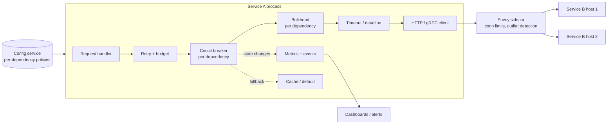

# 🏗️ Circuit Breaker — High-Level Design

> **Target Level:** Senior/Staff Engineer
>
> **Focus:** Resilience library for service-to-service calls: circuit breaking, retry budgets and jittered backoff, bulkheads and timeouts, and how they compare to Resilience4j and Envoy

---

## 1. SYSTEM OVERVIEW

**Purpose:** Keep a service healthy when its dependencies are slow or failing: fail fast instead of piling up waits, retry transient errors without amplifying load, and isolate one bad dependency from the rest.

**Users:** Service owners (library API / config), platform team (defaults, dashboards), on-call (state-change alerts, manual overrides).

**Scope:** An in-process library used by every service, plus org-wide configuration and telemetry. Mesh-level (Envoy) equivalents are discussed as the alternative / complement.

**Design targets:**

| Metric | Target |
|--------|--------|
| Overhead per call (CLOSED) | Sub-microsecond to low microseconds: one lock + O(1) window update |
| Time to trip | Within `minimum_calls` failed calls or one window, whichever is later |
| Fail-fast latency (OPEN) | No network I/O; microseconds |
| Retry amplification ceiling | ≤ ~1.1–1.2× of base traffic under a full outage (budget) |

---

## 2. HIGH-LEVEL ARCHITECTURE

Policies (thresholds, window, durations, retry limits) come from config with safe defaults and are hot-reloadable. Each dependency gets its own breaker, bulkhead and budget.

---

## 3. KEY COMPONENTS & INTERVIEW Q&A

### Circuit breaker (per dependency, per process)

**🔴 Interview Question:** *"Should breaker state be shared across all instances of a service, e.g. in Redis?"*

**✅ Answer:** Usually no.
1. Each instance observes the dependency through its own network path; local state reflects what that instance experiences.
2. Shared state puts a network call (and a new dependency that can itself fail) on every request.
3. With N instances, each tripping independently gives a fast, statistically similar decision anyway; the dependency sees load drop as instances trip.
4. The exception: very low traffic per instance, where no single instance reaches `minimum_calls`. Then use a time-based window, a smaller minimum, or move the decision to the mesh/load balancer, which sees aggregate traffic.

**🔴 Interview Question:** *"Per dependency or per host?"*

**✅ Answer:** Both, at different layers. A per-dependency breaker in the app answers "is service B usable?" and drives fallbacks. Per-host ejection (Envoy outlier detection, client-side load balancer health) removes one bad replica without failing the whole dependency. A per-dependency breaker alone will open the circuit for B when only 1 of 10 hosts is broken if traffic isn't host-aware.

### Retry with backoff, jitter and budget

**🔴 Interview Question:** *"Why jitter?"*

**✅ Answer:** Without jitter, clients that failed together retry together at `base`, `2·base`, `4·base`... and hit the server in synchronized waves. Full jitter (`uniform(0, cap)`) spreads them across the interval; AWS's analysis found it does the least total work for contended resources. Equal jitter keeps a minimum delay if you need one.

**🔴 Interview Question:** *"How do you stop retry storms org-wide?"*

**✅ Answer:**
- Retry at **one layer** (typically the caller nearest the failing dependency or the edge). Library default: inner layers don't retry.
- **Retry budgets** per downstream (gRPC token throttling or Envoy `retry_budget`): retries limited to a fraction of successful traffic, so amplification under total outage is bounded near 1×.
- **Deadline propagation**: pass the remaining deadline downstream (gRPC deadlines, `X-Request-Deadline` header). Don't start an attempt that can't finish in time.
- **Honour server push-back**: 429/503 with `Retry-After`; never retry 4xx.
- **Breaker inside retry**: an open breaker ends the loop.

### Idempotency (prerequisite for retries)

- Retries are enabled per operation and only for idempotent ones (GET/PUT/DELETE semantics or an idempotency key).
- Client: one idempotency key per **logical** operation, created before the retry loop, sent on every attempt.
- Server: store `key → (request hash, response)` in the same transaction as the side effect; TTL longer than the client's maximum retry horizon; concurrent duplicates serialized by a unique constraint; a repeated key with a different request body is a 422, not a replay.

### Bulkhead and timeout

- Semaphore bulkhead per dependency, sized by Little's law: `max_concurrent ≈ target RPS × p99 latency × headroom`. E.g. 200 RPS × 0.1 s × 2 = 40.
- Timeout per attempt below the caller's own deadline. Timeouts set from measured p99/p99.9, not guesses; retries + timeouts must fit inside the upstream SLA.

---

## 4. COMPARISON WITH PRODUCTION SYSTEMS

| | This library | Resilience4j | Hystrix | Envoy |
|---|---|---|---|---|
| Deployment | In-process (Python) | In-process (JVM) | In-process (JVM), maintenance mode since 2018 | Sidecar / edge proxy |
| Trip on | Failure rate, count/time window | Failure rate + slow-call rate, count/time window | Error % over rolling 10 s buckets | Concurrency limits ("circuit breakers"); outlier detection on consecutive 5xx / gateway failures / success-rate deviation |
| Half-open | N probes, all must succeed | N probes, rate-evaluated | One trial request | Host returns after ejection time (grows with each ejection) |
| Isolation | Semaphore bulkhead | Semaphore + thread-pool bulkhead | Thread pool per dependency | `max_connections`, `max_pending_requests`, `max_requests` per cluster |
| Retries | Retry + gRPC-style budget | Retry module | — | Retry policy + `retry_budget` |
| Knows app semantics | Yes (exception predicate, fallbacks) | Yes | Yes | No (status codes only) |

**Recommendation:** use both. The mesh gives uniform, language-agnostic connection limits and host ejection that every service gets for free. The in-process library handles what only the app knows: which errors count, fallbacks, idempotency-aware retries. Make sure the two layers don't **both** retry.

---

## 5. FAILURE MODES

| Failure | What happens | Mitigation |
|---------|--------------|------------|
| Dependency hard down | Breaker opens after `minimum_calls`; fail fast | Fallbacks; alert on OPEN |
| Dependency slow, not failing | Threads pile up before anything "fails" | Timeouts + bulkhead; slow-call-rate tripping |
| One bad host of many | Partial errors, maybe below threshold | Per-host outlier ejection in LB / mesh |
| Retry storm (metastable failure) | Load stays high after root cause is fixed | Budgets, single-layer retries, jitter, load shedding at the server |
| Flapping (open/close loop) | Bursts of errors every `open_duration` | Exponential `open_duration` on repeated trips; more probes |
| Hung probe | HALF_OPEN stuck | Timeout inside breaker; max wait in half-open |
| Misclassified errors (4xx counted) | One bad client opens the circuit for all | Exception predicate; count only transport/5xx/timeouts |
| Config mistake (threshold too low) | Unneeded outages | Safe defaults, config validation, canary config rollout, manual `reset()`/force-closed override |
| Thundering herd on recovery | All instances close at once | Jittered `open_duration`; limited probes; slow-start in LB |

---

## 6. OBSERVABILITY

- Metrics per breaker: state (gauge), calls by outcome (success / failure / ignored / not permitted), failure rate, slow-call rate, retries attempted / budget-exhausted, bulkhead saturation, timeout count.
- Events on every state transition (the listener hook) → logs + alert when OPEN lasts more than N minutes.
- Trace spans tag `retry.attempt`, `circuit.state`, so a slow trace shows it was the third attempt.

---

## 7. DEFAULTS WORTH STANDARDIZING

| Setting | Default | Reasoning |
|---------|---------|-----------|
| Failure-rate threshold | 50% | Resilience4j's default; clearly unhealthy |
| Window | Time-based, 10–60 s | Works at low and high RPS |
| Minimum calls | 10–20 | Avoid tripping on noise |
| Open duration | 10–30 s, jittered, growing on repeated trips | Give the dependency time; avoid synchronized recovery |
| Half-open probes | 3–10 | Enough signal without a flood |
| Max attempts | 2–3, idempotent operations only | Most transient errors clear in one retry |
| Backoff | Base 50–100 ms, cap 1–2 s, full jitter | Fit within the caller's deadline |
| Retry budget | ~10–20% of successful traffic | Bounds amplification |
