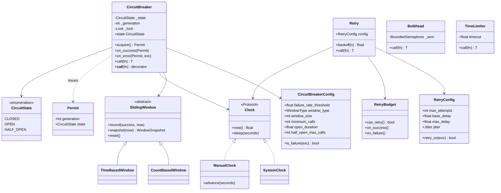
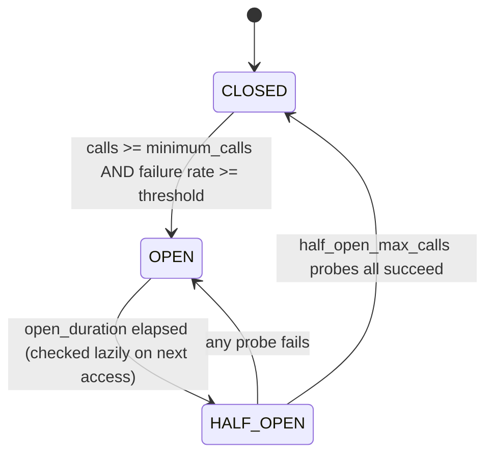

# 🧠 Circuit Breaker LLD — Thought Process Guide

> **Goal:** Design a small resilience library (circuit breaker, retry, bulkhead, timeout) whose state machine is correct under concurrency and testable without sleeping.

---

## 📊 Class Diagram





---

## ⏱️ How to run this in a 45–60 min interview

| Time | Step | What to say out loud |
|------|------|----------------------|
| 0–7 min | **Clarify** | "Failure *rate* over a sliding window, not consecutive failures. Which exceptions count? How many half-open probes? Library or sidecar? Thread-safe? I'll inject a clock so tests don't sleep." |
| 7–15 min | **Entities + state machine** | Draw the three-state diagram. Name `CircuitBreaker`, `CircuitBreakerConfig`, `SlidingWindow` (strategy), `Clock`. |
| 15–35 min | **Core code** | `CountBasedWindow` ring buffer, then `acquire` / `on_success` / `on_error` / `call`, then the decorator. Walk the state diagram with a `ManualClock`. |
| 35–45 min | **Concurrency** | One lock around state + window; check-and-reserve probes inside it; listeners outside it; the stale-result generation check. |
| 45–60 min | **Extension** | Retry with backoff + jitter, why retries need a budget and idempotency, bulkhead/timeout, composition order. |

If short on time: skip `TimeBasedWindow` and the bulkhead and describe them. The state machine and its thread-safety are what get graded.

---

## Phase 0: Clarifying questions worth asking

1. **Trip condition?** Consecutive failures (simple, noisy) or failure rate over a window (what Resilience4j does)? Choose rate, with a minimum number of calls so 2 failures out of 2 don't trip it.
2. **Window: count or time?** Count-based (last N calls) is predictable at steady load. Time-based (last N seconds) behaves better when traffic is bursty or low.
3. **What is a failure?** Timeouts and connection errors, yes. A `400 Bad Request` or a validation error is the caller's fault and must not open the circuit for everyone.
4. **Half-open policy?** How many probes, and do they all have to succeed?
5. **Scope:** one breaker per downstream dependency (or per host), per process. Shared state across instances is rarely worth it (see HLD).
6. **Retries in scope?** Then idempotency and retry budgets are in scope too.
7. **Sync or async?** This design is for threads; asyncio would swap the lock and the timeout mechanism, not the state machine.

## Phase 1: Identify the nouns

> *"Calls to a dependency go through a breaker. It watches recent outcomes; when too many fail it opens and fails fast, then lets a few probes through to test recovery."*

| Noun | Decision | Why |
|------|----------|-----|
| CircuitState, WindowType, Jitter | Enum | Closed sets |
| CircuitBreakerConfig, RetryConfig | Frozen dataclass | Validated, immutable config |
| SlidingWindow | ABC (Strategy) | Count- vs time-based is a swap, not an `if` |
| Clock | Protocol | Inject `ManualClock` in tests; `time.monotonic` in prod |
| CircuitBreaker | Class | Owns state machine + lock |
| Permit | Frozen dataclass | Ties an outcome to the generation that admitted it |
| Retry, RetryBudget | Class | Separate concern; composes around the breaker |
| Bulkhead, TimeLimiter | Class | Isolation and bounded waiting |
| CallNotPermittedError, BulkheadFullError, CallTimeoutError | Exceptions | Distinct, so retry logic can tell them apart |

## Phase 2: The window, O(1)

`CountBasedWindow`: ring buffer of the last N booleans and running `total` / `failures`. On record: subtract the evicted slot, add the new one. Snapshot is O(1).

`TimeBasedWindow`: N one-second buckets indexed by `second % N`, each stamped with the absolute second it holds. A bucket with an old stamp is recycled on write and ignored on read. Memory is O(N) regardless of call rate.

## Phase 3: The state machine, under one lock

```python
def acquire(self) -> Permit:
    with self._lock:
        self._maybe_half_open()             # lazy OPEN -> HALF_OPEN, no timer thread
        if CLOSED: return Permit(gen)
        if HALF_OPEN and probes_issued < max: probes_issued += 1; return Permit(gen)
        raise CallNotPermittedError(retry_after)
```

Three details that separate a correct answer from a plausible one:

1. **Check-and-reserve atomically.** "Is a probe slot free?" and "take it" happen in one critical section, so 50 threads arriving at the moment the breaker turns half-open can't all become probes.
2. **Generations.** Every transition bumps `_generation`. A slow call admitted while CLOSED that fails after the breaker went OPEN → HALF_OPEN carries the old generation and is ignored. Otherwise a stale failure would re-open a breaker whose probes are succeeding.
3. **Release on ignored exceptions.** If a probe raises something that doesn't count as a failure (`ValueError`), its slot must be released, or HALF_OPEN starves.

Listeners are called **after** releasing the lock: a slow logging/metrics callback must not block every caller of the dependency.

## Phase 4: Assign responsibilities

| Action | Owner | Why |
|--------|-------|-----|
| What counts as failure | `CircuitBreakerConfig.is_failure` | Policy, not mechanism |
| Rate math | `SlidingWindow.snapshot` | Breaker doesn't care how outcomes are stored |
| Admit / reject | `CircuitBreaker.acquire` | One place for the state check |
| Time | `Clock` | Determinism in tests |
| How long to wait between attempts | `Retry.backoff` | Pure function of attempt + jitter |
| Whether retrying is allowed at all | `RetryBudget` | System-level protection, shared across calls |
| Concurrency cap | `Bulkhead` | One slow dependency can't eat every thread |
| Waiting cap | `TimeLimiter` | Converts hangs into failures the breaker can count |

## Phase 5: Composition

`Retry( CircuitBreaker( Bulkhead( TimeLimiter( fn ) ) ) )`

- Retry outermost: every attempt passes through the breaker, so attempts are counted and an open circuit stops the retry loop immediately (`CallNotPermittedError` is not retryable).
- TimeLimiter innermost: a timeout becomes a `CallTimeoutError`, which the breaker records as a failure.
- Bulkhead inside the breaker: a full bulkhead is *local* overload, not proof the dependency is down, so the default `is_failure` ignores `BulkheadFullError` (and releases the probe slot if it happens in HALF_OPEN). Some teams do want sustained saturation to trip the breaker; that's one config predicate away. Say this trade-off out loud.

## Phase 6: Quick checklist

✅ Failure **rate** with a minimum-calls guard, count- or time-based window
✅ OPEN fails fast with `retry_after`; lazy transition to HALF_OPEN
✅ Exactly `half_open_max_calls` probes, reserved atomically
✅ Stale outcomes ignored via generation; ignored exceptions release probe slots
✅ `monotonic` clock, injected; tests never sleep for state transitions
✅ Retry: capped exponential backoff, jitter, retryable-exception predicate, budget
✅ Decorators preserve `__name__` / `__doc__` (`functools.wraps`)
