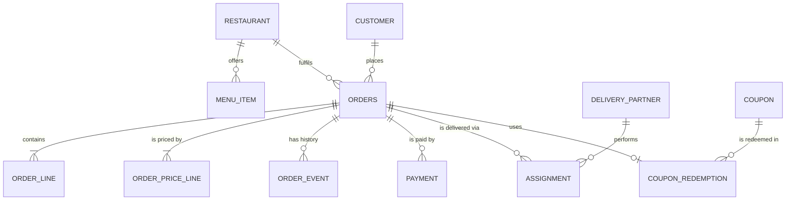

# 🗄️ Food Delivery — Database Schema

> PostgreSQL. Money is `NUMERIC(12,2)`, never `FLOAT`. Times are `TIMESTAMPTZ`.

---

## Entity overview



---

## Catalogue

```sql
CREATE TABLE restaurant (
    restaurant_id   BIGSERIAL PRIMARY KEY,
    name            TEXT NOT NULL,
    lat             DOUBLE PRECISION NOT NULL,
    lng             DOUBLE PRECISION NOT NULL,
    h3_cell         TEXT NOT NULL,                 -- for "restaurants near me" and dispatch sharding
    packaging_fee   NUMERIC(12,2) NOT NULL DEFAULT 0,
    is_open         BOOLEAN NOT NULL DEFAULT TRUE,
    updated_at      TIMESTAMPTZ NOT NULL DEFAULT now()
);
CREATE INDEX idx_restaurant_cell ON restaurant (h3_cell) WHERE is_open;

CREATE TABLE menu_item (
    item_id         BIGSERIAL PRIMARY KEY,
    restaurant_id   BIGINT NOT NULL REFERENCES restaurant,
    name            TEXT NOT NULL,
    price           NUMERIC(12,2) NOT NULL CHECK (price > 0),
    available       BOOLEAN NOT NULL DEFAULT TRUE,
    updated_at      TIMESTAMPTZ NOT NULL DEFAULT now()
);
CREATE INDEX idx_menu_restaurant ON menu_item (restaurant_id);
```

## Orders

```sql
CREATE TYPE order_status AS ENUM (
  'PENDING_PAYMENT','PAYMENT_FAILED','PLACED','ACCEPTED','PREPARING','READY',
  'PICKED_UP','DELIVERED','CANCELLED','REJECTED');

CREATE TABLE orders (
    order_id         BIGINT PRIMARY KEY,           -- snowflake-style, shard key
    customer_id      BIGINT NOT NULL,
    restaurant_id    BIGINT NOT NULL,
    status           order_status NOT NULL,
    version          INT NOT NULL DEFAULT 0,       -- optimistic CAS for transitions
    partner_id       BIGINT,
    total            NUMERIC(12,2) NOT NULL CHECK (total >= 0),
    currency         CHAR(3) NOT NULL DEFAULT 'INR',
    idempotency_key  TEXT NOT NULL,
    request_hash     BYTEA NOT NULL,               -- fingerprint to detect key reuse with a different body
    quote_id         TEXT,                          -- the surge/price quote the customer accepted
    created_at       TIMESTAMPTZ NOT NULL DEFAULT now(),
    updated_at       TIMESTAMPTZ NOT NULL DEFAULT now(),
    UNIQUE (customer_id, idempotency_key)
);
CREATE INDEX idx_orders_customer ON orders (customer_id, created_at DESC);
CREATE INDEX idx_orders_restaurant_active ON orders (restaurant_id, created_at)
    WHERE status IN ('PLACED','ACCEPTED','PREPARING','READY');
CREATE INDEX idx_orders_stuck ON orders (status, updated_at)
    WHERE status NOT IN ('DELIVERED','CANCELLED','REJECTED','PAYMENT_FAILED');

-- Snapshot of what was bought; never joins back to menu_item for price.
CREATE TABLE order_line (
    order_id     BIGINT NOT NULL REFERENCES orders,
    line_no      SMALLINT NOT NULL,
    item_id      BIGINT NOT NULL,
    name         TEXT NOT NULL,
    unit_price   NUMERIC(12,2) NOT NULL,
    qty          INT NOT NULL CHECK (qty > 0),
    PRIMARY KEY (order_id, line_no)
);

-- The receipt: one row per PricingRule output (ITEMS, DELIVERY, SURGE, COUPON, TAX ...).
CREATE TABLE order_price_line (
    order_id     BIGINT NOT NULL REFERENCES orders,
    code         TEXT NOT NULL,
    amount       NUMERIC(12,2) NOT NULL,            -- negative for discounts
    PRIMARY KEY (order_id, code)
);

-- Append-only history; also the source for the outbox relay.
CREATE TABLE order_event (
    order_id     BIGINT NOT NULL REFERENCES orders,
    seq          INT NOT NULL,
    old_status   order_status,
    new_status   order_status NOT NULL,
    actor        TEXT NOT NULL,                     -- CUSTOMER / RESTAURANT / PARTNER / SYSTEM
    actor_id     BIGINT,
    created_at   TIMESTAMPTZ NOT NULL DEFAULT now(),
    published_at TIMESTAMPTZ,                       -- NULL until the outbox relay ships it
    PRIMARY KEY (order_id, seq)
);
CREATE INDEX idx_order_event_unpublished ON order_event (created_at) WHERE published_at IS NULL;
```

### The transition, atomically

```sql
BEGIN;
UPDATE orders
   SET status = 'PREPARING', version = version + 1, updated_at = now()
 WHERE order_id = $1 AND status = 'ACCEPTED' AND version = $2;
-- 0 rows → someone else moved it (or a cancel won): re-read and report InvalidTransition
INSERT INTO order_event (order_id, seq, old_status, new_status, actor, actor_id)
VALUES ($1, $2 + 1, 'ACCEPTED', 'PREPARING', 'RESTAURANT', $3);
COMMIT;
```

The actor-permission check stays in application code (it's the `TRANSITIONS` table); the `WHERE status = ... AND version = ...` clause is what makes it race-free. `seq = version` keeps event ordering and the CAS in one number.

## Payments

```sql
CREATE TABLE payment (
    payment_id       BIGSERIAL PRIMARY KEY,
    order_id         BIGINT NOT NULL REFERENCES orders,
    psp_ref          TEXT UNIQUE,
    kind             TEXT NOT NULL CHECK (kind IN ('AUTH','CAPTURE','VOID','REFUND')),
    amount           NUMERIC(12,2) NOT NULL,
    status           TEXT NOT NULL CHECK (status IN ('PENDING','SUCCEEDED','FAILED')),
    idempotency_key  TEXT NOT NULL UNIQUE,         -- e.g. order_id:REFUND:1 (one refund per reason)
    created_at       TIMESTAMPTZ NOT NULL DEFAULT now()
);
CREATE INDEX idx_payment_order ON payment (order_id);
```

## Delivery

```sql
CREATE TABLE delivery_partner (
    partner_id    BIGSERIAL PRIMARY KEY,
    name          TEXT NOT NULL,
    vehicle       TEXT NOT NULL,
    rating        NUMERIC(3,2),
    is_active     BOOLEAN NOT NULL DEFAULT TRUE
);
-- Live state (online, location, current batch) is NOT here: it lives in the dispatch
-- shard / Redis and changes every few seconds.

CREATE TABLE assignment (
    assignment_id BIGSERIAL PRIMARY KEY,
    order_id      BIGINT NOT NULL REFERENCES orders,
    partner_id    BIGINT NOT NULL REFERENCES delivery_partner,
    status        TEXT NOT NULL CHECK (status IN ('OFFERED','ACCEPTED','DECLINED','EXPIRED','UNASSIGNED','COMPLETED')),
    offered_at    TIMESTAMPTZ NOT NULL DEFAULT now(),
    responded_at  TIMESTAMPTZ
);
-- At most one live assignment per order.
CREATE UNIQUE INDEX uq_assignment_live ON assignment (order_id)
    WHERE status IN ('OFFERED','ACCEPTED');
CREATE INDEX idx_assignment_partner ON assignment (partner_id, offered_at DESC);
```

## Coupons

```sql
CREATE TABLE coupon (
    code            TEXT PRIMARY KEY,
    kind            TEXT NOT NULL CHECK (kind IN ('PERCENT','FLAT')),
    value           NUMERIC(12,2) NOT NULL,
    min_subtotal    NUMERIC(12,2) NOT NULL DEFAULT 0,
    max_discount    NUMERIC(12,2),
    per_user_limit  INT NOT NULL DEFAULT 1,
    valid_from      TIMESTAMPTZ NOT NULL,
    valid_to        TIMESTAMPTZ NOT NULL
);

CREATE TABLE coupon_redemption (
    code         TEXT NOT NULL REFERENCES coupon,
    customer_id  BIGINT NOT NULL,
    order_id     BIGINT NOT NULL UNIQUE REFERENCES orders,
    redeemed_at  TIMESTAMPTZ NOT NULL DEFAULT now()
);
CREATE INDEX idx_redemption_user ON coupon_redemption (code, customer_id);
```

For `per_user_limit = 1`, a `UNIQUE (code, customer_id)` index is the simplest race-free enforcement. For higher limits, count under `SELECT ... FOR UPDATE` on a per-(code, customer) counter row. On cancellation, delete the redemption in the same transaction as the status change so the coupon can be reused.

---

## Sharding notes

- `orders`, `order_line`, `order_price_line`, `order_event`, `payment`, `assignment` all share `order_id` as the shard key, so every transition is a single-shard transaction.
- "My orders" by customer is a cross-shard query; serve it from a read model keyed by `customer_id`, built from `order_event`.
- The unique `(customer_id, idempotency_key)` constraint must live on one shard: either route placement by `customer_id` (and derive `order_id` to embed the shard), or keep a small idempotency table sharded by `customer_id`.
