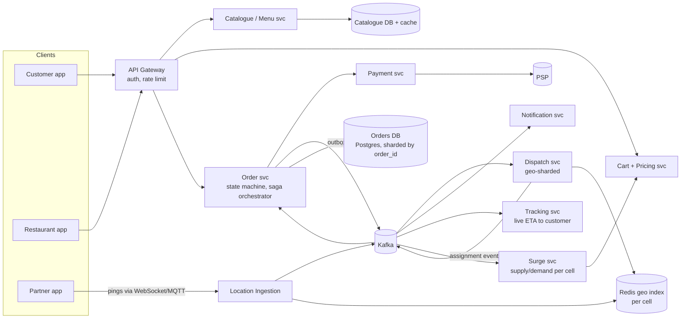
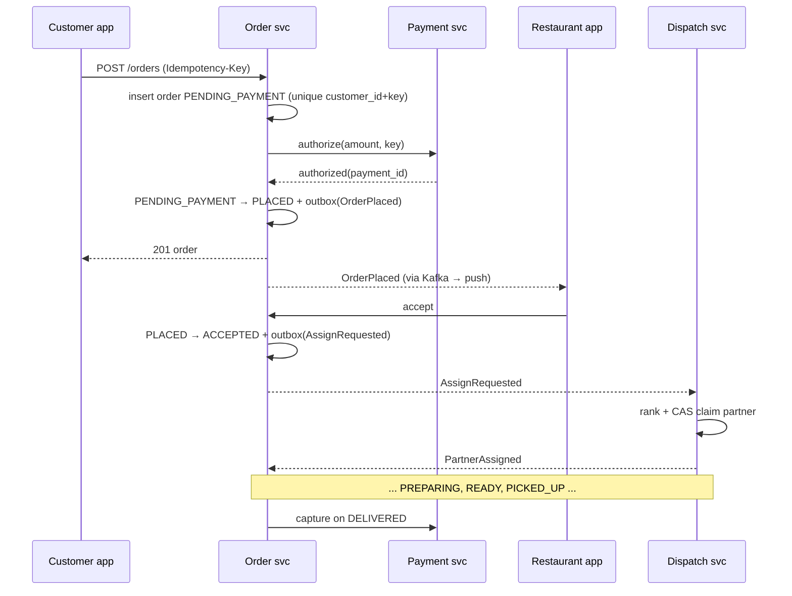

# 🍔 Food Delivery Platform — High-Level Design

> **Focus:** Order lifecycle as a saga across payment, order and dispatch; real-time partner location ingestion; geo-sharded dispatch; peak-hour surge

---

## 1. Scope and numbers

**Functional:** browse restaurants/menus, cart, checkout, pay, restaurant accept/prepare, partner assignment and tracking, notifications, cancellations/refunds.

**Back-of-envelope (large Indian metro-scale platform):**

| Quantity | Estimate | Derivation |
|---|---|---|
| Orders/day | 3 M | |
| Peak hour share | ~15% of the day | dinner peak 8–9 pm |
| Peak order rate | ~125/s average in the peak hour, ~400/s bursts | 450 k / 3600 s; ×3 for minute-level spikes |
| Online partners at peak | 300 k | |
| Location pings | **75 k writes/s** | 300 k partners / 4 s interval |
| Ping payload | ~100 B → ~7.5 MB/s ingress | |
| Order status events | ~3 M × 8 transitions ≈ 24 M/day, ~1.2 k/s at peak | |
| Menu reads | 100:1 read/write; served from cache/CDN | |

The interesting load is location ingestion and dispatch, not order writes.

---

## 2. Architecture

### Order service vs dispatch service

| | Order service | Dispatch service |
|---|---|---|
| Owns | Order state machine, line snapshot, price, payment refs | Partner state (available / assigned / batch), offers, assignment |
| Consistency | Strong per order (row lock or version CAS) | Strong per partner (CAS on partner record) |
| Partitioning | By `order_id` (or customer) | By **geo cell** (H3 res ~7–8 / city zone); one leader per cell |
| Latency budget | p99 < 300 ms for placement | Assignment within ~10–30 s of accept; each attempt < 100 ms |
| Scales with | Order rate | Partner density × order rate per cell |

They are split because they change at different rates, scale on different keys, and dispatch needs an in-memory view of partners that would be wrong to couple to the order DB. They talk through events plus a small number of commands (`AssignRequested`, `PartnerAssigned`, `AssignmentFailed`, `UnassignRequested`).

---

## 3. Location ingestion

- Partner app sends a ping every 3–5 s while online (faster when on an active trip), over a long-lived connection to a stateless ingestion fleet.
- Ingestion validates (speed sanity check, drop pings older than the last accepted timestamp), then:
  1. **Hot path:** updates the partner's position in the geo index for its cell (Redis `GEOADD` or an in-memory H3 bucket map in the dispatch shard), with `last_seen`.
  2. **Stream:** publishes to Kafka `partner-locations` keyed by `partner_id` (per-partner ordering) for tracking, ETA models and history (cold store: S3/Parquet).
- Liveness: a partner is "online" only if `now - last_seen < 30 s`; dispatch filters stale entries, and a sweeper marks them offline.
- Cell handover: when a partner crosses a cell boundary, ingestion writes to the new cell and deletes from the old; dispatch queries the target cell plus k-ring neighbours (H3 `gridDisk`) so boundary partners aren't missed.
- 75 k writes/s is comfortable for a sharded Redis (a single node handles ~100 k simple ops/s); shard by cell so a city's hot cells spread across nodes.

---

## 4. The placement saga (payment + order + dispatch)

No distributed transaction: each step is a local transaction plus an event, with compensations. The **order service orchestrates** (orchestration beats choreography here because the business wants one place that knows an order's state).

| Step fails | Compensation |
|---|---|
| Authorization declined | Order → `PAYMENT_FAILED` (terminal); nothing else ran |
| Restaurant rejects / times out | `REJECTED`; **void** the authorization (no money moved) |
| Customer cancels before prep | `CANCELLED`; void or refund per policy; `UnassignRequested` to dispatch |
| No partner within N minutes | Keep retrying with widening radius and incentives; after SLA, ops decides: cancel + refund, or restaurant self-delivery |
| Partner drops before pickup | Unassign + re-dispatch excluding them |
| Crash between steps | The outbox and idempotent consumers make every step safely re-drivable; a reconciler scans orders stuck in a state longer than its SLA |

**Authorize then capture** (rather than charging up front, as the LLD does for simplicity) makes the commonest compensation, rejection, a void instead of a refund: faster for the customer, no fees. UPI-style instant payments don't support auth/capture well, so for those the compensation is a refund.

**Idempotency everywhere:** the client key dedups placement; the order id dedups payment calls; consumers dedup on `(order_id, seq)`. The transactional outbox guarantees "state changed ⇔ event published" without 2PC.

---

## 5. Dispatch at scale

- **Single writer per cell.** Each dispatch shard owns a set of cells and holds partner state in memory, so the assignment CAS is a local operation; durability via a log (Kafka compacted topic of partner state) to rebuild on failover. Cross-cell candidates (k-ring) require a claim RPC to the neighbouring shard, which uses the same CAS.
- **Alternative:** stateless dispatchers + Redis; the claim is a Lua script `if HGET p state == AVAILABLE then HSET ... end`. Simpler ops, one more network hop per attempt, and hot cells contend on Redis.
- **Greedy vs batched matching.** Greedy per order (the LLD) is simple and low-latency. At peak, collecting orders for a few seconds per cell and solving an assignment problem (Hungarian / min-cost flow over ETA) gives materially better global ETAs and enables batching. Most large platforms use the windowed approach.
- **Offer, not assign.** A partner gets an offer with a ~15–30 s timeout; decline/timeout releases the claim and moves to the next candidate. Track acceptance rate as a ranking feature.
- **Assign timing.** Dispatch so that partner arrival ≈ food-ready time (predicted prep time). Assigning too early wastes partner time at the restaurant; too late lets food go cold.

---

## 6. Peak-hour surge

- The surge service consumes order and location streams and computes, per cell per minute, demand (open orders awaiting assignment, checkout sessions) vs supply (idle partners, predicted to free up soon).
- Output is a **delivery-fee multiplier** with a cap and hysteresis (don't flap every minute), published to the pricing service's cache. The multiplier used is stamped on the quote, and the quote has an id + expiry so the customer is charged what they saw.
- Other levers, usually cheaper than raising fees: partner incentives in hot cells, widening search radius, temporarily hiding far-away restaurants or increasing their displayed ETA, throttling new orders from a restaurant whose kitchen queue is long.
- Platform protection at peak: rate-limit at the gateway, shed non-critical work (recommendations) first, pre-scale on predictable peaks (Friday dinner, cricket finals).

---

## 7. Data and consistency choices

| Data | Store | Consistency |
|---|---|---|
| Orders, order events | Postgres sharded by `order_id` (see DB_SCHEMA.md) | Strong per order; status CAS via `version` column |
| Idempotency keys | Same DB as orders, unique `(customer_id, key)`, 24 h TTL | Strong |
| Partner live state | Dispatch shard memory / Redis | Strong per partner (CAS); rebuilt from log |
| Partner location history | Kafka → object storage | Eventual, analytics only |
| Menus | Postgres + Redis/CDN cache | Eventual (seconds); price re-validated at placement |
| Customer order history views | Read model built from events | Eventual |

---

## 8. Failure modes

| Failure | Effect | Mitigation |
|---|---|---|
| Dispatch shard dies | Cell can't assign | Standby takes over from the compacted log within seconds; orders retry `AssignRequested` |
| Kafka lag | Notifications/assignments delayed | Alert on consumer lag; assignment path can be a direct RPC with the event as the audit trail |
| PSP timeout | Unknown payment outcome | Retry with the same key; reconcile with PSP webhooks; never create a second auth |
| Duplicate events | Double notifications, double refunds | Consumers dedup on `(order_id, seq)`; refunds keyed on `payment_id` |
| GPS spoofing / stale pings | Bad assignments | Speed checks, liveness TTL, server-side ETA validation |
| Restaurant tablet offline | Orders never accepted | Auto-reject timer + IVR call fallback; mark restaurant temporarily closed after N misses |
| Thundering herd at peak | Latency spikes | Gateway rate limits, queue placement behind a token bucket per city, autoscale |

---

## 9. What I'd monitor

Placement success rate and p99; time-to-accept; time-to-assign (p50/p95 per cell); assignment retries per order; partner utilisation; orders stuck per state beyond SLA; surge multiplier per cell; refund rate by reason; outbox lag.
