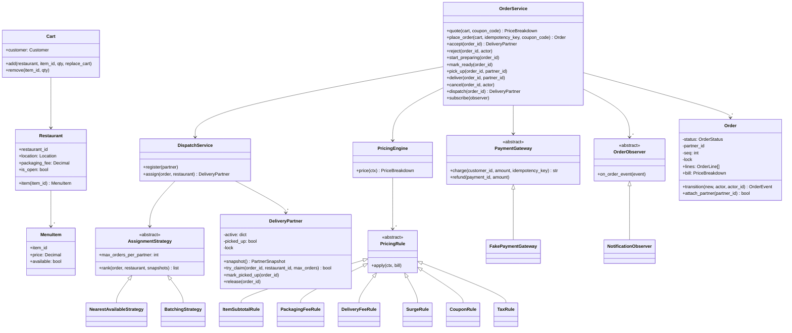
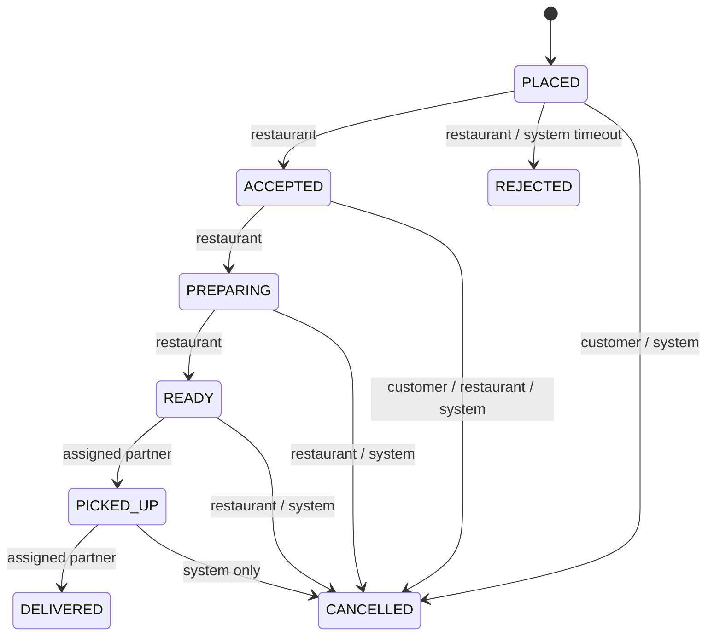

# 🧠 Food Delivery (Swiggy / Zomato / DoorDash) LLD — Thought Process Guide

> **Goal:** Reason your way to a design that survives the three things interviewers push on here: duplicate orders, illegal state changes, and two orders grabbing the same delivery partner.

---

## 📊 Class Diagram

---

## ⏱️ How to run this in a 45–60 min interview

| Minutes | Do | Say out loud |
|---|---|---|
| 0–7 | **Clarify** (questions below). Write the state machine on the board first. | "The state machine and who may drive each edge is the spine; everything else hangs off it." |
| 7–15 | **Entities + interfaces**: `Restaurant/MenuItem`, `Cart`, `Order`, `DeliveryPartner`, and the three seams: `AssignmentStrategy`, `PricingRule`, `OrderObserver` (+ `PaymentGateway` port). | "I'll keep pricing, dispatch and notifications behind interfaces because each is a known change axis." |
| 15–35 | **Core code**: transition table + `Order.transition`, `place_order` with idempotency, `PricingEngine` with 3–4 rules, `NearestAvailableStrategy`. | "Money is `Decimal`, quantised per line. Orders snapshot item prices." |
| 35–45 | **Concurrency**: per-order lock for transitions; per-partner `try_claim` compare-and-set; idempotency slot; cancel-vs-dispatch race via `attach_partner`. | "Strategy ranks from a snapshot; the claim re-validates. Stale reads cost a retry, never a double-assign." |
| 45–55 | **Extension** the interviewer picks: batching, surge, auto-reject timeout, reassignment when a partner goes offline. | "Batching is a new strategy plus a capacity argument to the claim; nothing else changes." |
| 55–60 | Tests you'd write, and what changes when this becomes services (see HLD). | |

### Clarifying questions worth asking

- One restaurant per cart? (Yes, nearly universal: one kitchen, one pickup.)
- Prepaid only, or COD too? (Changes whether payment precedes `PLACED`.)
- Who can cancel, until when, and with what refund? (Drives the actor rules.)
- When is a partner assigned: on placement, on accept, or near "ready"? (Here: on accept, so travel overlaps cooking.)
- Can a partner carry several orders? Same restaurant only? (Batching.)
- Is surge on delivery fee only, or on food too? (Delivery only here; surging food price is a regulatory/PR problem.)
- Scale for the LLD: single process, in-memory, but thread-safe? (Yes.)

---

## Phase 1: Identify the nouns

> *"Customers browse restaurants, fill a cart, place an order; the restaurant accepts and cooks; a delivery partner picks it up and delivers. Customers get notified at each step."*

| Noun | Decision | Why |
|------|----------|-----|
| Restaurant, MenuItem | Classes | Catalogue; `MenuItem.available` toggles stock-outs |
| Customer, Location | Frozen dataclasses | Value objects |
| Cart | Class | Enforces the single-restaurant invariant |
| OrderLine | Frozen dataclass | **Snapshot** of name and price at order time |
| Order | Class with a lock | Owns its status, partner and event sequence |
| OrderStatus, Actor | Enums | The vocabulary of the state machine |
| TRANSITIONS | Data, not code | `(from, to) -> allowed actors`; reviewing policy = reading a table |
| PricingRule / PricingEngine | ABC + pipeline | Fees, surge, coupons and tax change independently |
| DeliveryPartner | Class with a lock | Owns its capacity; the only place a claim happens |
| AssignmentStrategy | ABC | Nearest, batching, ML-scored: swappable |
| PaymentGateway | ABC (port) | Real PSP in production, fake in tests |
| OrderObserver | ABC | Push, SMS, analytics subscribe without touching the order flow |
| OrderService | Facade | Orchestrates; holds no business rules that belong to the entities |

## Phase 2: The state machine first

Why these cancel rules: once the kitchen is cooking, a customer cancellation wastes food the platform or restaurant pays for, so the customer loses the button (support can still cancel as `SYSTEM`, with a partial refund policy). Partners never cancel orders; they *unassign*, and the order is re-dispatched.

Encoding it as a dict means `transition()` is three checks under a lock: edge exists, actor allowed, and (for partners) it is *the* assigned partner.

## Phase 3: Money

- `Decimal` everywhere; `money()` refuses `float` so `money(0.1)` fails loudly.
- Quantise each line (half-up) and sum the quantised lines, so the receipt adds up to the total exactly.
- Rule order matters and is explicit: items → packaging → delivery → surge (reads delivery) → coupon (reads items) → tax (on items after discount). A coupon can never exceed the food subtotal; the total is floored at zero.

## Phase 4: Idempotent placement

The client generates the key when the checkout screen opens and resends it on every retry. The server scopes it per customer and stores a fingerprint of the request:

- same key, same body → return the original order (no second charge);
- same key, different body → `IdempotencyConflictError` (client bug);
- concurrent duplicates → the first caller owns an in-flight slot, others wait on its `Event`;
- the first attempt fails (payment declined) → slot removed, so the same key can be retried.

The payment call reuses the key, so even a crash between charge and order insert is safe against a PSP that dedups on it.

## Phase 5: Dispatch without double-assignment

1. Take `snapshot()` of every partner (each under that partner's own lock).
2. `strategy.rank(...)` returns partner ids, best first. Pure function, easy to unit-test.
3. For each id: `partner.try_claim(order_id, restaurant_id, max_orders)`, a compare-and-set that re-checks online / capacity / same-restaurant / not-yet-picked-up.
4. `order.attach_partner(pid)` under the order lock; if the order was cancelled meanwhile, release the claim.

No global lock, and two dispatchers can never hold the same partner beyond capacity. In production step 3 is a conditional update (`UPDATE partners SET ... WHERE id=? AND status='AVAILABLE'`) or a Redis Lua script.

## Phase 6: Notifications

`OrderService._move` performs the transition, then (after the order lock is released) releases the partner, refunds if needed, and publishes an `OrderEvent` to observers. Each event carries a per-order `seq`, so a consumer receiving events out of order (likely once this is Kafka) can drop stale ones. A failing observer is swallowed so notification problems never fail an order.

## Phase 7: Quick checklist

✅ State machine as data, with per-actor permissions
✅ Idempotent placement, including concurrent duplicates and retry after failure
✅ `Decimal` money, explicit rule order, receipt sums exactly
✅ Strategy ranks, partner claims (CAS); cancel-vs-dispatch race closed
✅ Observer decoupled, ordered by `seq`, failure-isolated
✅ Deterministic demo, unit tests including concurrency
