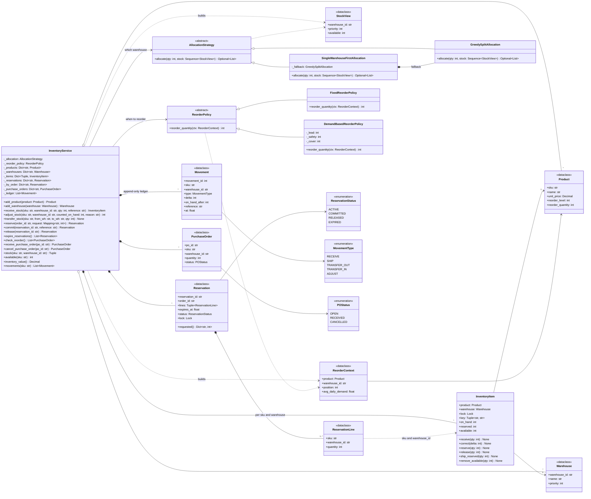

# 🧠 Inventory Management LLD — Thought Process Guide

> **Goal:** Learn *how* to think when designing a Low-Level Design. The heart of this problem is not CRUD on products: it is **never promising the same unit twice** while orders, cancellations, transfers and restocks happen concurrently across warehouses.

---

## 📊 Class Diagram



---

## ⏱️ How to run this in a 45–60 min interview

| Time | Step | What to say out loud |
|------|------|----------------------|
| 0–7 min | **Clarify** | "Is this the stock ledger behind an e-commerce checkout, or a warehouse management system with bins and pick paths? I'll assume the former: reserve at checkout, commit on payment/shipment." Ask the questions below and write the answers down. |
| 7–15 min | **Entities and interfaces** | Draw `Product`, `Warehouse`, `InventoryItem(on_hand, reserved)`, `Reservation`, `Movement`. State the invariant `0 <= reserved <= on_hand` and that `available` is derived. Name the two extension points: `AllocationStrategy`, `ReorderPolicy`. |
| 15–35 min | **Core code** | `InventoryItem` mutators first (receive / reserve / release / ship_reserved), then `InventoryService.reserve` → `commit` → `release`. Make failure explicit with typed exceptions. Run one happy path. |
| 35–45 min | **Concurrency** | "Two buyers, one unit left." Show that the availability check and the decrement happen under the same lock. Multi-line orders: lock all candidate items in sorted order (deadlock-free), plan, then mutate (all-or-nothing). TTL + sweeper for abandoned carts; commit re-checks TTL. |
| 45–60 min | **Extension** | Whatever they add: split shipments, nearest warehouse, reorder with lead time, idempotent retries, transfers. Point at the interface it plugs into before writing code. Close with how this maps to SQL (`UPDATE ... WHERE on_hand - reserved >= :q`). |

### Clarifying questions worth asking

1. **When is stock decremented: at add-to-cart, checkout, payment, or shipment?** This decides whether you need reservations at all. (Answer that leads to the interesting design: reserve at checkout, commit at payment/shipment.)
2. **Can one order be split across warehouses?** Changes allocation from "find one" to "plan a split".
3. **Is an order all-or-nothing, or can lines be backordered?**
4. **How long can a reservation be held?** → TTL and an expiry sweeper.
5. **Can clients retry?** → idempotency key (order id).
6. **Is overselling ever acceptable?** Some retailers deliberately oversell a little and backorder; most treat it as a bug. Assume never.
7. **Do we need an audit trail / valuation?** → append-only movement ledger, `Decimal` money.
8. **Scale and concurrency:** single process with threads, or many service instances? (In-memory locks for the LLD; the DB conditional update in production.)

---

## Phase 1: Identify the Nouns

> *"A company stocks products in several warehouses. Customers place orders; stock is held at checkout and shipped after payment. When stock runs low, a purchase order is raised."*

| Noun | Decision | Why |
|------|----------|-----|
| `Product` | frozen dataclass | Catalog data: sku, name, `Decimal` price, reorder level/quantity |
| `Warehouse` | frozen dataclass | id, name, `priority` used by allocation |
| `InventoryItem` | class with a lock | Product **at** a warehouse: `on_hand`, `reserved`, derived `available` |
| `Reservation` | dataclass with status + lock | The promise to an order: lines, TTL, state machine |
| `ReservationLine` | frozen dataclass | (sku, warehouse, qty): a reservation can span warehouses |
| `Movement` | frozen dataclass | Immutable ledger row for every physical on-hand change |
| `PurchaseOrder` | dataclass | Replenishment: OPEN → RECEIVED / CANCELLED |
| `AllocationStrategy` | ABC | Which warehouse(s) fill a line |
| `ReorderPolicy` | ABC | When and how much to reorder |
| `InventoryService` | facade | Owns locks, registries, the ledger; every operation goes through it |

## Phase 2: Enums

```python
class MovementType(Enum):       RECEIVE, SHIP, TRANSFER_OUT, TRANSFER_IN, ADJUST
class ReservationStatus(Enum):  ACTIVE, COMMITTED, RELEASED, EXPIRED
class POStatus(Enum):           OPEN, RECEIVED, CANCELLED
```

Reserving does not create a `Movement`: nothing physical moved. Keeping the ledger to physical changes means `sum(delta) == on_hand` for every item, which is the audit property you want.

## Phase 3: The three quantities

```
on_hand   = what is physically on the shelf
reserved  = promised to orders not yet shipped
available = on_hand - reserved        (derived, never stored)
```

| Operation | on_hand | reserved | Guard |
|-----------|---------|----------|-------|
| receive | +q | | q > 0 |
| reserve | | +q | q <= available |
| release / expire | | −q | q <= reserved |
| commit (ship) | −q | −q | q <= reserved |
| transfer out / write-off | −q | | q <= available |

Every row keeps `0 <= reserved <= on_hand`. Say this table out loud; it is the whole design.

## Phase 4: Assigning responsibilities

| Action | Owner | Why |
|--------|-------|-----|
| Guarded arithmetic on one item | `InventoryItem` | The item enforces its own invariant; callers hold its lock |
| Choosing warehouses | `AllocationStrategy` | Pure function of a `StockView` snapshot, easy to swap and test |
| Locking, all-or-nothing, idempotency, TTL | `InventoryService` | Cross-item coordination belongs above the item |
| Reorder decision | `ReorderPolicy` | Gets inventory *position* (available + on order) and demand |

## Phase 5: Concurrency, the part that gets you the hire

1. **Single item:** check and decrement under one lock. `if available >= q: reserved += q` outside a lock is the classic oversell.
2. **Many items:** lock every candidate item in sorted `(sku, warehouse)` order, plan, then mutate. Sorted order means no deadlock; planning before mutating means no rollback.
3. **State transitions:** each `Reservation` has its own lock, so commit, release and the expiry sweeper serialise per reservation and exactly one wins.
4. **Duplicates:** idempotency on `order_id` plus an in-flight set, so a retry storm reserves once.

## Phase 6: Strategy for allocation and reorder

```python
class AllocationStrategy(ABC):
    def allocate(self, qty, stock: Sequence[StockView]) -> list[(warehouse_id, qty)] | None

class ReorderPolicy(ABC):
    def reorder_quantity(self, ctx: ReorderContext) -> int   # 0 = don't reorder
```

The service never changes when the business moves from "one shipment if possible" to "nearest warehouse", or from a fixed reorder point to a demand-based one.

## Phase 7: Quick checklist

✅ Invariant `0 <= reserved <= on_hand` stated and enforced in one class
✅ Reserve ≠ commit; reservations have identity, TTL and a state machine
✅ Check-and-act under the same lock; multi-item locks in a global order
✅ All-or-nothing multi-line orders without compensation
✅ Idempotent reserve / commit / release
✅ Ledger of physical movements; `Decimal` money
✅ Reorder on position (available + on order), so no duplicate POs
✅ Tests include a contention test that proves no overselling
