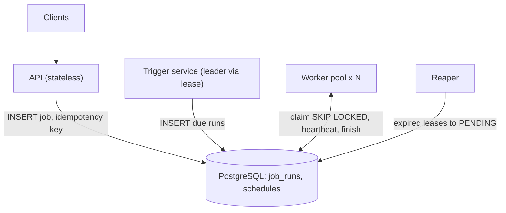
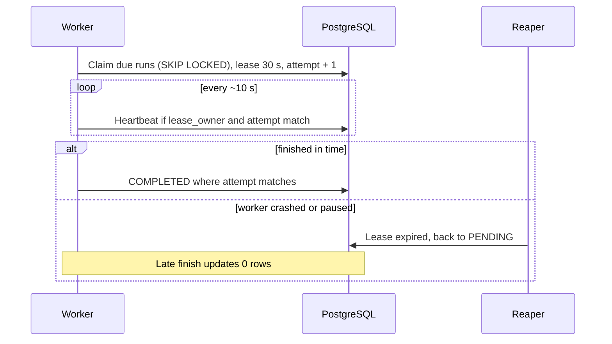
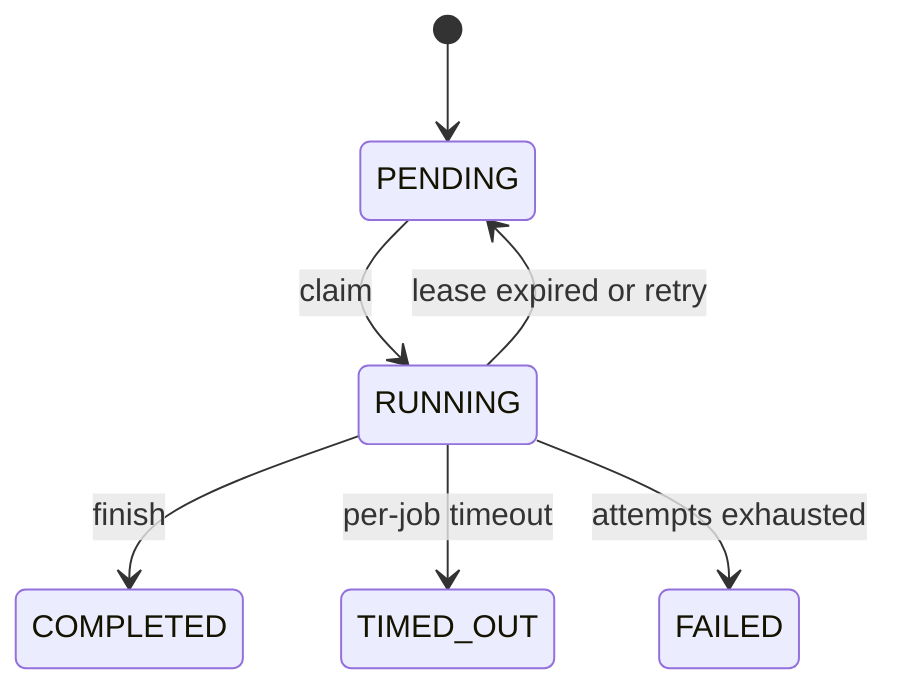

# 🏗️ Job Scheduling System — High-Level Design

> **Target Level:** Senior/Staff Engineer  
> **Core topics:** execution models and the GIL, durable queues, leases and fencing, at-least-once execution, recurring triggers, failure modes

---

## 1. SYSTEM OVERVIEW

**Purpose:** run one-shot, delayed, recurring and dependent jobs reliably across a fleet of workers, with priorities, timeouts and retries.

**Capacity assumptions (state these, then size from them):**

| Quantity | Value | Derived |
|----------|-------|---------|
| Jobs per day | 50M | ≈ 580/s average |
| Peak factor | 10× (top-of-hour cron spikes) | ≈ 6K dispatches/s at peak |
| Median run time | 2 s | Little's law: ≈ 12K jobs in flight at peak |
| Job row size | ~1 KB (definition) + ~0.5 KB per attempt | ≈ 75 GB/day of attempt history → keep 30 days hot, archive the rest |

Two things follow. First, ~12K concurrent jobs at 2 s each is a few hundred worker processes, not a big fleet. Second, **top-of-the-hour cron spikes** dominate peak load, so spread recurring fires (`fire_time + hash(job_id) % 60 s`) unless a job truly needs the exact minute.

**Execution models on a worker:**

| Model | Type | Best For | GIL Impact |
|-------|------|----------|------------|
| **ASYNC** | Cooperative (event loop) | I/O written with `await` | One thread; a blocking call stalls all jobs on that loop |
| **THREAD** | Preemptive (OS threads) | Blocking I/O libraries | Threads share the GIL; CPU-bound Python gets ~no speedup |
| **PROCESS** | Separate interpreters | CPU-bound work | One GIL per process → real parallelism |

---

## 2. ARCHITECTURE

### 2.1 The LLD (one process)

The code in [CODE.md](CODE.md) is the single-node core: an asyncio loop owns two heaps (`_ready` keyed by the strategy, `_delayed` keyed by `run_at`), N worker coroutines, a ticker for recurring jobs, and a `JobExecutor` that routes work to the loop, a thread pool or a process pool. All state lives in memory, so a crash loses the queue: **at-most-once**.

### 2.2 Distributed

```
            ┌──────────────────────────┐
 clients ──▶│ API (stateless)          │── INSERT job (idempotency key) ──┐
            └──────────────────────────┘                                  │
                                                                          ▼
 ┌────────────────────────┐   INSERT due runs     ┌─────────────────────────────────┐
 │ Trigger service        │──────────────────────▶│ PostgreSQL                      │
 │ (leader via lease)     │  UNIQUE(schedule,     │  job_definitions, schedules     │
 │ cron/interval → runs   │         fire_time)    │  job_runs (status, run_at,      │
 └────────────────────────┘                       │   lease_owner, lease_until,     │
                                                  │   attempt)                      │
 ┌────────────────────────┐   claim (SKIP LOCKED) │                                 │
 │ Worker pool × N        │◀─────────────────────▶│                                 │
 │  asyncio loop +        │   heartbeat / finish  └─────────────────────────────────┘
 │  thread / process pools│                                   ▲
 └────────────────────────┘                                   │ expired leases → PENDING
                                                  ┌───────────┴──────────┐
                                                  │ Reaper (any instance)│
                                                  └──────────────────────┘
```

- **API** validates and inserts. A client-supplied idempotency key with a unique index makes retried submits safe.
- **Trigger service** turns schedules into concrete `job_runs` rows. One active leader (a lease row, etcd or ZooKeeper). Correctness doesn't depend on the leader being unique, because `UNIQUE(schedule_id, fire_time)` turns a duplicate fire into a no-op insert.
- **Workers** claim runs, execute them with the LLD's executor, heartbeat, and write the outcome.
- **Reaper** returns runs whose lease has expired to `PENDING` (or to `FAILED` if attempts are exhausted).

At 6K dispatches/s, Postgres with `SKIP LOCKED` and a partial index on `(priority, run_at) WHERE status='PENDING'` is fine. Beyond ~10–20K/s, or with many priority classes, move the hot queue to Redis sorted sets or Kafka partitions and keep Postgres as the system of record.

*Figure: stateless API, leader trigger service, worker pool and reaper around PostgreSQL.*



### 🎬 Animated Sequence Diagram

<p align="center">
  <video controls width="900" style="border-radius: 12px; box-shadow: 0 4px 24px rgba(0,0,0,0.3);" loop playsinline preload="metadata">
    <source src="../../../assets/videos/job-scheduling-sequence.mp4" type="video/mp4" />
    Your browser does not support the video tag.
  </video>
  <br/>
  <em>🎬 Animated Job Scheduling Sequence — Submit → Queue → Schedule → Execute → Complete. Click ▶ to play/pause. Created with <a href="https://remotion.dev">Remotion</a>.</em>
</p>

---

## 3. CLAIMING WORK: LEASES AND FENCING

```sql
-- Claim up to 10 due runs. SKIP LOCKED lets many workers poll without blocking each other.
WITH picked AS (
    SELECT id FROM job_runs
    WHERE status = 'PENDING' AND run_at <= now()
    ORDER BY priority DESC, run_at
    LIMIT 10
    FOR UPDATE SKIP LOCKED
)
UPDATE job_runs r
SET status = 'RUNNING', lease_owner = $worker, lease_until = now() + interval '30 seconds',
    attempt = attempt + 1, started_at = now()
FROM picked WHERE r.id = picked.id
RETURNING r.id, r.attempt;
```

- **Heartbeat** every ~10 s extends `lease_until`, but only `WHERE lease_owner = $worker AND attempt = $attempt`.
- **Finish** is conditional too: `UPDATE … SET status='COMPLETED' WHERE id=$id AND attempt=$attempt`. If 0 rows change, this worker lost its lease (GC pause, partition) and a newer attempt owns the run. Its result is discarded.
- **`attempt` is the fencing token.** Pass it to downstream side effects (e.g. as part of the idempotency key, or a conditional write) so a zombie worker can't overwrite the newer attempt's effects.

**Delivery guarantee:** at-least-once *execution*. A worker can finish the work and crash before writing `COMPLETED`, and the reaper will re-run it. Exactly-once *effects* come from idempotent jobs: an idempotency key per run (not per attempt), upserts, or a transactional outbox.

*Figure: lease-based claim; attempt is the fencing token for conditional heartbeat and finish.*



---

## 4. FAILURE MODES

| Failure | Detection | Handling |
|---------|-----------|----------|
| Worker crashes mid-job | Lease expires | Reaper → `PENDING`, `attempt` increments on the next claim; job must be idempotent |
| Worker alive but partitioned / long GC pause | Heartbeat fails, lease expires | New attempt runs; the old worker's conditional `finish` updates 0 rows; fencing token blocks its side effects |
| Job hangs | Per-job timeout on the worker | Mark `TIMED_OUT` / retry. Threads can't be killed, so long or untrusted work runs as a subprocess the worker can `kill()` |
| Job crashes its process (segfault, OOM) | Process pool raises `BrokenProcessPool` | Recreate the pool, fail that attempt, retry with backoff; quarantine after N crashes |
| Poison job (fails every time) | `attempt > max_retries` | `FAILED` + dead-letter view + alert; never retry forever |
| Trigger leader dies | Leader lease expires | New leader resumes from `schedules.next_fire_time`; missed fires coalesced (or backfilled if `catchup=true`) |
| Duplicate trigger (two leaders briefly) | — | `UNIQUE(schedule_id, fire_time)` makes the second insert a no-op |
| Downstream outage (all jobs fail together) | Error-rate spike | Backoff with full jitter + per-dependency circuit breaker + retry budget, so the recovery isn't a thundering herd |
| DB primary failover | Connection errors | Workers retry claims with backoff; in-flight leases survive because they're time-based |
| Thundering cron (`0 * * * *`) | Dispatch-lag spike at :00 | Spread fires with a per-job offset; autoscale workers on schedule lag |

*Figure: job run lifecycle implied by claim, lease expiry and retry limits.*



---

## 5. DATA MODEL

```sql
CREATE TABLE job_definitions (
    id                UUID PRIMARY KEY,
    name              TEXT NOT NULL,
    handler           TEXT NOT NULL,                 -- which code to run
    execution_model   TEXT NOT NULL DEFAULT 'async', -- async | thread | process
    priority          SMALLINT NOT NULL DEFAULT 1,
    timeout_seconds   INT NOT NULL DEFAULT 300,
    max_retries       INT NOT NULL DEFAULT 3,
    created_at        TIMESTAMPTZ NOT NULL DEFAULT now()
);

CREATE TABLE schedules (
    id              UUID PRIMARY KEY,
    job_id          UUID NOT NULL REFERENCES job_definitions(id),
    cron            TEXT,                -- or interval_seconds
    interval_seconds INT,
    timezone        TEXT NOT NULL DEFAULT 'UTC',
    next_fire_time  TIMESTAMPTZ NOT NULL,
    allow_overlap   BOOLEAN NOT NULL DEFAULT false,
    catchup         BOOLEAN NOT NULL DEFAULT false,
    active          BOOLEAN NOT NULL DEFAULT true
);

CREATE TABLE job_runs (
    id               BIGSERIAL PRIMARY KEY,
    job_id           UUID NOT NULL REFERENCES job_definitions(id),
    schedule_id      UUID REFERENCES schedules(id),
    fire_time        TIMESTAMPTZ,                     -- logical time for recurring runs
    idempotency_key  TEXT,
    status           TEXT NOT NULL,                   -- pending, running, retry_wait, completed, failed, timed_out, cancelled
    priority         SMALLINT NOT NULL,
    run_at           TIMESTAMPTZ NOT NULL,            -- earliest start (delay / backoff)
    attempt          INT NOT NULL DEFAULT 0,          -- also the fencing token
    lease_owner      TEXT,
    lease_until      TIMESTAMPTZ,
    started_at       TIMESTAMPTZ,
    finished_at      TIMESTAMPTZ,
    last_error       TEXT,
    UNIQUE (schedule_id, fire_time),
    UNIQUE (idempotency_key)
);

CREATE TABLE job_run_deps (                            -- DAG edges
    run_id      BIGINT REFERENCES job_runs(id),
    depends_on  BIGINT REFERENCES job_runs(id),
    PRIMARY KEY (run_id, depends_on)
);

-- Dispatch: only pending rows, in claim order. Stays small because finished rows drop out.
CREATE INDEX idx_runs_dispatch ON job_runs (priority DESC, run_at) WHERE status = 'PENDING';
-- Reaper
CREATE INDEX idx_runs_lease ON job_runs (lease_until) WHERE status = 'RUNNING';
```

Postgres `UNIQUE` treats NULLs as distinct, so one-shot runs (no `schedule_id`) don't collide on `(schedule_id, fire_time)`. Partition `job_runs` by `finished_at` month so retention is `DROP PARTITION`, not a huge `DELETE`.

---

## 6. CONSISTENCY CHOICES

| Question | Choice | Why |
|----------|--------|-----|
| Source of truth for run state | Postgres row, conditional updates | Claims and finishes need compare-and-set; a DB gives it with no extra system |
| Queue in Redis too? | Only past ~10–20K dispatches/s | Two stores means reconciliation: Redis is a cache of "what's due", Postgres decides |
| Status updates from workers | Conditional on `(id, attempt)` | A stale worker can never move a run backwards |
| Dependencies | Released in the same transaction that marks the upstream `COMPLETED` | Otherwise a crash between the two leaves dependents blocked forever |
| Cancellation | Set `cancel_requested`; worker sees it on heartbeat | Workers poll; there's no push channel to a specific worker |

---

## 7. MONITORING

| Metric | What it reveals |
|--------|----------------|
| **Schedule lag** (`started_at − run_at`), p50/p99 | The SLO metric. Rising lag = under-provisioned workers or a hot queue |
| Pending depth by priority | Backlog; starvation of low priority |
| Runs by terminal status, per job | Error rate; poison jobs |
| Attempts per completed run | Flakiness of dependencies |
| Lease expiries / reaper re-queues | Worker crashes or GC pauses |
| Worker loop lag (time a `call_soon` callback waits) | A job blocking the event loop |
| Pool saturation (busy threads / processes) | Leaked slots from timed-out thread jobs |

---

## 8. TRADE-OFF ANALYSIS

| Decision | Option A | Option B | Choice |
|----------|----------|----------|--------|
| Worker execution | asyncio + pools in one process | One job per subprocess/container | A for short trusted jobs; B for long, untrusted or resource-heavy jobs (killable, isolated) |
| Queue | Postgres `SKIP LOCKED` | Redis ZSET / Kafka | Postgres until ~10–20K/s: one store, transactional with job state |
| Delivery | At-most-once | At-least-once + idempotent jobs | At-least-once; losing jobs silently is worse than running twice |
| Recurring after downtime | Coalesce | Backfill every missed fire | Coalesce by default; backfill opt-in per schedule (needs `fire_time` passed to the job) |
| Overlap of recurring runs | Skip | Allow | Skip by default; most periodic jobs aren't written to run concurrently with themselves |
| Priority vs fairness | Strict priority | Aging / weighted fair share | Aging in-process; per-tenant fair share at fleet scale |
