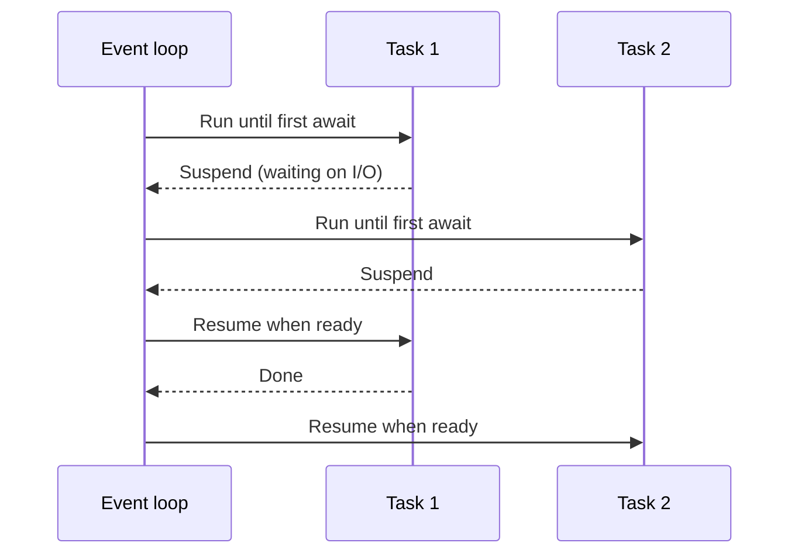
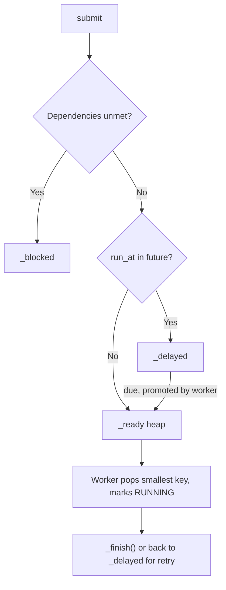

# Job Scheduling System — Interview Questions & Answers

> **Target Level:** Senior/Staff Engineer (6+ years)  
> **Evaluation Focus:** asyncio semantics, GIL, choosing an execution model, correctness under concurrency, failure handling, extensibility

---

## Question 1: Async/Await Fundamentals

**Interviewer:** *"Explain how async/await works in Python. What happens at each `await`?"*

### 🎯 Expected Answer

```python
async def fetch(url):
    print("start")               # runs synchronously until the first await
    data = await http_get(url)   # suspends this coroutine; the loop runs others
    return data                  # resumes when the awaited future completes

async def main():
    t1 = asyncio.create_task(fetch("/1"))   # scheduled now, starts at the next loop turn
    t2 = asyncio.create_task(fetch("/2"))
    await asyncio.gather(t1, t2)            # both interleave on ONE thread
```

1. Calling an `async def` returns a coroutine object; nothing runs until it is awaited or wrapped in a task.
2. `await` on something not yet ready suspends the coroutine and returns control to the event loop. Awaiting something already done does **not** yield.
3. The loop runs one callback at a time on one thread: concurrency, not parallelism.
4. **Races still exist in asyncio**, but only across `await` points. `if x not in d: await something(); d[x] = ...` is a check-then-act race. In this design `_take_next()` has no `await`, so it is atomic with respect to other coroutines.

*Figure: an await suspends the coroutine and hands control back to the event loop.*



---

## Question 2: GIL — Threads vs Processes

**Interviewer:** *"How does the GIL affect your scheduler? When do you use threads vs processes?"*

### 🎯 Expected Answer

- The GIL lets one thread execute Python bytecode at a time per interpreter. It is released during blocking I/O, `time.sleep`, and by C extensions that opt in (NumPy, hashlib on large buffers, zlib).
- **Threads + I/O-bound work:** good. Threads overlap their waits.
- **Threads + CPU-bound pure Python:** about the same wall time as running sequentially (often slightly worse from GIL hand-offs). Not "4x slower", just no speedup.
- **Processes + CPU-bound:** near-linear speedup up to the core count, minus pickling and start-up cost.
- Python 3.13 ships an optional free-threaded build (PEP 703) without the GIL. It isn't the default, and many C extensions aren't ready for it yet. Mention it, don't design around it.

In this code the choice is the job's base class: `AsyncJob` → event loop, `BlockingJob` → thread pool, `CpuBoundJob` → process pool.

---

## Question 3: Race Conditions

**Interviewer:** *"Where could your scheduler have a race? How did you avoid it?"*

### 🎯 Expected Answer

The classic lost update with threads:

```python
temp = self.count      # thread A reads 50
                       # switch: thread B reads 50, writes 51
self.count = temp + 1  # thread A writes 51: one increment lost
```

`count += 1` is several bytecodes (load, add, store), and CPython can switch threads between any two of them. How often you *see* the loss depends on the interpreter version and the switch interval (`sys.getswitchinterval()`, 5 ms by default). A demo can show zero losses on one run and thousands on the next. Never use "it passed" as proof of thread safety.

**Where this design could race and why it doesn't:**

| Risk | Why it's safe |
|------|---------------|
| Two workers take the same job | `_take_next()` pops and marks RUNNING with no `await` in between |
| Lost wakeup (worker sleeps while work is queued) | `clear()` happens with no `await` after the empty check; `set()` wakes every waiter |
| Producer on another thread mutates the heap | `submit_threadsafe` uses `call_soon_threadsafe`; only the loop thread touches state |
| A thread job mutates scheduler state | It can't: `run_sync` only returns a value; the loop thread records it |

---

## Question 4: Deadlock

**Interviewer:** *"Can your scheduler deadlock?"*

### 🎯 Expected Answer

Deadlock needs all four Coffman conditions: mutual exclusion, hold-and-wait, no preemption, circular wait. This scheduler holds **no locks** at all on its own state, so there is no lock cycle to form.

Things that *do* hang an asyncio program, and that's what interviewers are probing for:

- **Awaiting yourself or a cycle of futures:** task A awaits B's result while B awaits A's.
- **Blocking the loop:** a `time.sleep()` or CPU loop inside an `AsyncJob` freezes every worker, the ticker and timeouts. That isn't a deadlock, but it looks like one.
- **Re-acquiring a non-reentrant lock:** `asyncio.Lock` and `threading.Lock` are not reentrant. A coroutine that holds the lock and awaits code that acquires it again waits forever.
- **Pool exhaustion:** thread jobs that block waiting for other thread jobs in the same bounded pool.

Note that `task.cancel()` does not run the target's `finally` block synchronously. It only schedules a `CancelledError` for the target's next resumption. So cancelling tasks while holding a lock they also want does not deadlock by itself: the cancelled task waits for the lock like anyone else.

---

## Question 5: Producer-Consumer

**Interviewer:** *"Walk me through how a job gets from `submit()` to a worker."*

### 🎯 Expected Answer

1. `submit()` stamps `seq`, `submitted_at`, `run_at` and routes the job: `_blocked` if dependencies are unmet, `_delayed` if `run_at` is in the future, otherwise the `_ready` heap. Then it sets `_work_available`.
2. A waiting worker wakes, promotes any due `_delayed` entries, pops the smallest key, marks it RUNNING.
3. The worker awaits the attempt; the outcome goes through `_finish()` or back to `_delayed` for a retry.

Why not `asyncio.Queue`? It's FIFO only, so priority would only apply within whatever batch you sorted before putting. (`asyncio.PriorityQueue` would work for static priority, but not for delayed retries or dependencies.) Also, `asyncio.Queue` is **not thread-safe**. Only the loop thread may call `put`/`get`; other threads must go through `call_soon_threadsafe` or `run_coroutine_threadsafe`.

*Figure: where submit() routes a job, and how a worker takes it.*



---

## Question 6: Graceful Shutdown

**Interviewer:** *"How do you shut down without losing or corrupting work?"*

### 🎯 Expected Answer

```python
async def stop(self, *, cancel_running=False):
    self._stopping = True                 # 1. reject new submits
    if cancel_running:
        for job_id in list(self._attempts):
            self.cancel(job_id)           # 2. optional: cancel in-flight attempts
    self._work_available.set()            # 3. wake idle workers so they see _stopping
    self._ticker_wakeup.set()
    await asyncio.gather(*self._tasks, return_exceptions=True)   # 4. workers exit
    self._executor.shutdown()             # 5. pools: wait=False, cancel_futures=True
```

- Workers are **not** cancelled. They notice `_stopping` and return after the current job, so no job is left half-recorded.
- `CancelledError` is a normal exception at an `await` point. Code **can** catch and swallow it, and if it does, the task keeps running. Always re-raise unless you mean to absorb the cancellation, as `_run_attempt` does deliberately for a job-level cancel.
- In-process, queued jobs are lost when the process exits. With a durable store they stay `PENDING` and the next instance picks them up. With a lease, `RUNNING` jobs from a crashed instance get re-run, so jobs must be idempotent.

---

## Question 7: Semaphore vs Lock vs Worker Count

**Interviewer:** *"How do you limit concurrency? Why not a semaphore?"*

### 🎯 Expected Answer

| Primitive | Meaning | Use here |
|-----------|---------|----------|
| `Lock` | 1 holder: protect an invariant | Not needed: single-thread ownership |
| `Semaphore(n)` | n holders: cap concurrent use of a resource | Per-resource caps, e.g. "max 2 PROCESS jobs" or "max 5 calls to the payments API" |
| `BoundedSemaphore(n)` | Same, but `release()` past n raises | Catches double-release bugs; prefer it |
| N worker tasks | Global cap on jobs in flight | What this design uses |

A semaphore that's bigger than the worker count never binds; the old version of this code had exactly that (3 workers, `Semaphore(4)`).

---

## Question 8: Starvation and Aging

**Interviewer:** *"Low-priority jobs never run. Fix it."*

### 🎯 Expected Answer

```python
class AgingPriorityStrategy(SchedulingStrategy):
    def key(self, job):
        return (-(job.priority - self._age_rate * job.submitted_at), job.seq)
```

- Effective priority is `priority + age_rate × wait_time`. With `age_rate = 0.1`/s, a LOW (0) job waiting 10 s equals a fresh MEDIUM (1); after 20 s it beats a fresh HIGH (2).
- The trick that keeps it O(log n): every waiting job ages at the same rate, so the ordering between two jobs never changes over time. Sort by `priority − rate × submitted_at` once, at enqueue.
- Bounded wait: a job submitted at `t₀` with priority `p` is behind at most the jobs whose key is smaller, which is a finite set once `t` passes `t₀ + (CRITICAL − p) / rate`.
- Alternatives worth naming: weighted fair queuing per tenant/queue, and a reserved share (e.g. 1 in 10 dispatches from the low queue).

---

## Question 9: Retries, Backoff and Jitter

**Interviewer:** *"How do you retry without making an outage worse?"*

### 🎯 Expected Answer

```python
cap   = min(max_delay, base_delay * 2 ** (attempt - 1))
delay = rng.uniform(0, cap) if jitter else cap        # full jitter
```

| Failed attempt | Cap (base 1 s) | Full-jitter delay |
|----------------|----------------|-------------------|
| 1 | 1 s | 0–1 s |
| 2 | 2 s | 0–2 s |
| 3 | 4 s | 0–4 s |
| 7 | 64 s → capped at `max_delay` | 0–`max_delay` |

- **Jitter** spreads retries from jobs that failed together, so they don't come back as a synchronized wave.
- **Classify errors:** `NonRetryableError` (bad input, 4xx) fails at once. Timeouts and connection errors retry.
- **Retry budget:** at fleet scale, also cap retries as a fraction of traffic (e.g. ≤ 10%), or a circuit breaker on the dependency, because per-job backoff alone still multiplies load during an outage.
- **Idempotency:** a retry after a timeout may repeat work that actually succeeded. Use an idempotency key per job, not per attempt.

---

## Question 10: ThreadPoolExecutor vs ProcessPoolExecutor

| Criterion | ThreadPoolExecutor | ProcessPoolExecutor |
|-----------|-------------------|-------------------|
| GIL | Shared | One per process |
| Data in/out | Shared memory (needs care) | Pickled both ways; lambdas and open handles can't be sent |
| Start-up | Cheap | A new interpreter per worker (`spawn` on macOS/Windows re-imports your module, so the `if __name__ == "__main__"` guard is required) |
| Failure isolation | An exception is captured in the future; a segfault in a C extension kills the whole process | A crashed worker raises `BrokenProcessPool` and the pool is unusable until recreated |
| Kill a running task | Impossible | Not via the executor API; use a raw subprocess you can `kill()` |
| Use for | Blocking I/O libraries | CPU-bound pure Python |

---

## 🔁 Follow-ups Interviewers Actually Push On

### "Now add dependencies: job C runs after A and B."

`submit(c, depends_on=[a, b])` puts C in `_blocked = {a, b}` and records it in `_dependents[a]`, `_dependents[b]`. In `_finish(a)`, if A completed, remove A from C's unmet set and enqueue C when the set is empty. If A failed, timed out or was cancelled, cascade `CANCELLED` to C and, recursively, C's dependents. Because dependencies must already exist at submit time, **a cycle can't be built**. If the API allowed forward references, you'd run a DFS/Kahn's check on submit.

### "A recurring job takes longer than its interval. What happens?"

Decide and say it: skip (`allow_overlap=False`, the default here; counted in `skipped`), queue one, or allow overlap. Also: **fixed-rate** (`next_run += interval`) doesn't drift, while **fixed-delay** (`next = finish + interval`) does by design. After downtime, coalesce missed fires into one run (what `advance()` does) or backfill each one (Airflow's `catchup=True`); backfilling needs a "logical date" passed to the job.

### "How do you cancel a job that's running in a thread?"

You can't kill it. Options: (1) cooperative: pass a `threading.Event` the job checks between steps; (2) run it as a subprocess and `kill()` it; (3) accept abandonment, record `CANCELLED`, and size the pool so leaked slots don't starve others. This code does (3) and documents it.

### "Two scheduler instances for HA. How do you stop a job running twice?"

You can't get exactly-once *execution*; you get at-least-once execution plus idempotent effects. Mechanics:
- Claim with a conditional update: `UPDATE jobs SET status='RUNNING', owner=?, lease_until=now()+30s WHERE id=? AND status='PENDING'`, or `SELECT … FOR UPDATE SKIP LOCKED`.
- Heartbeat to extend the lease; a reaper returns expired leases to `PENDING`.
- **Fencing token** (monotonic attempt number) on every side-effect write, so a worker whose lease expired but is still running (GC pause, partition) can't overwrite the newer attempt.
- Recurring triggers: one leader (lease in etcd/ZooKeeper/DB row), or make firing idempotent with a unique key `(schedule_id, fire_time)`.

### "Add rate limiting: at most 10 email jobs per second."

A token bucket per job type, checked in `_take_next`. If no token, put the job in `_delayed` with `run_at` = next token time. Don't block the worker on the limiter, or one throttled type idles every worker.

### "How would you test this?"

- **Pure units:** strategy keys (aging overtakes after 20 s), `RetryPolicy.delay`, `RecurringSchedule.advance`, transition table. No event loop needed.
- **Behaviour on a real loop with tiny timings:** ordering with `num_workers=1`, retries to success/exhaustion, timeout, cancel queued/running, dependency cascade.
- **Concurrency:** 8 threads × 25 `submit_threadsafe` calls → each job runs exactly once; `peak_running` never exceeds workers.
- **Determinism:** inject `rng` and use `jitter=False`. In production code, also inject a clock so time-based tests don't sleep.

See `test_job_scheduler.py` (23 tests, ~1 s).

### "How would you make this observable?"

The listener hook gives you every transition. Emit queue depth (ready, delayed, blocked), schedule lag (`started_at − run_at`), run duration, attempts per job, terminal status counts, and `peak_running` vs workers. Alert on schedule lag: it's the first sign you're under-provisioned.

---

## ⚠️ Common Mistakes

1. **CPU work inside an `async def` job.** It blocks the loop: every timeout, worker and timer stalls.
2. **Treating `asyncio.Queue` (or any asyncio object) as thread-safe.** It isn't. Cross threads with `call_soon_threadsafe`.
3. **Sorting a batch and putting it on a FIFO queue**, then calling it "priority scheduling". Priority only holds within the batch.
4. **A `RETRYING` status nobody acts on.** If a failed job has no path back to RUNNING, there is no retry.
5. **Double `task_done()`** (once in `except CancelledError`, again in `finally`) → `ValueError` on shutdown.
6. **Creating a new lock per call** (`asyncio.Lock()` inside the method that "acquires" it). It protects nothing.
7. **Assuming a timeout stopped the work.** For threads and processes it didn't.
8. **`next_run = now + interval`** for recurring jobs: drifts, and fires a burst after a pause if you loop "while next_run <= now" without coalescing.
9. **Retrying non-idempotent work** without an idempotency key.
10. **Unbounded history** for recurring jobs.

---

## 📊 Senior vs Staff Signal

| Level | What it looks like |
|-------|-------------------|
| **Senior (hire)** | Clean `Job`/strategy/scheduler split; a correct state machine; working timeout, retry with backoff and cancellation; picks the right execution model per workload and explains the GIL correctly; tests the core paths. |
| **Staff (strong hire)** | States the concurrency invariant up front ("single owner, no await in check-then-act") and designs to it. Spots that aging fits a heap. Volunteers what *doesn't* work (killing threads, at-most-once in-process). Takes the design to a fleet (leases, fencing tokens, idempotency keys, leader election for triggers) and names the operational metrics (schedule lag). Keeps the code small enough to extend live. |
| **No hire** | Thinks asyncio gives parallelism; CPU work on the loop; retry status with no retry path; "it's thread-safe because of the GIL". |
