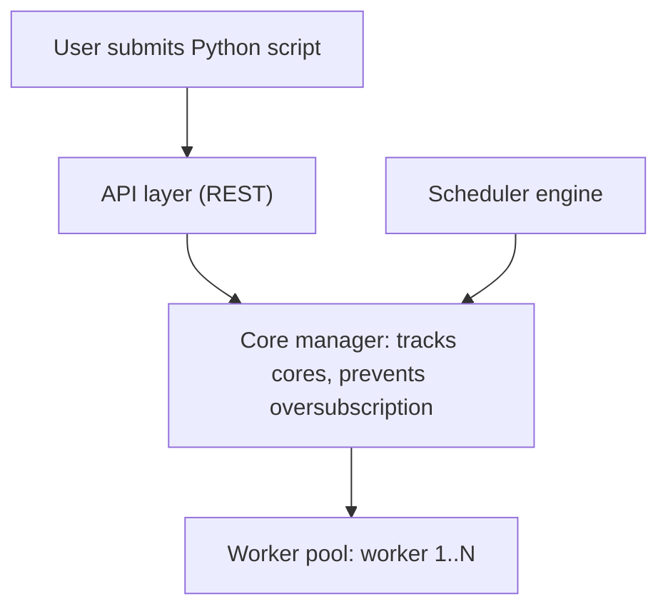
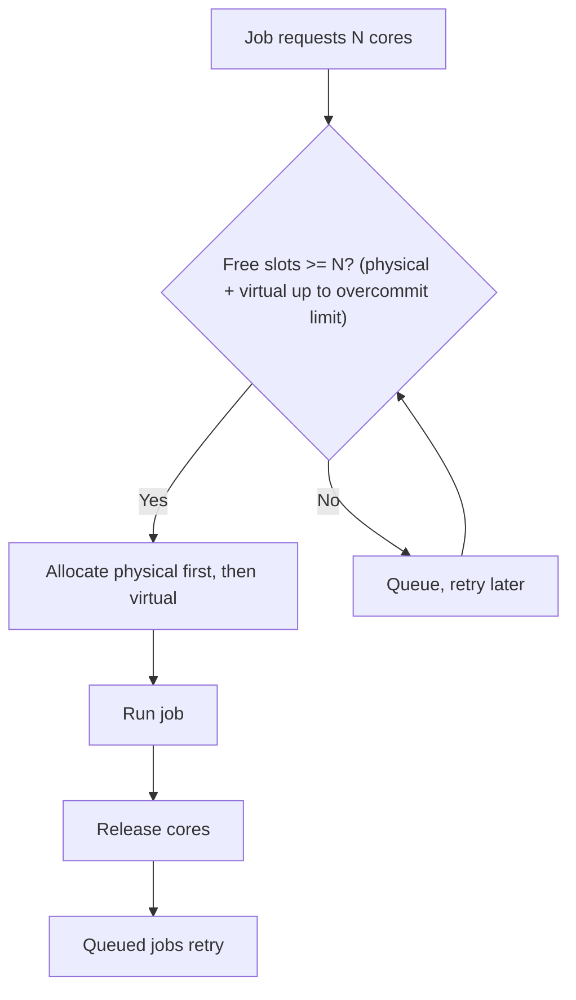
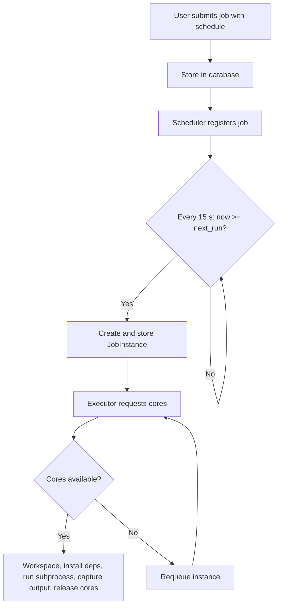

# 📅 Airflow-Like Job Scheduling System — Low Level Design

> **Target:** Principal Engineer | **Focus:** Distributed job scheduler with core-aware parallel execution, recurring schedules, and monitoring

---

## 1. SYSTEM OVERVIEW

```
User submits Python script
    │
    ▼
┌─────────────────────────────────────────────┐
│            JOB SCHEDULER SERVICE              │
│                                                │
│  ┌────────────┐  ┌────────────┐              │
│  │  API Layer  │  │ Scheduler  │              │
│  │  (REST API) │  │  Engine    │              │
│  └──────┬─────┘  └──────┬─────┘              │
│         │               │                     │
│  ┌──────▼───────────────▼──────┐             │
│  │        Core Manager          │             │
│  │  - Tracks CPU cores          │             │
│  │  - Allocates resources      │             │
│  │  - Prevents oversubscription│             │
│  └─────────────┬───────────────┘             │
│                │                              │
│  ┌─────────────▼───────────────┐             │
│  │       Worker Pool            │             │
│  │  ┌──────┐ ┌──────┐ ┌──────┐ │             │
│  │  │Worker│ │Worker│ │Worker│ │             │
│  │  │  1   │ │  2   │ │  3   │ │             │
│  │  └──────┘ └──────┘ └──────┘ │             │
│  └─────────────────────────────┘             │
└─────────────────────────────────────────────┘
```

*Figure: scheduler service components; the core manager gates the worker pool.*



---

## 2. CORE COMPONENTS

### 2.1 Job Representation

```python
from dataclasses import dataclass
from datetime import datetime, timedelta
from enum import Enum
from typing import Optional, List, Dict
import uuid

class JobStatus(Enum):
    PENDING = "pending"
    QUEUED = "queued"
    RUNNING = "running"
    SUCCESS = "success"
    FAILED = "failed"
    RETRYING = "retrying"
    CANCELLED = "cancelled"
    TIMEOUT = "timeout"

class JobPriority(Enum):
    LOW = 0
    MEDIUM = 1
    HIGH = 2
    CRITICAL = 3

class ScheduleType(Enum):
    ONCE = "once"
    INTERVAL = "interval"    # Every N minutes/hours
    CRON = "cron"            # Cron expression
    DAILY = "daily"          # Specific time daily
    WEEKLY = "weekly"        # Specific day/time weekly

@dataclass
class Job:
    """Represents a job to be executed."""
    job_id: str
    name: str
    script_path: str
    script_content: str       # The Python script to run
    python_version: str = "3.12"
    requirements: List[str] = None  # pip packages
    
    # Resource requirements
    cpu_cores_required: int = 1
    memory_mb_required: int = 512
    timeout_seconds: int = 3600
    
    # Schedule
    schedule_type: ScheduleType = ScheduleType.ONCE
    schedule_expression: Optional[str] = None  # Cron or interval
    start_date: Optional[datetime] = None
    end_date: Optional[datetime] = None
    max_retries: int = 3
    retry_delay_seconds: int = 60
    
    # Metadata
    priority: JobPriority = JobPriority.MEDIUM
    tags: List[str] = None
    created_by: str = "system"
    created_at: datetime = None
    depends_on: List[str] = None  # Job IDs that must complete first
    
    def __post_init__(self):
        self.job_id = self.job_id or f"job_{uuid.uuid4().hex[:8]}"
        self.created_at = self.created_at or datetime.utcnow()
        self.requirements = self.requirements or []
        self.tags = self.tags or []
        self.depends_on = self.depends_on or []

@dataclass
class JobInstance:
    """A single execution of a job."""
    instance_id: str
    job_id: str
    status: JobStatus = JobStatus.PENDING
    assigned_worker: Optional[str] = None
    cpu_cores_allocated: int = 1
    memory_mb_allocated: int = 512
    started_at: Optional[datetime] = None
    completed_at: Optional[datetime] = None
    exit_code: Optional[int] = None
    output: Optional[str] = None
    error: Optional[str] = None
    retry_count: int = 0
    scheduled_at: Optional[datetime] = None
```

### 2.2 Core Manager — CPU-Aware Scheduling

```python
import psutil
import asyncio
from typing import Dict, Optional
from dataclasses import dataclass

@dataclass
class CoreAllocation:
    """Represents an allocated CPU core."""
    core_id: int
    status: str = "free"  # free, allocated, reserved
    allocated_to: Optional[str] = None  # Instance ID
    allocated_at: Optional[datetime] = None

class CoreManager:
    """
    Manages CPU core allocation for parallel job execution.
    
    Key Features:
    - Tracks available/free cores
    - Prevents oversubscription
    - Supports soft limits (overcommit) and hard limits
    """
    
    def __init__(self, total_cores: Optional[int] = None, 
                 overcommit_ratio: float = 1.5):
        self.total_cores = total_cores or psutil.cpu_count(logical=True)
        self.overcommit_ratio = overcommit_ratio  # Allow 1.5x virtual allocation
        # Total allocatable = physical + overcommit headroom. With 4 cores and
        # 1.5x that is 6 slots: 4 physical + 2 "virtual". The headroom, not the
        # total, is what virtual allocations are counted against.
        self.max_virtual_cores = int(self.total_cores * overcommit_ratio)
        self.overcommit_slots = self.max_virtual_cores - self.total_cores
        
        # Track cores
        self.cores = [
            CoreAllocation(core_id=i) 
            for i in range(self.total_cores)
        ]
        self.virtual_allocations = 0
        # Track per-instance virtual allocation count for proper release
        self._instance_virtual: Dict[str, int] = {}
        self._lock = asyncio.Lock()
    
    async def allocate_cores(self, instance_id: str, 
                              cores_needed: int) -> bool:
        """
        Allocate cores for a job instance.
        Returns True if successful, False if insufficient resources.
        
        ⚠️ The check combines physical + overcommit capacity.
           Using OR (individual check) would reject jobs that
           could be satisfied by a mix of the two.
           Example: 1 free physical + 2 free overcommit = 3 total.
           A job needing 3 cores should succeed, but
           `3 <= 1 or 3 <= 2` → False (wrong!).
           `3 <= 1 + 2` → True (correct!).

        ⚠️ "Allocating core 3" is bookkeeping, not CPU pinning. To actually
           confine a job, set affinity (os.sched_setaffinity on Linux) or,
           better, a cgroup CPU quota (cpu.max), which is what Kubernetes
           requests/limits do.
        """
        async with self._lock:
            # Count free physical cores
            free_physical = sum(
                1 for c in self.cores if c.status == "free"
            )
            
            # Overcommit headroom left. NOT max_virtual_cores - allocations:
            # max_virtual_cores already includes the physical cores, so that
            # would count them twice (4 cores at 1.5x would admit 10, not 6).
            virtual_free = self.overcommit_slots - self.virtual_allocations
            
            # Can we allocate? Check COMBINED capacity, not individual.
            if cores_needed <= free_physical + virtual_free:
                # Allocate physical cores first (best effort)
                allocated = 0
                for core in self.cores:
                    if core.status == "free" and allocated < cores_needed:
                        core.status = "allocated"
                        core.allocated_to = instance_id
                        core.allocated_at = datetime.utcnow()
                        allocated += 1
                
                # If not enough physical, use virtual for the remainder
                if allocated < cores_needed:
                    extra = cores_needed - allocated
                    self.virtual_allocations += extra
                    self._instance_virtual[instance_id] = extra
                    allocated += extra
                
                return True
            
            return False
    
    async def release_cores(self, instance_id: str):
        """
        Release cores allocated to a job instance.
        
        ⚠️ Must decrement BOTH physical and virtual allocations.
        allocate_cores() may have used virtual allocations for
        the difference between cores_needed and free physical.
        If we only free physical cores without decrementing
        virtual_allocations, the pool leaks until saturation.
        """
        async with self._lock:
            # Free physical cores
            for core in self.cores:
                if core.allocated_to == instance_id:
                    core.status = "free"
                    core.allocated_to = None
                    core.allocated_at = None
            
            # Release virtual allocations tracked per-instance
            virtual_to_release = self._instance_virtual.pop(instance_id, 0)
            self.virtual_allocations = max(
                0, self.virtual_allocations - virtual_to_release
            )
    
    async def get_available_cores(self) -> dict:
        """Get current core availability."""
        async with self._lock:
            free_physical = sum(
                1 for c in self.cores if c.status == "free"
            )
            return {
                "total_physical": self.total_cores,
                "free_physical": free_physical,
                "used_physical": self.total_cores - free_physical,
                "virtual_allocations": self.virtual_allocations,
                "max_virtual": self.max_virtual_cores,
                "utilization_percent": (
                    (1 - free_physical / self.total_cores) * 100
                    if self.total_cores > 0 else 0
                )
            }
```

### 2.3 Scheduler Engine — Recurring Jobs

```python
import pytz
from croniter import croniter
from datetime import datetime, timedelta
import asyncio
from typing import Dict, Optional

class SchedulerEngine:
    """
    Schedules and manages recurring job execution.
    
    Handles:
    - Cron expressions (e.g., "0 2 * * *" = daily at 2 AM)
    - Interval-based (e.g., every 30 minutes)
    - Timezone-aware scheduling
    - Missed schedule catch-up
    """
    
    def __init__(self, job_store: 'JobStore', 
                 executor: 'JobExecutor', 
                 timezone: str = "UTC"):
        self.job_store = job_store
        self.executor = executor
        self.timezone = pytz.timezone(timezone)
        self.scheduled_jobs: Dict[str, ScheduledJob] = {}
        self._running = False
    
    async def start(self):
        """Start the scheduler loop."""
        self._running = True
        asyncio.create_task(self._scheduler_loop())
    
    async def stop(self):
        """Stop the scheduler."""
        self._running = False
    
    async def _scheduler_loop(self):
        """
        Main scheduler loop.
        Runs every 15 seconds, checks for jobs that need to run.
        
        ⚠️ Error handling rules:
        1. asyncio.CancelledError MUST propagate (not caught by bare except)
        2. Individual job failures shouldn't break the loop
        3. asyncio.sleep must run even after partial failures
        """
        while self._running:
            try:
                now = datetime.utcnow()
                
                # Check all active schedules
                # Use try/except per job so one failure doesn't block others
                for job_id, scheduled in list(self.scheduled_jobs.items()):
                    try:
                        if scheduled.next_run and now >= scheduled.next_run:
                            await self._trigger_job(job_id)
                            scheduled.last_run = now
                            scheduled.run_count += 1

                            if scheduled.job.schedule_type == ScheduleType.ONCE:
                                # _calculate_next_run(ONCE) returns start_date,
                                # which is already past: without this the job
                                # would re-fire on every 15 s tick.
                                scheduled.next_run = None
                            else:
                                # Computed from `now`, so missed fires after
                                # downtime are coalesced into one. INTERVAL
                                # schedules drift by the loop's lateness (up to
                                # 15 s per fire); compute from the previous
                                # next_run instead if that matters.
                                scheduled.next_run = self._calculate_next_run(
                                    scheduled.job, now
                                )
                    except asyncio.CancelledError:
                        raise  # Always propagate cancellation!
                    except Exception as e:
                        print(f"Scheduler error for job {job_id}: {e}")
                        # Individual job failure doesn't stop the loop
            
            except asyncio.CancelledError:
                # Clean shutdown — re-raise after cleanup
                print("Scheduler loop cancelled, shutting down")
                self._running = False
                raise
            except Exception as e:
                print(f"Scheduler loop error: {e}")
                # Log and continue, don't crash the entire scheduler
            finally:
                # Always sleep between iterations, even after errors
                if self._running:
                    await asyncio.sleep(15)
    
    def register_job(self, job: Job):
        """Register a recurring job with the scheduler."""
        next_run = self._calculate_next_run(job, datetime.utcnow())
        self.scheduled_jobs[job.job_id] = ScheduledJob(
            job=job,
            next_run=next_run
        )
    
    def _calculate_next_run(self, job: Job, from_time: datetime) -> Optional[datetime]:
        """Calculate the next run time for a job based on its schedule."""
        
        if job.schedule_type == ScheduleType.ONCE:
            return job.start_date
        
        elif job.schedule_type == ScheduleType.INTERVAL:
            # Parse interval expression (e.g., "30m", "2h", "1d")
            interval = self._parse_interval(job.schedule_expression)
            if interval:
                return from_time + interval
        
        elif job.schedule_type == ScheduleType.CRON:
            # Use croniter for cron expressions
            cron = croniter(job.schedule_expression, from_time)
            return cron.get_next(datetime)
        
        elif job.schedule_type == ScheduleType.DAILY:
            # Run at specific time daily (e.g., "02:00")
            scheduled_time = datetime.strptime(
                job.schedule_expression, "%H:%M"
            ).time()
            next_run = from_time.replace(
                hour=scheduled_time.hour,
                minute=scheduled_time.minute,
                second=0, microsecond=0
            )
            if next_run <= from_time:
                next_run += timedelta(days=1)
            return next_run
        
        return None
    
    async def _trigger_job(self, job_id: str):
        """Trigger execution of a scheduled job."""
        scheduled = self.scheduled_jobs.get(job_id)
        if not scheduled:
            return
        
        # Create a new instance and execute
        instance = JobInstance(
            instance_id=f"inst_{uuid.uuid4().hex[:8]}",
            job_id=job_id,
            scheduled_at=datetime.utcnow()
        )
        
        await self.job_store.save_instance(instance)
        asyncio.create_task(self.executor.execute(instance))

@dataclass
class ScheduledJob:
    """Tracks the schedule state of a job."""
    job: Job
    next_run: Optional[datetime] = None
    last_run: Optional[datetime] = None
    run_count: int = 0
    missed_runs: int = 0
```

### 2.4 Job Executor

```python
import subprocess
import tempfile
import os
import json
import sys
import shutil
import pytz
from typing import Optional, Dict

class JobExecutor:
    """
    Executes jobs in isolated subprocesses with resource limits.
    """
    
    def __init__(self, core_manager: CoreManager, 
                 workspace_dir: str = "/tmp/jobs"):
        self.core_manager = core_manager
        self.workspace_dir = workspace_dir
        os.makedirs(workspace_dir, exist_ok=True)
        self.active_instances: Dict[str, subprocess.Popen] = {}
    
    async def execute(self, instance: JobInstance):
        """Execute a job instance."""
        # Allocate cores
        job = await self._get_job(instance.job_id)
        allocated = await self.core_manager.allocate_cores(
            instance.instance_id, job.cpu_cores_required
        )
        
        if not allocated:
            instance.status = JobStatus.QUEUED
            await self._save_instance(instance)
            return  # Will be retried
        
        instance.status = JobStatus.RUNNING
        instance.assigned_worker = f"worker_{os.uname().nodename}"
        instance.started_at = datetime.utcnow()
        await self._save_instance(instance)
        
        try:
            # Create isolated workspace
            workspace = os.path.join(
                self.workspace_dir, instance.instance_id
            )
            os.makedirs(workspace, exist_ok=True)
            
            # Write script to file
            script_path = os.path.join(workspace, "job_script.py")
            with open(script_path, "w") as f:
                f.write(job.script_content)
            
            # Install dependencies if needed
            if job.requirements:
                req_file = os.path.join(workspace, "requirements.txt")
                with open(req_file, "w") as f:
                    f.write("\n".join(job.requirements))
                
                subprocess.run(
                    ["pip", "install", "-r", req_file, "--quiet"],
                    capture_output=True, timeout=120
                )
            
            # Execute with resource limits
            process = await asyncio.create_subprocess_exec(
                sys.executable, script_path,
                stdout=asyncio.subprocess.PIPE,
                stderr=asyncio.subprocess.PIPE,
                cwd=workspace,
                env={
                    **os.environ,
                    "JOB_INSTANCE_ID": instance.instance_id,
                    "JOB_ID": instance.job_id,
                    "CPU_LIMIT": str(job.cpu_cores_required),
                    "MEMORY_LIMIT_MB": str(job.memory_mb_required),
                }
            )
            
            self.active_instances[instance.instance_id] = process
            
            try:
                stdout, stderr = await asyncio.wait_for(
                    process.communicate(),
                    timeout=job.timeout_seconds
                )
                
                instance.exit_code = process.returncode
                instance.output = stdout.decode() if stdout else ""
                instance.error = stderr.decode() if stderr else ""
                
                if process.returncode == 0:
                    instance.status = JobStatus.SUCCESS
                else:
                    instance.status = JobStatus.FAILED
                    
            except asyncio.TimeoutError:
                process.kill()
                await process.wait()   # reap it, or it lingers as a zombie
                instance.status = JobStatus.TIMEOUT
                instance.error = f"Job timed out after {job.timeout_seconds}s"
        
        except Exception as e:
            instance.status = JobStatus.FAILED
            instance.error = str(e)
        
        finally:
            instance.completed_at = datetime.utcnow()
            await self._save_instance(instance)
            await self.core_manager.release_cores(instance.instance_id)
            
            if instance.instance_id in self.active_instances:
                del self.active_instances[instance.instance_id]
            
            # Cleanup workspace
            shutil.rmtree(workspace, ignore_errors=True)
```

!!! warning "Gaps in this executor (say them before the interviewer does)"
    - **`subprocess.run(["pip", "install", ...])` blocks the event loop** for up to 120 s and installs into the scheduler's own environment, so jobs can break each other's (and the scheduler's) dependencies. Build a per-job virtualenv or container image ahead of time, and run any install with `asyncio.create_subprocess_exec`.
    - **`QUEUED` is a dead end:** when cores aren't available the instance is saved as `QUEUED` and nothing ever picks it up again. Put it on a pending queue that `release_cores()` drains, or re-enqueue it with a delay.
    - **`process.kill()` only kills the direct child.** Start it with `start_new_session=True` and kill the process group (`os.killpg`) so grandchildren die too.
    - **Cancellation leaks the process:** `asyncio.CancelledError` is not an `Exception`, so the `except` doesn't see it. The `finally` releases the cores while the script keeps running. Catch it, kill the process, re-raise.
    - **`communicate()` buffers all output in memory.** A chatty job can OOM the scheduler. Stream to a file and keep only the tail.
    - **`CPU_LIMIT` / `MEMORY_LIMIT_MB` are only environment variables.** Nothing enforces them. Use `resource.setrlimit` in a `preexec_fn`, or cgroups.

### 2.5 Job Store — Persistence Layer

```python
import aiosqlite
import json
from typing import Optional, List

class JobStore:
    """
    Persistent storage for jobs and instances.
    
    ⚠️ Uses a persistent connection opened during initialize().
    Creating a new aiosqlite.connect() per query is expensive —
    each connection opens a file handle and creates a new
    SQLite transaction context. aiosqlite runs every call on one
    background thread, so calls never execute in parallel, but
    calls from different coroutines can still interleave between
    an execute() and its commit(). Keep each write a single
    execute+commit (as below) or guard multi-statement
    transactions with an asyncio.Lock.

    ⚠️ INSERT OR REPLACE deletes and re-inserts the row, which
    resets any column not listed (e.g. is_active, created_at).
    Prefer INSERT ... ON CONFLICT(job_id) DO UPDATE SET ...
    """
    
    def __init__(self, db_path: str = "jobs.db"):
        self.db_path = db_path
        self._db: Optional[aiosqlite.Connection] = None
    
    async def initialize(self):
        """
        Open persistent connection and create tables.
        Called once at application startup.
        """
        self._db = await aiosqlite.connect(self.db_path)
        self._db.row_factory = aiosqlite.Row  # Named tuple access
        await self._db.executescript("""
            CREATE TABLE IF NOT EXISTS jobs (
                job_id TEXT PRIMARY KEY,
                name TEXT NOT NULL,
                script_path TEXT,
                script_content TEXT NOT NULL,
                python_version TEXT DEFAULT '3.12',
                requirements TEXT DEFAULT '[]',
                cpu_cores_required INTEGER DEFAULT 1,
                memory_mb_required INTEGER DEFAULT 512,
                timeout_seconds INTEGER DEFAULT 3600,
                schedule_type TEXT DEFAULT 'once',
                schedule_expression TEXT,
                start_date TEXT,
                end_date TEXT,
                max_retries INTEGER DEFAULT 3,
                retry_delay_seconds INTEGER DEFAULT 60,
                priority INTEGER DEFAULT 1,
                tags TEXT DEFAULT '[]',
                created_by TEXT DEFAULT 'system',
                created_at TEXT DEFAULT CURRENT_TIMESTAMP,
                depends_on TEXT DEFAULT '[]',
                is_active INTEGER DEFAULT 1
            );
            
            CREATE TABLE IF NOT EXISTS job_instances (
                instance_id TEXT PRIMARY KEY,
                job_id TEXT NOT NULL,
                status TEXT DEFAULT 'pending',
                assigned_worker TEXT,
                cpu_cores_allocated INTEGER DEFAULT 1,
                memory_mb_allocated INTEGER DEFAULT 512,
                started_at TEXT,
                completed_at TEXT,
                exit_code INTEGER,
                output TEXT,
                error TEXT,
                retry_count INTEGER DEFAULT 0,
                scheduled_at TEXT,
                created_at TEXT DEFAULT CURRENT_TIMESTAMP,  -- used by the index + ORDER BY below
                FOREIGN KEY (job_id) REFERENCES jobs(job_id)
            );
            
            CREATE INDEX IF NOT EXISTS idx_instances_job 
                ON job_instances(job_id, created_at);
            CREATE INDEX IF NOT EXISTS idx_instances_status 
                ON job_instances(status);
            CREATE INDEX IF NOT EXISTS idx_jobs_schedule 
                ON jobs(is_active, schedule_type);
        """)
        await self._db.commit()
    
    async def save_job(self, job: Job):
        """Save or update a job using the persistent connection."""
        if not self._db:
            raise RuntimeError("JobStore not initialized. Call initialize() first.")
        
        await self._db.execute("""
            INSERT OR REPLACE INTO jobs 
            (job_id, name, script_content, cpu_cores_required, 
             memory_mb_required, timeout_seconds, schedule_type,
             schedule_expression, max_retries, priority, tags,
             created_by, requirements, depends_on)
            VALUES (?, ?, ?, ?, ?, ?, ?, ?, ?, ?, ?, ?, ?, ?)
        """, (
            job.job_id, job.name, job.script_content,
            job.cpu_cores_required, job.memory_mb_required,
            job.timeout_seconds, job.schedule_type.value,
            job.schedule_expression, job.max_retries,
            job.priority.value, json.dumps(job.tags),
            job.created_by, json.dumps(job.requirements),
            json.dumps(job.depends_on)
        ))
        await self._db.commit()
    
    async def save_instance(self, instance: JobInstance):
        """Save or update a job instance using the persistent connection."""
        if not self._db:
            raise RuntimeError("JobStore not initialized. Call initialize() first.")
        
        await self._db.execute("""
            INSERT OR REPLACE INTO job_instances
            (instance_id, job_id, status, assigned_worker,
             cpu_cores_allocated, memory_mb_allocated,
             started_at, completed_at, exit_code,
             output, error, retry_count, scheduled_at)
            VALUES (?, ?, ?, ?, ?, ?, ?, ?, ?, ?, ?, ?, ?)
        """, (
            instance.instance_id, instance.job_id,
            instance.status.value, instance.assigned_worker,
            instance.cpu_cores_allocated, instance.memory_mb_allocated,
            instance.started_at.isoformat() if instance.started_at else None,
            instance.completed_at.isoformat() if instance.completed_at else None,
            instance.exit_code,
            instance.output, instance.error,
            instance.retry_count,
            instance.scheduled_at.isoformat() if instance.scheduled_at else None,
        ))
        await self._db.commit()
    
    async def get_instances(self, job_id: str, limit: int = 10) -> List[JobInstance]:
        """Get recent instances for a job."""
        if not self._db:
            raise RuntimeError("JobStore not initialized. Call initialize() first.")
        
        cursor = await self._db.execute(
            "SELECT * FROM job_instances WHERE job_id = ? ORDER BY created_at DESC LIMIT ?",
            (job_id, limit)
        )
        rows = await cursor.fetchall()
        return [self._row_to_instance(row) for row in rows]

    @staticmethod
    def _row_to_instance(row) -> JobInstance:
        """SQLite hands back strings; JobInstance wants enums and datetimes."""
        d = dict(row)
        d.pop("created_at", None)                 # not a JobInstance field
        d["status"] = JobStatus(d["status"])
        for key in ("started_at", "completed_at", "scheduled_at"):
            if d[key]:
                d[key] = datetime.fromisoformat(d[key])
        return JobInstance(**d)
    
    async def close(self):
        """Close the persistent database connection."""
        if self._db:
            await self._db.close()
            self._db = None
```

### 2.6 REST API Layer

```python
from fastapi import FastAPI, HTTPException, BackgroundTasks
from pydantic import BaseModel, Field
from typing import Optional, List

app = FastAPI(title="Job Scheduler API", version="1.0.0")

# ─── API Models ──────────────────────────────────

class CreateJobRequest(BaseModel):
    name: str
    script_content: str
    python_version: str = "3.12"
    requirements: List[str] = []
    cpu_cores_required: int = 1
    memory_mb_required: int = 512
    timeout_seconds: int = 3600
    schedule_type: str = "once"
    schedule_expression: Optional[str] = None
    max_retries: int = 3
    priority: int = 1
    tags: List[str] = []

class JobResponse(BaseModel):
    job_id: str
    name: str
    status: str
    created_at: str

class JobStatusResponse(BaseModel):
    instance_id: str
    job_id: str
    status: str
    started_at: Optional[str]
    completed_at: Optional[str]
    exit_code: Optional[int]
    output: Optional[str]
    error: Optional[str]

# ─── Endpoints ────────────────────────────────────

@app.post("/api/v1/jobs", response_model=JobResponse)
async def create_job(request: CreateJobRequest, 
                     background_tasks: BackgroundTasks):
    """Submit a new job for execution."""
    job = Job(
        name=request.name,
        script_content=request.script_content,
        cpu_cores_required=request.cpu_cores_required,
        schedule_type=ScheduleType(request.schedule_type),
        schedule_expression=request.schedule_expression,
    )
    
    await job_store.save_job(job)
    
    # If immediate execution
    if request.schedule_type == "once":
        instance = JobInstance(
            instance_id=f"inst_{uuid.uuid4().hex[:8]}",
            job_id=job.job_id
        )
        await job_store.save_instance(instance)
        background_tasks.add_task(executor.execute, instance)
    
    return JobResponse(
        job_id=job.job_id,
        name=job.name,
        status="created",
        created_at=job.created_at.isoformat()
    )

@app.get("/api/v1/jobs/{job_id}/status", 
         response_model=List[JobStatusResponse])
async def get_job_status(job_id: str, limit: int = 10):
    """Get the execution status of a job's instances."""
    instances = await job_store.get_instances(job_id, limit)
    return [
        JobStatusResponse(
            instance_id=inst.instance_id,
            job_id=inst.job_id,
            status=inst.status.value,
            started_at=inst.started_at.isoformat() if inst.started_at else None,
            completed_at=inst.completed_at.isoformat() if inst.completed_at else None,
            exit_code=inst.exit_code,
            output=inst.output[:500] if inst.output else None,
            error=inst.error[:500] if inst.error else None,
        )
        for inst in instances
    ]

@app.get("/api/v1/system/resources")
async def get_system_resources():
    """Get current system resource usage."""
    return await core_manager.get_available_cores()

@app.get("/api/v1/jobs/scheduled")
async def get_scheduled_jobs():
    """Get all active scheduled jobs and their next run times."""
    return [
        {
            "job_id": sj.job.job_id,
            "name": sj.job.name,
            "next_run": sj.next_run.isoformat() if sj.next_run else None,
            "schedule": sj.job.schedule_expression
        }
        for sj in scheduler.scheduled_jobs.values()
    ]
```

---

## 3. HOW SCHEDULING & EXECUTION WORK

### 3.1 Time-Based Scheduling

```
Job: Send daily report → Schedule: "0 8 * * *" (cron for 8 AM daily)

Timeline:
08:00:00 → Scheduler detects "time to run", creates instance, triggers execution
08:00:01 → Executor checks core availability
            ├── Cores free → Run immediately
            └── No cores → Queue for retry in 60s
08:00:05 → Job starts (cores allocated)
08:00:30 → Job completes → Release cores
08:15:00 → Scheduler checks again → next run is tomorrow at 8 AM
```

### 3.2 Parallel Execution with Core Management

```
Available Cores: 4
Overcommit Ratio: 1.5 → Virtual max: 6

Jobs submitted:
Job A (2 cores):  Allocate 2 physical → Running on cores [0, 1]
Job B (1 core):   Allocate 1 physical → Running on core [2]
Job C (2 cores):  Allocate 1 physical [3] + 1 virtual → Running
Job D (3 cores):  0 physical + 1 virtual free (5 of 6 slots used) → Queued!
                  ↑ Will run when a job completes

When Job A completes:
  → Release cores [0, 1]
  → Job D can now allocate 2 physical [0, 1] + 1 virtual
  → Job D starts running
```

*Figure: core allocation with an overcommit ratio; jobs queue when no slots remain.*



### 3.3 Scheduling Flow

```
1. User submits job with schedule
    │
    ▼
2. Job stored in database
    │
    ▼
3. Scheduler registers job
    │
    ▼
4. Every 15 seconds, scheduler:
    ├── Checks all registered jobs
    ├── Compares current time vs next_run
    └── If time to run:
        ├── Creates JobInstance
        ├── Stores in database
        └── Calls Executor.execute()
            │
            ▼
5. Executor:
    ├── Requests cores from CoreManager
    ├── If cores available:
    │   ├── Creates workspace directory
    │   ├── Installs dependencies
    │   ├── Runs script in subprocess
    │   ├── Captures stdout/stderr
    │   └── Releases cores
    └── If no cores:
        └── Requeues instance (retry later)
```

*Figure: scheduling flow from submission to execution, polled every 15 seconds.*



---

## 4. INTERVIEW QUESTIONS

### Q1: How do you ensure a job runs at exactly the scheduled time?

**Answer:** Use a scheduler loop that checks every 15 seconds (configurable). For second-level precision, use a **priority queue** with Redis sorted sets (ZSET) where the score is the scheduled timestamp. The scheduler pops jobs with score ≤ current time and executes them.

```python
# Redis-based precise scheduling
async def check_schedule():
    now = time.time()
    # ZRANGEBYSCORE returns jobs with score between 0 and now
    due_jobs = await redis.zrangebyscore(
        "scheduler:queue", 0, now, start=0, num=100
    )
    for job_data in due_jobs:
        # Claim BEFORE executing. ZREM returns 1 for exactly one caller, so
        # with several scheduler instances only the winner runs the job.
        # (Reading, executing, then removing lets every instance run it.)
        if await redis.zrem("scheduler:queue", job_data) == 1:
            await enqueue_for_worker(json.loads(job_data))
```

A claimed job that crashes before it's handed off is lost. For at-least-once, move it atomically to a "processing" ZSET scored by a lease deadline (a small Lua script, or `ZPOPMIN` + `ZADD` in `MULTI`), and have a reaper return expired entries.

### Q2: How do you handle a missed schedule (scheduler was down)?

**Answer:** On startup, check for missed schedules:

```python
async def catchup_missed_schedules():
    for job in self.scheduled_jobs.values():
        if job.next_run and datetime.utcnow() > job.next_run:
            # Calculate how many runs were missed
            missed = self._count_missed_runs(job)
            if missed > 0 and job.job.catchup:
                for _ in range(min(missed, 3)):  # Max 3 catch-up runs
                    await self._trigger_job(job.job.job_id)
```

### Q3: How do you handle dependencies between jobs?

**Answer:** Use a DAG-based scheduler:

```python
async def check_dependencies(instance: JobInstance) -> bool:
    job = await job_store.get_job(instance.job_id)
    if not job.depends_on:
        return True
    
    for dep_job_id in job.depends_on:
        dep_instances = await job_store.get_instances(
            dep_job_id, limit=1
        )
        if not dep_instances:
            return False  # Dependency hasn't run
        if dep_instances[0].status != JobStatus.SUCCESS:
            return False  # Dependency failed
    
    return True
```

⚠️ "The latest instance of the upstream succeeded" is the wrong test for recurring jobs: today's run of B could be released by yesterday's success of A. Airflow scopes dependencies to a **DAG run** (one logical date): B's instance for date D waits on A's instance for date D. Store the logical date on each instance and match on it. Also, when an upstream fails terminally, mark dependents `upstream_failed` instead of leaving them waiting forever.

---

> **Next:** [Notification Service Design](../notification-service/HIGH_LEVEL_DESIGN.md) → High-throughput notification system
