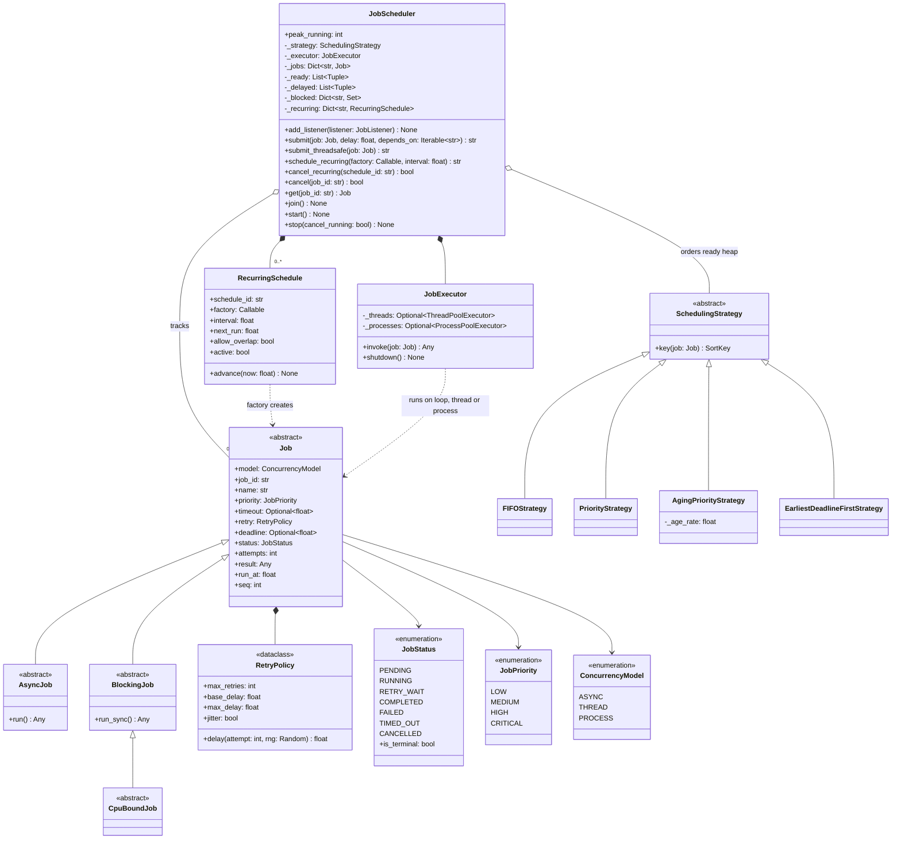

# 🧠 Job Scheduling System LLD — Thought Process Guide

> **Goal:** Learn *how* to think when designing a concurrent job scheduler, and how to pace it in a live round.

---

## 📊 Class Diagram



---

## ⏱️ How to Run This in a 45–60 Minute Interview

| Time | Phase | What you produce | What to say out loud |
|------|-------|------------------|----------------------|
| 0–7 min | **Clarify** | 5–6 bullet requirements, explicit non-goals | "In-process or distributed? I'll do in-process first and say where it changes for a fleet." |
| 7–15 min | **Entities + interfaces** | `Job` (Command), `JobStatus` + transition table, `SchedulingStrategy.key()`, `JobScheduler.submit/cancel/start/stop` | "The scheduler owns all state on one event-loop thread, so I won't need locks. I'll make that the invariant." |
| 15–35 min | **Core code** | Ready heap, workers, `_run_attempt` with timeout, `_finish` | "A worker pops and marks RUNNING with no `await` in between, so two workers can't take the same job." |
| 35–45 min | **Failure + concurrency** | Retry with backoff (`_delayed` heap), cancellation, graceful `stop()`, `submit_threadsafe` | "Timeouts on threads don't kill the thread. I'll record the timeout, and the slot stays busy until the call returns." |
| 45–60 min | **Extension** | Whatever they add: dependencies, recurring, aging, rate limits | Show that the change touches one place (a strategy, `_finish`, the ticker). |

Write the transition table and the `submit → ready → worker → finish` path first. Retries, dependencies and recurring jobs are all small additions to `_finish` and the two heaps. If you start with them, you won't finish the core.

### Clarifying questions worth asking

1. **One process or a fleet?** In-process changes everything about durability and double execution. Build in-process first, then discuss distribution.
2. **What kinds of work?** I/O-bound, blocking libraries, CPU-heavy? This decides ASYNC / THREAD / PROCESS.
3. **Ordering:** FIFO, priority, deadlines? Is starvation of low priority acceptable?
4. **Failure semantics:** retries, which errors are retryable, timeouts per job?
5. **Cancellation:** queued only, or running too? What happens to a running job on shutdown?
6. **Recurring jobs:** interval or cron? What if a run is still going when the next one is due (overlap)? What about missed runs after downtime?
7. **Dependencies:** "B after A"? What happens to B if A fails?
8. **Delivery guarantee:** at-most-once or at-least-once? (In-process it's effectively at-most-once: a crash loses the queue.)

---

## Phase 0: Requirements

**Functional (what the code implements):**
- Submit one-shot and delayed jobs; recurring fixed-interval jobs
- Ordering via a pluggable strategy: FIFO, priority, priority with aging, earliest-deadline-first
- Per-job timeout; retries with capped exponential backoff + jitter; non-retryable errors
- Cancel queued or running jobs
- Dependencies: a job runs only after all its upstreams complete; upstream failure cancels it

**Non-functional:**
- At most N jobs in flight
- I/O-bound, blocking and CPU-bound jobs side by side
- Graceful shutdown; submissions from other threads
- Bounded memory for history

**Out of scope (say it):** persistence, multiple scheduler instances, cron syntax. Each gets a sentence in the extension discussion.

---

## Phase 1: Concurrency Model Decision

**This is the key decision; the rest follows from it.**

| Model | Use for | Cost |
|-------|---------|------|
| **asyncio** | The scheduler core + I/O jobs written with `await` | Single thread; one blocking call stalls everything |
| **Threads** | Blocking I/O libraries (sync DB drivers, `requests`) | GIL: CPU-bound Python gets ~no speedup; threads can't be killed |
| **Processes** | CPU-bound work | Pickling in/out, process start-up, more memory |

**Decision:** asyncio for the scheduler itself; each job declares its execution model by which base class it extends (`AsyncJob`, `BlockingJob`, `CpuBoundJob`). `JobExecutor` routes it.

Why asyncio for the core: the scheduler mostly waits (for work, for backoff timers, for jobs). Thousands of coroutines are cheap. And with all state on one thread, there are no data races on scheduler state, as long as you never `await` in the middle of a check-then-act.

---

## Phase 2: Entities and the State Machine

```python
_TRANSITIONS = {
    PENDING:    {RUNNING, CANCELLED},
    RUNNING:    {COMPLETED, FAILED, TIMED_OUT, CANCELLED, RETRY_WAIT},
    RETRY_WAIT: {RUNNING, CANCELLED},
}
```

Every status change goes through `_transition()`, which validates the edge and notifies listeners. That gives you two things interviewers like: illegal states fail loudly, and observability (metrics, audit log, tests) hangs off one hook.

---

## Phase 3: The Ready Queue

**Problem:** pick the "best" runnable job quickly.

**Solution:** a heap keyed by `strategy.key(job)`. Keys must be **time-invariant** so a heap stays valid.

```python
class PriorityStrategy(SchedulingStrategy):
    def key(self, job):  return (-job.priority, job.seq)

class AgingPriorityStrategy(SchedulingStrategy):
    # effective(now) = p + r·(now − t0). Every job ages at the same rate,
    # so ordering by p − r·t0 gives the same answer at every `now`.
    def key(self, job):  return (-(job.priority - self._age_rate * job.submitted_at), job.seq)
```

`seq` (submit order) is the tie-breaker, so the heap never compares two `Job` objects.

Delayed work (retry backoff, `submit(delay=...)`) sits in a second heap keyed by `run_at`, and is promoted to the ready heap when due. Jobs waiting on dependencies sit in `_blocked` until their last upstream completes.

---

## Phase 4: Workers (Producer-Consumer)

```python
async def _worker(self, worker_id):
    while True:
        job = None if self._stopping else self._take_next()   # pop + mark RUNNING, no await
        if job is None:
            if self._stopping:
                return
            self._work_available.clear()
            try:
                await asyncio.wait_for(self._work_available.wait(), self._next_wakeup_in())
            except asyncio.TimeoutError:
                pass
            continue
        await self._run_attempt(job)
```

- **N workers = concurrency limit.** No separate semaphore needed.
- `clear()` then `wait()` has no lost-wakeup race: nothing can call `set()` between the failed `_take_next()` and `clear()` because there is no `await` between them.
- The wait timeout is "time until the next delayed job is due", so retries fire on time without polling.

---

## Phase 5: Running One Attempt

```python
attempt = asyncio.create_task(self._executor.invoke(job))
done, _ = await asyncio.wait({attempt}, timeout=job.timeout)
if not done:
    attempt.cancel()                     # timed out
```

Why a separate task per attempt:
- `cancel(job_id)` cancels the attempt, not the worker.
- `asyncio.wait` never raises on timeout, so "timed out" means the scheduler's timeout, not a `TimeoutError` the job raised itself.

Then classify: cancelled → `CANCELLED`; timeout or exception → retry if attempts remain, else `TIMED_OUT`/`FAILED`; else `COMPLETED`.

---

## Phase 6: Retries with Backoff

```python
cap   = min(max_delay, base_delay * 2 ** (attempt - 1))   # 1, 2, 4, 8 ... capped
delay = uniform(0, cap) if jitter else cap                # "full jitter"
```

The failed job goes to `RETRY_WAIT` and into `_delayed` with `run_at = now + delay`. Raise `NonRetryableError` for errors that will never succeed (bad input), so you don't burn retries on them.

---

## Phase 7: Cancellation and Shutdown

- **Queued job:** mark `CANCELLED` immediately. Its heap entry is skipped when popped (lazy deletion, O(1)).
- **Running ASYNC job:** `attempt.cancel()` → `CancelledError` at its next `await`.
- **Running THREAD/PROCESS job:** the scheduler stops waiting and records `CANCELLED`, but the call keeps running. Say this unprompted; it's the most common gap.
- **`stop()`:** reject new submits, wake every worker, let each finish (or cancel) its current job, await the worker tasks, shut the pools down with `cancel_futures=True`. Queued jobs stay `PENDING`, which is where a durable store would hand them to the next instance.

---

## Phase 8: Extensions (the "now add X" part)

| Extension | Where it lands |
|-----------|----------------|
| Dependencies | `submit(depends_on=...)` puts the job in `_blocked`; `_finish` releases dependents on success or cascades `CANCELLED` on failure. Requiring upstreams to exist first makes cycles impossible. |
| Recurring | `_ticker` task + `RecurringSchedule`: fixed-rate (`next_run += interval`), coalesce missed fires, optional overlap guard. |
| Aging | A new strategy; see Phase 3 for why it still fits a heap. |
| Cross-thread producers | `submit_threadsafe` → `loop.call_soon_threadsafe(self.submit, ...)`. |

---

## Quick Checklist

| Concept | Where |
|---------|-------|
| ✅ Command pattern | `Job` → `AsyncJob` / `BlockingJob` / `CpuBoundJob` |
| ✅ Strategy pattern | `SchedulingStrategy.key()` + 4 implementations |
| ✅ Explicit state machine | `_TRANSITIONS`, `_transition()` |
| ✅ Observer | `add_listener()` |
| ✅ Lock-free single-owner state | All mutation on the loop thread; `submit_threadsafe` for others |
| ✅ O(log n) dispatch | `_ready` / `_delayed` heaps, lazy deletion |
| ✅ Anti-starvation | `AgingPriorityStrategy` |
| ✅ Retry + backoff + jitter | `RetryPolicy`, `_after_failure()` |
| ✅ Timeout + cancellation | `_run_attempt()`, `cancel()` |
| ✅ Dependencies (DAG) | `_blocked`, `_dependents`, `_finish()` |
| ✅ Recurring, drift-free | `RecurringSchedule.advance()`, `_ticker()` |
| ✅ Graceful shutdown | `stop(cancel_running=...)` |
| ✅ Bounded memory | `history_limit` |
