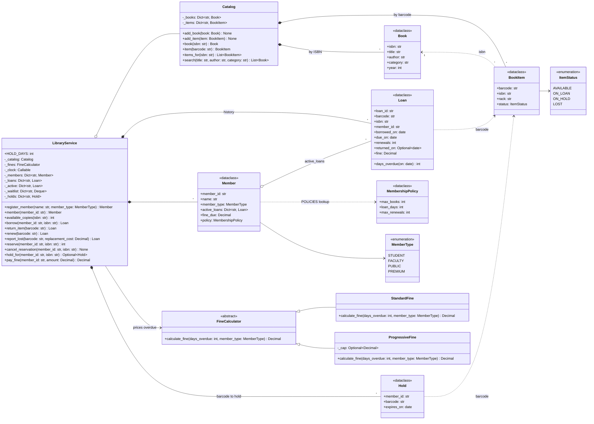

# 🧠 Library Management LLD — Thought Process Guide

> **Goal:** Learn *how* to think when designing a Low-Level Design.

---

## 📊 Class Diagram



---

## ⏱️ How to Run This in a 45–60 min Interview

| Time | Step | What to say out loud |
|------|------|----------------------|
| 0–7 min | **Clarify** | "Member types and their limits? Fine rules? Do we need reservations, renewals, lost books? Single branch?" Pin down scope before drawing anything. |
| 7–15 min | **Entities + interfaces** | "Book is a title, BookItem is a copy. A Loan is its own record. Availability is derived from item status, so there is one source of truth." Name `FineCalculator.calculate_fine` as the strategy and `POLICIES` as the per-type table. |
| 15–35 min | **Core code** | `Catalog` with an ISBN → items index, then `borrow` / `return_item` with the borrowing checks (limit, fines, overdue). Inject the clock now; it costs one parameter and saves the testing discussion later. |
| 35–45 min | **Reservations + concurrency** | FIFO waitlist per ISBN, holds that expire, lazy expiry before availability decisions. One lock makes "find copy → mark on loan" atomic; in a DB that is a conditional `UPDATE ... WHERE status = 'AVAILABLE'`. |
| 45–60 min | **Extension + tests** | Renewals (blocked when someone is waiting), lost books, notifications. List the tests: fine tiers, limits per type, hold expiry passes to the next member, concurrent borrow issues each copy once. |

**Clarifying questions worth asking**

- How many books and for how long, per member type? Can loans be renewed, and how often?
- How are fines computed, is there a cap, and at what unpaid amount is borrowing blocked?
- Reservations: FIFO per title? How long is a hold kept before it passes on?
- What happens to a lost or damaged copy?
- One branch or many? Self-service kiosks (concurrent checkouts)?

---

## Phase 0: Requirements Gathering

Members borrow copies of titles, subject to per-type limits and loan periods. Late returns accrue fines; unpaid fines or an overdue book block new loans. Titles with no copy on the shelf can be reserved; returned copies are held for the next member in line.

## Phase 1: Identify the Nouns

> *"A library has books with multiple copies. Members borrow and return books. Fines accrue for overdue returns."*

| Noun | Decision | Why |
|------|----------|-----|
| Book | frozen dataclass | Title metadata keyed by ISBN |
| BookItem | dataclass | A physical copy with a status |
| Loan | dataclass | One borrowing; due date, renewals, fine |
| Hold | dataclass | A copy reserved for one member until a date |
| Member | dataclass | Type, active loans, fine due |
| MembershipPolicy | frozen dataclass + table | Limits per member type |
| FineCalculator | ABC | Strategy for fines |
| Catalog | Regular class | Books, items, search |
| LibraryService | Facade | Orchestration, locking, clock |

**Key insight:** `Book` vs `BookItem` is title vs physical copy. Three copies of "Clean Code" are one `Book` and three `BookItem`s. Do not also keep an "available copies" counter on `Book`; count the items.

## Phase 2: Enums and Tables

```python
class ItemStatus(Enum):  AVAILABLE, ON_LOAN, ON_HOLD, LOST
class MemberType(Enum):  STUDENT, FACULTY, PUBLIC, PREMIUM

POLICIES = {MemberType.STUDENT: MembershipPolicy(max_books=5, loan_days=14), ...}
```

Key the table by the enum member, not by a string. (The original code keyed it by `"STUDENT"` and looked it up with `"Student"`, so every member got the default.)

## Phase 3: Assigning Responsibilities

| Action | Owner | Why |
|--------|-------|-----|
| Copy status | `BookItem.status` | Single source of truth for availability |
| Can this member borrow? | `LibraryService._check_can_borrow` | Needs member, policy, fines and clock |
| Calculate fine | `FineCalculator.calculate_fine()` | Swappable rule |
| Search | `Catalog.search()` | Owns the books and the ISBN index |
| Borrow / return / renew | `LibraryService` | Orchestrates under one lock |
| Who gets a returned copy | `LibraryService._release` | Queue head gets a hold, else shelf |

## Phase 4: The Borrow and Return Flows

```
borrow(member_id, isbn):
  1. member exists; under limit; fines below threshold; nothing overdue
  2. expire stale holds for this isbn
  3. pick the copy held for this member, else any AVAILABLE copy
  4. create Loan(due = today + policy.loan_days); copy -> ON_LOAN

return_item(barcode):
  1. close the Loan, compute fine from days overdue, add to member.fine_due
  2. release the copy: ON_HOLD for the queue head (expires in HOLD_DAYS), else AVAILABLE
```

## Phase 5: Strategy Pattern for Fines

```python
class FineCalculator(ABC):
    def calculate_fine(self, days_overdue: int, member_type: MemberType) -> Decimal

class StandardFine(FineCalculator):      # flat daily rate by member type
class ProgressiveFine(FineCalculator):   # 1/day to day 7, 2/day to day 30, 5/day after; optional cap
```

## Phase 6: Quick Checklist

✅ **Book vs BookItem**, with availability derived from item status
✅ **Loan as a record**, so renewals, fines and history have a home
✅ **Reservations** are FIFO with expiring holds that pass to the next member
✅ **Money** is `Decimal`; **time** comes from an injected clock
✅ **Concurrency:** one lock around find-and-mark; conditional update in a DB
✅ **Policy table** keyed by enum; new member type = new row
