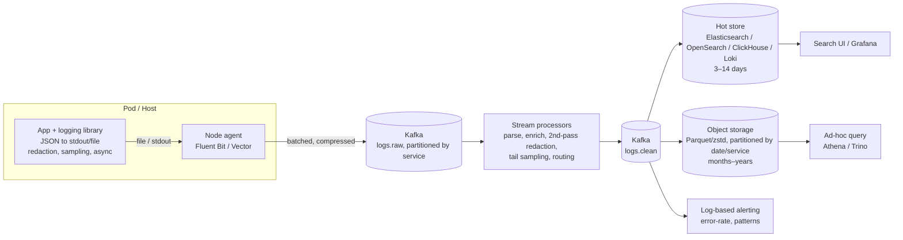

# 🪵 Centralised Logging Pipeline — High-Level Design

> **Focus:** From in-process logger to fleet-wide pipeline: node agents, Kafka buffering, hot/cold storage, sampling, PII redaction and back-pressure

---

## 1. Scope and numbers

**Goal:** collect logs from every service, make the last few days searchable within seconds, keep months cheaply, and never let logging take down the services it observes.

| Quantity | Estimate | Derivation |
|---|---|---|
| Hosts / pods | 20 k | |
| Avg log rate | 50 lines/s per pod → **1 M lines/s** | peaks 3× → 3 M/s |
| Avg line (JSON) | ~500 B | |
| Ingest | ~500 MB/s ≈ **43 TB/day** raw | 1 M × 500 B × 86 400 |
| Compressed (zstd, ~8–10×) | ~5 TB/day | logs compress very well |
| Hot search (7 days, 1 replica + index overhead ~1.5×) | ~43 × 7 × 2 × 1.5 ≈ **900 TB** if indexed raw | which is why you sample, drop DEBUG, or index only metadata |
| Cold (90 days, compressed, object storage) | ~450 TB | cheap tier |

The numbers drive the design: full-text indexing everything is the expensive choice. Many teams index only labels/metadata (Loki-style) or columnar-store everything (ClickHouse) instead of Elasticsearch for the full firehose.

---

## 2. Architecture

### Responsibilities by tier

| Tier | Does | Must not |
|---|---|---|
| **In-process library** (this LLD) | Structured JSON, correlation/trace ids, level filtering, **source redaction**, head sampling, async non-blocking write with bounded queue | Make network calls on the request path |
| **Node agent** | Tail files / stdout, add host/pod/k8s metadata, batch + compress, disk buffer when downstream is slow, per-source rate limits | Run expensive parsing for every line |
| **Kafka** | Durable buffer that absorbs storage outages and peaks; fan-out to multiple consumers; replay | Be the system of record for months |
| **Stream processors** | Parse, normalise, enrich (service owner, region), second-pass PII scrubbing, tail sampling, route by tenant/retention class | Block producers (it's a consumer; lag is its back-pressure) |
| **Hot store** | Fast search over recent data | Hold everything forever |
| **Cold store** | Cheap retention, compliance, rare investigations | Serve interactive queries |

Why write to a local file/stdout and let an agent ship, rather than having the app send to Kafka directly: the app stays decoupled from the network, the agent's disk buffer survives brief outages, and a single agent per node batches far more efficiently than 50 pods each holding Kafka connections.

---

## 3. Back-pressure, end to end

Each hop must have a **bounded** buffer and a stated policy when it's full:

| Hop | Buffer | When full |
|---|---|---|
| App → local sink | `AsyncHandler` queue (e.g. 10 k records) | DROP below ERROR, short BLOCK for ERROR+; export `dropped` |
| Local file | Disk; agent reads at its own pace | Log rotation by size; if the agent is far behind, oldest rotated files are deleted (loss, but bounded disk) |
| Agent → Kafka | Memory + disk buffer (e.g. 1–5 GB) | Stop reading files (back-pressure to disk); then drop lowest-priority sources first |
| Kafka | Retention (e.g. 24–72 h) | Consumers lag; data ages out after retention, so alert on lag long before |
| Consumers → hot store | Bulk batches with retry + backoff | Pause partition consumption; Kafka absorbs it |

Principle: **logging must degrade before the application does.** The only place that may block a request is the in-process queue, and only for ERROR+ with a short timeout.

---

## 4. Sampling

| Kind | Where | How | Trade-off |
|---|---|---|---|
| Level-based | Library | DEBUG off in prod; per-logger overrides at runtime | Cheap; loses detail you didn't predict you'd need |
| Head (request-consistent) | Library | `crc32(trace_id) % N < rate`, never WARNING+ | Decision before you know if the request failed |
| Tail | Stream processor | Buffer by trace id for ~30 s; keep if any error / slow / sampled | Keeps the interesting requests; needs state and memory in the processor |
| Rate limit per template | Agent or processor | Token bucket on `(service, template)` | Stops a log-spam loop from dominating cost |
| Dynamic | Control plane | Raise sampling for a service during an incident | Operational complexity |

Record the sample rate on each kept line (`sample_rate: 0.1`) so counts can be re-weighted in analytics.

---

## 5. PII redaction

1. **Source (library):** `RedactionFilter` on templates, arguments and fields; typed secret wrappers that mask themselves. Cheapest and closest to the knowledge of what's sensitive.
2. **Pipeline:** second-pass scrubber in the stream processor (regex + dictionary of field names, optionally an ML detector on a sample), before anything reaches storage. Lines that fail parsing go to a quarantined topic with tighter access, not straight to the index.
3. **Storage:** field-level access control, short retention for raw text, encryption at rest; right-to-erasure handled by retention windows plus, where required, per-tenant deletion jobs on the cold store (hard on immutable Parquet, which is why the first two layers matter).

Regex redaction has false negatives by construction; treat it as a mitigation and measure it (scan samples for PII patterns, alert on hits).

---

## 6. Partitioning and multi-tenancy

- Kafka topic `logs.raw` partitioned by `service` (or `service + pod hash` for hot services, to avoid one huge partition). Ordering is only needed per source; the store sorts by timestamp.
- Hot store indexes per day per service class (`logs-payments-2026.10.06`), so retention is "drop index", not "delete by query".
- Quotas per team (ingest bytes/day); over-quota traffic is sampled harder rather than rejected, so incidents still have data.

---

## 7. Failure modes

| Failure | Effect | Mitigation |
|---|---|---|
| Hot store down / slow | Search unavailable | Kafka buffers (hours); consumers resume; apps unaffected |
| Kafka unavailable | Agents can't ship | Agent disk buffer; local files keep rotating; alert on agent buffer usage |
| Log storm (bug logs in a loop) | Cost spike, lag for everyone | Per-source rate limits at agent; per-template limits; quotas |
| Slow local disk | App latency if logging is sync | `AsyncHandler` with bounded queue; DROP policy below ERROR |
| Pod killed (OOM, SIGKILL) | Last lines lost | Write to stdout (captured by container runtime); keep the async queue small; synchronous ERROR path |
| Clock skew | Misordered timelines | Use host NTP; store both event time and ingest time; trace ids for causality |
| Schema drift (field changes type) | Index mapping conflicts, rejected docs | Schema registry or typed field conventions; route rejects to a dead-letter topic |
| PII leak | Compliance incident | Layered redaction, quarantine topic, retention, audit of index access |

---

## 8. Consistency and delivery semantics

- **At-least-once** end to end (agent retries, Kafka consumer commits after a successful bulk write). Duplicates are tolerable for logs; deduplicate in the store by a per-line id (`host + file inode + offset`, or a UUID from the library) when it matters.
- Ordering is **per source**, not global. Cross-service ordering comes from trace ids and timestamps, not from the pipeline.
- Audit logs (who changed what, financial events) are **not** application logs: write them transactionally (outbox) to a dedicated, non-sampled, append-only store with stronger guarantees.

---

## 9. What I'd monitor

Library `dropped` counters per service; agent buffer fill and send errors; Kafka consumer lag per consumer group; ingest bytes per team vs quota; hot-store indexing latency and rejected documents; end-to-end freshness (synthetic log line emitted every minute, alert if not searchable within N seconds); PII-detector hit rate.
