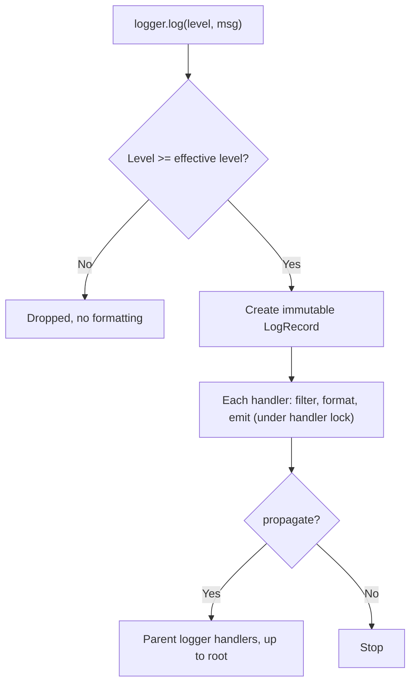
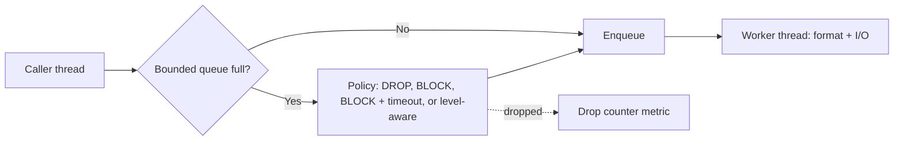

# Logging Framework - Interview Questions & Answers

> **Target Level:** Senior / Staff Engineer
> **Evaluation Focus:** Clean separation of concerns, hierarchy semantics, real thread-safety, bounded async I/O and back-pressure, structured logging, the log pipeline at scale

---

## Question 1: Core design
**Interviewer:** *"Design a logging library like log4j."*

### 🎯 Expected answer

Four questions, four abstractions:

| Question | Abstraction |
|---|---|
| Is this level on for this logger? | `Logger` + `effective_level()` (inherited through the dotted hierarchy) |
| Where does the record go? | `Handler` (Strategy): console, file, in-memory, async wrapper |
| What does it look like? | `Formatter`: text, JSON |
| Should *this sink* take it, and in what form? | `Filter`: drop or transform (name, redaction, sampling) |

Plus `LogRecord` (immutable data, lazy message), `LogManager` (registry, shutdown) and propagation up the hierarchy as a Chain of Responsibility.

---

## Question 2: "Why is `logger.debug(f"user={user}")` worse than `logger.debug("user=%s", user)`?"

### 🎯 Answer

The f-string is built before the call, even when DEBUG is off. With `%s` + args, interpolation happens only if a handler formats the record. The template also stays constant across calls, so log analytics can group by `template` ("user=%s") instead of millions of unique strings. For genuinely expensive values, guard with `if logger.is_enabled_for(Level.DEBUG):`.

---

## Question 3: "Root is at ERROR, `app.db` is at DEBUG, root has a console handler. Does `app.db.debug(...)` print?"

### 🎯 Answer

**Yes.** The level decision is made once, at the originating logger, against its *effective* level (DEBUG). Propagation then offers the record to ancestor *handlers* and checks each handler's own level, but never re-checks ancestor *logger* levels. To stop DEBUG at the console, set the console *handler's* level. That's log4j and Python semantics, and the tests pin it (`test_ancestor_logger_level_not_rechecked_but_handler_level_is`).

*Figure: the level is checked once at the originating logger; handlers filter, format and emit, then the record propagates up.*

**Follow-up: "How do you stop `app.db` lines reaching root's handlers entirely?"** `propagate = False` on `app.db` (or on `app`).

---

## Question 4: "Where exactly do you need locks?"

### 🎯 Answer

- **Per handler, around `emit`.** Otherwise two threads' writes interleave mid-line. Formatting stays outside the lock.
- **Registry mutations** (`get_logger` creating nodes, `set_level`, add/remove handler) under one manager lock. They're rare.
- **Not on the hot path:** handler lists are immutable tuples swapped copy-on-write; the effective-level cache is a tuple tagged with a config generation, so a stale read self-corrects on the next call.
- **Records are frozen**, so handing one to another thread needs no lock.

Watch for: a handler that itself logs (re-entrancy → use `RLock` or a guard), and a lock held across slow I/O, which is exactly why `AsyncHandler` exists.

---

## Question 5: "The disk is slow. Logging is now adding 50 ms to requests."

### 🎯 Answer

Put an `AsyncHandler` in front: the caller enqueues the record; a worker thread does format + I/O. The queue **must be bounded**, so define the overflow policy:

| Policy | Caller latency | Completeness | Use for |
|---|---|---|---|
| `DROP` (newest) | Never blocks | Loses records under pressure; `dropped` counter | Application/debug logs on latency-sensitive paths |
| `BLOCK` | Back-pressure; can stall requests | Nothing lost | Batch jobs; low-volume important streams |
| `BLOCK` + timeout | Bounded stall | Loses only after the timeout | A compromise for ERROR+ |
| Level-aware | DROP for < ERROR, BLOCK for ≥ ERROR | Keeps what you need for incidents | Most production services |

Emit the drop counter as a metric (and log "dropped N records" periodically, *synchronously*), because silent loss is the real failure.

**Follow-up: "Why not just an unbounded queue?"** It converts a slow disk into unbounded memory growth and an OOM kill, which then loses *everything* still queued.

**Follow-up: "Drop oldest or newest?"** Newest is cheaper (`put_nowait`). Oldest keeps the most recent context, which is usually what you want at the moment of a crash, but needs a deque + condition variable rather than `queue.Queue`.

*Figure: AsyncHandler decouples callers from slow I/O with a bounded queue and an overflow policy.*

---

## Question 6: "The process exits. What happens to queued logs?"

### 🎯 Answer

`LogManager.shutdown()` (registered with `atexit`) closes async handlers first: stop accepting, enqueue a stop marker with a *blocking* put, join the worker (bounded timeout), count stragglers as dropped, then close the target. Plain handlers close after that, so a target shared by an async wrapper and a logger is still open while the queue drains.

Limits worth naming: `atexit` doesn't run on `SIGKILL`, `os._exit`, or a hard crash. For those, the last lines are lost unless the sink is synchronous with `flush_every_record=True`, or you write to stdout/stderr and let the container runtime capture it (the common answer in Kubernetes).

---

## Question 7: "Add a correlation id to every log line of a request."

### 🎯 Answer

Middleware does `with log_context(correlation_id=req.headers.get("X-Request-Id") or new_id()):`. `log_context` sets a `ContextVar`; every `LogRecord` snapshots it at creation.

- `ContextVar`, not `threading.local`: in asyncio, many requests share one thread; each task has its own context copy. (`threading.local` would leak ids between interleaved requests.)
- Snapshot at creation, because an `AsyncHandler` worker thread has a different context.
- Propagate across services in headers (`traceparent` for W3C trace context), and across thread pools: `contextvars.copy_context().run(fn)`. `loop.run_in_executor` does *not* copy context for you; `asyncio.to_thread` does.

---

## Question 8: "Make the logs machine-readable."

### 🎯 Answer

`JsonFormatter`: one JSON object per line (NDJSON) with `ts` (ISO-8601 UTC, ms), `level`, `logger`, `message`, `template`, `thread`, the context fields and the `extra` fields. Reserved keys are written last so a user field named `level` can't spoof them. Keep field names stable and typed (`latency_ms` is always a number) so the index mapping doesn't explode; cap the number of distinct keys.

---

## Question 9: "We logged a customer's card number. How do you stop that happening again?"

### 🎯 Answer

Defence in depth:

1. **At the source:** a `RedactionFilter` on every handler, scrubbing the template, arguments and fields with patterns (emails, card-like digit runs) and key names (`password`, `token`, `authorization`). Redact before the record leaves the process: once it's in Kafka, it's in N systems and backups.
2. **Typed wrappers:** `Secret[str]` / `CardNumber` types whose `__str__`/`__repr__` return a mask, so they can't be logged by accident.
3. **In the pipeline:** a second scrubber at the collector/agent for what code missed.
4. **Process:** retention limits, access control on log indexes, and a tested deletion path, because regex redaction is best-effort (false negatives are guaranteed eventually).

---

## Question 10: "Logs cost too much. Sample them."

### 🎯 Answer

- Never sample WARNING+ (`keep_at_or_above`).
- Sample by **request**, not by line: `crc32(correlation_id) % 10000 < rate * 10000`. A sampled request is complete; an unsampled one is entirely absent, rather than every request having random holes. A stable hash (not Python's salted `hash()`) gives the same decision in every service for the same id: that's what makes cross-service traces coherent.
- Better still: **tail-based** sampling at the collector: buffer a request's logs briefly and keep all of them if any line was an error or the request was slow. That can't be done in-process for a distributed request, which is why it lives in the pipeline.
- Rate-limit noisy templates (`(logger, template)` token bucket) to stop one hot loop from dominating the bill.

---

## Question 11: "How do you test a logging library?"

### 🎯 Answer

- `InMemoryHandler` as the test sink; inject a fixed `clock` so timestamps are deterministic.
- Semantics tables: inheritance, `set_level(None)`, propagation, logger-vs-handler level.
- Robustness: broken formatter → no exception reaches the caller, error on stderr.
- Concurrency: N threads writing to one file → every line intact; N threads / M asyncio tasks → every record carries its own correlation id.
- Async: a **gated** target (blocks in `emit` until an `Event` is set) makes queue-full deterministic: assert the exact drop count under DROP, that the caller blocks under BLOCK, and that shutdown drains everything.

---

## ⚠️ Common mistakes

- Formatting the message before the level check (or using f-strings in log calls).
- One global lock around all logging, held across file I/O.
- `threading.local` for request context in async code.
- Unbounded async queue; or a bounded one with no stated overflow policy and no drop metric.
- Formatting in the worker using *the worker's* context (correlation ids disappear).
- No flush/close on shutdown, or closing the shared target before the async queue drains.
- Re-checking ancestor logger levels during propagation (not how log4j/Python behave) or not knowing the semantics at all.
- Letting a logging exception propagate into business code.
- Redacting only the formatted text sink but not the JSON one.

---

## 🎚️ Senior vs Staff signal

- **Senior:** clean Logger/Handler/Formatter/Filter split, correct hierarchy and propagation, per-handler locking, lazy formatting, an async handler with a bounded queue, JSON output, tests.
- **Staff:** states the overflow trade-off as a product decision (latency vs completeness, per level) and makes loss observable; knows why `contextvars` and when context does *not* flow (executors); designs redaction and sampling as pipeline-wide policies (request-consistent hashing, tail sampling); connects the in-process design to the at-scale pipeline (agent → Kafka → storage) and reasons about cost, retention and back-pressure end to end.
