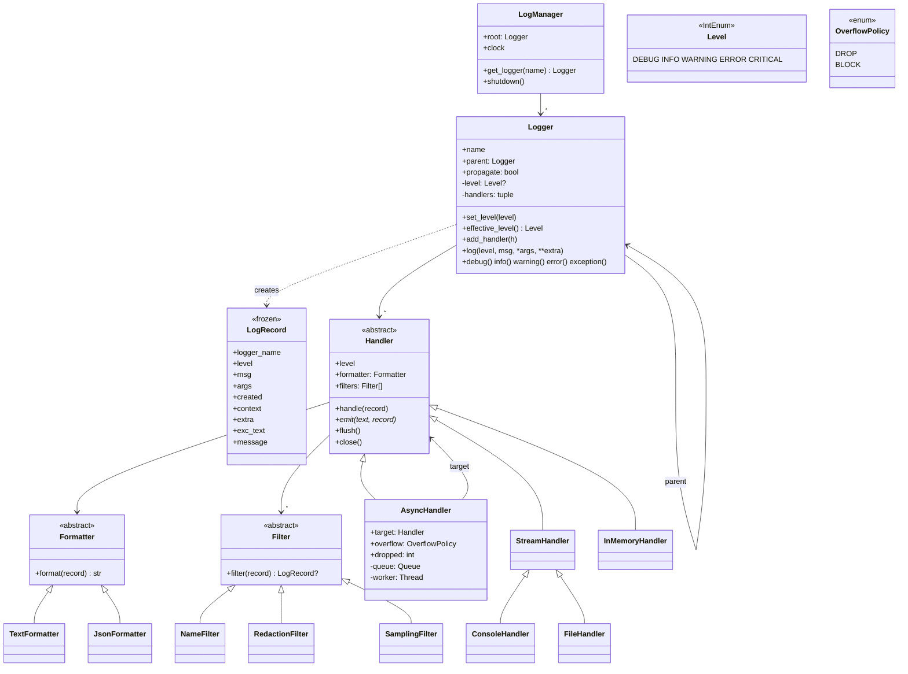

# 🧠 Logging Framework LLD — Thought Process Guide

> **Goal:** Design a log4j / Python-`logging`-style library and defend the three things that separate a good answer: correct hierarchy semantics, real thread-safety, and a non-blocking path with an explicit overflow policy.

---

## 📊 Class Diagram



---

## ⏱️ How to run this in a 45–60 min interview

| Minutes | Do | Say out loud |
|---|---|---|
| 0–5 | **Clarify** (questions below). | "Library, not service. I'll design the in-process API first, then talk about the pipeline behind it." |
| 5–12 | **Entities + interfaces**: `Level`, `LogRecord`, `Logger`, `Handler` (Strategy for the sink), `Formatter`, `Filter`, `LogManager`. | "Logger decides *whether*; handlers decide *where*; formatters decide *how it looks*; filters decide *which* and can transform." |
| 12–30 | **Core code**: `get_logger` building the dotted hierarchy; `effective_level()`; `log()` with the fast-path level check; propagation loop; `Handler.handle` template method; console + in-memory handlers; text formatter. | "The disabled path must be one integer comparison: no record, no string formatting." |
| 30–42 | **Thread-safety + async**: per-handler lock around `emit`; copy-on-write handler tuple; `AsyncHandler` with bounded queue, worker, DROP vs BLOCK, `flush`/`close`. | "An unbounded queue just moves the outage from latency to OOM." |
| 42–52 | **Extension**: JSON formatter, correlation ids via `contextvars`, redaction, sampling. | "Context is captured at record creation, in the caller, because the worker thread has a different context." |
| 52–60 | Tests and the at-scale pipeline (HLD). | |

### Clarifying questions worth asking

- Which levels? Custom levels? (Five standard ones; `IntEnum` leaves room.)
- Hierarchy by dotted name with inheritance? (Yes, that is the classic ask.)
- Sinks: console, file, in-memory now; network later? (Handler interface.)
- Must logging ever block the caller? What happens when a sink is slower than the producer? (Drives `AsyncHandler` + overflow policy.)
- Is losing logs acceptable? Which ones? (Usually: DEBUG/INFO yes under pressure, ERROR+ prefer not; audit logs are not "logs", they're data.)
- Structured output? (JSON for machines, text for humans.)
- Multi-threaded? asyncio? (Both, hence `contextvars`, not `threading.local`.)
- Config at runtime (change a level without restart)? (Supported: `set_level` invalidates the level cache.)

---

## Phase 1: Separate the four decisions

| Question | Owner | Why separate |
|---|---|---|
| Is this level enabled here? | `Logger.effective_level()` | Must be the cheapest check in the system |
| Where does it go? | `Handler` subclasses (Strategy) | Sinks vary independently of format |
| What does it look like? | `Formatter` | Same sink, different formats (text locally, JSON in prod) |
| Should this record go to this sink, and in what form? | `Filter` (drop or transform) | Redaction and sampling are per-sink policies |

## Phase 2: Hierarchy and inheritance

- `get_logger("a.b.c")` creates `a` and `a.b` if missing, so `parent` is always the true nearest ancestor. (Python's stdlib uses placeholders and fixes up children later. Creating ancestors eagerly is simpler and costs a few objects.)
- `level=None` means "inherit". `effective_level()` walks up to the first explicit level; root always has one.
- Walking on every call is O(depth). Cache it per logger, tagged with a manager-wide *generation* that any `set_level` bumps. Readers stay lock-free and stale caches self-invalidate.

## Phase 3: Propagation is a Chain of Responsibility

```python
node = self
while node:
    for h in node.handlers: h.handle(record)
    if not node.propagate: break
    node = node.parent
```

The semantic interviewers probe: **ancestor logger levels are not re-checked; ancestor handler levels are.** So `root.level=ERROR` doesn't hide INFO from `app.db` (if `app.db` is INFO) at root's handlers. To restrict a sink, set the *handler's* level. This matches log4j and Python and is worth stating explicitly.

## Phase 4: Thread-safety, made real

- `Handler.handle`: level → filters → format **outside** the lock → `emit` **inside** the handler's lock. Lines never interleave; formatting parallelises.
- `Logger._handlers` is an immutable tuple replaced under the manager lock (copy-on-write): the hot path iterates it without locking.
- `LogRecord` is frozen, so it can cross to another thread safely.
- Logging must never crash the app: `handle()` catches everything, reports to stderr (`handle_error`), and moves on.

## Phase 5: Non-blocking with a bounded queue

`AsyncHandler(target, capacity, overflow)`:

- Caller thread: level + filters (cheap rejection), then enqueue the **record** (not formatted text).
- Worker thread: `target.handle(record)` (format + I/O).
- Queue full: `DROP` discards the incoming record and counts it; `BLOCK` waits (optionally up to `block_timeout`, then drops). DROP protects latency; BLOCK protects completeness. Expose `dropped` as a metric.
- `flush()` = `queue.join()` then `target.flush()`. `close()` = stop accepting, enqueue a stop marker with a *blocking* put (it must get in even under DROP), join the worker, account for any stragglers, close the target.
- `LogManager.shutdown()` closes async handlers *before* plain ones, so a target shared by both is still open while the queue drains. The default manager registers it with `atexit`.

## Phase 6: Context and structure

- `log_context(correlation_id=...)` sets a `ContextVar` holding an immutable mapping; nested scopes merge and restore via the reset token. `ContextVar` is per thread *and* per asyncio task; `threading.local` would leak between tasks on one event-loop thread.
- The record copies the context at creation, so async handlers see the caller's context, not the worker's.
- `JsonFormatter` flattens context + extra, then writes reserved keys (`ts`, `level`, `logger`, `message`, `template`) last so a stray `extra` can't spoof them. Keeping the unformatted `template` gives a stable grouping key for log analytics.

## Phase 7: Quick checklist

✅ Disabled levels cost one comparison; message interpolation is lazy
✅ Hierarchy with inheritance; cached effective level with generation invalidation
✅ Propagation semantics stated and tested
✅ Per-handler lock; lock-free reads of handler lists; frozen records
✅ Bounded async queue, DROP vs BLOCK(+timeout), drop counter, flush/close ordering
✅ `contextvars` correlation ids for threads and asyncio
✅ JSON, redaction (template, args and fields), request-consistent sampling
✅ Logging failures never propagate to the caller
