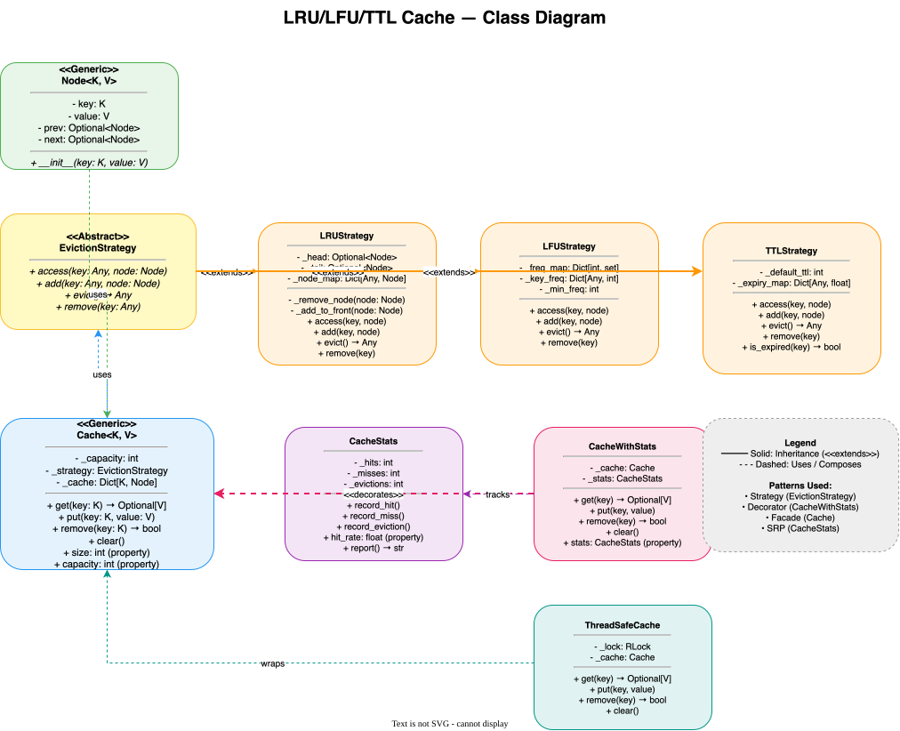

# 🏗️ Distributed Cache System — High-Level Design

> **Target Level:** Senior/Staff Engineer | **Focus:** Distributed caching, consistency, eviction, high availability

---

## 1. SYSTEM OVERVIEW

**Purpose:** Multi-layered distributed cache providing low-latency data access with pluggable eviction policies.

**Scale:** 10M requests/second peak, 500GB cache capacity, 99.999% availability

**Users:** Internal microservices, API endpoints, Database query layer

**Use Cases:** Session caching, API response caching, Database query result caching, Rate limiter backing store

**Constraints:** p99 latency <5ms, no data loss on single node failure, support LRU/LFU/TTL/ARC

---

## 2. HIGH-LEVEL ARCHITECTURE

```
┌──────────────────────────────────────────────┐
│              Client Applications               │
│  (Microservices, API Servers, Worker Pods)    │
└──────────────────────┬───────────────────────┘
                       │
              ┌────────▼────────┐
              │  Cache Client   │
              │  (Sidecar/Lib)  │
              │  - Consistent   │
              │    hashing      │
              │  - Circuit      │
              │    breaker      │
              └────────┬────────┘
                       │
          ┌────────────┼────────────┐
          │            │            │
    ┌─────▼─────┐┌─────▼─────┐┌─────▼─────┐
    │ Cache     ││ Cache     ││ Cache     │
    │ Shard 1   ││ Shard 2   ││ Shard N   │
    │ (Primary) ││ (Primary) ││ (Primary) │
    └─────┬─────┘└─────┬─────┘└─────┬─────┘
          │            │            │
    ┌─────▼─────┐┌─────▼─────┐┌─────▼─────┐
    │ Replica   ││ Replica   ││ Replica   │
    │ (Read)    ││ (Read)    ││ (Read)    │
    └───────────┘└───────────┘└───────────┘

          ┌────────────────────────────────┐
          │         Cluster Manager         │
          │  (Raft/Consul for consensus)    │
          │  - Node membership              │
          │  - Shard rebalancing            │
          │  - Leader election              │
          └────────────────────────────────┘
```

### 🎬 Animated Sequence Diagram

<p align="center">
  <video controls width="900" style="border-radius: 12px; box-shadow: 0 4px 24px rgba(0,0,0,0.3);" loop playsinline preload="metadata">
    <source src="../../../assets/videos/lru-cache-sequence.mp4" type="video/mp4" />
    Your browser does not support the video tag.
  </video>
  <br/>
  <em>🎬 Animated LRU Cache Sequence — Get/Set → Eviction Check → Cache Update → Return. Click ▶ to play/pause. Created with <a href="https://remotion.dev">Remotion</a>.</em>
</p>

---

## 2.5 CLASS DIAGRAM



> **📥 Download:** [LRU Cache Architecture Diagram (draw.io)](lru-cache-class-diagram.drawio) — Open in [draw.io](https://app.diagrams.net/) to edit.

---

## 3. KEY COMPONENTS & INTERVIEW Q&A

### Cache Node (Go/C++)
- In-memory hash table + eviction data structures
- LRU: Doubly linked list + HashMap O(1)
- LFU: Frequency list + HashMap O(1) amortized
- TTL: Priority queue of expiry times

**🔴 Interview Question:** *"How does consistent hashing distribute keys across nodes?"*

**✅ Answer:**
```python
import bisect, hashlib

def _h(s: str) -> int:
    # Stable across processes. Python's hash() of str is randomized per
    # process (PYTHONHASHSEED), so clients would disagree on placement.
    return int.from_bytes(hashlib.md5(s.encode()).digest()[:8], "big")

class ConsistentHashRing:
    def __init__(self, nodes, vnodes=150):
        # Sort once; re-sorting per lookup would be O(n log n) per request.
        self._ring = sorted((_h(f"{n}#{i}"), n) for n in nodes for i in range(vnodes))
        self._points = [p for p, _ in self._ring]

    def node_for(self, key: str) -> str:
        i = bisect.bisect(self._points, _h(key)) % len(self._ring)  # wrap around
        return self._ring[i][1]
```

**Why virtual nodes?** With one point per node, arc lengths are very uneven and a removed node dumps its whole range on a single neighbour. With ~100–200 points per node, load evens out (a few % spread) and a departing node's keys scatter across all survivors. Vnode counts can also be weighted by node capacity.

**Alternative:** Redis Cluster uses 16,384 fixed hash slots (`CRC16(key) mod 16384`) assigned to nodes explicitly; resharding moves slots, and clients learn the map via `MOVED`/`ASK` redirects.

---

### Replication Layer
- **Leader-follower per shard:** Writes go to primary, async replication to replica
- **Read from replica:** Cache-aside pattern, primary for write-through
- **Failover:** If primary fails, promote replica (30s detection + 10s promotion)

**🔴 Interview Question:** *"What happens during cache replication lag?"*

**✅ Answer:** After a write, subsequent reads from stale replicas see old data. Mitigation:
1. **Read-your-writes:** Track writes in client session, route reads for recently-written keys to primary
2. **Configurable consistency:** `--consistency=strong` → always read from primary
3. **Version check:** The client remembers the version it last wrote for a key; a replica whose copy is older than that version makes the client fall back to the primary

---

### Cluster Manager
- Gossip protocol for node membership
- Raft consensus for configuration changes
- Automatic shard rebalancing on scale events

**🔴 Interview Question:** *"How does cache rebalancing work when adding a new node?"*

**✅ Answer (Detailed):**

When a new cache node joins the cluster, rebalancing happens in **5 phases** to minimise disruption:

1. **Membership detection** — The new node announces itself via gossip protocol. Within seconds, every node in the cluster knows about the addition. The cluster manager (Raft leader) confirms the join.

2. **Consistent hash ring update** — The new node adds N virtual nodes (e.g., 150) to the ring. Each virtual node hashes to a position on the ring. Keys whose nearest clockwise node was previously shard X now map to the new node. Approximately **1/N of all keys** remap (where N is the new total node count).

3. **Key migration** — two options, and for a cache the first is usually right:
   - **Let them miss.** The ~1/N remapped keys miss on the new node and reload from the source of truth. Simple; the cost is a temporary DB load spike, so add nodes one at a time and off-peak.
   - **Warm the new node.** While the ring change is pending, on a miss at the new owner, read the old owner and copy the value over (dual-read), or stream the affected ranges in the background. Clients with stale ring state are corrected by a redirect from the node they hit (Redis Cluster's `MOVED`/`ASK`), then refresh their map.

4. **Proactive hot-key migration** — A background goroutine/thread walks the keyspace and migrates frequently-accessed ("hot") keys before they're requested. This avoids the MOVED redirect penalty for popular keys.

5. **Rolling rebalancing completion** — The cluster operator monitors:
   - Redirect rate (should decay to near-zero within minutes)
   - Per-node memory utilisation (should converge to uniform)
   - Client error rates (should remain flat)

**Failure scenarios:**
- **Node crashes during rebalance:** The cluster manager detects failure via gossip timeout. The rebalance pauses, the dead node's virtual nodes are removed from the ring, and its keys remap to remaining nodes.
- **Network partition:** Only the side holding a Raft majority can change membership or promote replicas; the minority side cannot commit config changes. Cache nodes on the minority side may keep serving reads (possibly stale) unless clients are configured to fail closed — for a cache, serving slightly stale data is usually the right choice. Redis Cluster's equivalent: a primary isolated from the majority stops accepting writes after `cluster-node-timeout`.

---

## 4. CACHE STRATEGIES COMPARISON

| Strategy | Read | Write | Consistency | Use Case |
|----------|------|-------|-------------|----------|
| **Cache-aside** | Miss → load from DB | Write DB, invalidate cache | Eventual | General purpose |
| **Write-through** | Same as aside | Write cache + DB on the same path | Fresher, but not atomic (crash between writes diverges) | Read-heavy data that must be fresh after writes |
| **Write-behind** | Same as aside | Write cache, async to DB | Eventual | High throughput |
| **Refresh-ahead** | Predict and pre-load | — | Eventual | Predictable access |

---

## 5. EVICTION STRATEGY SELECTION

| Strategy | When to Use | When NOT to Use |
|----------|-------------|-----------------|
| **LRU** | Temporal locality (session cache) | Scan-heavy workloads (bulk reads thrash) |
| **LFU** | Popularity-driven access (product cache) | Shifting popularity: old hot items never age out, new items are evicted first (needs decay or W-TinyLFU) |
| **TTL** | Fixed expiry (rate limiter counters) | No access pattern awareness |
| **ARC** | Mixed workloads | Implementation complexity |
| **2Q** | Good balance | Tuning parameters needed |

---

## 6. SCALABILITY & RELIABILITY

**Bottleneck:** At 10M req/s, **throughput**, not memory. One Redis primary handles roughly 100–200K simple ops/s (more with pipelining or I/O threads), so 10M req/s needs ~60–100 primaries; memory alone (500 GB / 50 GB) would suggest only 10.

**Solution:** Shard by key hash across ~80 primaries (≈125K ops/s each, leaving headroom) + 80 replicas. Each holds ~6–7 GB, so smaller memory-optimised instances suffice. Hot keys still concentrate on one shard regardless of shard count: replicate them to L1 in-process caches or split them (`key#1..key#k`) and read a random copy.

**Cache avalanche prevention:**
1. **Uniform TTL + jitter:** `TTL = base_TTL + random(0, TTL_jitter)` — prevents mass expiry
2. **Circuit breaker:** If DB can't handle reload traffic, return stale cache instead
3. **Rate limiting per origin:** Limit number of concurrent cache misses

**Thundering herd protection:** Single-flight per key — the first miss loads from the DB, concurrent misses wait for its result (the LLD's `get_or_load`). Across servers: a short `SET lock:k NX PX 2000` or memcache-style leases.

---

## 7. COST (Monthly)

| Component | Nodes | Cost |
|-----------|-------|------|
| Cache primaries (~16 GB memory-optimised, ~$150/mo each) | 80 | ~$12,000 |
| Replicas | 80 | ~$12,000 |
| Cluster manager (3-node) | 3 | ~$600 |
| Bandwidth + Monitoring | — | ~$2,000 |
| **Total** | | **~$27,000** |

> Rough on-demand list prices; the point is that request rate, not data size, sets the node count.
