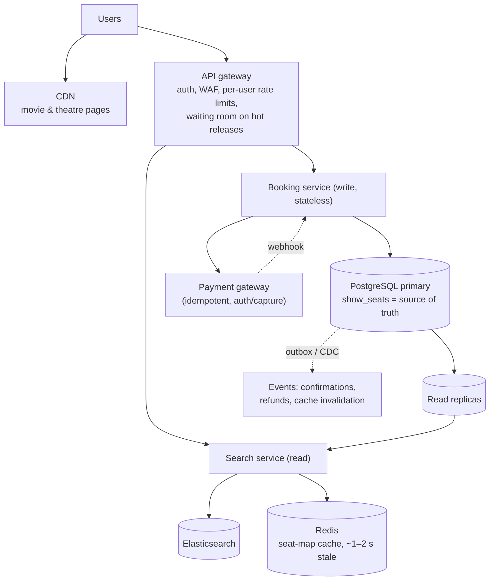
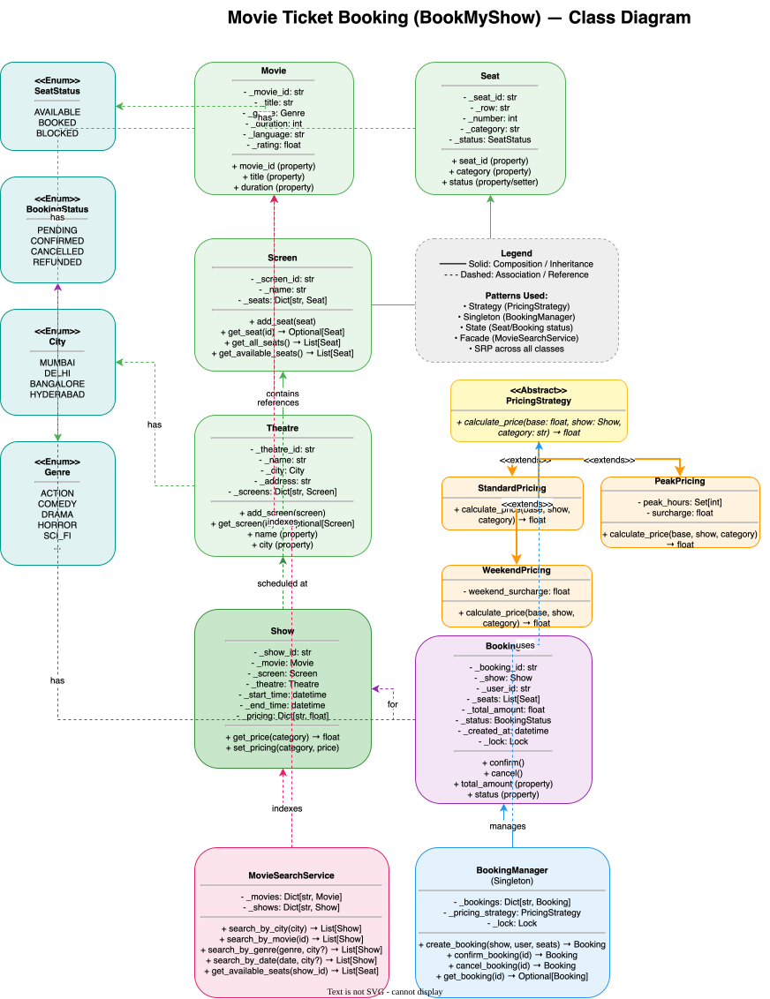

# 🏗️ Movie Ticket Booking System — High-Level Design

> **Target Level:** Senior/Staff Engineer | **Focus:** Concurrency, flash sales, payment, seat allocation

---

## 1. SYSTEM OVERVIEW

**Purpose:** Online movie ticket platform handling bookings, seat selection, payments, and discovery (like BookMyShow).

**Scale:** 10M MAU, 100K concurrent during flash sales (Avengers release), 50K simultaneous bookings

**Users:** Moviegoers, Theatre admins, Platform operators

**Use Cases:** Browse movies/theatres, Select seats, Book tickets, Cancel/refund, Search by city/date/genre

**Constraints:** No double-booking, <2s booking response, 99.95% uptime, payment idempotency

---

## 2. HIGH-LEVEL ARCHITECTURE



### 🎬 Animated Sequence Diagram

<p align="center">
  <video controls width="900" style="border-radius: 12px; box-shadow: 0 4px 24px rgba(0,0,0,0.3);" loop playsinline preload="metadata">
    <source src="../../../assets/videos/movie-ticket-sequence.mp4" type="video/mp4" />
    Your browser does not support the video tag.
  </video>
  <br/>
  <em>🎬 Animated Movie Ticket Booking Sequence — Search → Select → Reserve → Payment → Confirm. Click ▶ to play/pause. Created with <a href="https://remotion.dev">Remotion</a>.</em>
</p>

---

## 2.5 CLASS DIAGRAM



> **📥 Download:** [Movie Ticket Booking Architecture Diagram (draw.io)](movie-ticket-class-diagram.drawio) — Open in [draw.io](https://app.diagrams.net/) to edit.

---

## 3. KEY COMPONENTS & INTERVIEW Q&A

### Booking Service (Go/Python)
- Seat selection with a 10-minute hold (a lease on `show_seats` rows)
- Stateless; the database row is the lock
- Admission control (waiting room) for flash sales

**🔴 Interview Question:** *"How do you prevent double-booking during a flash sale?"*

**✅ Answer:** One source of truth, plus layers that only shed load:
1. **Correctness: a conditional update on `show_seats`** (`... WHERE status = 'AVAILABLE' OR hold expired`), all-or-nothing per request, rows locked in seat-id order. Two requests can never both succeed for a seat, whatever happens above the database.
2. **Seat state machine:** AVAILABLE → HELD (10 min lease) → BOOKED, with lazy expiry in the same `WHERE` clause.
3. **Load shedding:** per-user rate limits, max seats per booking, a waiting room that admits users at the rate the booking path can serve. Optionally a per-seat Redis `SET NX` pre-filter so obviously taken seats never reach the DB.
4. **Client:** immediate "seats held" with a countdown timer; the seat map is a cached snapshot and may be slightly stale, which is fine because the hold is authoritative.

**🔴 Interview Question:** *"How do you handle multiple bookings for a single seat during peak hours in a distributed system?"*

**✅ Answer:**

App servers are stateless, so in-process locks don't help. **The database decides** (layer 1 or 2, pick one); layers 3 and 4 only reduce how much contention reaches it:

#### Layer 1 — Optimistic Locking (Application Level)
Each seat has a `version` field. The booking request includes the version read during seat selection:
```sql
UPDATE show_seats
SET status = 'HELD', version = version + 1, held_by = ?, held_until = ?
WHERE seat_id = ? AND show_id = ? AND version = ?
  AND (status = 'AVAILABLE' OR (status = 'HELD' AND held_until <= NOW()))
```
If `Rows affected = 0`, another request has already taken the seat — the booking is rejected. The user sees "Seat no longer available."

#### Layer 2 — Pessimistic Locking (Database)
For peak hours, escalate to pessimistic row-level locks:
```sql
BEGIN;
SELECT seat_id, status, held_until FROM show_seats
WHERE show_id = ? AND seat_id IN (?, ?, ?)
ORDER BY seat_id          -- every transaction locks rows in the same order: no deadlocks
FOR UPDATE NOWAIT;        -- fail fast instead of queueing behind another booking
-- In the app: every row AVAILABLE or HELD-and-expired? Otherwise ROLLBACK.
UPDATE show_seats SET status = 'HELD', held_by = ?, held_until = NOW() + INTERVAL '10 minutes'
WHERE show_id = ? AND seat_id IN (?, ?, ?);
COMMIT;
```
`NOWAIT` avoids queueing at the DB level: if a row is already locked, the request fails immediately rather than blocking. `ORDER BY seat_id` matters for multi-seat requests: two transactions locking `{A1, A2}` and `{A2, A1}` in different orders deadlock (Postgres detects it and aborts one, but that is a failed booking and wasted work).

#### Layer 3 — Redis (optional pre-filter, not the source of truth)
A per-seat lease in Redis can reject obviously taken seats before they reach the database:
```python
# one key per seat; value = booking id so only the owner can release it
ok = all(redis.set(f"seat:{show_id}:{seat_id}", booking_id, nx=True, px=600_000) for seat_id in seats)
# (all-or-nothing needs a Lua script over hash-tagged keys, or releasing the ones acquired on failure)

RELEASE = """
if redis.call('GET', KEYS[1]) == ARGV[1] then return redis.call('DEL', KEYS[1]) end
return 0
"""   # compare-and-delete must be atomic; GET then DEL from the client can delete someone else's lease
```
Why it can't be the source of truth: a lease can expire while its holder is paused (GC, network), and Redis replication is asynchronous, so a failover can lose a lease. The database's conditional update decides; the `held_by` value on the row acts as a fencing token. A per-*show* mutex (`SET show:123:lock … NX`) is worse still: it serialises every booking for a show across the whole fleet even when they want different seats.

#### Layer 4 — Queue-Based Admission Control
During known peak hours (new release weekends), route all booking requests through a **queuing layer**:
```
User Request → Rate Limiter → SQS/Kafka Queue → Booking Workers → DB
                             ↕
               User polls for status via WebSocket
```
The queue acts as a **shock absorber** in front of the hot rows. Prefer a *waiting room in front of seat selection* (admit N users per show per second) over queuing the booking writes themselves: an asynchronous "your booking is pending" result for seats the user already picked is a poor experience when the answer is often "taken". A write queue with one allocator per show fits "best available N seats" allocation, where there is no user choice to conflict.

#### Seat Hold Timeout Strategy
| Step | Action | TTL |
|------|--------|-----|
| 1 | User selects seats → seats become HELD | 10 minutes |
| 2 | User starts payment → hold extended once (optional) | +5 minutes, hard cap |
| 3 | Payment confirmed while still held → seats become BOOKED | Permanent |
| 4 | Payment declined → hold kept so the user can retry | Until expiry |
| 5 | Hold lapses → seats free immediately (lazy check in every `WHERE`) | — |

A background sweeper runs every 30 seconds. It is **housekeeping, not correctness**: expired holds are already treated as free by the booking query.
```sql
WITH lapsed AS (
  UPDATE bookings SET status = 'EXPIRED'
  WHERE status = 'PENDING' AND expires_at <= NOW()
  RETURNING booking_ref
)
UPDATE show_seats SET status = 'AVAILABLE', held_by = NULL, held_until = NULL
WHERE status = 'HELD' AND held_by IN (SELECT booking_ref FROM lapsed);   -- only seats still held by that booking
```

---

### Search Service (Elasticsearch + Redis)
- Movie/theatre/shows indexed in Elasticsearch
- Popular searches cached in Redis (TTL: 1 minute)
- Geo-filtering by city and proximity

**🔴 Interview Question:** *"How do you handle the thundering herd problem when a popular movie releases?"*

**✅ Answer:**
1. **CDN for static pages:** Movie listing pages cached at edge (10 min TTL)
2. **Stale cache while revalidate:** Serve stale cached results while async refetch happens in background
3. **Redis cache for seat availability:** `GET show:123:seat_map`, rebuilt at most every 1–2 s per show, not on every booking. Staleness is safe because the hold is authoritative
4. **Request coalescing:** If 100 requests arrive for same query simultaneously, only 1 hits the backend; others wait on the first result
5. **Rate limiting per user:** 5 requests/second max during flash sales

---

### Payment Service
- Idempotency key on every payment (`booking_id`), and on every refund (`refund:{booking_id}`)
- Prefer **authorise, then capture after the seats are confirmed**; on a failed confirm, void instead of refunding
- Results arrive via webhook, possibly more than once; the handler runs the same idempotent confirm
- Gateway failover (e.g. Stripe → Razorpay) only for *new* attempts, never for an attempt whose outcome is unknown: query its status first, or you risk charging twice

---

## 4. DATABASE OPERATIONS & SCHEMA

### Entity-Relationship Model

```
Movie (1) ────→ Show (N) ────→ Screen (1) ────→ Theatre (1) ────→ City (1)
                  │                 │
                  │                 └───→ Seat (N)
                  │
                  └───→ Booking (N) ────→ User (1)
                           │
                           └───→ Payment (1)
```

### Core SQL Schema

```sql
-- Theatres
CREATE TABLE theatres (
    id          BIGSERIAL PRIMARY KEY,
    name        VARCHAR(255) NOT NULL,
    city        VARCHAR(100) NOT NULL,
    address     TEXT NOT NULL,
    created_at  TIMESTAMPTZ DEFAULT NOW()
);

CREATE INDEX idx_theatres_city ON theatres(city);

-- Screens (auditoriums within a theatre)
CREATE TABLE screens (
    id          BIGSERIAL PRIMARY KEY,
    theatre_id  BIGINT NOT NULL REFERENCES theatres(id),
    name        VARCHAR(100) NOT NULL,  -- "Screen 1", "IMAX", etc.
    capacity    INT NOT NULL
);

CREATE INDEX idx_screens_theatre ON screens(theatre_id);

-- Seats (physical seats in a screen)
CREATE TABLE seats (
    id          BIGSERIAL PRIMARY KEY,
    screen_id   BIGINT NOT NULL REFERENCES screens(id),
    seat_row    CHAR(1) NOT NULL,    -- A, B, C, ...
    seat_number INT NOT NULL,        -- 1, 2, 3, ...
    category    VARCHAR(20) DEFAULT 'Regular',  -- Regular, Premium, VIP
    UNIQUE (screen_id, seat_row, seat_number)
);

CREATE INDEX idx_seats_screen ON seats(screen_id);

-- Movies
CREATE TABLE movies (
    id              BIGSERIAL PRIMARY KEY,
    title           VARCHAR(255) NOT NULL,
    genre           VARCHAR(50),
    duration_min    INT NOT NULL,      -- In minutes
    language        VARCHAR(50),
    rating          DECIMAL(2,1) DEFAULT 0.0,
    release_date    DATE
);

-- Shows (individual screenings)
CREATE TABLE shows (
    id           BIGSERIAL PRIMARY KEY,
    movie_id     BIGINT NOT NULL REFERENCES movies(id),
    screen_id    BIGINT NOT NULL REFERENCES screens(id),
    start_time   TIMESTAMPTZ NOT NULL,
    end_time     TIMESTAMPTZ NOT NULL,
    -- Base prices by category (denormalised for fast reads)
    price_regular DECIMAL(10,2) DEFAULT 150.00,
    price_premium DECIMAL(10,2) DEFAULT 250.00,
    price_vip     DECIMAL(10,2) DEFAULT 400.00,
    -- UNIQUE (screen_id, start_time) would only stop identical start times.
    -- Preventing overlaps needs an exclusion constraint (requires btree_gist):
    EXCLUDE USING gist (screen_id WITH =, tstzrange(start_time, end_time) WITH &&)
);

CREATE INDEX idx_shows_movie ON shows(movie_id);
CREATE INDEX idx_shows_time ON shows(start_time);
CREATE INDEX idx_shows_screen_time ON shows(screen_id, start_time);  -- city queries join screens → theatres(city)

-- Per-show seat inventory (to avoid N+1 queries)
CREATE TABLE show_seats (
    id        BIGSERIAL PRIMARY KEY,
    show_id   BIGINT NOT NULL REFERENCES shows(id),
    seat_id   BIGINT NOT NULL REFERENCES seats(id),
    status    VARCHAR(20) DEFAULT 'AVAILABLE',  -- AVAILABLE, HELD, BOOKED
    version   INT DEFAULT 0,        -- Optimistic locking
    held_by   VARCHAR(255),         -- Booking holding the seat (acts as a fencing token)
    held_until TIMESTAMPTZ,         -- Hold expiry time
    UNIQUE (show_id, seat_id)
);

-- Critical for booking performance
CREATE INDEX idx_show_seats_status ON show_seats(show_id, status) 
    WHERE status IN ('AVAILABLE', 'HELD');

-- Bookings
CREATE TABLE bookings (
    id           BIGSERIAL PRIMARY KEY,
    booking_ref  VARCHAR(20) UNIQUE NOT NULL,  -- Human-readable: BK-XXXX
    user_id      BIGINT NOT NULL,
    show_id      BIGINT NOT NULL REFERENCES shows(id),
    total_amount DECIMAL(10,2) NOT NULL,
    status       VARCHAR(20) DEFAULT 'PENDING',  -- PENDING, CONFIRMED, CANCELLED, EXPIRED
    expires_at   TIMESTAMPTZ NOT NULL,           -- end of the seat hold
    created_at   TIMESTAMPTZ DEFAULT NOW(),
    confirmed_at TIMESTAMPTZ,
    cancelled_at TIMESTAMPTZ
);

CREATE INDEX idx_bookings_user ON bookings(user_id);
CREATE INDEX idx_bookings_show ON bookings(show_id, status);

-- Booking seats (junction table)
CREATE TABLE booking_seats (
    id         BIGSERIAL PRIMARY KEY,
    booking_id BIGINT NOT NULL REFERENCES bookings(id),
    seat_id    BIGINT NOT NULL REFERENCES seats(id),   -- with bookings.show_id identifies the show_seats row
    category   VARCHAR(20) NOT NULL,
    price      DECIMAL(10,2) NOT NULL,  -- Snapshot of price at time of booking
    UNIQUE (booking_id, seat_id)
);

-- Payments (idempotency key prevents double-charge)
CREATE TABLE payments (
    id               BIGSERIAL PRIMARY KEY,
    booking_id       BIGINT NOT NULL REFERENCES bookings(id),
    amount           DECIMAL(10,2) NOT NULL,
    status           VARCHAR(20) DEFAULT 'PENDING',  -- PENDING, SUCCESS, FAILED, REFUNDED
    idempotency_key  VARCHAR(255) UNIQUE NOT NULL,
    gateway          VARCHAR(50),         -- stripe, razorpay
    gateway_txn_id   VARCHAR(255),
    created_at       TIMESTAMPTZ DEFAULT NOW()
);

CREATE INDEX idx_payments_booking ON payments(booking_id);
CREATE INDEX idx_payments_idempotency ON payments(idempotency_key);
```

### Key Transaction Flows

**Booking flow (atomic, all-or-nothing):**
```sql
BEGIN;
-- 1. Lock the requested rows in a fixed order (no deadlocks between multi-seat requests)
SELECT seat_id FROM show_seats
WHERE show_id = $1 AND seat_id = ANY($2)
ORDER BY seat_id
FOR UPDATE;

-- 2. Hold them only if each is free or its hold has lapsed (lazy expiry)
UPDATE show_seats
SET status = 'HELD', version = version + 1,
    held_by = $3, held_until = NOW() + INTERVAL '10 minutes'
WHERE show_id = $1 AND seat_id = ANY($2)
  AND (status = 'AVAILABLE' OR (status = 'HELD' AND held_until <= NOW()));
-- 3. If rows updated < array_length($2): ROLLBACK → "seats taken" (nothing was held)

-- 4. Create the booking with snapshotted prices
INSERT INTO bookings (booking_ref, user_id, show_id, total_amount, status, expires_at)
VALUES ($3, $4, $1, $5, 'PENDING', NOW() + INTERVAL '10 minutes');
INSERT INTO booking_seats (booking_id, seat_id, category, price) VALUES (...);
COMMIT;
```

**Payment confirmation flow (idempotent, re-checks ownership):** the charge happens *outside* any transaction. Then:
```sql
BEGIN;
INSERT INTO payments (booking_id, amount, status, idempotency_key, gateway_txn_id)
VALUES ($1, $2, 'SUCCESS', $3, $4)
ON CONFLICT (idempotency_key) DO NOTHING;      -- duplicate webhook / client retry

-- Confirm only if the hold is still ours and unexpired
UPDATE show_seats SET status = 'BOOKED'
WHERE held_by = $ref AND status = 'HELD' AND held_until > NOW();
-- rows updated == seat count?
--   yes → UPDATE bookings SET status = 'CONFIRMED', confirmed_at = NOW() WHERE id = $1 AND status = 'PENDING';
--   no  → UPDATE bookings SET status = 'EXPIRED' ...; insert a refund request into the outbox
COMMIT;
```
If the hold lapsed while the user was paying and another user took the seat, `held_by` no longer matches, the update touches 0 rows, and the late payer is refunded (or the authorisation voided). The seat is never sold twice.

---

## 5. SCALABILITY FOR FLASH SALES

| Strategy | Implementation |
|----------|---------------|
| **Queue excess** | Requests beyond capacity go to SQS; user gets estimated wait time |
| **Rate limit per user** | 1 booking attempt per 5 seconds |
| **Separate read/write paths** | Movie listing reads from replicas/cache; bookings go to write master |
| **Auto-scaling** | Booking workers auto-scale based on queue depth |
| **A/B capacity testing** | Regular load testing to know breaking point |

---

## 6. FAILURE MODES

| Failure | Effect | Mitigation |
|---------|--------|------------|
| Payment succeeds after hold lapsed | Paid for a seat now held by someone else | Ownership + expiry re-check in the confirm `UPDATE`; refund / void |
| Duplicate webhook or client retry | Double confirm / double charge | Idempotency keys on payment and confirm; confirm is a no-op if already CONFIRMED |
| Gateway timeout (outcome unknown) | Can't tell if charged | Query the gateway by idempotency key before retrying or failing over |
| Sweeper down | Lapsed bookings stay PENDING in reports | No effect on availability (lazy expiry); alert on sweeper lag |
| App crash after commit, before refund call | Refund lost | Transactional outbox: refund request committed with the state change |
| Primary DB failover | Seconds of write unavailability | Synchronous replica for bookings (no lost confirmations); clients retry with the same idempotency key |
| Hold hoarding by bots | Inventory locked without purchase | Max seats per booking, max concurrent holds per user, CAPTCHA in the waiting room |

---

## 7. CAPACITY (back of the envelope)

- **Inventory:** ~10K screens × 5 shows/day × 7 days published × ~250 seats ≈ **90M `show_seats` rows** live; ~100 bytes each ≈ 9 GB plus indexes. One Postgres primary holds it; partition by show date to keep the hot set small and drop old partitions cheaply.
- **Write rate, normal:** 10M MAU, say 3M bookings/month ≈ 1.2/s average, maybe 50/s at Friday-evening peak. Trivial.
- **Write rate, flash sale:** 100K users in the first minute ≈ 1.7K hold attempts/s, concentrated on maybe 50 shows (~12K seats). Each attempt is one short transaction on a handful of rows, a few ms. The hot-row contention, not total QPS, is the limit, which is why admission control per show matters more than adding app servers.
- **Reads:** seat-map views run 10–100× holds; served from a cache refreshed every 1–2 s per show.

---

## 8. COST (Monthly)

| Component | Cost |
|-----------|------|
| Compute (booking + search) | $4,000 |
| PostgreSQL (Primary + Replicas) | $2,500 |
| Elasticsearch cluster | $1,500 |
| Redis Cache | $800 |
| CDN + Bandwidth | $1,000 |
| **Total** | **$9,800** |
