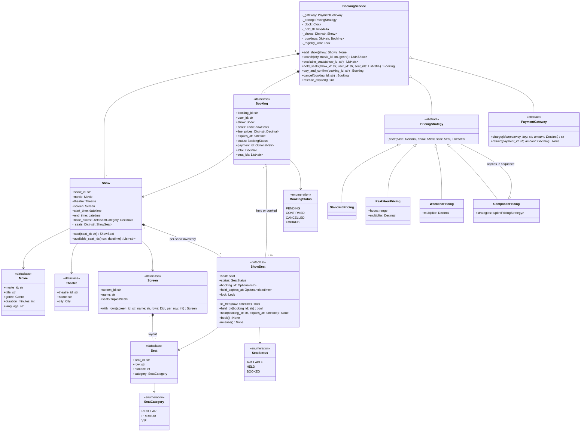

# 🧠 Movie Ticket Booking LLD — Thought Process Guide

> **Goal:** Learn *how* to think when designing a Low-Level Design.

---

## 📊 Class Diagram



---

## ⏱️ How to run this in a 45–60 min interview

| Time | Step | What to say out loud |
|------|------|----------------------|
| 0–7 min | **Clarify** | "One theatre chain or a marketplace? Can a user pick specific seats? How long is a hold? What happens if payment completes after the hold expires? Cancellations and refunds in scope? Max seats per booking?" |
| 7–15 min | **Entities** | "A screen has a seat *layout*; a show has seat *inventory*. Status lives on `ShowSeat`, never on the screen's seat." Draw `Show → ShowSeat (status, booking_id, expires_at)` and `Booking (PENDING/CONFIRMED/CANCELLED/EXPIRED)`. |
| 15–30 min | **Core flow** | `hold_seats` → `pay_and_confirm` → `cancel`. Write `hold_seats` first: validate, lock, check all, hold all. |
| 30–42 min | **Concurrency** | "Two users, same seat: check-and-hold must be atomic, so lock. Several seats: lock them in sorted order or two users with overlapping seats deadlock. Payment is slow and external, so no lock around it; re-check ownership and expiry under the lock when confirming." |
| 42–52 min | **Extension** | Likely: hold expiry details, cancellation fees, flash sale, distributed version (DB conditional update). |
| 52–60 min | **Testing** | "Fake clock for expiry boundaries; a gateway hook to force expiry *during* payment; 32 threads on one seat → exactly one wins; opposite-order requests → no deadlock." |

### Clarifying questions worth asking

1. **Seat selection:** specific seats, or "best available N"? (Best-available needs an allocator, but the same locking.)
2. **Hold duration** and whether it extends when payment starts.
3. **Late payment:** if the hold lapsed, refund, or honour it if the seat is still free? (This code: if the hold has lapsed when the charge returns, the booking expires and the charge is refunded, even if nobody took the seat. A friendlier policy confirms anyway when every seat is still free. Either is fine; state which one you chose.)
4. **Cancellation:** allowed until when, and with what refund?
5. **Scale:** one process (in-memory locks are enough) or many app servers (the DB is the arbiter)?
6. **Max seats per booking** (anti-hoarding) and per-user limits during a flash sale.

---

## Phase 1: Identify the Nouns

> *"Users search shows of a movie in a city, pick seats for a show, hold them briefly, pay, and get a confirmed booking they can cancel."*

| Noun | Decision | Why |
|------|----------|-----|
| `Movie`, `Theatre`, `Screen`, `Seat` | Frozen dataclasses | Catalogue data; never changes during booking |
| `Show` | Class | Movie + screen + time + base prices + **its own seat inventory** |
| `ShowSeat` | Mutable dataclass with a lock | The thing users compete for |
| `Booking` | Mutable dataclass | Links user, show, seats, snapshotted prices, payment |
| `PricingStrategy` | ABC | Peak, weekend, composite; `Decimal` |
| `PaymentGateway` | ABC | External, idempotent, can fail |
| `BookingService` | Facade | Orchestrates hold → pay → confirm / cancel / expire |

The noun people miss is **`ShowSeat`**. Putting status on `Seat` makes every show on the screen share one seat map.

## Phase 2: Assigning Responsibilities

| Action | Owner | Why |
|--------|-------|-----|
| Is this seat free now? | `ShowSeat.is_free(now)` | Includes lazy expiry |
| Hold N seats atomically | `BookingService.hold_seats` + `locked_in_order` | Needs all seats' locks at once |
| Price a seat | `PricingStrategy.price` | Varies by time, day, demand |
| Charge / refund | `PaymentGateway` | External; idempotent by booking id |
| Confirm only if still ours | `BookingService.pay_and_confirm` | Re-check under lock after the slow call |
| Release lapsed holds | Lazy in `is_free`; tidy in `release_expired` | Correctness can't depend on a cron job |

## Phase 3: The Seat Locking Problem

**The hardest part of the design.** Three separate races, three answers:

| Race | Answer |
|------|--------|
| Two users click the same seat | Check-and-hold under the seat's lock; the second sees `HELD` |
| Users request overlapping *sets* of seats | Lock all requested seats in sorted order (no deadlock), check all, hold all (no partial holds) |
| Hold lapses while the user is paying, someone else takes the seat, then the payment succeeds | Never hold locks across payment; on return, re-check `held_by(booking_id)` and expiry under the locks; if lost, refund |

```python
with locked_in_order(seats):
    now = clock()
    taken = [s for s in seats if not s.is_free(now)]
    if taken: raise SeatUnavailable(taken)       # nothing changed
    for s in seats: s.hold(booking_id, now + ttl)
```

## Phase 4: Booking Flow

```
1. search(city, movie, date)           → shows
2. available_seats(show)               → snapshot (may be stale; that's fine)
3. hold_seats(show, user, seats)       → Booking PENDING, expires_at = now + 10 min
4. pay_and_confirm(booking)            → charge (idempotent) → lock → still ours? BOOKED : refund
5. cancel(booking)                     → release seats; refund if it was CONFIRMED
   release_expired()                   → PENDING past expiry → EXPIRED, seats released
```

## Phase 5: Quick Checklist

✅ **Per-show inventory**, not per-screen
✅ **All-or-nothing holds** with locks in a global order
✅ **Lazy expiry**: correctness without the sweeper
✅ **No lock across the payment call**; ownership re-checked after it
✅ **Idempotent payment** keyed by booking id
✅ **Decimal money**, prices snapshotted at hold time
✅ **Injected clock**; tests force the expiry-during-payment race deterministically
