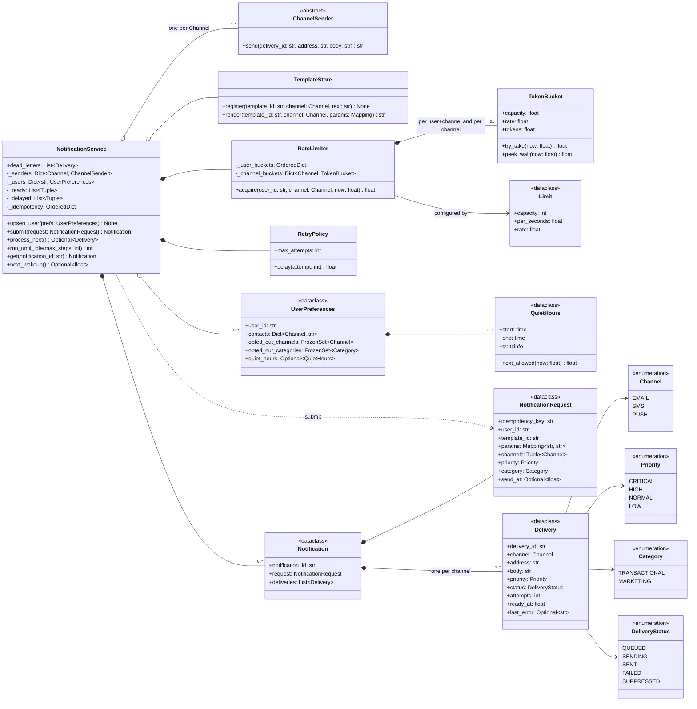

# 🧠 Notification Service LLD — Thought Process Guide

> **Goal:** Learn *how* to think when designing a Low-Level Design. A notification service looks like "call the provider for each channel". The interview is really about the policies wrapped around that call: **don't send twice, don't spam, don't wake people up, send the important things first, and don't lose anything when providers fail.**

---

## 📊 Class Diagram



---

## ⏱️ How to run this in a 45–60 min interview

| Time | Step | What to say out loud |
|------|------|----------------------|
| 0–7 min | **Clarify** | "Transactional (OTP, order updates) or marketing too? Which channels? Do users have preferences and quiet hours? What's the delivery guarantee: at-least-once with dedup?" |
| 7–15 min | **Entities and interfaces** | `NotificationRequest` → `Notification` → one `Delivery` per channel. `ChannelSender` (adapter per provider), `TemplateStore`, `UserPreferences`, `RateLimiter`, `RetryPolicy`. State `DeliveryStatus`. |
| 15–30 min | **Core code** | `submit()`: idempotency, render, fan out, opt-outs. `process_next()`: pick by priority, send, mark SENT. Get one channel working end to end. |
| 30–45 min | **Policies** | Retries with backoff (transient vs permanent), rate limits per user+channel (defer, don't drop), quiet hours at send time with midnight wrap, CRITICAL overrides. Two heaps for correct priority. |
| 45–60 min | **Concurrency and extension** | Multiple workers: claim under lock, send outside it. Then whatever they add: provider failover, digest batching, delivery receipts, a new channel. Close with how it maps to a queue + DB in production. |

### Clarifying questions worth asking

1. **Which channels, and which providers?** Email/SMS/push have very different cost, latency and limits.
2. **Transactional, marketing, or both?** Marketing needs opt-out (and legal compliance: CAN-SPAM, GDPR consent, TRAI DND in India); transactional usually can't be opted out of entirely.
3. **Delivery guarantee?** Exactly-once to a phone is not achievable end to end; agree on at-least-once with idempotency and dedup.
4. **Priorities?** Is an OTP allowed to jump the queue? Can it bypass quiet hours?
5. **Rate limits?** Per user per channel (anti-spam), per provider (quota), per tenant?
6. **Quiet hours?** Per user, in the user's timezone? What happens to messages generated during them: defer or drop?
7. **Scheduling?** "Send at 9 a.m. local time" is common.
8. **Templates and localisation?** Who owns templates; what happens on a missing variable?
9. **Do we need delivery receipts** (delivered / bounced / opened) or just "accepted by provider"?

---

## Phase 1: Identify the Nouns

| Noun | Decision | Why |
|------|----------|-----|
| `NotificationRequest` | frozen dataclass | What the caller asked for: key, user, template, params, channels, priority, category, send_at |
| `Notification` | dataclass | The accepted request plus its deliveries; what idempotency returns |
| `Delivery` | dataclass | One channel to one address: status, attempts, ready_at, last error |
| `UserPreferences` | dataclass | Contacts, channel and category opt-outs, quiet hours |
| `QuietHours` | frozen dataclass | Local window + tzinfo; `next_allowed(now)` |
| `TemplateStore` | class | Template per (id, channel); strict substitution |
| `ChannelSender` | ABC | Provider adapter |
| `RateLimiter` / `TokenBucket` | classes | Per-user+channel and per-channel buckets |
| `RetryPolicy` | class | Exponential backoff with full jitter |
| `NotificationService` | facade | Queues, locking, orchestration |

## Phase 2: Enums

```python
class Channel(Enum):        EMAIL, SMS, PUSH
class Priority(Enum):       CRITICAL=0, HIGH=1, NORMAL=2, LOW=3     # lower value = sent first
class Category(Enum):       TRANSACTIONAL, MARKETING
class DeliveryStatus(Enum): QUEUED, SENDING, SENT, FAILED, SUPPRESSED
```

## Phase 3: Where each policy is checked

| Policy | When | Why then |
|--------|------|----------|
| Idempotency key | submit | Client retries arrive at submit |
| Content dedup | submit | Upstream double-fires arrive at submit |
| Opt-outs | submit | Permanent decision; record SUPPRESSED with a reason |
| Quiet hours | send | Retries and scheduled sends can land in the window |
| Rate limits | send | Limits are about send rate, not request rate |
| Retry / DLQ | after send | Depends on the provider's answer |

## Phase 4: Priority done right

One heap ordered by `(ready_at, priority)` sends a LOW that became ready a millisecond earlier before a CRITICAL. Instead keep a **delayed heap** by `ready_at` and a **ready heap** by `(priority, seq)`; move due items from delayed to ready before each pop. `seq` keeps FIFO within a priority. Mention starvation: under sustained HIGH load LOW never runs; fix with aging or a weighted share per priority.

## Phase 5: Retries without making things worse

- **Transient** (timeout, 5xx, 429): retry with `uniform(0, min(cap, base * 2^(n-1)))` (full jitter) so retries from many workers don't synchronise.
- **Permanent** (invalid number, hard bounce, unregistered device): fail now. Retrying hurts sender reputation and costs money.
- After `max_attempts`, dead-letter it with the last error so someone can inspect and replay.
- Deferrals (quiet hours, rate limit) are not attempts.

## Phase 6: Concurrency

One service lock guards the heaps and records. A worker pops and marks the delivery SENDING under the lock (so no other worker can take it), releases the lock, calls the provider, and re-acquires it to record the result. The rate limiter checks and debits both buckets under its own lock, so N workers can't overshoot a user's limit.

## Phase 7: Quick checklist

✅ Request → notification → per-channel deliveries
✅ Idempotency key with TTL, plus a content dedup window, both bounded
✅ Opt-outs at submit; quiet hours (wrapping midnight, user timezone) and rate limits at send
✅ Strict priority among ready deliveries; CRITICAL exemptions stated explicitly
✅ Transient vs permanent errors, backoff with jitter, dead letters
✅ Lock not held during provider calls; concurrency tests for exactly-once processing and rate limits
