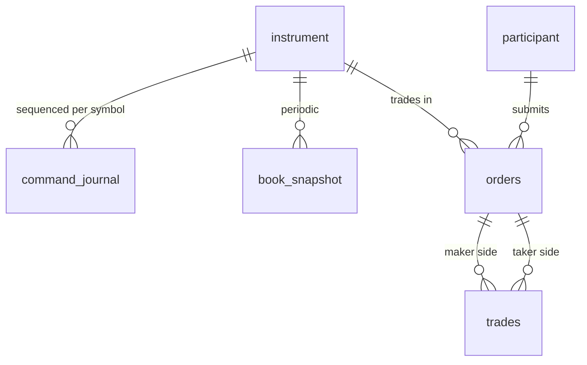

# 🗄️ Order Matching Engine — Database Schema & Relationships

> **Database:** PostgreSQL 16 (post-trade / recovery store; not on the matching hot path)
> **Purpose:** Command journal for replay, book snapshots, order and trade projections for clients, clearing and audit
> **Tables:** 6 tables

The matching engine never reads from these tables while trading. The **journal** is the source of truth (in production it usually lives in a replicated log such as Aeron/Raft or Kafka and is archived here); `orders` and `trades` are projections rebuilt from events.

---

## 📊 Entity Relationship Diagram



---

## 1. instrument

```sql
CREATE TABLE instrument (
    symbol          TEXT PRIMARY KEY,
    tick_size       NUMERIC(18, 8) NOT NULL CHECK (tick_size > 0),
    lot_size        BIGINT NOT NULL DEFAULT 1 CHECK (lot_size > 0),
    partition_id    INT NOT NULL,              -- which engine shard owns it
    status          TEXT NOT NULL DEFAULT 'TRADING'
                    CHECK (status IN ('TRADING', 'HALTED', 'CLOSED'))
);
```

## 2. participant

```sql
CREATE TABLE participant (
    participant_id  TEXT PRIMARY KEY,
    stp_group       TEXT,                      -- self-trade prevention group
    max_order_qty   BIGINT NOT NULL,
    kill_switch     BOOLEAN NOT NULL DEFAULT FALSE
);
```

## 3. command_journal (source of truth)

```sql
CREATE TABLE command_journal (
    symbol          TEXT   NOT NULL REFERENCES instrument(symbol),
    seq             BIGINT NOT NULL,           -- assigned by the sequencer
    session_date    DATE   NOT NULL,
    command_type    TEXT   NOT NULL CHECK (command_type IN ('NEW', 'CANCEL', 'REPLACE')),
    payload         BYTEA  NOT NULL,           -- the serialized command, exactly as applied
    sequenced_at    TIMESTAMPTZ NOT NULL,      -- stamped by the sequencer, part of the input
    PRIMARY KEY (symbol, session_date, seq)
) PARTITION BY RANGE (session_date);
```

- Append-only; never updated. Replay = `SELECT ... WHERE symbol = $1 AND session_date = $2 AND seq > $3 ORDER BY seq`.
- `payload` stores the command as the engine saw it (ticks, not decimals) so replay doesn't depend on conversion code.

## 4. book_snapshot

```sql
CREATE TABLE book_snapshot (
    symbol          TEXT   NOT NULL REFERENCES instrument(symbol),
    session_date    DATE   NOT NULL,
    last_seq        BIGINT NOT NULL,           -- replay resumes at last_seq + 1
    payload         BYTEA  NOT NULL,           -- every resting order in priority order
    checksum        TEXT   NOT NULL,
    created_at      TIMESTAMPTZ NOT NULL DEFAULT now(),
    PRIMARY KEY (symbol, session_date, last_seq)
);
```

The snapshot must store resting orders **in queue order per level**, not just aggregated depth; otherwise time priority is lost on restore.

## 5. orders (projection)

```sql
CREATE TABLE orders (
    symbol          TEXT   NOT NULL,
    session_date    DATE   NOT NULL,
    order_id        BIGINT NOT NULL,           -- = seq of the NewOrder command
    participant_id  TEXT   NOT NULL REFERENCES participant(participant_id),
    cl_ord_id       TEXT   NOT NULL,           -- client's idempotency key
    side            TEXT   NOT NULL CHECK (side IN ('BUY', 'SELL')),
    order_type      TEXT   NOT NULL CHECK (order_type IN ('LIMIT', 'MARKET')),
    tif             TEXT   NOT NULL CHECK (tif IN ('GTC', 'IOC', 'FOK')),
    price_ticks     BIGINT,                    -- NULL for market orders
    quantity        BIGINT NOT NULL CHECK (quantity > 0),
    filled_qty      BIGINT NOT NULL DEFAULT 0,
    status          TEXT   NOT NULL,
    last_seq        BIGINT NOT NULL,           -- last event applied; makes the projector idempotent
    PRIMARY KEY (symbol, session_date, order_id),
    UNIQUE (participant_id, session_date, cl_ord_id),
    CHECK (filled_qty <= quantity)
);

CREATE INDEX idx_orders_open ON orders (participant_id)
    WHERE status IN ('NEW', 'PARTIALLY_FILLED');
```

The projector applies an event only if `event.seq > orders.last_seq`, so redelivered events are no-ops.

## 6. trades

```sql
CREATE TABLE trades (
    symbol          TEXT   NOT NULL,
    session_date    DATE   NOT NULL,
    trade_id        BIGINT NOT NULL,           -- deterministic per symbol/session
    seq             BIGINT NOT NULL,           -- command that produced it
    price_ticks     BIGINT NOT NULL,
    quantity        BIGINT NOT NULL CHECK (quantity > 0),
    maker_order_id  BIGINT NOT NULL,
    taker_order_id  BIGINT NOT NULL,
    taker_side      TEXT   NOT NULL,
    PRIMARY KEY (symbol, session_date, trade_id)
);

CREATE INDEX idx_trades_maker ON trades (symbol, session_date, maker_order_id);
CREATE INDEX idx_trades_taker ON trades (symbol, session_date, taker_order_id);
```

`trade_id` is deterministic (a counter inside the book), so a replayed trade has the same primary key and `INSERT ... ON CONFLICT DO NOTHING` makes the projector idempotent.

---

## 🔑 Design notes

- **Prices as `BIGINT` ticks**, matching the engine. Convert to decimal (`price_ticks * tick_size`) only in views and reports.
- **Partition by `session_date`**: the journal is huge and only the current session is hot. Old partitions move to cheap storage and are dropped from the primary.
- **No foreign key from `trades` to `orders`**: projections can arrive out of order across consumers, and the journal, not the FK, guarantees integrity.
- **`(participant_id, session_date, cl_ord_id)` unique** backs the gateway's idempotency check for status queries and resend handling.
