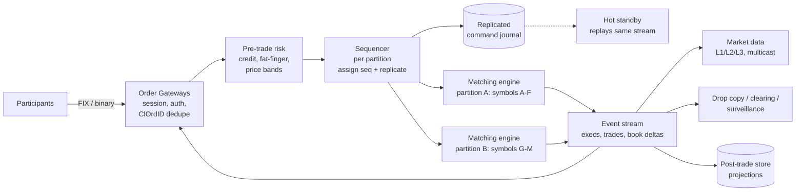
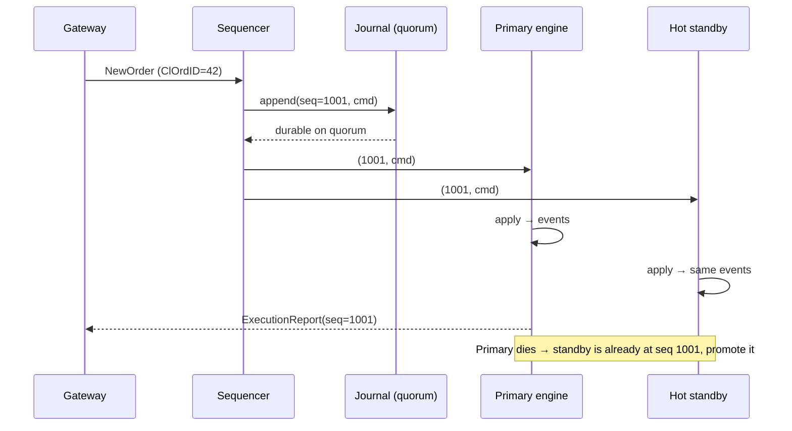

# 🏗️ Order Matching Engine — High-Level Design

> **Target Level:** Senior/Staff Engineer
>
> **Focus:** Exchange order book with price-time matching, a single-writer sequencer per symbol, and event-sourced recovery by deterministic replay

---

## 1. SYSTEM OVERVIEW

**Purpose:** Accept orders from trading participants, match them by price-time priority per instrument, and publish executions and market data.

**Users:** Broker/participant trading systems (FIX or binary protocol), market data consumers, clearing/settlement, surveillance.

**Design targets (illustrative):**

| Metric | Target |
|--------|--------|
| Instruments | 10K symbols |
| Peak inbound messages | ~1M msgs/s across all symbols; ~100K msgs/s on the hottest symbol |
| Order-to-ack latency | p99 < 100 µs inside the matching tier (real top-tier venues are in single- to low-double-digit µs) |
| Durability | No acked order or trade is ever lost |
| Failover | Hot standby takes over in < 1 s with identical state |
| Cancels | Typically the majority of messages; most orders never trade |

**Non-goals here:** clearing/settlement, margin, auctions (opening/closing cross), but the architecture leaves room for them.

---

## 2. HIGH-LEVEL ARCHITECTURE

**Hot path:** gateway → risk → sequencer → engine → event stream → gateway (ack/fill). Everything on it is in memory; the only I/O is replicating the journal entry.
**Cold path:** event stream → databases, analytics, regulatory reporting. Never blocks the hot path.

---

## 3. KEY COMPONENTS & INTERVIEW Q&A

### Order Gateway
- Terminates client sessions, authenticates, validates syntax, converts prices to integer ticks.
- **Idempotency:** clients tag each order with a `ClOrdID` unique per session. The gateway rejects duplicates, so a client that resends after a timeout can't double-submit. The dedupe set must survive gateway failover: rebuild it from the event stream (orders carry `client_id` + `ClOrdID`) or keep it in the sequenced state.
- **Cancel-on-disconnect**: if a session drops, optionally cancel its resting orders (participants ask for this to limit risk while they're blind).

### Pre-trade risk
- Credit / position limits, max order size, price collars (reject a buy far above the reference price), self-trade prevention group checks, kill switch per participant.
- Stateful limits (open exposure) need the same single-writer treatment as the book, or they race. Common design: risk state lives in the same sequenced partition as the account, or is checked against conservative per-gateway allocations.

### Sequencer + journal
- Assigns a monotonically increasing `seq` per partition and appends the command to a replicated log **before** the engine applies it. The ack to the client goes out only after the entry is durable on a quorum.
- Implementation options: Raft-replicated log (Aeron Cluster), a primary/backup pair with synchronous replication, or Kafka (`acks=all`, `min.insync.replicas=2`, one partition per engine shard, idempotent producer). Kafka adds milliseconds; ultra-low-latency venues use custom replication over kernel-bypass networking.

**🔴 Interview Question:** *"Why a sequencer instead of locks around each order book?"*

**✅ Answer:**
1. **Determinism.** A recorded total order of inputs plus a deterministic engine gives identical outputs on any replica. Lock acquisition order is decided by the scheduler and isn't recorded, so you can't replay or replicate it.
2. **Matching is serial per symbol anyway.** Every order touches the same best price. Locks add contention and cache-line transfers without adding parallelism.
3. **Predictable latency.** One pinned thread, no lock handoffs, no context switches, data hot in cache.
4. **Parallelism comes from partitioning symbols**, not from threads inside a book.

### Matching engine (this LLD)
- One `OrderBook` per symbol, many symbols per engine thread/partition. Pure function of `(state, command) → (state', events)`.
- Pre-allocated object pools and price-banded arrays in production to avoid allocation and GC pauses on the hot path.

**🔴 Interview Question:** *"A hot symbol saturates its engine thread. What now?"*

**✅ Answer:** You can't split one symbol's book across threads without giving up price-time priority. Options: move other symbols off that partition (rebalancing happens at a sequenced boundary, e.g. start of day), make the single thread faster (no allocation, no I/O, batching of outbound events), and throttle per participant at the gateway. Rebalancing intra-day requires a snapshot handoff at an agreed `seq`.

### Event stream and market data
- Events: accepted, rested, trade, cancelled, rejected, each carrying the command `seq`. Consumers are idempotent on `(partition, seq)`.
- Market data publishes incremental book updates with their own sequence numbers over UDP multicast, plus a snapshot channel for late joiners and gap recovery.
- **Back-pressure rule:** the engine writes to a ring buffer and moves on. A slow consumer falls behind and re-syncs from a snapshot; it never slows matching.

---

## 4. RECOVERY: EVENT SOURCING AND REPLAY

- **Snapshots:** every N commands, serialize the book with its last `seq`. Recovery = snapshot + replay of `seq > snapshot.seq`. Snapshot cadence trades disk/CPU for recovery time; with ~1M cmds/s and replay at a few M cmds/s, a minute of journal replays in well under a minute.
- **Determinism checklist:** no wall clock inside the engine (time priority = `seq`; if timestamps are needed in reports, the sequencer stamps them into the command so replay sees the same value), no randomness, no iteration over unordered collections, no floats, single thread.
- **Detect divergence:** primary and standby publish a rolling hash of outputs; mismatch is a page-the-on-call event.
- **Start of day:** books start empty (or reloaded GTC orders from the previous session's final snapshot), journal starts at `seq = 1`.

---

## 5. FAILURE MODES

| Failure | Effect | Mitigation |
|---------|--------|------------|
| Engine crash | Partition stops matching | Hot standby promoted; it has applied the same journal |
| Sequencer leader crash | No new seqs | Consensus elects a new leader; uncommitted entries were never acked, so clients retry with the same ClOrdID |
| Split brain (two sequencers) | Two divergent histories | Consensus with fencing (term/epoch in every entry); engines reject entries from stale terms |
| Gateway crash | Clients disconnected | Reconnect to another gateway; resend with same ClOrdID; dedupe prevents doubles; optional cancel-on-disconnect |
| Client timeout, unknown outcome | Client unsure if the order landed | Order status query by ClOrdID; resend is safe because of dedupe |
| Market data packet loss | Consumer has a gap | Gap detection by sequence number; retransmit request or snapshot recovery |
| Slow downstream consumer | Growing lag | Ring buffer + independent cursors; never back-pressure the engine |
| Non-deterministic bug | Standby diverges | Output hash comparison; halt partition rather than trade on divergent state |
| Fat finger / runaway algo | Huge or off-market orders | Price collars, max order size, per-participant kill switch, market-wide circuit breakers (trading halts) |

---

## 6. CONSISTENCY CHOICES

- **Within a partition:** strict serializability. One total order of commands, applied by one thread.
- **Across partitions:** no cross-symbol atomicity. Multi-leg orders (spreads) need either all legs in the same partition or a dedicated implied-matching engine.
- **Ack semantics:** a client ack means "durably sequenced". A crash after ack but before matching is fine because replay will match it.
- **Downstream stores** (orders table, trades table) are eventually consistent projections of the event stream, idempotent on `(partition, seq)`.

---

## 7. CAPACITY SKETCH

- Order message ≈ 64–128 bytes on the wire in a binary protocol. 1M msgs/s × 100 B ≈ 100 MB/s into the journal, ~8.6 TB/day if sustained (it isn't; volume is bursty around open/close). Retain journals for replay and audit; compress and move to object storage after the session.
- Book memory: 1M resting orders × ~100 B ≈ 100 MB. Fits comfortably in RAM on one host.
- A tuned single-threaded engine in Java/C++ handles millions of simple commands per second; the Python LLD here is ~100× slower and exists to show the structure, not the speed.

---

## 8. TRADE-OFF ANALYSIS

| Decision | Chosen | Alternative | Why |
|----------|--------|-------------|-----|
| Concurrency | Single writer per partition | Locks per book | Determinism, replay, latency |
| Durability | Journal inputs before ack | Persist state after each order | Smaller, append-only, enables replicas |
| Replication | Hot standby replaying the stream | Cold restore from DB | Sub-second failover |
| Price type | Integer ticks | Decimal/float | Exact and fast |
| Matching rule | Price-time (FIFO) | Pro-rata | Standard for equities; pro-rata used in some futures to reward size |
| Market data transport | UDP multicast + snapshots | TCP per consumer | Fan-out without per-consumer back-pressure |
