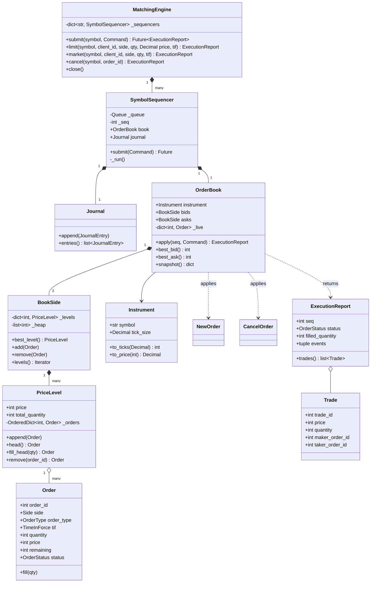

# 🧠 Order Matching Engine LLD — Thought Process Guide

> **Goal:** Reason your way to a correct, deterministic order book in an interview, then defend the data-structure and concurrency choices.

---

## 📊 Class Diagram



---

## ⏱️ How to run this in a 45–60 min interview

| Time | Step | What to say out loud |
|------|------|----------------------|
| 0–7 min | **Clarify** | "Limit + market, price-time priority, partial fills, cancel. IOC/FOK as stretch. One book per symbol. In-memory, single process, but I'll design so it can be made durable." |
| 7–15 min | **Entities + interfaces** | Name `Order`, `PriceLevel`, `BookSide`, `OrderBook`, `Trade`. Say the key decision early: "prices are integer ticks, time priority is the sequence number, not a timestamp." |
| 15–40 min | **Core code** | `PriceLevel` (FIFO), `BookSide` (best price), `OrderBook._match` loop, rest-or-cancel the remainder, cancel by id. Run 3 scenarios by hand: no cross, partial fill across two makers, sweep two levels. |
| 40–50 min | **Concurrency** | "The book is single-threaded on purpose. One sequencer thread per symbol; clients enqueue. That gives a total order, which gives determinism, which gives replay." |
| 50–60 min | **Extension** | IOC/FOK (FOK needs a dry-run liquidity check), then whatever they ask: modify, stop orders, self-trade prevention (see Interview Questions). |

If you are behind at minute 35, drop FOK and the sequencer code; *say* how they work. A correct `_match` loop beats a half-written engine.

---

## Phase 0: Clarifying questions worth asking

1. **Order types?** Limit and market only, or also stop / iceberg / pegged? (Assume limit + market, TIF GTC/IOC/FOK.)
2. **Matching rule?** Price-time (FIFO) is the default for equities. Some futures markets use pro-rata. Confirm FIFO.
3. **Trade price?** The resting (maker) order's price. An aggressive buy at 105 against an ask at 100 trades at 100: price improvement goes to the taker.
4. **Can market orders rest?** No. A market order has no price; unfilled remainder is cancelled. So market + GTC is rejected.
5. **Price representation?** Tick size per instrument. Engine uses integer ticks; the boundary converts from `Decimal`.
6. **Multiple symbols?** Yes, but symbols are independent: no cross-symbol atomicity needed. That makes per-symbol sharding trivial.
7. **Durability / recovery in scope?** Usually "discuss". Plan for a journal anyway, because it shapes the concurrency model.
8. **Self-trade prevention, modify/replace?** Typical follow-ups; park them.

## Phase 1: Identify the nouns

> *"Clients send buy and sell orders for a symbol. Orders that cross the best opposite price trade; the rest wait in the book in price then time order."*

| Noun | Decision | Why |
|------|----------|-----|
| Side, OrderType, TimeInForce, OrderStatus | Enum | Closed sets; makes invalid combinations explicit |
| Instrument | Frozen dataclass | Symbol + tick size; owns `Decimal` ↔ ticks conversion |
| Order | Mutable dataclass | Identity + `remaining` changes as it fills |
| PriceLevel | Class | FIFO queue of orders at one price + running total |
| BookSide | Class | Price → level map + best-price index |
| OrderBook | Class | The matching state machine for one symbol |
| NewOrder / CancelOrder | Frozen dataclass | **Commands**: the input stream we journal and replay |
| Trade, OrderAccepted, OrderRested, OrderCancelled, OrderRejected | Frozen dataclass | **Events**: the output stream for market data / clearing |
| SymbolSequencer, Journal | Class | Single writer per symbol + write-ahead command log |

## Phase 2: Pick the data structures (the real question)

What the hot path needs:

| Operation | Frequency | Structure | Cost |
|-----------|-----------|-----------|------|
| Best bid / ask | Every order | Heap of prices (max-heap for bids via negation) | O(1) peek, amortized |
| Add at existing price | Very common | `dict[price] → PriceLevel` | O(1) |
| Add at new price | Common | heap push | O(log L) |
| Fill the oldest order at a level | Every trade | `OrderedDict` head | O(1) |
| Cancel by order id | Very common (most orders are cancelled, not filled) | `dict[order_id] → Order` + `OrderedDict.pop` | O(1) |

L = number of price levels on one side.

Why `OrderedDict` and not `deque` for a level: a deque gives FIFO but cancel-from-the-middle is O(n). `OrderedDict` is a hash map plus a doubly linked list, i.e. the classic "intrusive linked list + id map" exchanges use.

Why a heap and not a sorted list: inserting a new level in a sorted list is O(L) shifting. A balanced tree (Java `TreeMap`, C++ `std::map`) is the textbook answer: O(log L) insert and in-order iteration. Python's stdlib has no balanced tree, so heap + dict + lazy deletion is the idiomatic stdlib choice. In production, if tick range is bounded, an **array indexed by tick offset** gives O(1) everything (see Interview Questions).

Lazy deletion detail: when a level empties, delete it from the dict right away, leave its heap entry, and pop stale entries when they surface at the top. A `_in_heap` set stops duplicate heap entries when a price level is emptied and re-created.

## Phase 3: Write the match loop first

```python
while taker.remaining > 0:
    level = contra.best_level()
    if level is None or not crosses(taker, level.price):
        break
    while taker.remaining > 0 and level:        # FIFO inside the level
        qty = min(taker.remaining, level.head().remaining)
        maker = level.fill_head(qty)
        taker.fill(qty)
        emit Trade(price=level.price, ...)       # maker's price
    contra.drop_level_if_empty(level)
```

Then the tail decides what happens to the remainder: LIMIT + GTC rests; IOC and MARKET cancel; FOK never gets here with a remainder because it was pre-checked.

## Phase 4: Assign responsibilities

| Action | Owner | Why |
|--------|-------|-----|
| Decimal → ticks, reject off-tick / float | `Instrument.to_ticks` | Validate at the boundary, keep the core integer-only |
| Business validation (qty > 0, market has no price) | `OrderBook._validate` | Deterministic → part of replay; emits `OrderRejected` |
| Price-time matching | `OrderBook._match` | One place owns the invariant "book is never crossed after a command" |
| FIFO + level total | `PriceLevel` | Keeps `total_quantity` correct for depth and FOK |
| Best price | `BookSide.best_level` | Hides the heap / lazy-deletion details |
| Ordering, journaling, publishing | `SymbolSequencer` | The only writer; turns concurrent callers into one stream |
| Routing by symbol | `MatchingEngine` | Facade; symbols match in parallel |

## Phase 5: Concurrency — say "single writer" before they ask

- `OrderBook` has **no locks** and that is the design, not an omission.
- Many client threads call `engine.submit()`. Each symbol's `queue.Queue` linearizes them. One worker thread per symbol assigns `seq`, journals the command, applies it, publishes events, then resolves the caller's `Future`.
- Time priority = `seq`. No wall clock in the book, so replaying the journal gives byte-identical trades.
- Symbols are independent, so throughput scales by sharding symbols across threads/cores/machines.
- Listeners run on the sequencer thread and are wrapped in try/except: a broken consumer must not stall matching. In production they read from a ring buffer instead (LMAX Disruptor style).

## Phase 6: Quick checklist

✅ Integer ticks; `Decimal` only at the edge; floats refused
✅ Price priority across levels, FIFO within a level, trade at maker price
✅ Partial fills on both taker and maker; level totals stay correct
✅ Market orders and IOC never rest; FOK is all-or-nothing with no side effects
✅ Cancel is O(1) and a cancel of a dead order is a normal reject, not an exception
✅ Book never left crossed after any command
✅ Single writer per symbol; journal + replay reproduces the book exactly
