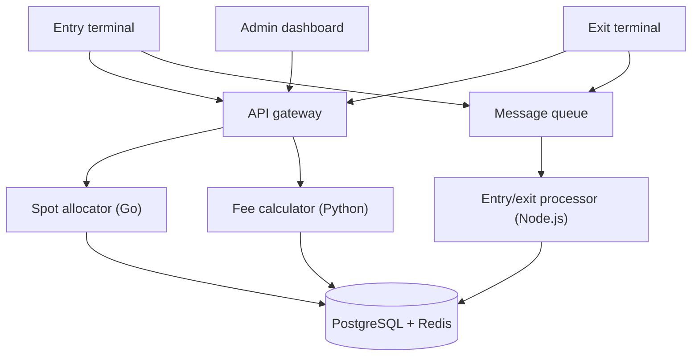
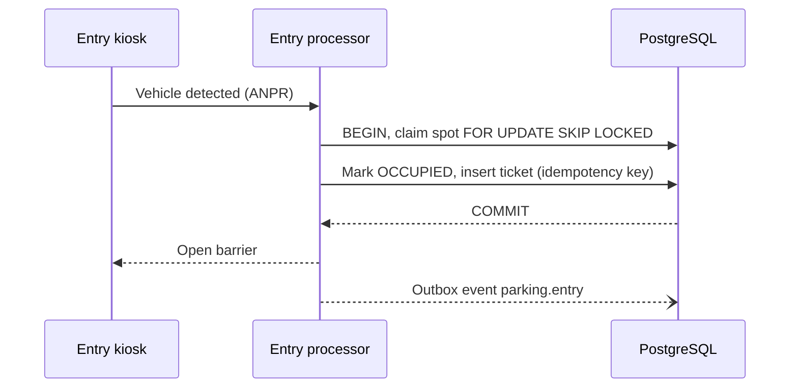
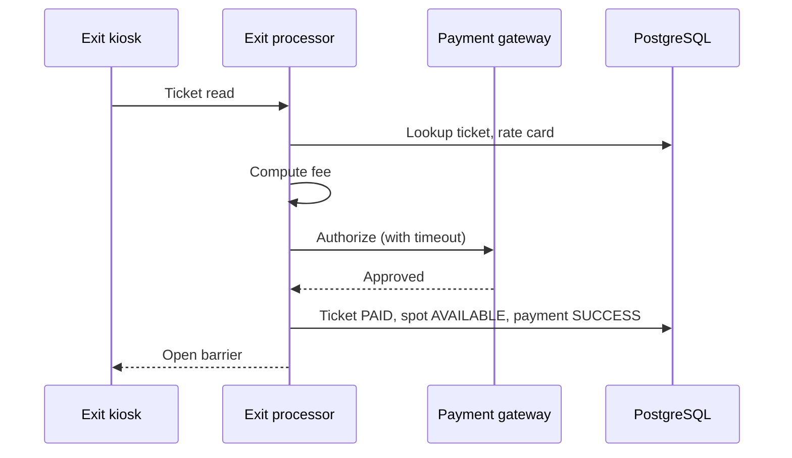

# 🏗️ Parking Lot System — High-Level Design (Production)

> **Target Level:** Senior/Staff Engineer  
> **Focus:** Multi-floor parking, spot allocation, fee calculation, concurrency, resilience

---

## 1. SYSTEM OVERVIEW

**Purpose:** Multi-floor parking facility with automated fee collection and real-time spot allocation.

**Scale:** 10 floors × 500 spots = 5,000 total. Peak: 500 entries/hr, 500 exits/hr. Target 99.99% availability.

**What those numbers mean:** 1,000 gate events/hour is ~0.3 writes/second. A single PostgreSQL primary handles that with >1000× headroom; the spot table (5,000 rows) fits in memory. The hard problems here are **correctness under concurrent gates, idempotency against flaky gate hardware, and staying usable when the network or payment provider is down** — not throughput. A staff answer says this early and keeps the architecture proportionate: one service + one DB per lot is a fine starting point; the multi-service split below is what a large operator running hundreds of lots ends up with.

**Domain:** Smart mobility infrastructure with distributed entry/exit terminals.

---

## 2. SYSTEM ARCHITECTURE

```
┌──────────────┐          ┌──────────────┐          ┌──────────────┐
│ Entry        │          │ Exit         │          │ Admin        │
│ Terminal     │          │ Terminal     │          │ Dashboard    │
│ (Kiosk +     │          │ (Kiosk +     │          │ (Web UI)     │
│  Barrier)    │          │  Barrier)    │          │              │
└──────┬───────┘          └──────┬───────┘          └──────┬───────┘
       │                         │                         │
       └────────────┬────────────┘────────────┬────────────┘
                    │                         │
           ┌────────▼────────┐       ┌────────▼────────┐
           │  API Gateway    │       │  Message Queue  │
           │  (REST/WebSocket)│       │  (RabbitMQ/SQS)│
           └────────┬────────┘       └────────┬────────┘
                    │                         │
    ┌───────────────┼─────────────────────────┘
    │               │                         
┌───▼──────┐  ┌─────▼──────┐          ┌───────▼──────┐
│ Spot     │  │ Fee        │          │ Entry/Exit   │
│ Allocator│  │ Calculator │          │ Processor    │
│ Service  │  │ Service    │          │ (Async)      │
│ (Go)     │  │ (Python)   │          │ (Node.js)    │
└───┬──────┘  └─────┬──────┘          └───────┬──────┘
    │               │                         │
    └───────────────┼─────────────────────────┘
                    │
          ┌─────────▼──────────┐
          │ PostgreSQL (Aurora)│
          │   + Redis cache    │
          └────────────────────┘
```

*Figure: gates, services and stores.*



### 🎬 Animated Sequence Diagram

<p align="center">
  <video controls width="900" style="border-radius: 12px; box-shadow: 0 4px 24px rgba(0,0,0,0.3);" loop playsinline preload="metadata">
    <source src="../../../assets/videos/parking-lot-sequence.mp4" type="video/mp4" />
    Your browser does not support the video tag.
  </video>
  <br/>
  <em>🎬 Animated Parking Lot Sequence — Entry → Spot Allocation → Ticket → Payment → Exit. Click ▶ to play/pause. Created with <a href="https://remotion.dev">Remotion</a>.</em>
</p>

---

## 3. PARKING FLOW

### Entry Flow
```
1. Driver arrives at entry gate
2. Entry kiosk detects vehicle (ANPR camera)
3. Entry processor:
   a. Check availability (Redis cache hit: ~2ms; advisory only)
   b. In ONE DB transaction: claim a spot (FOR UPDATE SKIP LOCKED),
      mark it OCCUPIED, insert the ticket with the gate's idempotency key
   c. Commit, THEN open the barrier (never open on an uncommitted claim)
   d. Publish event: parking.entry (outbox table → bus, for analytics/display)
4. Driver parks at assigned spot
```

*Figure: entry flow; the barrier opens only after the claim commits.*



### Exit Flow
```
1. Driver arrives at exit gate
2. Exit kiosk reads ticket / ANPR lookup
3. Exit processor:
   a. Lookup ticket in PostgreSQL
   b. Calculate fee (base rate + duration + tax) using the rate card stamped on the ticket
   c. Authorize payment SYNCHRONOUSLY with a timeout (the driver is waiting at the barrier)
   d. On success, in one transaction: ticket → PAID, spot → AVAILABLE, payment row SUCCESS
   e. Open barrier
   f. Publish event: parking.exit (via outbox)
   Capture, retries and reconciliation run async afterwards; the authorization cannot.
4. Driver exits
```

*Figure: exit flow; authorization is synchronous, capture and retries are async.*



---

## 4. KEY COMPONENTS & INTERVIEW Q&A

### Spot Allocation Service (Go)
- Finds nearest available spot matching vehicle type
- Maintains availability in Redis (O(1) lookups)
- Handles floor preference (closest floor to entrance fills first)

**🔴 Interview Question:** *"How do you handle concurrent entry requests at multiple gates?"*

**✅ Answer:** Use database-level pessimistic locking with a timeout:
```sql
BEGIN;
SELECT id FROM parking_spot
WHERE floor_id = ANY(:floors_in_lot) AND status = 'AVAILABLE' AND spot_type = :type
ORDER BY floor_id ASC, spot_number ASC
LIMIT 1
FOR UPDATE SKIP LOCKED;  -- Skip rows another gate has locked
UPDATE parking_spot SET status = 'OCCUPIED', version = version + 1 WHERE id = :picked;
INSERT INTO ticket (...) VALUES (...);
COMMIT;
```
If the query joins `floor` to filter by lot, write `FOR UPDATE OF parking_spot SKIP LOCKED`; a bare `FOR UPDATE` locks the joined `floor` row too, and a second gate would then *skip every spot on that floor*.
`FOR UPDATE SKIP LOCKED` (PostgreSQL 9.5+) allows multiple concurrent entry processors to grab different spots without waiting for each other — essential for high-throughput scenarios.

### Fee Calculation Service (Python)
- Strategy Pattern: `HourlyFeeCalculator`, `DailyFeeCalculator`, `WeekendFeeCalculator`
- Supports promotions via Decorator Pattern
- Money as `NUMERIC` / `Decimal`; billing units round up (started hour), currency quantized once at the end

**🔴 Interview Question:** *"How would you implement fee calculation with different strategies?"*

**✅ Answer:** Strategy + Decorator pattern:
```python
# Strategy pattern for interchangeable fee logic
fee = HourlyFeeCalculator().calculate_fee(duration, spot_type)

# Decorator pattern for composable add-ons
fee = TaxDecorator(
    WeekdaySurchargeDecorator(
        HourlyFeeCalculator()
    )
).calculate_fee(duration, spot_type)
```

### Entry/Exit Processor (Node.js, Async)
- Processes entry/exit events via message queue
- Handles edge cases: lost tickets, overstay, payment failure
- Publishes events for real-time display boards

---

## 5. DATA MODEL & DB SCHEMA

### PostgreSQL Tables

**parking_lot:**
```sql
CREATE TABLE parking_lot (
    id UUID PRIMARY KEY DEFAULT gen_random_uuid(),
    name VARCHAR(255) NOT NULL,
    address TEXT,
    total_floors INT NOT NULL,
    total_spots INT NOT NULL,
    created_at TIMESTAMPTZ DEFAULT NOW()
);
```

**floor:**
```sql
CREATE TABLE floor (
    id UUID PRIMARY KEY DEFAULT gen_random_uuid(),
    parking_lot_id UUID NOT NULL REFERENCES parking_lot(id),
    floor_number INT NOT NULL,  -- negative for basements
    label VARCHAR(50),  -- "B1", "B2", "1", "2", "R"
    UNIQUE(parking_lot_id, floor_number)
);
```

**parking_spot:**
```sql
CREATE TABLE parking_spot (
    id UUID PRIMARY KEY DEFAULT gen_random_uuid(),
    floor_id UUID NOT NULL REFERENCES floor(id),
    spot_number VARCHAR(10) NOT NULL,
    spot_type VARCHAR(20) NOT NULL CHECK (spot_type IN ('MOTORCYCLE', 'COMPACT', 'LARGE', 'EV', 'HANDICAP')),
    status VARCHAR(20) DEFAULT 'AVAILABLE' CHECK (status IN ('AVAILABLE', 'OCCUPIED', 'RESERVED', 'MAINTENANCE')),
    version INT DEFAULT 1,  -- For optimistic locking
    UNIQUE(floor_id, spot_number)
);

-- Composite index for availability queries
CREATE INDEX idx_spot_floor_type_status ON parking_spot(floor_id, spot_type, status);
-- Partial index for fast available spot lookup
CREATE INDEX idx_spot_available ON parking_spot(id) WHERE status = 'AVAILABLE';
```

**ticket:**
```sql
CREATE TABLE ticket (
    id UUID PRIMARY KEY DEFAULT gen_random_uuid(),
    spot_id UUID NOT NULL REFERENCES parking_spot(id),
    vehicle_license_plate VARCHAR(20) NOT NULL,
    vehicle_type VARCHAR(20) NOT NULL,
    entry_time TIMESTAMPTZ NOT NULL DEFAULT NOW(),
    exit_time TIMESTAMPTZ,
    fee DECIMAL(10,2),
    status VARCHAR(20) DEFAULT 'ACTIVE' CHECK (status IN ('ACTIVE', 'PAID', 'LOST')),
    payment_method VARCHAR(20),
    payment_transaction_id VARCHAR(255),
    idempotency_key VARCHAR(64) UNIQUE,  -- For idempotent processing
    version INT DEFAULT 1,
    created_at TIMESTAMPTZ DEFAULT NOW()
);

-- At most one ACTIVE ticket per spot and per plate (DB-enforced invariants)
CREATE UNIQUE INDEX uq_ticket_active_spot  ON ticket(spot_id) WHERE status = 'ACTIVE';
CREATE UNIQUE INDEX uq_ticket_active_plate ON ticket(vehicle_license_plate) WHERE status = 'ACTIVE';
CREATE INDEX idx_ticket_entry ON ticket(entry_time DESC);
-- idempotency_key needs no extra index: UNIQUE already creates one
```

**rate_card:**
```sql
CREATE TABLE rate_card (
    id UUID PRIMARY KEY DEFAULT gen_random_uuid(),
    parking_lot_id UUID NOT NULL REFERENCES parking_lot(id),
    spot_type VARCHAR(20) NOT NULL,
    hourly_rate DECIMAL(8,2) NOT NULL,
    daily_max DECIMAL(8,2),
    weekly_rate DECIMAL(8,2),
    grace_period_minutes INT DEFAULT 15,
    is_active BOOLEAN DEFAULT true,
    effective_from DATE NOT NULL,
    effective_to DATE,
    UNIQUE(parking_lot_id, spot_type, effective_from)
);
```

**payment:**
```sql
CREATE TABLE payment (
    id UUID PRIMARY KEY DEFAULT gen_random_uuid(),
    ticket_id UUID NOT NULL REFERENCES ticket(id),
    amount DECIMAL(10,2) NOT NULL,
    currency VARCHAR(3) DEFAULT 'USD',
    method VARCHAR(20) NOT NULL CHECK (method IN ('CASH', 'CARD', 'UPI', 'WALLET', 'SUBSCRIPTION')),
    status VARCHAR(20) DEFAULT 'PENDING' CHECK (status IN ('PENDING', 'SUCCESS', 'FAILED', 'REFUNDED')),
    gateway_response JSONB,
    idempotency_key VARCHAR(64) UNIQUE,
    created_at TIMESTAMPTZ DEFAULT NOW()
);
```

### Redis Cache Keys

```ascii
parking:{lot_id}:available_count        → STRING (total available spots)
parking:{lot_id}:floor:{n}:available     → SET (available spot IDs on floor n)
parking:{lot_id}:spot:{id}:status        → STRING (AVAILABLE/OCCUPIED)
parking:{lot_id}:spot:{id}:lock          → STRING (distributed lock, TTL 5s)
```

### Performance Considerations

| Operation | Cache | DB | Latency |
|-----------|-------|----|---------|
| Check availability | Redis `GET available_count` | — | < 1ms |
| Find available spot | — | `FOR UPDATE SKIP LOCKED` (DB is the source of truth; a Redis `SPOP` set drifts on crashes) | ~5ms |
| Create ticket | — | PostgreSQL INSERT | ~10ms |
| Check ticket on exit | Redis `GET ticket:{id}` | PostgreSQL (cache miss) | < 2ms / ~20ms |
| Calculate fee | — | PostgreSQL rate_card lookup | ~5ms |

---

## 6. CONCURRENCY & EDGE CASES

### Concurrency Handling

| Scenario | Approach | How |
|----------|----------|-----|
| Two gates check same spot simultaneously | `SELECT ... FOR UPDATE SKIP LOCKED` | Each transaction locks a different row |
| Payment timeout | Async queue + DLQ | Payment failed → retry 3x → send to DLQ → manual review |
| Display board updates | Redis Pub/Sub on spot status change | Real-time updates to all boards |
| Lost ticket | Plate lookup + flat penalty + ID verification | `status = 'LOST'`, charge fee-so-far + penalty (typically one day's `daily_max`) |
| Same entry event delivered twice (gate retry) | Idempotency key | `INSERT ... ON CONFLICT (idempotency_key) DO NOTHING RETURNING *`, else return the existing ticket |
| Same exit scanned twice | Conditional update | `UPDATE ticket SET status='PAID' WHERE id=? AND status='ACTIVE'`; rowcount 0 → return the stored receipt |

### Edge Cases

- **Vehicle leaves without paying (tailgating):** ANPR at exit captures plate; ticket moves to an UNPAID/collections state (not LOST, which means "ticket lost, fee paid"); invoice sent to registered owner
- **System crash mid-parking:** Tickets persisted in PostgreSQL; on restart, active tickets are recovered
- **Grace period:** 15-minute grace for entry-exit without parking; no fee charged
- **Overstay after payment:** Pay-by-plate cameras at exit; re-calculate fee on actual exit time
- **Handicap spot misuse:** Penalty fee + warning to registered vehicle owner

---

## 7. TRADE-OFF ANALYSIS

| Decision | Choice | Rationale | Alternative |
|----------|--------|-----------|-------------|
| Spot allocation | Nearest-available | Minimal driver walking | Even-distribution (balances floor usage) |
| Fee rounding | Bill per started unit (hour), quantize currency once with an explicit mode | Matches posted tariffs; avoids accumulated per-step rounding error | Per-minute billing (fairer, but needs clear signage and a minimum charge) |
| Locking strategy | `SKIP LOCKED` | High throughput, no deadlocks | `NOWAIT` (fails immediately) or `FOR UPDATE` (blocks) |
| Cache layer | Redis | < 1ms reads, Pub/Sub for real-time boards | Memcached (no Pub/Sub, no data structures) |
| Payment | Sync authorization at the gate, async capture/reconciliation | Driver is waiting; barrier must know the outcome | Fully async (barrier opens on unknown outcome → revenue leak) |

---

## 8. FAILURE MODES & CONSISTENCY

| Failure | What happens | Design response |
|---------|--------------|-----------------|
| Gate loses network to the backend | Can't claim spots or validate tickets | Gate runs in **offline mode**: issues locally-signed tickets with a gate-generated UUID and queues events; on reconnect they replay idempotently. Accept temporary over-subscription; the lot is physical, drivers will find a spot or leave. |
| DB commit succeeded, response lost | Gate retries entry | Same idempotency key → returns the existing ticket; no second spot claimed |
| Barrier fails to open after commit | Ticket exists, car still outside | Staff override; an un-entered ticket with no ANPR sighting is voided after N minutes by a sweeper |
| Payment provider timeout | Unknown payment outcome | Retry auth with the same idempotency key; if still unknown, fall back to "pay later by plate" and open the barrier, rather than trapping cars |
| Redis down | Boards/app availability stale | Serve from DB (tiny table); Redis is never on the write path |
| Primary DB fails over | Seconds of write unavailability | Multi-AZ failover; gates retry with idempotency keys; synchronous replication so committed tickets aren't lost |
| Spot status drifts from reality (car parked in wrong spot) | Counts slightly wrong | Occupancy sensors / periodic reconciliation; allocate by **type capacity** rather than exact spot when sensors are absent |

**Consistency choice:** the lot's DB is the single source of truth and the only place a spot is claimed (strong consistency, one primary per lot). Everything else (Redis counts, boards, the mobile app, analytics) is a derived, eventually consistent view fed from an outbox. This keeps the one invariant that matters — a spot is never sold twice — inside a single ACID transaction.

---

## 9. COST (Monthly Estimate)

| Component | Configuration | Cost |
|-----------|--------------|------|
| Application servers (Go) | 4 instances, t3.medium | $400 |
| PostgreSQL (Aurora) | db.r6g.large, Multi-AZ, 100GB | $500 |
| Redis (ElastiCache) | cache.r6g.large, 1 node | $200 |
| Message Queue (SQS) | 1M requests | $30 |
| Entry/Exit kiosks (IoT) | 10 kiosks × $50 | $500 |
| Monitoring + logging | CloudWatch, Grafana | $100 |
| **Total** | | **$1,730** |
