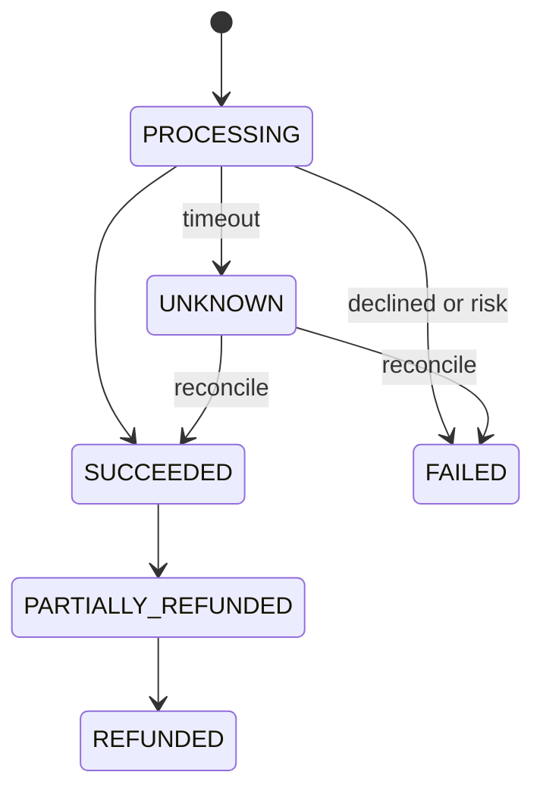
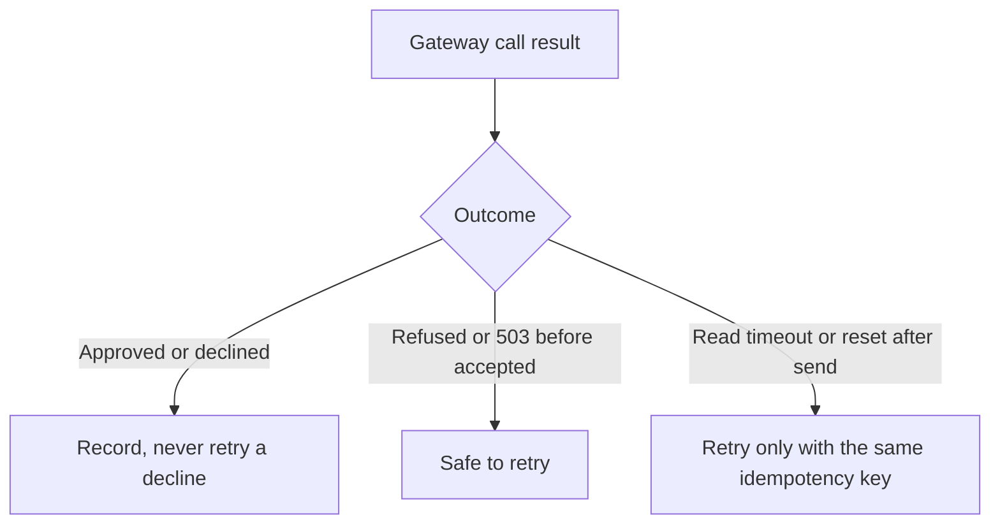

# Payment Processing System - Interview Questions & Answers

> **Target Level:** Senior/Staff Engineer (6+ years)  
> **Evaluation Focus:** Idempotency, the payment state machine, money representation, retries vs double-charge, refund invariants, reliable events

---

## Question 1: Core Design
**Interviewer:** *"Design a payment processing system — payments, refunds, fraud checks."*

### 🎯 Expected Answer

```
PROCESSING ──▶ SUCCEEDED ──▶ PARTIALLY_REFUNDED ──▶ REFUNDED
     │   └──▶ FAILED (declined / risk)
     └──────▶ UNKNOWN (timeout) ──reconcile──▶ SUCCEEDED | FAILED
```

Entities: `Money(Decimal, Currency)`, `PaymentRequest(idempotency_key, merchant_id, customer_id, amount, payment_token)`, `Payment` (status, gateway reference, refunds), `Refund` (own key, PENDING/SUCCEEDED/FAILED). Interfaces: `PaymentGateway` (one adapter per provider) and `RiskRule`. Lead with the two invariants: **at most one charge per idempotency key** and **refunds never exceed the captured amount**.

*Figure: payment state machine; a timeout leaves the payment UNKNOWN until reconciled.*



---

## Question 2: "How do you guarantee idempotency?"

### 🎯 Answer

The common answer is wrong in a subtle way:

```python
existing = redis.get(key)          # two concurrent requests both see None
if existing: return existing
result = gateway.charge(...)       # both charge
redis.setex(key, 86400, result)
```

It is check-then-act, and the result lives in a different store from the payment, so a crash between `charge` and `setex` loses it. The correct shape:

1. **Claim the key atomically before acting**: `INSERT INTO payments (merchant_id, idempotency_key, request_hash, status) VALUES (..., 'PROCESSING') ON CONFLICT DO NOTHING`. If you didn't insert, read the existing row: same request hash → return its stored result (or 409 if still PROCESSING); different hash → 422.
2. **Forward the same key to the gateway** (Stripe, Adyen and most modern gateways accept one). Your own dedup cannot help if *your* request timed out after the gateway charged the card; theirs can.
3. **Persist the outcome** in the same row.

Keys are scoped per merchant (two merchants may both send `order-1`) and expire after a retention window (Stripe: at least 24 hours). The code does exactly this in `PaymentService.pay`.

---

## Question 3: "The gateway call times out. Do you retry?"

### 🎯 Answer

Classify first:

| Outcome | Processed? | Action |
|---------|------------|--------|
| Approved / declined | Yes, definite | Record. Never retry a decline. |
| Connection refused, DNS failure, 503 before the request was accepted | No | Safe to retry |
| Read timeout, connection reset after send | **Unknown** | Retry only with the **same** idempotency key |

Retry with exponential backoff and jitter (full jitter: `sleep(uniform(0, min(cap, base * 2**n)))`) so a gateway blip doesn't turn into a synchronised retry storm. When the budget is exhausted, mark the payment **UNKNOWN**, not FAILED: telling the customer "failed" invites a second payment while the first may have succeeded. A reconciler re-sends with the same key (the gateway returns the original outcome), or queries the charge by reference, or consumes the gateway's webhook. `test_timeout_after_charge_does_not_double_charge` and `test_exhausted_retries_leave_unknown_then_reconcile` cover this.

*Figure: deciding whether a gateway error can be retried.*



---

## Question 4: "Why not float? What about rounding?"

### 🎯 Answer

`0.1 + 0.2 == 0.30000000000000004`. Money is either an integer of minor units (`amount_minor=1999, currency="USD"`) or a `Decimal` quantized to the currency's exponent. Currencies differ: USD/EUR/INR have 2 decimals, JPY 0, some (BHD, KWD) 3. Round once, at a defined point (fee calculation), with a defined mode (half-up for fees here; banker's rounding is common in accounting), and never mix currencies implicitly. DB column: `NUMERIC(19,4)` or `BIGINT` minor units, never `FLOAT`/`DOUBLE`.

---

## Question 5: Refunds
**Interviewer:** *"Support partial refunds. Two support agents click refund at the same time."*

### 🎯 Answer

Invariant: `sum(succeeded refunds) + sum(pending refunds) <= captured amount`.

Under the payment's lock (in SQL, `SELECT ... FOR UPDATE` on the payment row): compute refundable, reject if insufficient, insert the refund as PENDING. *Then* call the gateway outside the lock. PENDING counts against refundable, so the second agent's request sees the hold and is rejected or limited. Outcomes: approved → SUCCEEDED, payment moves to PARTIALLY_REFUNDED / REFUNDED; declined → FAILED, hold released; timeout → stays PENDING, reconciled later with the refund's own idempotency key. A refund is only allowed from SUCCEEDED or PARTIALLY_REFUNDED, never from UNKNOWN. `test_concurrent_refunds_never_exceed_captured_amount` fires 25 parallel 10.00 refunds at a 100.00 payment: exactly 10 succeed.

---

## Question 6: "How do other services learn a payment succeeded?"

### 🎯 Answer

Dual write is the trap: update the DB, then publish to Kafka. If the publish fails, the order service never ships; if you publish first and the DB commit fails, it ships an unpaid order. **Transactional outbox**: in the same transaction as the status update, insert an `outbox` row. A relay (polling or CDC with Debezium) publishes rows in order and marks them sent. Delivery is at-least-once (relay can crash after publish, before marking), so consumers dedupe on `event_id`. The `Outbox` class models this; `relay()` stops at the first publish failure to preserve order.

---

## Question 7: Multiple gateways and failover

### 🎯 Answer

`PaymentGateway` adapters plus a router (by currency, card network, cost, success rate). Failover has a sharp edge: you may only fail over a request that **definitely did not reach** the first gateway (connection refused, circuit open). After a timeout the first gateway may have charged the card; sending the same payment to a second gateway is a double charge, because idempotency keys are not shared between providers. So: circuit breaker per gateway (CLOSED → OPEN after N failures → HALF_OPEN lets one probe through), failover only on "not processed" errors, UNKNOWN + reconcile otherwise.

---

## Question 8: Fraud / risk checks

### 🎯 Answer

Ordered list of `RiskRule`s evaluated before the gateway: hard limits (amount, blocked BINs/countries), velocity per customer/card/IP (sliding window; count *attempts*, because card-testing bots mostly fail), then an ML score with three bands: allow, manual review, block. Rules short-circuit, so put cheap rules first and keep stateful rules (velocity) aware that they only see requests that passed earlier rules. Tune thresholds against chargeback cost vs lost revenue from false declines; ship new rules in shadow mode first.

---

## Question 9: Settlement & Reconciliation

Daily, per merchant: `net = captured − refunds − fees − chargebacks`, computed from the ledger, paid out via ACH/NEFT. Reconciliation is a three-way match: our ledger vs the gateway's settlement report vs the bank statement. Any mismatch (missing charge, amount differs, unknown reference) goes to an exception queue. This is also where UNKNOWN payments that reconcile could not resolve finally get an answer.

A staff-level addition: a **double-entry ledger** (every movement is a debit and a credit that sum to zero, e.g. `customer_receivable −100, merchant_payable +97.10, fee_revenue +2.90`). Balances are derived; the invariant `sum(all entries) == 0` catches bugs that single-column balances hide.

---

## Question 10: PCI DSS

| Requirement | Practice |
|-------------|----------|
| Minimise scope | Card data goes from the browser/app straight to the provider (hosted fields / SDK); we store only tokens. Tokens alone are not cardholder data |
| If PAN is stored | Render it unreadable at rest (strong cryptography, truncation, or tokenization); never store CVV after authorization |
| In transit | TLS 1.2+ on all hops carrying card data |
| Keys | Documented key management with defined cryptoperiods and rotation (PCI does not mandate a fixed 90 days) |
| Access | Least privilege, MFA, audit logs of access to cardholder data |
| Validation | Level 1 service providers need an annual Report on Compliance by a QSA; smaller ones may self-assess with a SAQ |

---

## 🔁 Follow-ups interviewers push on

**"Add authorize and capture."** New states AUTHORIZED → CAPTURED / VOIDED (and auth expiry, typically ~7 days for cards). Capture can be partial; capture and void each need their own idempotency key. Refunds apply to captured amounts only.

**"Add webhooks from the gateway."** Verify the signature, dedupe on the provider's event id, and apply as a state transition through the same table. Webhooks arrive out of order and more than once, so a `charge.succeeded` for a payment already SUCCEEDED is a no-op, and a stale event cannot move a payment backwards.

**"Chargebacks / disputes."** DISPUTED is entered from SUCCEEDED or a refunded state; the disputed amount is debited from the merchant's balance immediately and returned if the dispute is won. Refunding a disputed payment risks paying twice, so block refunds while DISPUTED.

**"What if the idempotency store is down?"** Fail closed for the charge path: refuse rather than charge without dedup. Since the key lives on the payment row in the primary DB, "the store is down" means the DB is down, and you cannot record the payment anyway.

**"How do you test this?"** A fake gateway with scriptable faults (`timeout_after` is the important one), an injectable sleep and clock, unit tests for every transition and for money rounding, and concurrency tests that line threads up on a barrier and assert invariants (one charge, refunds ≤ amount). In production: reconciliation jobs as continuous tests, and a chaos test that kills the service between gateway response and DB commit.

---

## ⚠️ Common mistakes

- Floats for money, or percentages as floats.
- Idempotency via "check cache, then charge, then store": racy, and lost on crash.
- Not forwarding the idempotency key to the gateway, so a timeout retry double-charges.
- Treating a timeout as a failure ("please try again" → customer pays twice).
- Retrying declines, or retrying without backoff/jitter.
- A status setter that accepts any value; no terminal states.
- Incrementing `refunded_amount` before the gateway call and never undoing it on failure, or checking refundable without a lock.
- Publishing events outside the DB transaction.
- Failing over to a second gateway after a timeout.

---

## 🎯 Senior vs Staff signal

- **Senior:** Decimal money, idempotency with a unique constraint, explicit state machine, refund bounds, retries with backoff, solid tests.
- **Staff:** separates "not processed" from "unknown" and designs UNKNOWN + reconciliation; knows the key must reach the gateway and why cross-gateway failover after a timeout is unsafe; enforces the refund invariant under concurrency with holds; uses an outbox and dedupe-on-consume; brings up a double-entry ledger and three-way reconciliation; defines what is synchronous to the client and what is eventually consistent.

---

## Design Patterns

| Pattern | Where | Why |
|---------|-------|-----|
| **Strategy / Adapter** | `PaymentGateway` | One interface over Stripe, Razorpay, a simulator |
| **State machine** | `ALLOWED_TRANSITIONS` | Legal transitions in one table |
| **Facade** | `PaymentService` | One entry point owns idempotency and locking |
| **Pipeline of rules** | `RiskRule` list | Composable pre-auth checks (a list is simpler than a linked Chain of Responsibility and does the same job) |
| **Retry with backoff** | `RetryPolicy` | Transient failures only |
| **Transactional outbox** | `Outbox` | Reliable events without dual writes |
