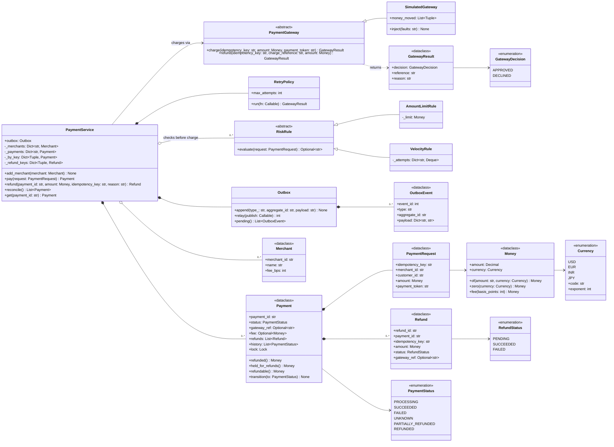

# 🧠 Payment Processing LLD — Thought Process Guide

> **Goal:** Learn *how* to think when designing a Low-Level Design. In a payments round, gateway strategies and validator chains are table stakes. What gets evaluated is whether you can say, precisely, why your design **never charges a customer twice and never refunds more than was captured**, including when the network lies to you.

---

## 📊 Class Diagram



---

## ⏱️ How to run this in a 45–60 min interview

| Time | Step | What to say out loud |
|------|------|----------------------|
| 0–7 min | **Clarify** | "Are we the merchant integrating with Stripe, or the payment processor itself? I'll assume we're a payment service in front of external gateways." Pin down auth/capture vs one-step charge, partial refunds, currencies. |
| 7–15 min | **Entities, money, states** | `Money(Decimal, Currency)` first, and say why not float. Draw the state machine including **UNKNOWN**. Name the interfaces: `PaymentGateway`, `RiskRule`. |
| 15–35 min | **Core code** | `pay()` with idempotency: claim the key, call the gateway with the key, record the outcome. Then `refund()` with the refundable-amount check. Typed errors: conflict, in-progress, illegal transition, refund error. |
| 35–45 min | **Failure and concurrency** | Walk the timeout-after-charge case. Distinguish "definitely not processed" from "unknown". Retries with backoff and jitter, decline never retried, UNKNOWN + reconcile. Two refunds racing: hold before calling out. |
| 45–60 min | **Extension** | Whatever they add (auth/capture, second gateway with failover, webhooks, ledger, outbox for events). Point to where it plugs in. Close with the DB view: unique constraint on the key, outbox table. |

### Clarifying questions worth asking

1. **Are we the merchant or the processor?** Changes whether we own card data (PCI scope) or just tokens.
2. **One-step charge or authorize then capture?** E-commerce often authorizes at checkout and captures at shipment.
3. **Partial refunds? Multiple refunds per payment?** → the refund invariant.
4. **Currencies?** → minor units differ (JPY has none), no implicit FX.
5. **Who generates the idempotency key and how long is it valid?** (Client, typically a UUID per logical operation; Stripe keeps keys for at least 24 hours.)
6. **What does the gateway guarantee?** Does it accept an idempotency key? Does it send webhooks? Can we query a charge by our reference?
7. **Synchronous result required, or can the client poll / receive a webhook?** Decides whether UNKNOWN is visible to the client.
8. **Fraud checks: blocking, or async review?**

---

## Phase 1: Identify the Nouns

| Noun | Decision | Why |
|------|----------|-----|
| `Money` | frozen dataclass | Decimal + currency; validation and arithmetic in one place |
| `Merchant` | frozen dataclass | Fee in basis points (int), no float percentages |
| `PaymentRequest` | frozen dataclass | Exactly the fields that define "the same request" for idempotency |
| `Payment` | dataclass + lock | Aggregate root: status, gateway reference, refunds, history |
| `Refund` | dataclass | Own key, own status; PENDING holds its amount |
| `PaymentGateway` | ABC | Adapter per provider; must forward the idempotency key |
| `RiskRule` | ABC | Pre-auth checks returning a rejection reason |
| `RetryPolicy` | class | Backoff with jitter, only for transient gateway errors |
| `Outbox` | class | Events written atomically with state changes |
| `PaymentService` | facade | Idempotency, locking, orchestration |

## Phase 2: Enums and the state machine

```python
class PaymentStatus(Enum): PROCESSING, SUCCEEDED, FAILED, UNKNOWN, PARTIALLY_REFUNDED, REFUNDED
class RefundStatus(Enum):  PENDING, SUCCEEDED, FAILED

ALLOWED_TRANSITIONS = {
    PROCESSING:         {SUCCEEDED, FAILED, UNKNOWN},
    UNKNOWN:            {SUCCEEDED, FAILED},
    SUCCEEDED:          {PARTIALLY_REFUNDED, REFUNDED},
    PARTIALLY_REFUNDED: {PARTIALLY_REFUNDED, REFUNDED},
    FAILED: set(), REFUNDED: set(),
}
```

Say out loud: "A table, not a setter. FAILED and REFUNDED are terminal. UNKNOWN exists because a timeout is not a failure."

## Phase 3: Money

- `Decimal` built from strings, quantized to the currency's exponent (USD 2, JPY 0).
- Fees in basis points, rounded half-up once, at the minor unit.
- Same-currency arithmetic only. FX is a separate, explicit conversion with a recorded rate.

## Phase 4: Idempotency, the core of the round

1. **Claim before acting.** Insert the payment record keyed by `(merchant_id, key)` *before* calling the gateway. In SQL: `INSERT ... ON CONFLICT (merchant_id, idempotency_key) DO NOTHING` and check whether you won.
2. **Compare the request.** Same key + different body → reject.
3. **In flight → 409.** The client retries later and gets the stored result.
4. **Forward the key to the gateway.** This is the only thing that protects the timeout-after-charge case.

## Phase 5: Retries vs double-charge

| Gateway outcome | Meaning | Action |
|-----------------|---------|--------|
| Approved / Declined | Definite answer | Record it. Never retry a decline. |
| Unavailable (connection refused, 503 before acceptance) | Not processed | Retry with backoff |
| Timeout / connection reset after sending | Unknown | Retry **with the same key**; after the budget, mark UNKNOWN and reconcile |

## Phase 6: Refund invariant

`succeeded_refunds + pending_refunds <= captured_amount`, checked and the PENDING refund recorded under the payment lock before the gateway call. Declined refunds release the hold; unknown ones keep it until reconciled.

## Phase 7: Quick checklist

✅ Decimal money with currency exponent; no float anywhere
✅ Idempotency key claimed before the gateway call, compared against the request, forwarded to the gateway
✅ State machine as a transition table; UNKNOWN for timeouts; reconcile
✅ Retries only for transient errors, with backoff and jitter
✅ Refund holds make concurrent refunds safe
✅ Outbox for events; consumers dedupe by event id
✅ Tests for timeout-after-charge, duplicate concurrent requests, concurrent refunds
