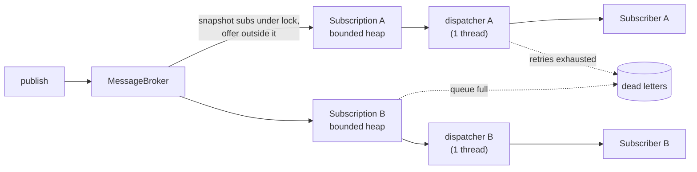

# Pub-Sub System — Implementation

> An in-process broker: topics, per-subscription bounded queues, one dispatcher per subscription, retry with backoff, and a dead-letter queue. Python 3.10+, stdlib only.

---

## 🗺️ Shape of the code

| Piece | Role |
|-------|------|
| `Message` | Frozen dataclass; headers wrapped read-only. Every subscriber gets the same object, so it must be immutable |
| `MessagePriority` | `IntEnum`, so priorities compare directly |
| `Subscriber` (ABC) | Observer: `subscriber_id`, `on_message()`. Raising means "failed, retry me" |
| `CallbackSubscriber` | Adapts a function to a `Subscriber` |
| `DedupingSubscriber` | Decorator: at-least-once delivery → effectively-once processing |
| `RetryPolicy` | Strategy for retries: `max_attempts`, exponential `delay(attempt)` |
| `Subscription` | One subscriber on one topic: filter, bounded priority queue, `dispatch_one()` |
| `DeadLetter` / `DeadLetterReason` | What failed, for which subscription, and why (`RETRIES_EXHAUSTED`, `OVERFLOW`) |
| `MessageBroker` | Facade: topics, subscribe/unsubscribe, publish, two run modes, DLQ |



---

## 🔑 Key design decisions

### 1. Fan out at publish time into a queue per subscription

The original design kept one queue per topic and delivered each message to every subscriber in turn, in one `flush()` loop. One slow or retrying subscriber then delayed every other subscriber on every topic. With a queue per subscription:

- **Isolation:** a slow subscriber only backs up its own queue (`test_slow_subscriber_does_not_delay_others`).
- **Independent failure handling:** retry and DLQ are per subscription. Subscriber A failing does not cause B to see a duplicate.
- **Cost:** the message object is shared, so fan-out costs one heap entry per subscriber, not a copy.

### 2. One dispatcher per subscription → ordering and no concurrent callbacks

Exactly one thread calls `dispatch_one()` for a given subscription. That gives each subscriber:
- messages in **priority order, FIFO within a priority** (heap key is `(-priority, publish_sequence)`), and
- **no concurrent calls**, so subscriber code needs no locking of its own.

The test publishes from 4 threads and asserts every subscriber sees each producer's messages in order with `max_active == 1`. Wanting more throughput for one subscriber means giving up one of those two properties, the same trade-off as partitions in Kafka (see Interview Questions).

The old `AsyncDelivery` (a new thread per message) broke both: unbounded threads, no ordering, and it reported success before the subscriber had run.

### 3. Retry in place, then dead-letter

```python
for attempt in range(1, retry.max_attempts + 1):
    try:
        subscriber.on_message(message); return
    except Exception:
        if attempt == retry.max_attempts: dead_letter(...); return
        sleep(retry.delay(attempt))
```

Retrying *in place* preserves order but blocks that subscription's queue during backoff (head-of-line blocking). The alternative, moving the message to a delayed retry queue and continuing, keeps the queue flowing but gives up ordering. Choose per subscriber; the in-place version is the right default when order matters.

The default sleep is `stop_event.wait(delay)`, so `close()` interrupts a backoff instead of waiting it out.

### 4. Bounded queues: overflow is dead-lettered, not blocking

A full subscription queue dead-letters the message with reason `OVERFLOW`. The publisher never blocks and memory is bounded. Other choices, and when they are right:

| Policy | Good for |
|--------|----------|
| Dead-letter / reject (this code) | Publishers must not stall; overflow is visible and replayable |
| Block the publisher (with timeout) | End-to-end backpressure when the producer can slow down |
| Drop oldest | Telemetry and "latest value wins" feeds |

### 5. Lock discipline

- `MessageBroker._lock` guards only the topic → subscriptions map. `publish` takes a snapshot under it and calls `offer()` outside it.
- Each `Subscription` has one `Condition` for its heap, in-flight count and closed flag.
- **No lock is held while subscriber code runs.** A subscriber can therefore call `unsubscribe()` on itself without deadlocking (tested), and a slow subscriber cannot stall `publish`.
- `_retire()` does not `join()` the current thread, for the same self-unsubscribe case.

### 6. Two run modes, one code path

`run_until_idle()` drives every subscription's `dispatch_one()` round-robin in the caller's thread: deterministic, used by the demo and most tests. `start()` runs one worker per subscription that calls the same `dispatch_one(block=True)`. The modes can't be mixed (`run_until_idle` raises once workers exist), because two dispatchers on one subscription would break ordering.

### 7. Delivery guarantee, stated honestly

At-least-once **with respect to subscriber failures**: a message is retried until it succeeds or is dead-lettered. **Not durable:** queues live in memory, so a process crash loses whatever is queued or in flight. Making it durable means an append-only log per topic and a committed offset per subscription (see [High-Level Design](HIGH_LEVEL_DESIGN.md)). Because of retries, a subscriber can see a message twice (it succeeded but raised afterwards, for example), so `DedupingSubscriber` shows the idempotent-consumer pattern. It records an id only after success, so a failed attempt is still retried.

---

## 🧩 Where to extend

| Requirement | Change |
|-------------|--------|
| Durability / replay | Replace the heap with an append-only log per topic; each `Subscription` keeps an offset and commits it after `on_message` returns |
| Wildcard topics (`orders.*`) | Match at `publish`: subscriptions stored by pattern, matched against the topic name (a trie by segment if there are many) |
| More throughput per subscriber, order per key | Add `key` to `Message`; N dispatchers per subscription, route `hash(key) % N`: order per key, parallelism across keys |
| Pull-based consumers | Expose `Subscription.poll(timeout)` and `ack(message_id)`; redeliver unacked messages after a visibility timeout |
| Message TTL | Check `timestamp + ttl` in `_take`; expired → dead-letter with a new `EXPIRED` reason |
| DLQ replay | `broker.replay(dead_letter)` re-offers to the original subscription |

---

## ▶️ How to run

```bash
cd python-low-level-design/pub-sub-system
python3 pub_sub_system.py                      # deterministic demo
python3 -m unittest test_pub_sub_system -v     # 16 tests, < 1 s
```

---

## 📄 Full source

<!-- source: pub_sub_system.py -->
```python
"""
Pub-Sub Messaging System - Low Level Design
-------------------------------------------
In-process broker: topics, subscriptions with their own bounded queues,
per-subscription dispatch with retry + dead-letter queue.

Key design decisions
  * Fan-out happens at publish time into one queue *per subscription*. A slow
    or failing subscriber only backs up its own queue; it never delays others.
  * Exactly one dispatcher drains each subscription, so a subscriber sees
    messages in order (priority first, FIFO within a priority) and is never
    called concurrently by the broker.
  * Delivery is at-least-once with respect to subscriber failures: a message is
    retried with backoff, then dead-lettered. Subscribers must be idempotent
    (see `DedupingSubscriber`). Nothing is persisted: a process crash loses
    queued messages. The HLD covers the durable, log-based version.
  * Queues are bounded. A full queue dead-letters the message for that
    subscription (reason OVERFLOW) instead of blocking the publisher or
    growing without limit.
  * Two run modes share the same code path: `run_until_idle()` dispatches in
    the caller's thread (deterministic: demo, tests) and `start()` runs one
    worker thread per subscription.

Python 3.10+, stdlib only.
"""

from __future__ import annotations

import heapq
import itertools
import threading
import time
import uuid
from types import MappingProxyType
from abc import ABC, abstractmethod
from collections import OrderedDict
from dataclasses import dataclass, field
from enum import Enum, IntEnum
from typing import Any, Callable, Mapping

Predicate = Callable[["Message"], bool]
Sleeper = Callable[[float], None]


# --- Messages -----------------------------------------------------------------

class MessagePriority(IntEnum):
    LOW = 0
    NORMAL = 1
    HIGH = 2
    CRITICAL = 3


@dataclass(frozen=True)
class Message:
    """Immutable once published: every subscriber gets the same object, so a
    mutable message would let one subscriber corrupt another's view."""

    topic: str
    payload: Any
    priority: MessagePriority = MessagePriority.NORMAL
    headers: Mapping[str, str] = field(default_factory=dict, compare=False)
    message_id: str = field(default_factory=lambda: str(uuid.uuid4()))
    timestamp: float = field(default_factory=time.time)

    def __str__(self) -> str:
        return f"Msg[{self.message_id[:8]}]({self.topic})"


class DeadLetterReason(Enum):
    RETRIES_EXHAUSTED = "retries_exhausted"
    OVERFLOW = "overflow"


@dataclass(frozen=True)
class DeadLetter:
    subscription_id: str
    message: Message
    reason: DeadLetterReason
    error: str = ""


# --- Subscribers (Observer) ---------------------------------------------------

class Subscriber(ABC):
    """Raise from `on_message` to signal failure; the broker retries."""

    @property
    @abstractmethod
    def subscriber_id(self) -> str: ...

    @abstractmethod
    def on_message(self, message: Message) -> None: ...


class CallbackSubscriber(Subscriber):
    def __init__(self, name: str, callback: Callable[[Message], None]) -> None:
        self._name = name
        self._callback = callback

    @property
    def subscriber_id(self) -> str:
        return self._name

    def on_message(self, message: Message) -> None:
        self._callback(message)

    def __str__(self) -> str:
        return self._name


class DedupingSubscriber(Subscriber):
    """Decorator that turns at-least-once delivery into effectively-once
    processing by remembering the last `capacity` message ids. Ids are recorded
    only after the inner subscriber succeeds, so a failed attempt is retried.
    In production the seen-set lives in the same transaction as the side
    effect (e.g. a unique key in the consumer's DB), not in memory."""

    def __init__(self, inner: Subscriber, capacity: int = 10_000) -> None:
        self._inner = inner
        self._seen: OrderedDict[str, None] = OrderedDict()
        self._capacity = capacity
        self._lock = threading.Lock()   # safe even if the same instance is subscribed twice

    @property
    def subscriber_id(self) -> str:
        return self._inner.subscriber_id

    def on_message(self, message: Message) -> None:
        with self._lock:
            if message.message_id in self._seen:
                return
            self._inner.on_message(message)
            self._seen[message.message_id] = None
            if len(self._seen) > self._capacity:
                self._seen.popitem(last=False)


# --- Retry policy (Strategy) --------------------------------------------------

@dataclass(frozen=True)
class RetryPolicy:
    max_attempts: int = 3
    base_delay: float = 0.1
    multiplier: float = 2.0
    max_delay: float = 5.0

    def __post_init__(self) -> None:
        if self.max_attempts < 1:
            raise ValueError("max_attempts must be >= 1")

    def delay(self, attempt: int) -> float:
        """Backoff after failed attempt number `attempt` (1-based)."""
        return min(self.max_delay, self.base_delay * self.multiplier ** (attempt - 1))


NO_RETRY = RetryPolicy(max_attempts=1)


# --- Subscription: bounded priority queue + dispatch --------------------------

class Subscription:
    """One subscriber's view of one topic. Owns a bounded priority queue
    (priority desc, then publish order) and delivers from it one message at
    a time. All queue state is guarded by one Condition."""

    def __init__(self, topic: str, subscriber: Subscriber, *,
                 predicate: Predicate | None, retry: RetryPolicy, max_queue: int,
                 dead_letter: Callable[[DeadLetter], None], sleep: Sleeper) -> None:
        self.topic = topic
        self.subscriber = subscriber
        self.subscription_id = f"{topic}/{subscriber.subscriber_id}"
        self._predicate = predicate
        self._retry = retry
        self._max_queue = max_queue
        self._dead_letter = dead_letter
        self._sleep = sleep
        self._heap: list[tuple[int, int, Message]] = []
        self._seq = itertools.count()
        self._cond = threading.Condition()
        self._in_flight = 0
        self._closed = False
        self.delivered = 0
        self.dead_lettered = 0

    # Producer side -------------------------------------------------------

    def offer(self, message: Message) -> bool:
        """Enqueue if the filter matches. Returns True if enqueued."""
        if self._predicate is not None and not self._predicate(message):
            return False
        with self._cond:
            if self._closed:
                return False
            if len(self._heap) >= self._max_queue:
                overflow = True
            else:
                overflow = False
                heapq.heappush(self._heap, (-message.priority, next(self._seq), message))
                self._cond.notify()
        if overflow:
            self._dead(message, DeadLetterReason.OVERFLOW, "queue full")
        return not overflow

    # Consumer side -------------------------------------------------------

    def _take(self, block: bool, timeout: float | None) -> Message | None:
        with self._cond:
            if block:
                self._cond.wait_for(lambda: self._heap or self._closed, timeout)
            if not self._heap or self._closed:
                return None
            self._in_flight += 1
            return heapq.heappop(self._heap)[2]

    def dispatch_one(self, block: bool = False, timeout: float | None = None) -> bool:
        """Deliver the next message with retries. Returns False if none was
        available. Only one thread may call this per subscription; that is
        what guarantees in-order, non-concurrent delivery to the subscriber."""
        message = self._take(block, timeout)
        if message is None:
            return False
        try:
            for attempt in range(1, self._retry.max_attempts + 1):
                try:
                    self.subscriber.on_message(message)
                    with self._cond:
                        self.delivered += 1
                    return True
                except Exception as exc:  # subscriber code is untrusted
                    if attempt == self._retry.max_attempts:
                        self._dead(message, DeadLetterReason.RETRIES_EXHAUSTED, repr(exc))
                        return True
                    self._sleep(self._retry.delay(attempt))
                    if self.closed:   # shutting down: stop retrying, keep the message visible
                        self._dead(message, DeadLetterReason.RETRIES_EXHAUSTED, "closed during retry")
                        return True
            return True
        finally:
            with self._cond:
                self._in_flight -= 1
                self._cond.notify_all()

    def _dead(self, message: Message, reason: DeadLetterReason, error: str) -> None:
        with self._cond:
            self.dead_lettered += 1
        self._dead_letter(DeadLetter(self.subscription_id, message, reason, error))

    # Lifecycle -----------------------------------------------------------

    def wait_idle(self, timeout: float | None = None) -> bool:
        with self._cond:
            return self._cond.wait_for(lambda: not self._heap and self._in_flight == 0, timeout)

    def close(self) -> None:
        """Stop accepting and delivering. Pending messages are discarded
        (a durable broker would keep them for a re-subscribe)."""
        with self._cond:
            self._closed = True
            self._heap.clear()
            self._cond.notify_all()

    @property
    def closed(self) -> bool:
        with self._cond:
            return self._closed

    @property
    def pending(self) -> int:
        with self._cond:
            return len(self._heap)


# --- Broker (Facade) ----------------------------------------------------------

class TopicNotFound(KeyError):
    pass


class MessageBroker:
    """Thread-safe registry of topics and subscriptions.

    Lock discipline: `_lock` guards the topic -> subscriptions map only. It is
    never held while calling a subscriber or another Subscription's lock, so
    subscriber code cannot deadlock or stall the broker."""

    def __init__(self, *, default_retry: RetryPolicy = RetryPolicy(),
                 max_queue: int = 10_000, sleep: Sleeper | None = None) -> None:
        self._topics: dict[str, dict[str, Subscription]] = {}
        self._lock = threading.Lock()
        self._default_retry = default_retry
        self._max_queue = max_queue
        self._stop = threading.Event()
        # Interruptible backoff by default, so close() is not stuck behind a sleep.
        self._sleep: Sleeper = sleep or (lambda s: self._stop.wait(s))
        self._workers: dict[str, threading.Thread] = {}
        self._started = False
        self._dlq: list[DeadLetter] = []
        self._dlq_lock = threading.Lock()

    # Topics --------------------------------------------------------------

    def create_topic(self, name: str) -> None:
        with self._lock:
            self._topics.setdefault(name, {})

    def delete_topic(self, name: str) -> None:
        with self._lock:
            subs = self._topics.pop(name, {})
        for sub in subs.values():
            self._retire(sub)

    def topics(self) -> list[str]:
        with self._lock:
            return sorted(self._topics)

    # Subscriptions -------------------------------------------------------

    def subscribe(self, topic: str, subscriber: Subscriber, *,
                  predicate: Predicate | None = None,
                  retry: RetryPolicy | None = None) -> Subscription:
        sub = Subscription(topic, subscriber, predicate=predicate,
                           retry=retry or self._default_retry, max_queue=self._max_queue,
                           dead_letter=self._record_dead_letter, sleep=self._sleep)
        with self._lock:
            subs = self._topics.get(topic)
            if subs is None:
                raise TopicNotFound(topic)
            if subscriber.subscriber_id in subs:
                raise ValueError(f"{subscriber.subscriber_id!r} already subscribed to {topic!r}")
            subs[subscriber.subscriber_id] = sub
            if self._started:
                self._spawn(sub)
        return sub

    def unsubscribe(self, topic: str, subscriber_id: str) -> None:
        with self._lock:
            sub = self._topics.get(topic, {}).pop(subscriber_id, None)
        if sub is not None:
            self._retire(sub)

    # Publishing ----------------------------------------------------------

    def publish(self, topic: str, payload: Any,
                priority: MessagePriority = MessagePriority.NORMAL,
                headers: dict[str, str] | None = None) -> Message:
        message = Message(topic, payload, priority, MappingProxyType(dict(headers or {})))
        with self._lock:
            subs = self._topics.get(topic)
            if subs is None:
                raise TopicNotFound(topic)
            targets = list(subs.values())       # snapshot; offer outside the broker lock
        for sub in targets:
            sub.offer(message)
        return message

    # Delivery: synchronous mode ------------------------------------------

    def run_until_idle(self) -> int:
        """Deliver everything queued, in the caller's thread, round-robin over
        subscriptions. Deterministic. Returns the number of messages handled."""
        if self._started:
            raise RuntimeError("broker is running worker threads; use wait_idle()")
        handled = 0
        while True:
            progressed = False
            for sub in self._all_subscriptions():
                if sub.dispatch_one():
                    handled += 1
                    progressed = True
            if not progressed:
                return handled

    # Delivery: threaded mode ---------------------------------------------

    def start(self) -> None:
        with self._lock:
            if self._started:
                return
            self._started = True
            for subs in self._topics.values():
                for sub in subs.values():
                    self._spawn(sub)

    def _spawn(self, sub: Subscription) -> None:   # caller holds self._lock
        def loop() -> None:
            while not sub.closed:
                sub.dispatch_one(block=True, timeout=0.1)

        t = threading.Thread(target=loop, name=f"dispatch-{sub.subscription_id}", daemon=True)
        self._workers[sub.subscription_id] = t
        t.start()

    def _retire(self, sub: Subscription) -> None:
        sub.close()
        with self._lock:
            worker = self._workers.pop(sub.subscription_id, None)
        if worker is not None and worker is not threading.current_thread():
            worker.join()

    def wait_idle(self, timeout: float = 5.0) -> bool:
        deadline = time.monotonic() + timeout
        return all(sub.wait_idle(max(0.0, deadline - time.monotonic()))
                   for sub in self._all_subscriptions())

    def close(self) -> None:
        self._stop.set()
        for sub in self._all_subscriptions():
            self._retire(sub)

    # Dead letters --------------------------------------------------------

    def _record_dead_letter(self, dl: DeadLetter) -> None:
        with self._dlq_lock:
            self._dlq.append(dl)

    def dead_letters(self) -> list[DeadLetter]:
        with self._dlq_lock:
            return list(self._dlq)

    def _all_subscriptions(self) -> list[Subscription]:
        with self._lock:
            return [s for subs in self._topics.values() for s in subs.values()]


# --- Demo ---------------------------------------------------------------------

def demo() -> None:
    printer = lambda name: CallbackSubscriber(name, lambda m: print(f"  [{name}] {m.topic}: {m.payload}"))

    broker = MessageBroker(sleep=lambda s: None)    # no real backoff in the demo
    for t in ("orders", "notifications"):
        broker.create_topic(t)

    print("=== Fan-out, priority order, filtering ===")
    broker.subscribe("orders", printer("Email"))
    broker.subscribe("orders", printer("Audit"))
    broker.subscribe("orders", printer("UrgentOnly"),
                     predicate=lambda m: m.priority >= MessagePriority.HIGH)
    broker.publish("orders", {"order_id": 1})
    broker.publish("orders", {"order_id": 2, "vip": True}, MessagePriority.HIGH)
    broker.publish("orders", {"order_id": 3})
    print(f"  handled {broker.run_until_idle()} deliveries (HIGH first, then FIFO)")

    print("\n=== Retry, then dead-letter ===")
    attempts = {"n": 0}

    def flaky(m: Message) -> None:
        attempts["n"] += 1
        if attempts["n"] < 3:
            raise ConnectionError("SMS gateway timeout")
        print(f"  [SMS] sent on attempt {attempts['n']}: {m.payload}")

    def broken(m: Message) -> None:
        raise ValueError("bad template")

    broker.subscribe("notifications", CallbackSubscriber("SMS", flaky), retry=RetryPolicy(max_attempts=3))
    broker.subscribe("notifications", CallbackSubscriber("Push", broken), retry=RetryPolicy(max_attempts=2))
    broker.publish("notifications", {"user": 7, "text": "Order shipped"})
    broker.run_until_idle()
    for dl in broker.dead_letters():
        print(f"  DLQ: {dl.subscription_id} {dl.reason.value} {dl.error}")

    print("\n=== Threaded mode: idempotent consumer sees a duplicate publish once ===")
    seen: list[int] = []
    lock = threading.Lock()

    def record(m: Message) -> None:
        with lock:
            seen.append(m.payload["n"])

    broker.create_topic("events")
    inner = CallbackSubscriber("Counter", record)
    sub = broker.subscribe("events", DedupingSubscriber(inner))
    broker.start()
    for n in range(5):
        msg = broker.publish("events", {"n": n})
    sub.offer(msg)   # simulate a redelivery of the last message
    broker.wait_idle()
    broker.close()
    print(f"  processed in order, once each: {seen}")


if __name__ == "__main__":
    demo()
```
<!-- /source -->
