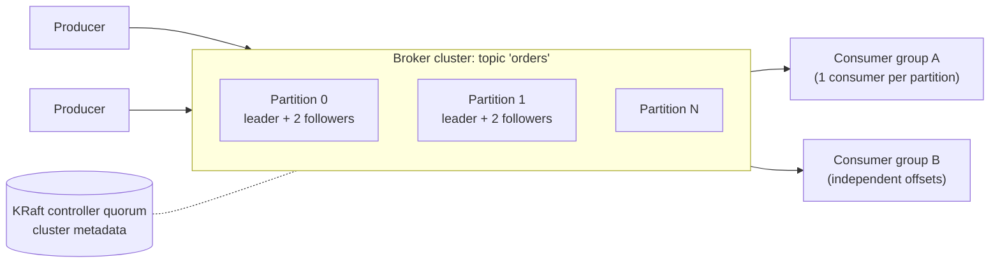

# 🏗️ Pub-Sub Messaging System — High-Level Design

> **Target Level:** Senior/Staff Engineer | **Focus:** Event-driven architecture, Kafka-style design, delivery semantics

---

## 1. SYSTEM OVERVIEW

**Purpose:** Scalable publish-subscribe messaging system for event-driven microservices with ordering guarantees and delivery semantics.

**Scale:** 10M messages/second peak, 100K topics, 1M subscribers, 99.99% durability

**Users:** Service developers (publishers/subscribers), Platform operators

**Use Cases:** Event sourcing, Log aggregation, Stream processing, Service decoupling, Real-time analytics

**Constraints:** At-least-once delivery, per-partition ordering, <50ms end-to-end latency, zero data loss

---

## 2. HIGH-LEVEL ARCHITECTURE



Producers choose the partition by `hash(key) % partitions`. Each consumer group has its own committed offset per partition, so groups are independent subscribers; within a group, a partition is consumed by exactly one member.

### 🎬 Animated Sequence Diagram

<p align="center">
  <video controls width="900" style="border-radius: 12px; box-shadow: 0 4px 24px rgba(0,0,0,0.3);" loop playsinline preload="metadata">
    <source src="../../../assets/videos/pub-sub-sequence.mp4" type="video/mp4" />
    Your browser does not support the video tag.
  </video>
  <br/>
  <em>🎬 Animated Pub-Sub Sequence — Publisher → Topics → Subscribers → Message Delivery. Click ▶ to play/pause. Created with <a href="https://remotion.dev">Remotion</a>.</em>
</p>

---

## 3. KEY COMPONENTS & INTERVIEW Q&A

### Message Broker (Kafka-like, C++/Java)
- Append-only commit log per partition
- Configurable retention (time or size)
- Replication factor = 3 for durability
- Leader-follower per partition

**🔴 Interview Question:** *"How does Kafka guarantee ordering within a partition?"*

**✅ Answer:**
1. **Partition = ordered sequence:** Messages appended sequentially — offset = position in log
2. **Single leader per partition:** All writes go to leader, followers replicate in order
3. **Producer acknowledges:** `acks=all` waits until every *in-sync* replica has the record; with idempotence on, retries cannot reorder a partition
4. **Consumer reads sequentially:** From offset 0 forward. Parallelism comes from multiple partitions, not concurrent reads within one partition.
5. **Key insight:** If you need global ordering, use a single partition (sacrifice throughput). For most cases, order per key (e.g., per user_id) is sufficient.

---

### Producer API
- Batch messages for throughput (`batch.size` 16 KB default, `linger.ms` to wait for a fuller batch; `max.request.size` 1 MB default)
- Idempotent producer (automatic retry without duplicates)
- Configurable durability (`acks=0|1|all`)

**🔴 Interview Question:** *"How do you achieve exactly-once semantics in pub-sub?"*

**✅ Answer:** Exactly-once *delivery* over a network is impossible: when an ack is lost, the broker can't distinguish "processed" from "not processed" (the Two Generals problem). What you can get is exactly-once *effects*:
1. **Producer idempotency:** producer id + per-partition sequence number; the broker drops a retried batch it has already written. On by default since Kafka 3.0.
2. **Transactions:** `beginTransaction() → send() … → sendOffsetsToTransaction() → commitTransaction()` atomically writes output records *and* the consumer's input offsets. Consumers with `isolation.level=read_committed` never see aborted writes. This is exactly-once for Kafka → Kafka pipelines.
3. **External side effects** (DB writes, emails, payments) are outside the transaction, so the consumer must be idempotent: store the processed message id (or offset) in the same DB transaction as the side effect, with a unique constraint.

---

### Consumer Groups
- Each partition assigned to exactly one consumer in group
- Rebalancing on consumer join/leave
- Offset management (auto-commit or manual)

**🔴 Interview Question:** *"What happens during consumer rebalancing?"*

**✅ Answer:**
1. A member joins, leaves cleanly, or misses heartbeats for `session.timeout.ms` (45 s default), or doesn't call `poll()` within `max.poll.interval.ms` (5 min default; this catches stuck processing).
2. **Eager protocol (old default):** every member revokes *all* partitions, the leader computes a new assignment, everyone resumes from committed offsets. The whole group stops processing ("stop the world").
3. **Cooperative incremental (KIP-429, `CooperativeStickyAssignor`):** only the partitions that actually move are revoked, so most members keep processing. The new consumer protocol (KIP-848, Kafka 4.0) moves assignment to the broker and makes rebalances incremental by default.
4. **Static membership** (`group.instance.id`): a restarting pod rejoins under the same identity within the session timeout without triggering a rebalance at all.
5. **Duplicates:** anything processed but not yet committed when a partition moves is reprocessed by the new owner. Commit in `onPartitionsRevoked` and keep consumers idempotent.

---

## 4. DATA MODEL (Storage Layer)

```sql
-- Internal metadata (not the actual messages)
CREATE TABLE topics (
    id SERIAL, name TEXT UNIQUE, partitions INT, replication_factor INT
);
CREATE TABLE consumer_groups (
    id SERIAL, group_id TEXT, topic_id INT,
    partition INT, offset BIGINT
);
```

Logical model only. Kafka itself keeps topic metadata in the KRaft metadata log and committed offsets in the compacted internal topic `__consumer_offsets` (key = group, topic, partition), not in a relational database.

**Actual messages stored as segments on disk:**
```
/data/kafka/topics/orders/partition-0/00000000000000000000.log
/data/kafka/topics/orders/partition-0/00000000000000100000.log  (after roll)
```

---

## 5. TRADE-OFF ANALYSIS

| Decision | Choice | Rationale |
|----------|--------|-----------|
| Storage | Append-only log | Sequential writes and reads; the OS page cache serves recent data and `sendfile` sends it to consumers without copying through user space |
| Partitioning | By key hash | Ensures per-key ordering |
| Replication | Leader-follower (ISR) | With `acks=all`, a write is acknowledged once every in-sync replica has it, so f+1 replicas tolerate f failures (quorum systems need 2f+1). `min.insync.replicas=2` with RF=3 refuses writes rather than accept them on one copy |
| Retention | Time + size based | Delete old segments; compacted topics for latest-value semantics |

---

## 6. SCALABILITY

**Bottleneck:** Disk I/O per partition, network bandwidth

**Solution:** Partition = unit of parallelism. More partitions = more parallelism. Add brokers to distribute partitions.

**Capacity check:** 10M msgs/s × 1 KB = 10 GB/s ingress; with RF=3 that is 30 GB/s of disk writes and 20 GB/s of replication traffic, plus consumer egress per group. A broker on a 25 Gbps NIC (~3 GB/s) taking ~1 GB/s of producer ingress also writes ~3 GB/s to disk (its own leaders plus follower copies) and serves replication and consumer egress, so both NIC and disk are near their limits: plan **~15–20 brokers** for 10 GB/s with headroom for broker loss and rebalancing and size partitions so each is ~10 MB/s (≈1,000 partitions for this topic set). Retention: 10 GB/s × 86,400 s × 3 replicas ≈ 2.6 PB/day, which is why retention is short (hours to days) or tiered to object storage.

**Availability:** RF=3, `min.insync.replicas=2`, `acks=all`. When a leader's broker fails, the controller elects a new leader from the ISR, usually within seconds of detecting the failure. `unclean.leader.election.enable=false` (default) chooses unavailability over losing acknowledged writes.

---

## 7. FAILURE MODES

| Failure | Effect | Mitigation |
|---------|--------|------------|
| Producer retry after a timeout | Duplicate write | Idempotent producer (default since 3.0) |
| Consumer crashes after processing, before commit | Reprocessing | Idempotent consumers; commit after processing |
| Poison message | Partition stuck (retry in place) | Bounded retries → DLQ topic with original offset and error; alert |
| Slow consumer | Lag grows; data may age out of retention | Alert on lag (time, not count); scale by partition; retention > max tolerable lag |
| Broker loss | Leader moves; brief produce errors | RF=3, `min.insync.replicas=2`, producer retries |
| Rebalance storm (pods flapping) | Processing pauses repeatedly | Static membership, cooperative rebalancing, sane `max.poll.interval.ms` |
| Hot partition (one huge key) | One consumer saturated | Better key, or salt the key and re-aggregate downstream (loses per-key order) |

---

## 8. COST (Monthly)

| Component | Nodes | Cost |
|-----------|-------|------|
| Broker nodes (i3en.2xlarge, at the 10M msg/s peak) | 15–20 | $9,000–12,000 |
| ZooKeeper/KRaft (m5.large) | 3 | $450 |
| Monitoring | — | $300 |
| **Total** | | **~$10,000–13,000** |
