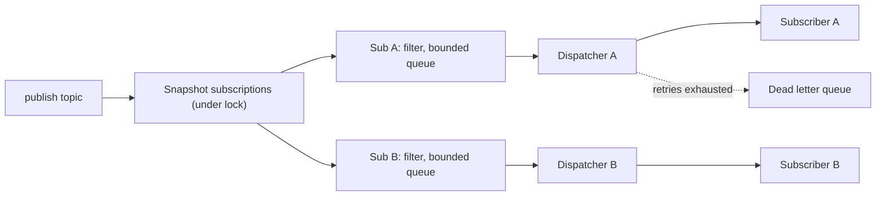
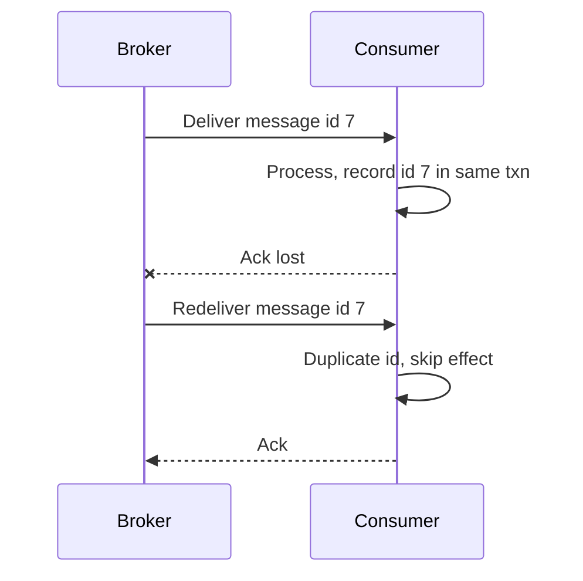

# Pub-Sub Messaging System - Interview Questions & Answers

> **Target Level:** Senior/Staff Engineer (6+ years)
> **Evaluation Focus:** Event-driven architecture, delivery guarantees, ordering, backpressure, concurrency

---

## Question 1: Core Design
**Interviewer:** *"Design a publish-subscribe messaging system."*

### 🎯 Expected Answer

The abstraction that matters is the **subscription**, not the topic:

```python
class Subscription:                    # one subscriber on one topic
    def offer(self, message) -> bool   # filter, bounded enqueue, overflow policy
    def dispatch_one(self) -> bool     # pop, deliver with retry, dead-letter on failure

class MessageBroker:
    def publish(self, topic, payload):
        with self._lock:
            targets = list(self._topics[topic].values())   # snapshot
        for sub in targets:                                  # outside the lock
            sub.offer(message)
```

- **Queue per subscription:** a slow or failing subscriber backs up only its own queue.
- **One dispatcher per subscription:** ordered delivery and no concurrent calls into one subscriber.
- **Immutable `Message`:** the same object goes to every subscriber.
- **Never hold a lock while running subscriber code:** otherwise a slow subscriber stalls publishers, and a subscriber that calls back into the broker deadlocks.

A design with one queue per topic and a loop that delivers each message to every subscriber in turn works in the demo and fails the first follow-up ("what if one subscriber is slow?").

*Figure: publish snapshots subscriptions; each subscription has its own queue and dispatcher.*



---

## Question 2: Delivery Semantics

| Guarantee | Meaning | Mechanism |
|-----------|---------|-----------|
| **At-most-once** | 0 or 1 deliveries | Remove from queue (or commit offset) *before* processing. No retry |
| **At-least-once** | ≥1 delivery, duplicates possible | Remove / commit only *after* successful processing; retry on failure or timeout |
| **Exactly-once processing** | Effect happens once | At-least-once delivery + idempotent consumer, or an atomic "process + record offset" transaction |

**Why exactly-once *delivery* is impossible over a network:** if the consumer's ack is lost, the broker cannot tell "processed, ack lost" from "never processed". It must either redeliver (risking a duplicate) or not (risking a loss). That is the Two Generals problem, not FLP (FLP is about consensus being impossible in an asynchronous system with one crash failure).

What systems actually provide is **exactly-once *effects***:
- **Idempotent consumer:** dedupe by message id in the same transaction as the side effect (unique constraint on `processed_messages(message_id)`), or make the operation naturally idempotent (`SET status = 'shipped'`, not `balance += 10`).
- **Kafka EOS:** idempotent producer (producer id + sequence number, broker drops duplicates) plus transactions that atomically write output records *and* the consumer offsets. This covers Kafka → Kafka pipelines; a side effect in an external system still needs idempotency.

**In this code:** at-least-once with respect to subscriber exceptions (retry, then DLQ); not durable across a process crash. `DedupingSubscriber` shows the idempotent-consumer pattern, recording an id only after success.

*Figure: at-least-once delivery; a lost ack causes a redelivery that an idempotent consumer absorbs.*



---

## Question 3: Ordering Guarantees
**Interviewer:** *"How do you make sure messages are processed in order?"*

### 🎯 Answer

**Order is a property of a single queue consumed by a single consumer.** Anything that adds parallelism (more consumers on one queue, retries that move a message elsewhere) gives up order somewhere. So ask: in order relative to *what*?

- **Per key** (per order id, per user) is almost always what the business needs. Partition by `hash(key) % N`; one consumer per partition. Ordered per key, parallel across keys.
- **Global order** means one partition and one consumer: throughput of one thread.

Things that break ordering, and the fixes:
- **Producer retries with several in-flight requests** (batch 1 fails, batch 2 succeeds, batch 1 retried). Kafka: `enable.idempotence=true` keeps order with up to 5 in-flight requests; without it, `max.in.flight.requests.per.connection=1`.
- **Consumer retries to a separate retry topic:** message 1 is in the retry topic while message 2 is processed. If order matters, retry in place (head-of-line blocking) or park the whole key.
- **Competing consumers on one queue** (RabbitMQ, SQS standard): no per-key order. SQS FIFO uses message group ids to get per-group order.
- **Changing partition count** remaps keys to new partitions, so per-key order breaks across the change.

**In this code:** one dispatcher per subscription gives priority-then-FIFO order per subscriber. Retries happen in place, so a failing message blocks the ones behind it until it succeeds or is dead-lettered.

---

## Question 4: "Now add…" extensions

| Ask | Answer |
|-----|--------|
| **Wildcard topics** (`orders.*`) | Store subscriptions by pattern; match on publish. With many patterns, a trie over dot-separated segments (`*` = one segment, `#` = many, as in AMQP). |
| **Message filtering** | Per-subscription predicate evaluated in `offer()` (done). In a networked broker, filter on headers at the broker (SNS filter policies) so filtered messages never cross the network. |
| **TTL / expiry** | Check age when dequeuing; expired → DLQ with an `EXPIRED` reason. |
| **Delayed / scheduled messages** | A separate min-heap keyed by delivery time and a timer thread that moves due messages into subscription queues. |
| **Replay from a point in time** | Needs a durable log per topic and offsets per subscription; replay = reset the offset. Not possible with in-memory queues. |
| **Higher throughput for one slow subscriber** | N dispatchers routed by `hash(key) % N`: order per key, parallelism across keys. |
| **Request-reply** | Publish with a `reply_to` topic and a `correlation_id` header; the requester subscribes to `reply_to` and matches on the id, with a timeout. |

---

## Question 5: Backpressure & Flow Control
**Interviewer:** *"A subscriber is 10× slower than the publish rate. What happens?"*

### 🎯 Answer
Its queue grows. You must choose what happens at the limit:

1. **Block the publisher** (with a timeout): true backpressure, but one slow subscriber now slows *every* subscriber's publisher.
2. **Reject / dead-letter the overflow** (this code): publishers never stall; overflow is visible and replayable.
3. **Drop oldest:** fine for telemetry and "latest value wins".
4. **Pull instead of push:** consumers fetch when ready (Kafka). The broker keeps a durable log and the consumer just falls behind (lag); retention, not memory, is the limit. This is why large-scale systems are pull-based.

Then fix the actual problem: scale the consumer (partition by key), batch its work, or alert on lag.

---

## Question 6: Concurrency follow-ups

**"Why one thread per subscription instead of a shared thread pool?"**
A shared pool would let two threads run the same subscriber at once (breaking order and requiring subscriber locks) unless you add per-subscription serial executors, which is the same idea in another form. One thread per subscription is simple and correct for tens to hundreds of subscriptions. For thousands, use a pool where each subscription is scheduled as a task only when it has work and is not already running (an actor-style mailbox).

**"A subscriber calls `unsubscribe()` on itself inside `on_message`. What happens?"**
No deadlock, because no broker lock is held while subscriber code runs, and `_retire()` doesn't `join()` the current thread. There is a test for this.

**"Publish and unsubscribe race. Can a message reach a removed subscriber?"**
`publish` snapshots the subscription list. If unsubscribe wins after the snapshot, `offer()` sees the subscription closed and drops the message. A message already in flight completes. That is the standard semantics: unsubscribe is effective "soon", not at an exact point in the stream.

---

## Question 7: Testing strategy

- **Synchronous mode for logic:** `run_until_idle()` makes fan-out, priority order, filters, retry counts and DLQ contents deterministic.
- **Inject `sleep`:** record backoff delays (`[0.1, 0.2]`) instead of waiting.
- **Isolation:** a subscriber blocked on an `Event` must not delay another subscriber's 20 messages.
- **Ordering and exclusivity under concurrency:** 4 publisher threads × 200 messages; each subscriber sees each producer's sequence in order and `max_active == 1`.
- **Lifecycle:** self-unsubscribe doesn't deadlock; `close()` interrupts a long backoff.
- **Churn:** subscribe/unsubscribe in a loop while publishing; no exceptions.

---

## Question 8: Design Patterns

| Pattern | Where | Why |
|---------|-------|-----|
| **Observer** | `Subscriber.on_message` | Publishers don't know their subscribers |
| **Facade** | `MessageBroker` | One entry point |
| **Strategy** | `RetryPolicy`, per-subscription `predicate` | Swappable retry and filtering behaviour |
| **Decorator** | `DedupingSubscriber` | Adds idempotency to any subscriber without changing it |

---

## ⚠️ Common mistakes

1. **One queue per topic**, delivered to subscribers in a loop: one slow subscriber stalls the rest.
2. **Holding the broker lock while calling subscribers:** deadlocks on re-entrant calls and serialises everything behind the slowest subscriber.
3. **A new thread per message** (the "async delivery" shortcut): unbounded threads, no ordering, errors lost.
4. **Unbounded queues** with no stated overflow policy.
5. **Swallowing failures:** retrying forever (poison message blocks the queue) or dropping silently (no DLQ).
6. **Claiming exactly-once delivery**, or attributing its impossibility to FLP.
7. **Mutable messages** shared across subscribers.
8. **Promising global ordering** without noticing it caps throughput at one consumer.

---

## 🎚️ Senior vs Staff signal

- **Senior:** queue per subscription, one dispatcher each, retry + DLQ, bounded queues, no lock across callbacks; can explain at-least-once vs at-most-once and write the tests above.
- **Staff:** starts from the guarantee the business needs (can we lose it? duplicate it? reorder it?) and derives the design from that; explains why exactly-once is about effects, not delivery; chooses ordering per key and explains what breaks it (producer retries, retry topics, repartitioning); sees push-with-buffers vs pull-with-a-log as the real fork, and knows when an in-process bus is the wrong tool (anything that must survive a deploy).
