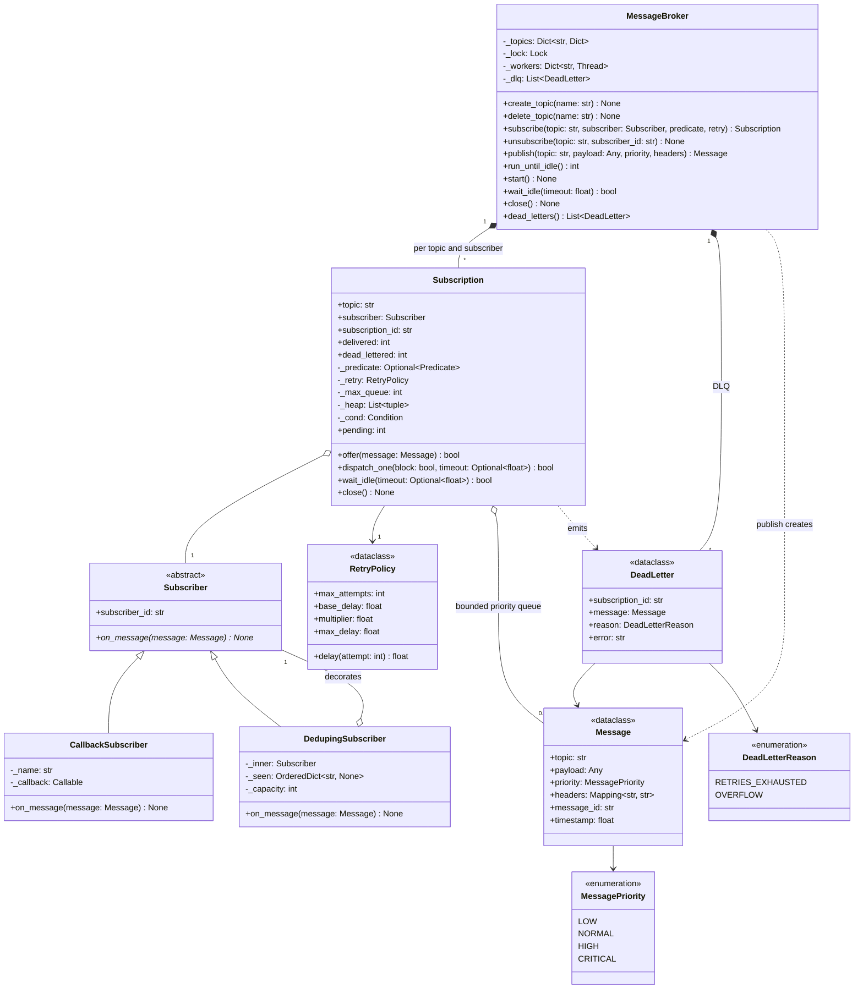

# 🧠 Pub-Sub System LLD — Thought Process Guide

> **Goal:** Learn *how* to think when designing a Low-Level Design.

---

## 📊 Class Diagram



---

## ⏱️ How to run this in a 45–60 min interview

| Time | Step | What to say out loud |
|------|------|----------------------|
| 0–7 min | **Clarify** | "In-process library or a networked broker? Push or pull? What delivery guarantee: at-most-once or at-least-once? Ordering per topic, per key, or none? What happens when a subscriber is slow or keeps failing?" |
| 7–15 min | **Entities and interfaces** | `Message` (immutable), `Subscriber` ABC, `Subscription` (subscriber + topic + its own queue), `MessageBroker` facade. "The key decision: one queue per *subscription*, not per topic, so subscribers are isolated." |
| 15–30 min | **Core code** | `publish` → snapshot subscriptions → `offer` to each; `dispatch_one` pops and calls the subscriber. Get fan-out working synchronously first (`run_until_idle`). |
| 30–40 min | **Concurrency** | "One dispatcher thread per subscription: ordered, never concurrent per subscriber. The broker lock guards the map only; never hold a lock while calling subscriber code." |
| 40–50 min | **Failure handling and extension** | Retry with backoff → DLQ; bounded queue and overflow policy; idempotent consumer. Then whatever they add: wildcards, TTL, durability, ordering per key. |
| 50–60 min | **Testing and trade-offs** | "Inject the sleep so retry tests are instant; a slow-subscriber test proves isolation; a multi-producer test asserts per-producer order and `max_active == 1`." |

### Clarifying questions worth asking

1. **Scope:** in-process event bus, or a broker other services connect to? (The second needs persistence and acks; say which one you're building.)
2. **Delivery guarantee:** can a message be lost? Can it be delivered twice?
3. **Ordering:** none, per topic, or per key (e.g. per order id)?
4. **Slow consumers:** block the publisher, buffer (how much?), or drop?
5. **Failures:** retry how many times? What happens to a message that never succeeds?
6. **Filtering / wildcards:** do subscribers want every message on the topic?

---

## Phase 1: Identify the Nouns

> *"Publishers send messages to topics. Each subscriber receives, in order, the messages on topics it subscribed to."*

| Noun | Decision | Why |
|------|----------|-----|
| `Message` | Frozen dataclass | Shared by all subscribers, so immutable |
| `MessagePriority` | `IntEnum` | Comparable, so the heap key is just `-priority` |
| `Subscriber` | ABC | Observer interface; raising = failure |
| `Subscription` | Class | The real unit of work: filter + bounded queue + dispatch |
| `RetryPolicy` | Frozen dataclass | Strategy for backoff; per subscription |
| `DeadLetter` | Frozen dataclass | Failed message + reason, for inspection and replay |
| `MessageBroker` | Facade | Topics, subscriptions, publish, run modes |

The noun that is easy to miss is **`Subscription`**. Without it you end up with one queue per topic and a delivery loop that couples all subscribers together.

## Phase 2: Assigning Responsibilities

| Action | Owner | Why |
|--------|-------|-----|
| Route a publish to subscribers | `MessageBroker.publish()` | Owns the topic → subscriptions map |
| Filter, buffer, apply overflow policy | `Subscription.offer()` | Per-subscriber concern |
| Deliver with retry, dead-letter on failure | `Subscription.dispatch_one()` | Keeps retry state next to the queue it blocks |
| Backoff schedule | `RetryPolicy.delay()` | Swappable strategy |
| Collect dead letters | `MessageBroker` | One place to inspect and replay |
| Idempotency | `DedupingSubscriber` (decorator) | Consumer concern; the broker can't know what "duplicate side effect" means |

## Phase 3: Patterns, and why each is there

- **Observer:** `Subscriber.on_message`. Publishers don't know who listens.
- **Facade:** `MessageBroker` is the only class callers touch.
- **Strategy:** `RetryPolicy`; per-subscription `predicate` for filtering.
- **Decorator:** `DedupingSubscriber` wraps any subscriber without changing it.

## Phase 4: Concurrency model

```text
publisher threads ──publish──▶ broker._lock (map snapshot only)
                                   │
                    offer() ───────┼──▶ Subscription A: Condition + heap ──▶ 1 dispatcher ──▶ subscriber A
                                   └──▶ Subscription B: Condition + heap ──▶ 1 dispatcher ──▶ subscriber B
```

- Two locks only, never nested with subscriber code running.
- Per-subscription ordering comes from "exactly one consumer per queue", not from a lock around the subscriber.
- `wait_idle()` waits on `queue empty and in_flight == 0`, both under the same `Condition`, so there is no window where a popped-but-unfinished message is invisible.

## Phase 5: Quick Checklist

✅ **Isolation:** a slow or failing subscriber only affects its own queue
✅ **Ordering:** priority, then FIFO, per subscriber; no concurrent callbacks
✅ **Bounded memory:** queue cap with an explicit overflow policy
✅ **Failure path:** retry with backoff, then DLQ with a reason
✅ **No lock held across subscriber code**
✅ **Guarantee stated:** at-least-once on subscriber failure, not durable across crashes
