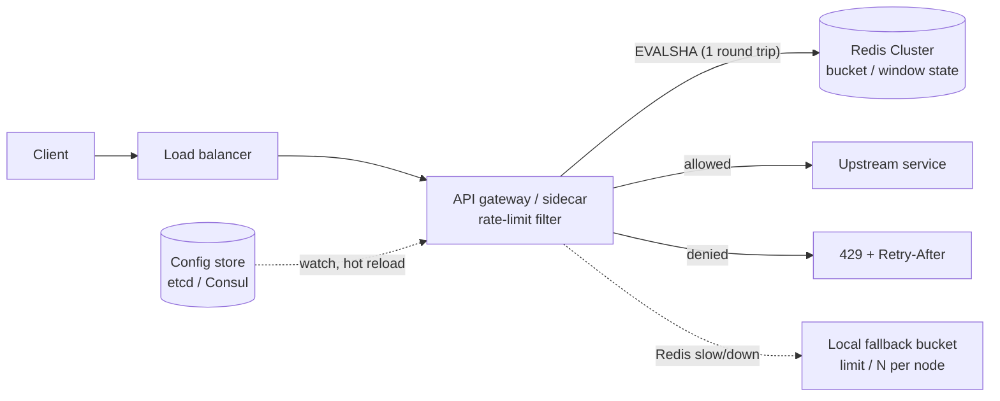

# 🏗️ Rate Limiter — High-Level Design

> **Target Level:** Senior/Staff Engineer | **Focus:** Distributed rate limiting, algorithms, API gateway design

---

## 1. SYSTEM OVERVIEW

**Purpose:** Protect APIs from abuse and overload by enforcing request rate limits per user/IP/API key, with configurable algorithms and tiers.

**Scale:** 1M requests/second peak, ~10M distinct rate-limit keys active per hour, <2 ms added p99 latency.

**Users:** API consumers (external developers), internal services, platform admins.

**Use Cases:** Per-user API throttling, tier-based limits (Free/Pro/Enterprise), burst protection, abuse protection on sensitive endpoints (login, OTP).

**Constraints and the trade-off they force:** "exact" and "<2 ms with no network hop" conflict. Pick per limit:
- **Exact limits** (billing quotas, login attempts): every decision goes to Redis via one Lua script (~0.5 ms in-region).
- **Approximate limits** (abuse/overload protection on high-volume routes): local decision with periodic sync; overshoot bounded and documented.

---

## 2. HIGH-LEVEL ARCHITECTURE



**Request path:** the filter resolves the rule from `(tier, route)`, builds the key (`rl:{api_key}:route`), runs the algorithm's Lua script with `EVALSHA`, and either forwards the request or returns 429 with `Retry-After`. State lives only in Redis; gateway nodes are stateless apart from the fallback bucket and the cached rule map.

### 🎬 Animated Sequence Diagram

<p align="center">
  <video controls width="900" style="border-radius: 12px; box-shadow: 0 4px 24px rgba(0,0,0,0.3);" loop playsinline preload="metadata">
    <source src="../../../assets/videos/rate-limiter-sequence.mp4" type="video/mp4" />
    Your browser does not support the video tag.
  </video>
  <br/>
  <em>🎬 Animated Rate Limiter Sequence — Request → Token Check → Allow/Block → Response. Click ▶ to play/pause. Created with <a href="https://remotion.dev">Remotion</a>.</em>
</p>

---

## 3. KEY COMPONENTS & INTERVIEW Q&A

### Rate Limiter Filter
- **Deployment:** API gateway plugin, Envoy (local rate limit filter for per-node limits, `ratelimit` service for global ones), or an in-app library.
- **Algorithm per route:** config-driven.

**🔴 Interview Question:** *"How do you make rate limiting decisions in under 2 ms?"*

**✅ Answer:**
1. **Exact limits:** one Redis round trip with a Lua script. In-region that is typically 0.2–1 ms, inside the budget. Pipeline nothing else in front of it; keep scripts O(1) (token bucket) or O(log n) (sorted-set log).
2. **High-volume approximate limits:** a local token bucket per node, syncing deltas to Redis every ~100 ms. Decisions are in-memory (microseconds). Worst-case overshoot ≈ `rate_per_node × sync_interval × nodes`; state that number and get it accepted.
3. **Two tiers combined:** a local per-node bucket rejects obvious floods before they reach Redis, so a single abusive client cannot turn into Redis load.

---

### Redis Cluster (State)
- **Keys:** `rl:{api_key}:{route}` for buckets; fixed windows add the window index: `rl:{api_key}:{route}:{window}`.
- **Atomicity:** one Lua script per decision. Redis runs a script without interleaving other commands, so read-decide-write is atomic. In Cluster, every key a script touches must be in the same hash slot, so multi-limit scripts use a hash tag: `rl:{user42}:sec`, `rl:{user42}:day`.
- **Clock:** the script reads `redis.call('TIME')`, never a timestamp passed from the app server.
- **TTL:** set on every write: a bucket expires after `capacity / rate` (when it would be full anyway); a window after one window length. Expiry then *is* the idle-key eviction.

**🔴 Interview Question:** *"How do you handle Redis failure?"*

**✅ Answer:**
1. **Decide fail-open vs fail-closed per route up front.** General API traffic: fail open. Login/OTP/password reset: fail closed.
2. **Circuit breaker with a tight timeout** (2–5 ms). A slow Redis is worse than a dead one because every request waits on it.
3. **Local fallback:** while the breaker is open, use a local token bucket at `limit / N` per node. Limits become approximate, not absent.
4. **Failover:** Redis Cluster promotes a replica after `cluster-node-timeout` (15 s by default, often tuned to a few seconds). Replication is asynchronous, so a failover can lose the last few ms of counter updates: some clients get a little extra quota. Acceptable for rate limiting; not acceptable for anything that is money, which is why billing quotas are reconciled from a durable usage log, not from the limiter.
5. **`NOSCRIPT` after failover:** the new primary's script cache may be empty; the client retries with `EVAL`.

---

### Configuration Store
- Rule schema: `{"route": "/api/v1/users", "tier": "free", "algorithm": "token_bucket", "max": 100, "window_seconds": 60}`
- Watched via etcd/Consul for hot reload. Gateways build a new immutable rule map and swap the reference; in-flight requests finish on the old map.

**🔴 Interview Question:** *"How do you support multi-tier rate limiting (Free, Pro, Enterprise)?"*

**✅ Answer:**
```json
{
  "tiers": {
    "free":       { "rps": 5,   "rpm": 100,   "rpd": 1000   },
    "pro":        { "rps": 50,  "rpm": 1000,  "rpd": 50000  },
    "enterprise": { "rps": 500, "rpm": 10000, "rpd": 500000 }
  },
  "endpoints": {
    "POST /orders":  { "cost": 5 },
    "GET /search":   { "cost": 1 }
  }
}
```

Each request is checked against all of its tier's limits in **one** script (hash-tagged keys), so a request denied by the daily limit does not burn per-second tokens. Expensive endpoints carry a `cost` instead of a separate limit.

---

## 4. ALGORITHM SELECTION GUIDE

| Algorithm | Bursts | Accuracy | Memory/key | Best for |
|-----------|--------|----------|------------|----------|
| Token Bucket | ✅ configurable | Exact for its model | O(1) | Default for public APIs |
| Sliding Window Log | ❌ | Exact | O(limit) | Low limits that must be precise (login, OTP) |
| Fixed Window | ⚠️ up to 2× at boundary | Low | O(1) | Daily/monthly quotas where the boundary does not matter |
| Sliding Window Counter | ❌ | ~Exact (Cloudflare: 0.003% error) | O(1) | High-volume per-window limits |

**Recommendation:** token bucket for most APIs (bursts are normal client behaviour); sliding window log for low, security-relevant limits; fixed window only for coarse quotas.

---

## 5. ERROR HANDLING

```http
HTTP/1.1 429 Too Many Requests
Content-Type: application/json
Retry-After: 45
X-RateLimit-Limit: 100
X-RateLimit-Remaining: 0
X-RateLimit-Reset: 45

{
  "error": "rate_limit_exceeded",
  "message": "API rate limit exceeded. Retry in 45 seconds.",
  "retry_after_seconds": 45
}
```

`429` and `Retry-After` are standard (RFC 6585 / RFC 9110). The `X-RateLimit-*` headers are a de facto convention; the IETF draft standardises them as `RateLimit` / `RateLimit-Policy`.

---

## 6. FAILURE MODES

| Failure | Effect | Mitigation |
|---------|--------|------------|
| Redis down | No shared state | Breaker → local `limit/N` buckets; fail closed on sensitive routes |
| Redis slow (p99 spikes) | Every request slows | 2–5 ms timeout, breaker, local fallback |
| Replica promotion | Last few ms of updates lost | Accept small over-admission; never use the limiter as a billing ledger |
| Hot key (one huge tenant) | One shard saturates | Local pre-filter bucket; split the tenant's limit across N sub-keys (`rl:{t}:0..N-1`), each with `limit/N` |
| Clock skew between gateways | Inconsistent windows | Use Redis `TIME` inside scripts |
| Retry storms after 429 | Load amplifies | `Retry-After` + client jittered backoff |
| Config push with a bad rule | Mass 429s or no limiting | Validate rules, canary rollout, keep last-known-good |

---

## 7. SCALABILITY & CAPACITY

- **Throughput:** 1M decisions/s. A Redis primary handles roughly 100K–200K simple commands/s; a short Lua script costs a few times a plain `INCR`, so budget ~50K–80K scripts/s per shard. That gives **~16–20 primaries** (plus a replica each). Keys spread evenly by slot unless one tenant dominates (see hot key above).
- **Memory:** a token bucket as a small Redis hash is ~100 bytes including key and overhead. 10M active keys ≈ **1 GB**, trivial across 16 shards. A sliding log at limit 1000 is ~1000 × ~60 bytes = 60 KB per key, which is why logs are reserved for low limits.
- **Latency:** one in-region round trip per request; no fan-out because each script hits one slot.

---

## 8. COST (Monthly, rough)

| Component | Cost |
|-----------|------|
| Redis Cluster (16 primaries + 16 replicas, small memory-light nodes) | ~$4,000 |
| Config Store (etcd, 3 nodes) | $300 |
| Monitoring + Alerts | $200 |
| **Total** | **~$4,500** |
