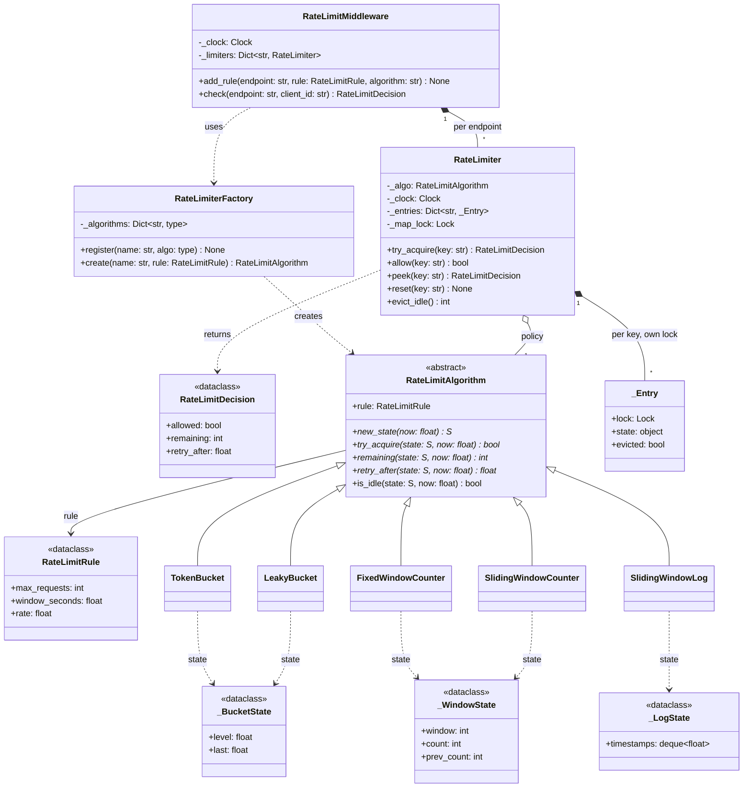

# 🧠 Rate Limiter LLD — Thought Process Guide

> **Goal:** Learn *how* to think when designing a Low-Level Design.

---

## 📊 Class Diagram



---

## ⏱️ How to run this in a 45–60 min interview

| Time | Step | What to say out loud |
|------|------|----------------------|
| 0–7 min | **Clarify** | "Is this in-process (a library) or a shared service? Per user, per IP, per API key, per endpoint? Is bursting acceptable? Reject or queue when over the limit? Must the limit be exact, or is a small overshoot fine?" |
| 7–15 min | **Entities and interfaces** | "A rule is a value object. Each algorithm is a Strategy. I'll keep the algorithm a pure policy over a small per-key state, and put concurrency in one class that owns the map." Write `RateLimitAlgorithm` with `new_state / try_acquire / remaining / retry_after` first. |
| 15–30 min | **Core code** | Token bucket first (it's what they usually want), then one window algorithm. Say the invariants: "`try_acquire` is check-and-consume in one step; time is injected." |
| 30–40 min | **Concurrency** | "Two threads can both see one token left and both take it. I lock per key, not globally: the map lock is for get-or-create only." Mention lock order and the eviction race if there is time. |
| 40–50 min | **Extension** | Likely asks: Retry-After, multiple limits per request, distributed (Redis + Lua), weighted cost. Show the change is local to one class. |
| 50–60 min | **Testing and trade-offs** | "Fake clock for boundaries; a thread-hammer test that asserts exactly N admitted; fixed window's 2× boundary burst as a documented test." |

### Clarifying questions worth asking

1. **Scope:** single process, or many servers sharing a limit? (Changes the whole design: local map vs Redis.)
2. **Key:** user id, API key, IP, or (endpoint, user)? Anonymous traffic?
3. **Burst:** may a client spend a minute's quota in one second? (Yes → token bucket; no → sliding window.)
4. **Over the limit:** reject with 429, or queue/delay? (Delay → leaky bucket as a queue, a different component.)
5. **Accuracy:** is 1–2% overshoot acceptable for lower latency? (Decides local caching in the distributed case.)
6. **Fail open or closed** if the limiter's store is down?

---

## Phase 1: Identify the Nouns

> *"A rate limiter restricts how many requests a client can make in a time window, using a configurable algorithm."*

| Noun | Decision | Why |
|------|----------|-----|
| `RateLimitRule` | Frozen dataclass | Pure config; validates `max > 0`, `window > 0` |
| `RateLimitDecision` | Frozen dataclass | Allowed + remaining + retry_after: exactly what a 429 response needs |
| `RateLimitAlgorithm` | Generic ABC | Strategy: each algorithm is a policy over its own state type |
| Per-key state (`_BucketState`, `_WindowState`, `_LogState`) | Mutable dataclasses | Small, private, one per key |
| `RateLimiter` | Class | Owns the key → state map, locking, eviction, the clock |
| `RateLimitMiddleware` | Class | Maps endpoints to limiters |

A `bool` would do for allow/deny, but returning a decision object costs nothing and answers the inevitable "what goes in the response headers?" follow-up.

## Phase 2: Assigning Responsibilities

| Action | Owner | Why |
|--------|-------|-----|
| Decide allow/deny and consume | `RateLimitAlgorithm.try_acquire()` | Algorithm-specific math, one atomic step |
| Refill / leak / roll windows | Private helpers on each algorithm (`_refill`, `_leak`, `_roll`, `_evict`) | Lazy: updated on access, no background timer |
| Store per-key state | `RateLimiter._entries` | One place for the map, so one place for locking |
| Concurrency | `RateLimiter` (map lock + per-key lock) | Algorithms stay single-threaded and easy to test |
| Forget idle keys | `RateLimiter.evict_idle()` + `algorithm.is_idle()` | Bounded memory without losing information |
| Route to a limiter | `RateLimitMiddleware` | Endpoint → limiter; key = endpoint + client |

**Key insight:** if every algorithm keeps its own `dict[key, ...]`, locking has to be repeated in five places or done with one global lock. Making algorithms policies over a state object puts locking in exactly one place and lets it be per key.

## Phase 3: Strategy + Factory

```python
class RateLimitAlgorithm(ABC, Generic[S]):
    def new_state(self, now) -> S
    def try_acquire(self, state: S, now) -> bool
    def remaining(self, state: S, now) -> int
    def retry_after(self, state: S, now) -> float

class TokenBucket(RateLimitAlgorithm[_BucketState]): ...
class SlidingWindowLog(RateLimitAlgorithm[_LogState]): ...

RateLimiterFactory.create("token_bucket", RateLimitRule(100, 60))
```

The factory maps config strings to classes and has `register()`, so a new algorithm is a new class plus one line.

## Phase 4: Understanding the Algorithms

| Algorithm | State per key | Time | Allows bursts? | Exact? |
|-----------|---------------|------|----------------|--------|
| Token Bucket | 2 numbers | O(1) | Yes, up to capacity | Yes, for its own definition |
| Leaky Bucket (meter) | 2 numbers | O(1) | Yes, up to capacity (same as token bucket) | Yes |
| Fixed Window | 2 numbers | O(1) | Up to 2× at a boundary | No |
| Sliding Window Log | ≤ max timestamps | amortised O(1) | No | Yes |
| Sliding Window Counter | 3 numbers | O(1) | No (approximately) | Approximate |

## Phase 5: Quick Checklist

✅ **Atomic check-and-consume** under a per-key lock
✅ **Injected monotonic clock**: deterministic tests, immune to wall-clock jumps
✅ **Bounded memory**: per key (log capped at `max`) and across keys (`evict_idle`)
✅ **Strategy + Factory**: add an algorithm without touching the limiter
✅ **`retry_after`** for proper 429 responses
