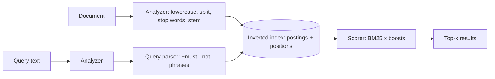

# Search Platform - Interview Questions & Answers

> **Target Level:** Senior/Staff Engineer (6+ years)  
> **Evaluation Focus:** Information retrieval, inverted index, ranking algorithms, distributed search, relevance

---

## Question 1: Core Design
**Interviewer:** *"Design a search platform: document indexing, tokenization, ranking, query parsing."*

### 🎯 Expected Answer

**Core Architecture:**
```
Documents → Analyzer → Inverted Index ← Query Parser ← Analyzer ← query text
                │            │                │
       lowercase, split,   postings +     +must, -not,
       stop words, stem    positions      "phrases"
                             │
                     Scorer (BM25) × Boosts → top-k
```

**Inverted index, the heart of search:**
```python
postings: Dict[str, Dict[str, Posting]]   # term -> doc_id -> positions per field

def upsert(self, doc):
    if doc.doc_id in self.docs:
        self.delete(doc.doc_id)                       # via the forward index
    for field_name, tokens in analyzed_fields(doc):
        for tok in tokens:
            posting = self.postings[tok.term].setdefault(doc.doc_id, Posting())
            posting.positions.setdefault(field_name, []).append(tok.position)
```

**Why an inverted index?** Without one, a query scans every document: O(total text). With one, a query touches only the posting lists of its terms: O(Σ |postings(t)|) to gather candidates, plus O(m log k) to pick the top k of m candidates. For a rare term that's tiny. For a stop-word-like term it's most of the corpus, which is why engines keep per-term statistics and use tricks like WAND/MaxScore to skip low-scoring documents.

*Figure: indexing and query paths meet at the inverted index.*



---

## Question 2: Ranking with TF-IDF and BM25
**Interviewer:** *"How do you rank results by relevance?"*

### 🎯 Answer

**TF-IDF:** term frequency in the document × how rare the term is across the corpus.

```python
class TfIdfScorer(Scorer):
    def score(self, tf, df, n_docs, doc_len, avg_len):
        return (1 + math.log(tf)) * (math.log((1 + n_docs) / (1 + df)) + 1)
```

**`df` is the number of documents containing the *term*.** A common bug, and the one this project's earlier version had, is computing something per *document* (e.g. how many distinct terms it contains) and calling it df. If your IDF has no term in it, it isn't IDF.

**BM25, the default in Lucene, Elasticsearch and OpenSearch:**
```
idf(t)  = ln(1 + (N − df + 0.5) / (df + 0.5))
score   = Σ_t idf(t) · tf·(k1 + 1) / (tf + k1·(1 − b + b·dl/avgdl))
```
- `k1 ≈ 1.2`: **saturation.** The score approaches `idf·(k1+1)` as tf grows, so keyword stuffing stops paying.
- `b = 0.75`: **length normalisation.** The same tf counts less in a longer document. `b = 0` turns it off.
- The `1 +` inside the log is Lucene's change from classic Robertson IDF, which goes **negative** for terms in more than half the documents.
- Raw TF-IDF has neither saturation nor length normalisation, which is why BM25 usually ranks better out of the box.

**Field weighting:** a title match should count more than a body match. Here, weighted occurrences are summed before saturation (simplified BM25F). Elasticsearch's `multi_match` with `best_fields` instead scores each field separately and takes the max.

---

## Question 3: Query Understanding
**Interviewer:** *"How would you improve search quality?"*

### 🎯 Techniques

| Technique | How | Watch out for |
|-----------|-----|---------------|
| **Stemming** | Porter/Snowball, or a light stemmer: "running" → "run" | Over-stemming ("university"/"universe" both → "univers" in Porter) hurts precision; it's a recall/precision trade |
| **Lemmatisation** | Dictionary-based: "better" → "good" | Slower, needs a POS tagger |
| **Synonyms** | Expand at **query** time ("k8s" → "kubernetes") | Index-time synonyms need a re-index whenever the list changes |
| **Spell correction** | Edit distance against the vocabulary, weighted by term frequency | Short terms: 1 edit already changes meaning. Fuzziness grows with length (ES `AUTO`: 0/1/2 edits for ≤2 / 3–5 / >5 chars) |
| **Phrases** | Positional index; check consecutive positions | Phrases are **not** single tokens; that would need every n-gram indexed |
| **Stop words** | Drop "the", "of"… | Modern engines often *keep* them (BM25's IDF already makes them nearly worthless) because removal breaks phrases like "to be or not to be" |

**Edit distance:**
```python
def levenshtein(a, b, max_dist=None):
    prev = list(range(len(b) + 1))
    for i, ca in enumerate(a, 1):
        cur = [i]
        for j, cb in enumerate(b, 1):
            cur.append(min(cur[j-1] + 1,            # insertion
                           prev[j] + 1,             # deletion
                           prev[j-1] + (ca != cb))) # substitution
        if max_dist is not None and min(cur) > max_dist:
            return max_dist + 1                     # early exit: row minimum never decreases
        prev = cur
    return prev[-1]
```
O(|a|·|b|) per pair. Note that a transposition ("desing" → "design") costs 2 here; Damerau-Levenshtein counts it as 1. Scanning the whole vocabulary is O(V) pairs per query term. At scale: a **Levenshtein automaton** intersected with the sorted term dictionary (Lucene), a **BK-tree**, or **SymSpell** (precomputed deletes, O(1)-ish lookup at a memory cost).

---

## Question 4: Scaling to Billions of Documents

**Architecture:**
```
                   ┌─────────────┐
Query ────────────▶│ Coordinator │──▶ Shard 1 (primary or replica)
                   │             │──▶ Shard 2
                   └──────┬──────┘──▶ Shard M
                          │ each shard returns its local top (from+size) ids + scores
                   ┌──────▼──────┐
                   │ Merge top k │──▶ fetch phase: load the k documents
                   └─────────────┘
```

- **Document-partitioned sharding** (hash(doc_id) → shard): every query fans out to all shards, each scores locally, the coordinator merges. Two phases, *query then fetch*, so only k full documents cross the network.
- **Term-partitioned** (each shard owns some terms): a query touches only the shards for its terms, but multi-term queries must join posting lists across machines and hot terms create hot shards. Almost nobody does this for general search.
- **IDF skew:** each shard computes IDF from its own documents. With good hashing and many documents per shard the difference is negligible; for small or skewed indexes use a DFS pre-phase that collects global term statistics (Elasticsearch's `dfs_query_then_fetch`).
- **Tail latency:** the query is as slow as the slowest shard. Replicas let the coordinator pick the least-loaded copy (adaptive replica selection) or hedge requests.
- **Deep pagination:** page 1000 means every shard returns 1000·size hits. Cap `from + size` and use `search_after` for scrolling.
- **Caching:** filter results (bitsets) cache very well; full query results less so (long tail). Cache the top few thousand queries at the API with a short TTL.

---

## Question 5: Real-time Indexing

**Approach: Lucene-style segments.**
```python
class SegmentedIndex:
    def index(self, doc):
        self._translog.append(doc)          # durability (fsync policy is a knob)
        self._buffer.add(doc)               # in memory, NOT yet searchable

    def refresh(self):                      # every ~1 s
        seg = self._buffer.freeze()         # immutable segment, now searchable
        self._segments = self._segments + [seg]   # readers hold the old list: no lock

    def delete(self, doc_id):
        self._tombstones.add(doc_id)        # segments are immutable; deletes are a bitmap

    def search(self, q):
        segments = self._segments           # snapshot
        return merge(s.search(q, exclude=self._tombstones) for s in segments)

    # background: merge small segments into big ones, dropping tombstoned docs
```

**Trade-offs:** a shorter refresh interval means fresher results but more tiny segments and more merge work. A bulk load turns refresh off (`refresh_interval: -1`) and replicas to 0, then restores both. An update is delete + insert, so heavy updates create merge pressure.

---

## Question 6: Advanced Ranking Features

**Boosts as composable strategies:**
```python
class RecencyBoost(Boost):
    def factor(self, doc):
        age_days = (self._now - doc.created_at).total_seconds() / 86_400
        return 1 + self._weight * 0.5 ** (age_days / self._half_life)

score = bm25 * product(b.factor(doc) for b in boosts)
```

- **Smooth decay, not cliffs.** "×1.5 if under 7 days" makes a day-6 document jump past a better day-8 one. Exponential, Gauss or linear decay (ES `function_score`) behave predictably.
- **Log-scale popularity:** otherwise one viral document outranks every relevant one.
- **Apply boosts inside the engine**, before top-k. Re-ranking only the page you got back can't promote a document that wasn't in it.
- **Inject `now`**: ranking that depends on the wall clock can't be tested.
- **Personalisation / learning-to-rank:** BM25 as a cheap first stage over all candidates, then a model re-ranks the top ~100–1000 with features (BM25 per field, freshness, CTR, user affinity).

---

## Question 7: Design Patterns

| Pattern | Where | Why |
|---------|-------|-----|
| **Strategy** | `Scorer` (BM25, TF-IDF) | Swap the relevance model |
| **Strategy, composed** | `Boost` list | Add a ranking signal without touching scoring |
| **Facade** | `SearchEngine` | One API: `index`, `delete`, `search`, `suggest`; owns the lock |
| **Interpreter (tiny)** | `QueryParser` → `Query` | Operators become structured clauses. A full boolean grammar with parentheses would be a **Composite** query tree |
| **Value object** | Frozen `Document`, `Token`, `SearchHit` | Immutability: an update is a re-index, so the index can't drift from the document |

---

## 🔁 Follow-ups Interviewers Actually Push On

### "A document is updated. How do you keep the index correct?"

Treat it as delete + insert. The forward index (`doc_id → terms`) makes delete O(terms in doc): remove the doc from each of those posting lists, drop lists that become empty, subtract its length from the total used for `avgdl`. Do it all under the same lock as searches, so no reader sees the old terms removed but the new ones missing. Lucene does the same thing with immutable segments: a tombstone for the old version, the new version in a new segment.

### "Two threads index while others search. What breaks?"

Without a lock: a reader iterates a posting dict while a writer inserts into it → `RuntimeError: dictionary changed size during iteration`, or a doc that's in `postings` but not yet in `docs` → `KeyError`. With the single lock here, indexing and search are atomic with respect to each other. The test hammers it with 4 writers and 4 readers. To scale reads: snapshot immutable segments (copy-on-write list) so readers take no lock at all.

### "Phrase search. How?"

Store positions. For `"system design"`, intersect the two posting lists, then for each candidate check whether some position `p` of `system` has `p + 1` in `design`'s positions, **within the same field**. Removed stop words keep their position, so `"design of systems"` becomes `design, _, system` and requires a gap of exactly one. Multi-valued fields (tags) get a big position gap between values so a phrase can't straddle two tags.

### "Autocomplete in under 10 ms."

Sorted vocabulary + binary search for the prefix range (what `suggest` does) or a trie. Rank by document frequency or, better, by query-log frequency. For very short prefixes the range is huge, so precompute top-k per prefix node (a trie with cached top-k, or a finite-state transducer like Lucene's suggesters). Add fuzzy prefix matching for typos ("kuberne" → "kubernetes").

### "Results for 'apple' are a mix of fruit and phones."

That's a relevance problem, not an indexing bug. Options: category facets so the user narrows it, query classification (route to a category), personalisation, or learning-to-rank from click data. Measure with an offline judged set (NDCG@10, MRR) before shipping any change, and A/B test online (CTR, zero-result rate, reformulation rate).

### "How do you test a search engine?"

- **Analyzer:** golden input → terms ("Databases, INDEXING" → `database, index`).
- **Scorer:** BM25 against a hand computation; properties: rarer term scores higher, tf saturates, longer doc scores lower, IDF never negative.
- **Query semantics:** MUST-only, MUST_NOT, phrase adjacency, phrase across tags (must fail), stop-word-only query → empty.
- **Maintenance:** re-index removes old terms; delete removes postings and suggestions.
- **Determinism:** search twice → identical scores (no side effects).
- **Concurrency:** writers + readers in parallel → no exceptions, final counts exact.
- **Relevance regression:** a judged query set with NDCG thresholds in CI.

See `test_search_platform.py` (27 tests).

---

## ⚠️ Common Mistakes

1. **Different analysis at index and query time.** Nothing matches, or only sometimes matches.
2. **IDF computed per document** instead of per term.
3. **Binary TF** (`for token in set(tokens)`) while calling it TF-IDF.
4. **Treating a quoted phrase as a single token.** It never matches.
5. **Only filtering by `+terms`**, so a query with only required terms returns nothing.
6. **Fuzzy-matching the query against whole titles** (`levenshtein("desing", "Python Design Patterns")`) instead of against vocabulary terms.
7. **Mutating ranking signals inside `search()`** (popularity++). Results then change on every call and become self-reinforcing.
8. **Delete by scanning the entire vocabulary** instead of keeping a forward index.
9. **Sorting all matches** when you need the top 10: use a heap.
10. **Stemmer with no guards:** "string" → "str", "databases" → "databas" while "database" → "database".

---

## 📊 Senior vs Staff Signal

| Level | What it looks like |
|-------|-------------------|
| **Senior (hire)** | Correct inverted index; one analyzer for both sides; correct BM25 and can explain `k1`/`b`; boolean operators and phrases via positions; delete/update without a full scan; thread-safe; tests on analyzer, scoring and query semantics. |
| **Staff (strong hire)** | Frames relevance as something to *measure* (judged sets, NDCG, online metrics) rather than tweak by feel. Knows the distributed failure modes: per-shard IDF skew, tail latency from fan-out, deep paging. Proposes immutable segments + refresh/merge for real-time indexing with lock-free reads. Separates first-stage retrieval from re-ranking. Knows when to stop building and use Elasticsearch/OpenSearch, and what that costs operationally. |
| **No hire** | Linear scan "search"; IDF that doesn't depend on the term; can't explain why an inverted index helps; boosts applied after pagination. |
