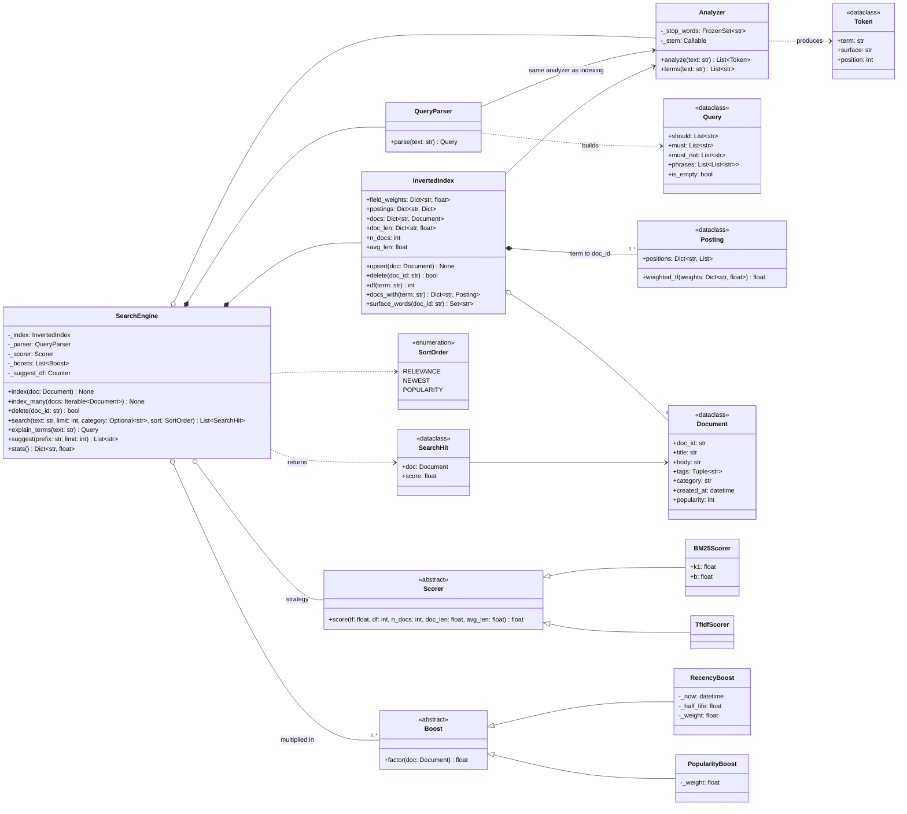

# 🧠 Search Platform LLD — Thought Process Guide

> **Goal:** Learn *how* to think when designing a Low-Level Design.

---

## 📊 Class Diagram



---

## ⏱️ How to Run This in a 45–60 Minute Interview

| Time | Phase | What you produce | What to say out loud |
|------|-------|------------------|----------------------|
| 0–7 min | **Clarify** | Fields, query features, ranking, scale | "I'll build an in-memory engine with BM25, then talk about sharding." |
| 7–15 min | **Entities + interfaces** | `Document`, `Analyzer`, `InvertedIndex`, `Scorer`, `SearchEngine.index/delete/search` | "The analyzer is shared by indexing and querying. That's the invariant that makes matching work." |
| 15–35 min | **Core code** | Analyzer, `upsert` with positions, OR query + BM25, top-k | "IDF is per term: `df` is the length of the term's posting list." |
| 35–45 min | **Operators + maintenance** | `+`/`-`/phrases, delete via forward index, one lock | "MUST lists intersect smallest-first. Delete uses the forward index, so it doesn't scan the vocabulary." |
| 45–60 min | **Extension** | Typos, autocomplete, boosts, or sharding | Show each lands in one place: a `Boost`, `_fuzzy_expand`, `suggest`. |

Get a single-term query returning BM25-ranked results by minute ~30. Phrases and fuzzy matching are extensions. A perfect parser with no ranking is a weaker result.

### Clarifying questions worth asking

1. **What's searched, and which fields?** Title vs body vs tags matter for weighting.
2. **Query features:** AND/OR, exclusion, phrases, prefix, typos? Default operator: OR (ranked) or AND?
3. **Ranking:** text relevance only, or also freshness/popularity/personalisation?
4. **Update pattern:** append-only, or edits and deletes? How fast must a change be searchable?
5. **Scale:** documents, QPS, latency target. (This decides in-memory vs sharded.)
6. **Language:** English only? (It affects the stemmer and stop words.)

---

## Phase 1: Identify the Nouns

> *"Documents are analyzed into terms and stored in an inverted index. Queries are analyzed the same way, matched against postings, scored, boosted and the top k returned."*

| Noun | Decision | Why |
|------|----------|-----|
| `Document` | frozen `@dataclass` | Pure data; an update is a re-index, which keeps the index consistent |
| `Analyzer` | Class | Pluggable stop words + stemmer; used on both sides |
| `InvertedIndex` | Class | The core data structure + corpus statistics |
| `Scorer` | ABC | BM25 vs TF-IDF is a classic Strategy |
| `Boost` | ABC | Recency, popularity: composable multipliers |
| `QueryParser` / `Query` | Class / dataclass | Operators → structured clauses |
| `SearchEngine` | Facade | One entry point, owns the lock |

---

## Phase 2: The Analyzer (get this right first)

```python
"Databases, INDEXING & designed!"  →  ["database", "index", "design"]
```

1. Lowercase; split on anything not `[a-z0-9]` (so `design-patterns` → `design`, `pattern`).
2. Drop stop words but **keep their positions** (needed for phrases).
3. Stem. The light stemmer here strips common suffixes with guards (a 3-letter minimum stem for plural `s`, 4 for others) so `string` doesn't become `str`.

**Rule:** the same analyzer runs at index and query time. If you change it, re-index.

---

## Phase 3: Inverted Index Structure

```python
postings: Dict[str, Dict[str, Posting]]
#   term   ->  doc_id -> Posting(positions={"title": [0], "body": [4, 9]})
forward:  Dict[str, Set[str]]     # doc_id -> terms   (delete/update)
doc_len:  Dict[str, float]        # weighted length   (BM25)
```

- `df(term) = len(postings[term])`, `N = len(docs)`, `avgdl = total_len / N`
- Update = delete old version via `forward`, then insert. Drop empty posting lists.

---

## Phase 4: Scoring

**BM25** per query term, summed:

```
idf = ln(1 + (N − df + 0.5) / (df + 0.5))
tf' = tf·(k1 + 1) / (tf + k1·(1 − b + b·dl/avgdl))      k1 = 1.2, b = 0.75
```

- `k1` → saturation: the 10th occurrence adds far less than the 2nd.
- `b` → length normalisation: the same tf counts less in a longer document.
- Field weights multiply occurrences before saturation (a simplified BM25F).

Then multiply by boosts: `RecencyBoost` (half-life decay) and `PopularityBoost` (log). Keep text relevance and business signals separate so each can be tuned on its own.

---

## Phase 5: Query Semantics

| Syntax | Meaning | Implementation |
|--------|---------|----------------|
| `a b` | OR, ranked | Union of postings |
| `+a` | must contain | Intersect, smallest list first |
| `-a` | must not contain | Subtract |
| `"a b"` | phrase (must) | Intersect, then check consecutive positions in one field |

A query with only `+terms` must still return results. The old version started from the OR set, so `+python` returned nothing.

---

## Phase 6: Typo Tolerance and Autocomplete

- **Fuzzy:** only for SHOULD terms with zero postings. Expand to vocabulary terms within 1–2 edits (by length), score at half weight. O(V) scan here; at scale use a Levenshtein automaton or SymSpell.
- **Autocomplete:** surface words with document counts, sorted list + `bisect` for the prefix range, top-k by count.

---

## Phase 7: Concurrency

One `threading.Lock` around index mutation and search. It's correct, and in CPython a readers-writer lock buys little because the GIL serialises the Python work anyway. The scalable answer is Lucene's: immutable segments plus a snapshot per search, so reads take no lock.

---

## Quick Checklist

✅ **Same analyzer** for index and query
✅ **Per-term IDF**, BM25 with saturation and length normalisation
✅ **Positional index** → phrases; stop-word gaps preserved; no cross-tag phrases
✅ **Boolean operators**, MUST-only queries work, smallest-first intersection
✅ **Forward index** → O(doc) delete/update
✅ **Top-k with a heap**, not a full sort
✅ **No side effects in search** (deterministic ranking)
✅ **Thread-safe** index + search
