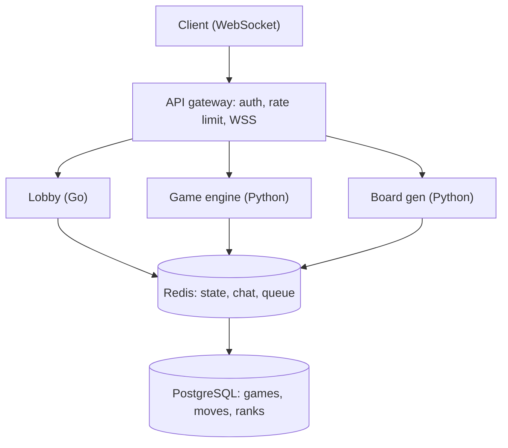
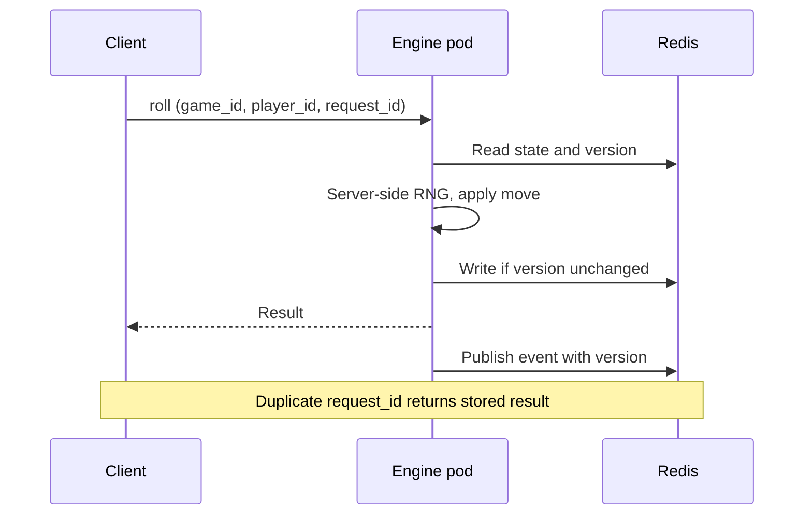

# 🏗️ Snakes and Ladders — High-Level Design

> **Target Level:** Senior/Staff Engineer | **Focus:** Real-time multiplayer, game state sync, dynamic board gen

---

## 1. SYSTEM OVERVIEW

**Purpose:** Online multiplayer Snakes & Ladders platform with customizable boards, power-ups, and tournaments.

**Scale:** 100K DAU, 10K concurrent games, 4 players/game avg

**Users:** Casual players, Competitive players

**Use Cases:** Quick play (random match), Private room (invite friends), AI practice, Tournaments

**Constraints:** <100ms dice roll sync, 99.5% uptime, real-time state for all players

---

## 2. HIGH-LEVEL ARCHITECTURE

```
Mobile/Web Client (React/PWA)
      │ WebSocket
┌─────▼──────┐
│ API Gateway │── Auth ── Rate Limit ── WSS Upgrade
└─────┬──────┘
      │
┌─────▼──────┐  ┌─────▼──────┐  ┌─────▼────────┐
│ Lobby      │  │ Game       │  │ Board Gen    │
│ Service    │  │ Engine     │  │ Service      │
│ (Go)       │  │ (Python)   │  │ (Python)     │
└─────┬──────┘  └─────┬──────┘  └─────┬────────┘
      │               │               │
      └───────────────┼───────────────┘
                      │
              ┌───────▼───────┐
              │    Redis       │
              │ (Game state,   │
              │  chat, queue)  │
              └───────┬───────┘
                      │
              ┌───────▼────────┐
              │  PostgreSQL    │
              │ (users, games, │
              │  moves, ranks) │
              └────────────────┘
```

*Figure: WebSocket clients, services and stores.*



### 🎬 Animated Sequence Diagram

<p align="center">
  <video controls width="900" style="border-radius: 12px; box-shadow: 0 4px 24px rgba(0,0,0,0.3);" loop playsinline preload="metadata">
    <source src="../../../assets/videos/snakes-and-ladders-sequence.mp4" type="video/mp4" />
    Your browser does not support the video tag.
  </video>
  <br/>
  <em>🎬 Animated Snakes & Ladders Sequence — Roll → Move → Check → Snake/Ladder → Turn End. Click ▶ to play/pause. Created with <a href="https://remotion.dev">Remotion</a>.</em>
</p>

---

## 3. KEY COMPONENTS & INTERVIEW Q&A

### Game Engine (Python)
- Turn management (order, dice rolls, extra turns)
- Snake/ladder chaining (multi-hop)
- Win condition (exact roll or bounce-back)

**🔴 Interview Question:** *"How do you ensure fair dice for all players?"*

**✅ Answer:**
1. **Server-authoritative dice:** Dice rolls happen server-side, not client-side. Clients send "roll intention," server computes result.
2. **Unpredictable RNG:** Use a CSPRNG server-side (`secrets` / `random.SystemRandom`). A seeded `random.Random` is fine for tests and replay but its state is recoverable from outputs, so don't use a plain PRNG where money or rankings are at stake. For provable fairness, commit to `hash(server_seed)` before the game and reveal the seed after.
3. **Cheat detection:** Track roll statistics per player — deviation beyond 3σ triggers investigation.
4. **Spectator verification:** All rolls logged and verifiable post-game.

---

### Lobby Service (Go)
- Matchmaking (ELO/friends/random)
- Private room creation
- Chat system

**🔴 Interview Question:** *"How do you handle disconnect/reconnect in multiplayer?"*

**✅ Answer:**
1. Player disconnected → server holds game state in Redis (TTL: 5 minutes)
2. Bot takes over: Simple AI makes random moves
3. Reconnect: Client sends last known game ID → server replays state
4. After 5 min → game forfeited, other players win

---

### Board Gen Service (Python)
- Validates no cycles (snake→ladder loops)
- Ensures solvability (expected moves < threshold)
- Difficulty tuning (more snakes = harder)

**🔴 Interview Question:** *"How do you generate fair boards programmatically?"*

**✅ Answer:**
1. Place ladders first (bottom cells → higher cells, distance 10-30)
2. Place snakes on remaining cells (head above tail, distance 5-20)
3. Validate: Run Monte Carlo simulation (10K random games, compute average moves)
4. If average moves outside target range (50-200), regenerate
5. Difficulty levels: Easy (few snakes), Medium (balanced), Hard (many snakes)

---

## 4. DATA MODEL

```sql
CREATE TABLE games (
    id UUID, board_size INT, status TEXT,
    created_at TIMESTAMP, finished_at TIMESTAMP
);
CREATE TABLE players (
    id UUID, game_id UUID, user_id UUID, position INT DEFAULT 0,
    finish_order INT, color TEXT
);
CREATE TABLE moves (
    game_id UUID, turn_no INT, player_id UUID,
    faces SMALLINT[], from_pos INT, landed_pos INT, to_pos INT,
    request_id UUID, created_at TIMESTAMP,
    PRIMARY KEY (game_id, turn_no)      -- one move per turn; a duplicate insert fails
);
CREATE TABLE boards (
    id UUID, game_id UUID, cell INT, type TEXT, destination INT
);
```

---

## 5. SCALABILITY

**Capacity:** 10K concurrent games × 4 players, one move every ~3 s per game → **~3.3K moves/s** peak. Each move is a ~200-byte state write plus a fan-out to 4 sockets (~13K messages/s). Active state is ~1 KB/game → ~10 MB in Redis. This is small: the hard parts are correctness and reconnects, not throughput.

**Solution:** Redis stores all active game states. Game engine pods are stateless — any pod can process any move. Redis pub/sub broadcasts moves to all players in a game room.

**Alternative worth naming:** route each `game_id` to one owner pod (consistent hashing) and keep the game in memory, single-threaded per game (actor model). No per-move Redis CAS, lower latency; the cost is rebalancing and recovery when a pod dies (rebuild from the move log).

---

## 6. CONSISTENCY, IDEMPOTENCY & FAILURE MODES

**Single writer per game via optimistic concurrency.** Game state in Redis carries a `version` (= turn number). A roll request is `{game_id, player_id, expected_turn, request_id}`. The engine runs a Lua script (atomic in Redis) that checks `status == IN_PROGRESS`, `current_player == player_id` and `version == expected_turn`, then writes the new state and `version+1`. Two racing requests: one wins, the other gets a conflict and the client refetches. This is the distributed version of the in-process lock in the LLD.

**Idempotent rolls.** Clients retry on timeouts. Store `request_id -> TurnResult` with a short TTL (or check it against the last applied move); a retry returns the original result instead of rolling again. Without this, a retry after a lost response lets a player re-roll.

**Pub/sub is fire-and-forget.** A client that is disconnected during a publish misses the event. Every event carries the `version`; a client that sees a gap (or reconnects) fetches the full state. The move log, not pub/sub, is the source of truth.

*Figure: a roll request is idempotent by request_id and guarded by the version (turn number).*



| Failure | Effect | Mitigation |
|---------|--------|------------|
| Engine pod dies mid-request | Move may or may not be applied | Client retries with the same `request_id`; idempotency makes it safe |
| Redis primary fails | Writes since last replication lost | Replica + AOF `everysec`; append each move to Postgres asynchronously (via a queue) so finished games and history survive |
| Client disconnects | Their turn stalls the game | Turn timer: auto-roll after 30 s; forfeit after N missed turns |
| Duplicate roll (double-click) | Two moves | Turn/version check rejects the second |
| Stale client UI | Wrong board shown | Version gap → full resync |

---

## 7. COST (Monthly)

| Component | Cost |
|-----------|------|
| Game Engine (10 pods) | $2,000 |
| Lobby + Matchmaking | $500 |
| Redis + PostgreSQL | $800 |
| Bandwidth (WSS) | $400 |
| **Total** | **$3,700** |
