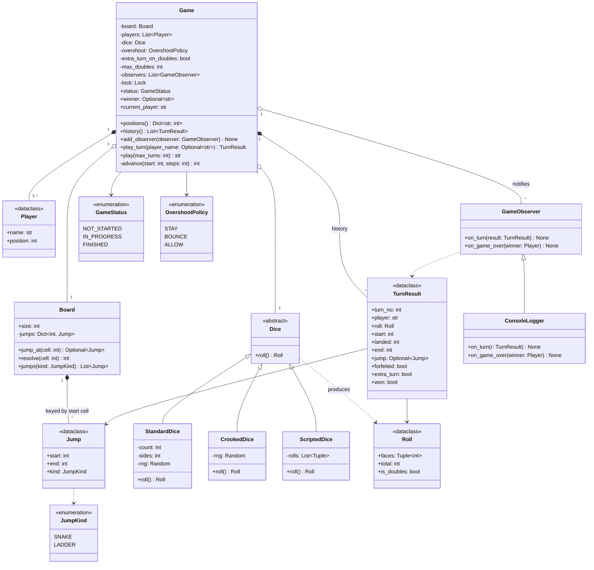

# 🧠 Snakes & Ladders LLD — Thought Process Guide

> **Goal:** Learn *how* to think when designing a Low-Level Design.

---

## 📊 Class Diagram



---

## ⏱️ How to Run This in a 45–60 min Interview

| Time | Step | What to say out loud |
|------|------|----------------------|
| 0–5 | **Clarify** | "Board size and layout fixed or configurable? How many players? One die or two, extra turn on doubles? Exact roll to win, bounce, or any overshoot wins? Can snakes/ladders chain? Single process or online multiplayer?" |
| 5–12 | **Entities + interfaces** | "Snakes and ladders are the same thing — a jump from one cell to another — so one `Jump` type. `Dice` is the strategy that varies. `Board` validates once; `Game` owns turn order." Sketch `Dice.roll() -> Roll`, `Board.resolve(cell)`, `Game.play_turn(player) -> TurnResult`. |
| 12–35 | **Core code** | Write `Board` with validation first, then `Game.play_turn`. Say which invariants the board guarantees so the loop doesn't re-check them. |
| 35–45 | **Concurrency** | "Online, two requests can race. One lock per game; the 'is it your turn?' check and the move live in the same critical section, so duplicates are rejected instead of double-moving." |
| 45–60 | **Extension** | Take the interviewer's "now add X" (two dice + doubles, play until everyone finishes, power-ups) and show it lands in one class. |

**Clarifying questions worth asking** (and the defaults to propose if they shrug):

- Board size? → 100, configurable.
- Overshoot rule? → exact roll needed (`STAY`), configurable.
- Two dice? Doubles grant an extra turn? Three doubles in a row? → yes, yes, forfeit the turn.
- Can a jump end on another jump's start? → no; it removes cycles.
- Game ends at first winner, or play on for ranks? → first winner, ranking as an extension.
- Local only, or concurrent remote players? → design for concurrent requests.

---

## Phase 1: Identify the Nouns

> *"Players roll dice to move across a board. Landing on a snake head slides you down; landing on a ladder bottom climbs you up."*

| Noun | Decision | Why |
|------|----------|-----|
| Board | Class | Owns size + jumps, validates the layout once |
| Snake / Ladder | One `Jump` dataclass | Same data (`start -> end`); kind derived from direction |
| Cell | **Not a class** | An int is enough; per-cell objects are 80% empty |
| Player | Dataclass | Name + position |
| Dice | ABC | Varies independently (count, sides, rigged, scripted) |
| Roll | Frozen dataclass | Doubles depend on faces, not the sum |
| Overshoot rule | Enum | Three fixed behaviours; no state |
| TurnResult | Frozen dataclass | The event: history, observers, replay |
| GameObserver | Base class | Output/side effects out of the game logic |
| GameStatus | Enum | NOT_STARTED → IN_PROGRESS → FINISHED |

## Phase 2: Assign Responsibilities

| Action | Owner | Why |
|--------|-------|-----|
| Roll | `Dice.roll()` | Strategy encapsulates randomness; inject `rng` for determinism |
| Validate layout | `Board.__init__` | Fail fast; the game loop can trust the board |
| Snake/ladder lookup | `Board.resolve()` | O(1) because chains are banned |
| Overshoot | `Game._advance()` | Policy chosen at construction |
| Turn order, doubles, win | `Game.play_turn()` | One place owns the turn state machine |
| Output | `GameObserver` | Console / websocket / achievements without touching `Game` |

## Phase 3: Composition

```
Game HAS-A Board, Dice, list[Player], list[GameObserver], history: list[TurnResult]
Board HAS-A dict[start -> Jump]
```

## Phase 4: The Turn State Machine

```
roll → doubles streak +1 (or reset)
     → streak hits limit?  yes: forfeit, no move, next player
     → advance (overshoot policy) → take jump if any
     → reached last cell?  yes: FINISHED
     → doubles and extra turns enabled?  yes: same player again
                                         no: next player, streak = 0
```

Edge cases to say out loud: winning on doubles ends the game (no extra turn); a bounce can land on a snake; overshoot under `STAY` still counts as the player's turn.

## Phase 5: Quick Checklist

✅ Board invariants enforced in the constructor (no cycles, nothing on the goal)
✅ `Dice` is swappable and seedable; tests use `ScriptedDice`
✅ Doubles computed from faces, not `total % 2`
✅ Turn check + move under one lock; typed errors for out-of-turn and game-over
✅ Every turn produces an immutable `TurnResult`
