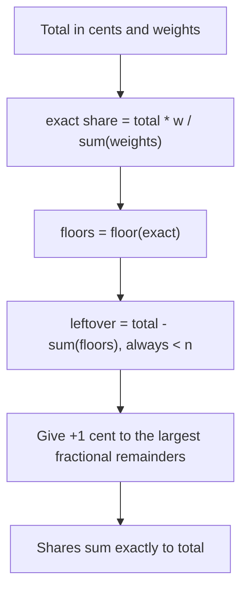

# Splitwise / Expense Sharing - Interview Questions & Answers

> **Target Level:** Senior/Staff Engineer (6+ years)  
> **Evaluation Focus:** Exact money handling, debt minimization, strategy pattern, ledger invariants

---

## Question 1: Core Design
**Interviewer:** *"Design an expense sharing application like Splitwise with groups, expenses, and balance calculation."*

### 🎯 Expected Answer

**Domain model:** `Expense` and `Payment` are immutable ledger entries. A `BalanceSheet` per group keeps a running net balance per user. `SplitwiseService` validates, assigns ids, and applies entries under a lock.

```python
@dataclass(frozen=True)
class Expense:
    expense_id: str
    amount: Decimal
    paid_by: str
    shares: Mapping[str, Decimal]       # __post_init__ checks sum(shares) == amount

class BalanceSheet:
    def apply_expense(self, e: Expense, sign: int = 1) -> None:
        self._add(e.paid_by, sign * e.amount)
        for uid, share in e.shares.items():
            self._add(uid, -sign * share)
```

**Split rules are strategies:** `EqualSplit`, `ExactSplit`, `PercentageSplit`, `ShareSplit` implement `calculate_shares(amount, participant_ids, values)`. A new rule is one class plus one factory entry; nothing else changes.

**The two invariants to state out loud:** an expense's shares sum to its amount exactly, and every ledger's balances sum to exactly zero.

---

## Question 2: Rounding
**Interviewer:** *"Split $100 three ways. Split $0.05 seven ways. Split $10 at 33.33 / 33.33 / 33.34 %."*

### 🎯 Expected Answer

Use the **largest-remainder method** on integer cents:

```python
exact  = [total_cents * w / sum(weights) for w in weights]    # as Fractions
floors = [floor(x) for x in exact]
leftover = total_cents - sum(floors)                          # 0 <= leftover < n
# +1 cent to the `leftover` largest remainders, ties by position
```

- $100 / 3 → 33.34, 33.33, 33.33.
- $0.05 / 7 → five people pay 0.01, two pay 0.00. The naive "round each share, push the difference onto one person" approach gives one person **−0.01** here, because every share rounds *up* to 0.01 and the correction overshoots.
- $10 at 33.33/33.33/33.34 % → 3.33, 3.33, 3.34. Rounding each share independently gives 9.99 and silently loses a cent.

Who gets the extra cent is a product decision (first participant, payer, random). What is not negotiable: the shares sum to the total and no share is more than one cent off.

*Figure: largest-remainder split in integer cents.*



---

## Question 3: Debt Simplification (Minimum Transactions)
**Interviewer:** *"Given balances, find the minimum number of transactions to settle all debts."*

### 🎯 Algorithm Analysis

**Greedy (heaps), O(n log n):** repeatedly match the largest debtor with the largest creditor and transfer `min(debt, credit)`. Each transfer zeroes at least one person, so it uses **at most n − 1** transfers for n non-zero balances.

**It is not optimal.** The minimum is **n − k**, where k is the maximum number of disjoint subsets of balances that each sum to zero (a zero-sum subgroup of m people settles internally in m − 1 transfers, and you can never do better than that per subgroup). Finding k is NP-hard (it generalises subset-sum / partition).

Counter-example the greedy misses:

```
{A: -8, B: -7, C: -2, D: +9, E: +8}
greedy : A->D 8, B->E 7, C->D 1, C->E 1      # 4 transfers
optimal: A->E 8, B->D 7, C->D 2              # 3 transfers, (A, E) sums to 0
```

**Exact for small n:** bitmask DP. `best[mask] = max_i best[mask without i] + (sum(mask) == 0)`; answer `n − best[full]`. O(2ⁿ · n) time, O(2ⁿ) memory, fine to about n = 15–20. `OptimalSettlement` caps at 12 and falls back to greedy.

**What to say about product:** most groups are small, so exact is affordable. Simplification can make someone pay a person they never shared an expense with, which is why Splitwise makes "simplify debts" an opt-in group setting.

---

## Question 4: Concurrency
**Interviewer:** *"Two people add expenses to the same group at the same time. What can go wrong?"*

### 🎯 Expected Answer

`add_expense` is read-validate-write: check membership, compute shares, store the expense, update the ledger. Without a lock, two threads doing `balance[u] = balance[u] + delta` lose an update, and the ledger stops summing to zero. In this code one `RLock` covers the whole sequence; ids come from `itertools.count` under the same lock.

**In a database:** expenses are **inserts**, so they never conflict with each other. The contention is on a materialised balance row. Either update it with an atomic `UPDATE balances SET net = net + :delta` in the same transaction as the expense insert, or do not materialise balances and compute them with `SUM` over `expense_shares` (cheap per group). Optimistic locking (`version` column) belongs on **edits** to an existing expense, where two people editing the same expense is a real conflict.

**Test:** 8 threads × 200 random expenses, then assert balances sum to zero and equal a from-scratch recomputation. `test_concurrent_expenses_keep_ledger_exact` does exactly that.

---

## Question 5: "Now add X" Extensions

| Interviewer adds | Answer |
|------------------|--------|
| **Edit / delete an expense** | Never mutate the entry. Delete = apply it again with `sign=-1`; edit = delete + add. You keep an audit trail and the ledger stays consistent. |
| **Multiple payers** | `paid: Mapping[str, Decimal]` that sums to the amount; the ledger credits each payer. Split logic is unchanged. |
| **Multi-currency** | Keep one balance per (group, user, currency). Do not convert at expense time; rates move. Convert at settle time and store the rate on the `Payment`. |
| **Recurring expenses** | A schedule that creates ordinary expenses with a deterministic id per occurrence, so a retried job does not double-charge. |
| **Show who owes whom without simplifying** | A pairwise ledger keyed by (debtor, creditor) next to the net ledger; net balances are its row sums. |
| **Remove a member** | Only when their balance is zero (`Group.remove_member` enforces it). |

---

## Question 6: Settlement & Payment Integration
**Interviewer:** *"Users want to pay each other through the app."*

### 🎯 Expected Answer

The app is not the money mover; a payment provider is. Flow:

1. Create a `settlement` row in `PENDING` with a client-generated idempotency key.
2. Call the provider with that key. Retries reuse it, so a timeout cannot cause a double charge.
3. Apply the `Payment` to the ledger **only** when the provider confirms (webhook or poll), in the same transaction that moves the settlement to `COMPLETED`.
4. A reconciliation job compares provider records with `PENDING`/`COMPLETED` rows and fixes stragglers.

Recording a cash payment ("Bob paid me back") skips steps 2–4 and is just `record_payment`.

---

## Question 7: Testing Strategy
**Interviewer:** *"How do you know this is correct?"*

### 🎯 Expected Answer

- **Property tests on `allocate`:** random totals and weights; sum is exact, every part is within one cent of its exact value, nothing negative.
- **Regression tests** for the known rounding traps ($0.05 / 7, 33.33 %).
- **Settlement:** for random zero-sum balances, applying the plan zeroes everyone; greedy uses ≤ n − 1 transfers; optimal never uses more than greedy; the known counter-example gives 4 vs 3.
- **Ledger invariant:** after any sequence of adds, deletes and payments, balances sum to zero and match a from-scratch recomputation.
- **Concurrency:** many threads adding expenses, then the invariant check.

---

## Question 8: Design Patterns

| Pattern | Where | Why |
|---------|-------|-----|
| **Strategy** | `SplitStrategy`, `SettlementStrategy` | Swap split rules and settlement algorithms |
| **Factory** | `SplitStrategyFactory` | `SplitType` → strategy instance |
| **Facade** | `SplitwiseService` | One entry point that owns validation and locking |
| **Event sourcing (lite)** | Immutable `Expense`/`Payment` + reversals | Balances are a fold over the entries |

---

## ⚠️ Common Mistakes

- Using `float` for money, or comparing `sum(percentages) == 100.0` on floats.
- Rounding each share independently and never reconciling to the total.
- Pushing the whole rounding difference onto one person (it can go negative).
- Dropping balances below some epsilon like `0.01` in the settle-up step, which leaves a cent unsettled forever.
- Claiming the greedy settle-up is optimal or "within one of optimal". It is neither; it is bounded by n − 1.
- Mutating an expense in place on edit, so balances drift and there is no audit trail.
- Forgetting to check that the payer and participants are group members.
- Looking up users with `dict[key]` and then checking for `None` (the `KeyError` fires first).

---

## 🎚️ Senior vs Staff Signal

- **Senior:** clean strategies, exact money, correct balances, greedy settle-up with a stated complexity, a lock around the write path, sensible tests.
- **Staff:** states the invariants and tests them as properties; explains *why* greedy is not optimal and gives the n − k bound and the exact DP; separates the ledger (append-only entries) from derived balances; talks about idempotent payment flows, edits as reversals, and multi-currency as a product decision rather than a conversion detail.
