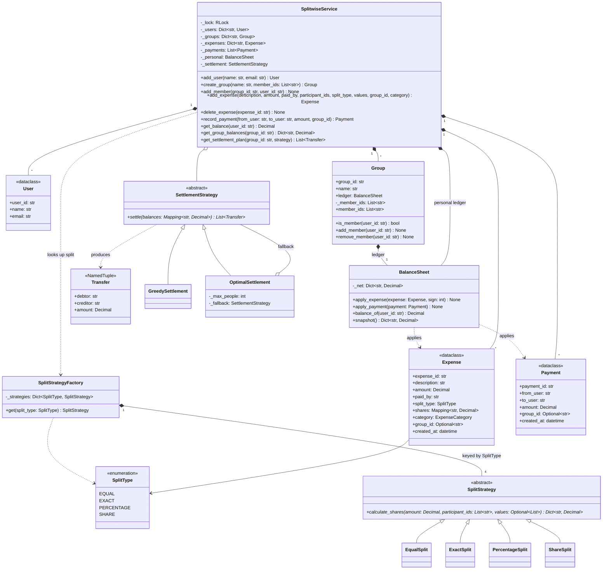

# 🧠 Splitwise / Expense Sharing LLD — Thought Process Guide

> **Goal:** Learn *how* to think when designing a Low-Level Design.

---

## 📊 Class Diagram



---

## ⏱️ How to Run This in a 45–60 min Interview

| Time | Step | What to say out loud |
|------|------|----------------------|
| 0–7 min | **Clarify** | "Which split types? Groups only, or also one-off expenses between friends? Do we need settle-up and 'simplify debts'? Single currency? One payer per expense?" Write the answers down as scope. |
| 7–15 min | **Entities + interfaces** | "`Expense` and `Payment` are immutable ledger entries. A `BalanceSheet` keeps net balance per user. Split rules and settlement algorithms are strategies." Sketch `SplitStrategy.calculate_shares` and `SettlementStrategy.settle` signatures first. |
| 15–35 min | **Core code** | Money helpers and `allocate()` first, because every split depends on them. Then the four strategies, `Expense`, `BalanceSheet`, and the service's `add_expense` / `record_payment` / `get_group_balances`. Say the invariants: shares sum to the amount; balances sum to zero. |
| 35–45 min | **Simplify debts + concurrency** | Greedy with heaps, then say plainly: "This is a heuristic; the true minimum is NP-hard. Here is the n − k argument and a bitmask DP for small groups." Add the service lock and explain what it makes atomic. |
| 45–60 min | **Extension + tests** | Take whatever they add (multi-payer, delete/edit, currencies). Name the tests you would write: allocation sums, negative-share regression, settlement zeroes everything, concurrent adds keep sum zero. |

**Clarifying questions worth asking**

- Split types: equal, exact, percentage, shares? Can a payer be excluded from the split?
- Is "simplify debts" required, and do we need the *minimum* number of transfers or just a reasonable plan?
- Who absorbs the leftover cent when 100 does not divide by 3?
- One currency or many? One payer or several per expense?
- Can expenses be edited or deleted after the fact?
- Is this a single-process library or a service with concurrent requests?

---

## Phase 0: Requirements Gathering

Expenses are split equally, by exact amount, by percentage or by share ratio. Users belong to groups; expenses can also be outside any group. Users can see net balances, get a settle-up plan, and record payments.

## Phase 1: Identify the Nouns

> *"Users in a group share expenses. One person pays, the cost is split among participants. Balances are tracked and can be simplified."*

| Noun | Decision | Why |
|------|----------|-----|
| User | frozen dataclass | Identity only |
| Group | Regular class | Members plus its own `BalanceSheet` |
| Expense | frozen dataclass | Immutable once recorded; checks `sum(shares) == amount` |
| Payment | frozen dataclass | A settle-up is a ledger entry too |
| SplitStrategy | ABC | Equal / Exact / Percentage / Share |
| BalanceSheet | Regular class | Running net balance per user |
| SettlementStrategy | ABC | Greedy heuristic vs exact DP |
| SplitwiseService | Facade | Validation, ids, locking |
| SplitType / ExpenseCategory | Enums | Closed sets of values |

## Phase 2: Money Before Anything Else

Decide the money type before writing a single class, because it changes every signature:

- `Decimal` quantized to cents (or integer cents). Never `float`: `0.1 + 0.2 != 0.3`, and a ledger that does not sum to exactly zero is wrong forever.
- Reject floats at the boundary (`to_money` raises `TypeError`) so callers cannot smuggle them in.
- Do the rounding in one function. `allocate()` uses the largest-remainder method: floor every exact share, then hand the leftover cents (always fewer than the number of participants) to the largest remainders.

## Phase 3: Assigning Responsibilities

| Action | Owner | Why |
|--------|-------|-----|
| Compute shares | `SplitStrategy.calculate_shares()` | Each rule validates its own `values` |
| Record an expense | `SplitwiseService.add_expense()` | Needs users, group membership, lock |
| Update balances | `BalanceSheet.apply_expense()` / `apply_payment()` | O(participants) per entry |
| Settle up | `SplitwiseService.record_payment()` | A payment is the inverse of a debt |
| Undo | `SplitwiseService.delete_expense()` | Re-applies the expense with `sign=-1` |
| Simplify debts | `SettlementStrategy.settle()` | Pure function of a balance snapshot |

## Phase 4: Strategy Pattern for Splits

```python
class SplitStrategy(ABC):
    def calculate_shares(self, amount, participant_ids, values) -> Dict[str, Decimal]

class EqualSplit(SplitStrategy):       # allocate(amount, [1] * n)
class ExactSplit(SplitStrategy):       # values must sum to amount exactly
class PercentageSplit(SplitStrategy):  # values must sum to 100; allocate(amount, values)
class ShareSplit(SplitStrategy):       # ratio 2:1:1; allocate(amount, values)
```

Three of the four are "proportional to some weights", so they share `_proportional()` and the rounding rule lives in one place.

## Phase 5: Debt Simplification

1. Net balance per user: `paid − owed` (already maintained by `BalanceSheet`).
2. **Greedy:** pop the largest debtor and largest creditor, transfer `min(debt, credit)`, push back whoever has a remainder. At most n − 1 transfers, O(n log n).
3. **Be honest that greedy is not optimal.** Minimum transfers = n − k, where k is the maximum number of disjoint zero-sum subgroups. That is NP-hard in general; a bitmask DP solves it exactly for small groups (`OptimalSettlement`, n ≤ 12).

## Phase 6: Quick Checklist

✅ **Exact money:** `Decimal`, floats rejected, shares sum to the amount
✅ **Invariant:** every ledger sums to zero, after any sequence of adds, deletes and payments
✅ **Strategy pattern:** split rules and settlement algorithms are swappable
✅ **Immutability:** `Expense` / `Payment` are frozen; edits are reversals
✅ **Thread-safety:** one lock around validate → compute → store → update ledger
✅ **Honest algorithm claims:** greedy ≤ n − 1 transfers, optimum is NP-hard
